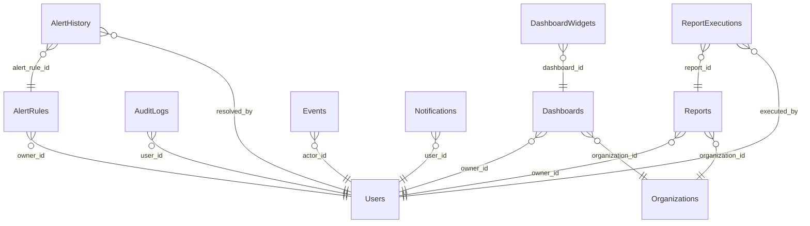

# Analytics Schema

> Generated by DataBridge Doc Generator — 2026-04-03 12:39:58

## Tables

| Name | SQL Name | Type | Info |
|------|----------|------|------|
| [AlertHistory](./alert_history.md) | `alert_history` | TABLE | 8 columns |
| [AlertRules](./alert_rules.md) | `alert_rules` | TABLE | 12 columns |
| [AuditLogs](./audit_logs.md) | `audit_logs` | TABLE | 13 columns |
| [DashboardWidgets](./dashboard_widgets.md) | `dashboard_widgets` | TABLE | 10 columns |
| [Dashboards](./dashboards.md) | `dashboards` | TABLE | 9 columns |
| [Events](./events.md) | `events` | TABLE | 12 columns |
| [Metrics](./metrics.md) | `metrics` | TABLE | 7 columns |
| [Notifications](./notifications.md) | `notifications` | TABLE | 11 columns |
| [RecentEvents](./recent_events.md) | `recent_events` | VIEW | 8 columns |
| [ReportExecutions](./report_executions.md) | `report_executions` | TABLE | 12 columns |
| [Reports](./reports.md) | `reports` | TABLE | 12 columns |
| [UnreadNotifications](./unread_notifications.md) | `unread_notifications` | VIEW | 8 columns |

## Entity Relationship Diagram

## Enum Types

| Enum | Values |
|------|--------|
| `analytics.event_severity` | `debug`, `info`, `warning`, `error`, `critical` |
| `analytics.report_type` | `daily`, `weekly`, `monthly`, `quarterly`, `annual`, `custom` |

