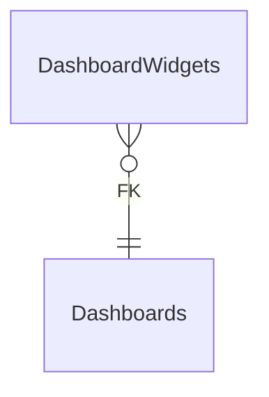

# DashboardWidgets

**Table:** `analytics.dashboard_widgets`

**Base path:** `/dashboard-widgets`

## Related Tables

### Parent Tables

_Tables this table references via foreign keys._

| Parent Table | FK Column | References | Link |
|-------------|-----------|------------|------|
| `dashboards` | `dashboard_id` | `dashboard_widgets_dashboard_id_fkey` | [Dashboards](./dashboards) |


## Entity Relationship Diagram



::::tabs

=== FullStack

## Columns

| # | Column | SQL Type | Go Type | TS Type | Nullable | Default | Constraints | Description |
|---|--------|----------|---------|---------|----------|---------|-------------|-------------|
| 1 | `id` | `uuid` | `uuid.UUID` | `string` | NO | `gen_random_uuid()` | `PK` | Primary key |
| 2 | `name` | `text` | `string` | `string` | NO | - | - | - |
| 3 | `dashboard_id` | `uuid` | `uuid.UUID` | `string` | NO | - | `FK` | → References `dashboards` |
| 4 | `widget_type` | `text` | `string` | `string` | NO | `'chart'::text` | - | - |
| 5 | `config` | `jsonb` | `json.RawMessage` | `Record<string, unknown>` | NO | `'{}'::jsonb` | - | - |
| 6 | `position` | `jsonb` | `json.RawMessage` | `Record<string, unknown>` | NO | `'{"h": 4, "w": 6, "x": 0, "y": 0}'::json…` | - | - |
| 7 | `data_source` | `text` | `string` | `string` | NO | `''::text` | - | - |
| 8 | `refresh_interval` | `integer` | `int` | `number` | NO | `300` | - | - |
| 9 | `created_at` | `timestamp with time zone` | `time.Time` | `string` | NO | `now()` | - | Auto-filled from session |
| 10 | `updated_at` | `timestamp with time zone` | `time.Time` | `string` | NO | `now()` | - | Auto-filled from session |

## Primary Keys

- `id` (`uuid`)

## Foreign Keys & Relationships

| Column | References | Constraint |
|--------|-----------|------------|
| `dashboard_id` | `dashboards` | `dashboard_widgets_dashboard_id_fkey` |


## Go Generated Code

> 📂 Source: [📄 `DashboardWidgets.go`](https://github.com/meftunca/data-bridge-examples/blob/main//analytics/structures/DashboardWidgets.go) · [📄 `DashboardWidgets.go`](https://github.com/meftunca/data-bridge-examples/blob/main//analytics/services/DashboardWidgets.go) · [📄 `DashboardWidgets.go`](https://github.com/meftunca/data-bridge-examples/blob/main//analytics/controllers/DashboardWidgets.go)

### Structs

:::tabs

== Form

#### DashboardWidgetsForm [](https://github.com/meftunca/data-bridge-examples/blob/main//analytics/structures/DashboardWidgets.go#:~:text=type%20DashboardWidgetsForm%20struct)

_Create payload — excludes auto-generated PK fields_

| Field | Go Type | JSON Key | Nullable |
|-------|---------|----------|----------|
| `Name` | `string` | `name` | NO |
| `DashboardId` | `uuid.UUID` | `dashboardId` | NO |
| `WidgetType` | `string` | `widgetType` | NO |
| `Config` | `json.RawMessage` | `config` | NO |
| `Position` | `json.RawMessage` | `position` | NO |
| `DataSource` | `string` | `dataSource` | NO |
| `RefreshInterval` | `int` | `refreshInterval` | NO |
| `CreatedAt` | `time.Time` | `createdAt` | NO |
| `UpdatedAt` | `time.Time` | `updatedAt` | NO |

== Model

#### DashboardWidgets [](https://github.com/meftunca/data-bridge-examples/blob/main//analytics/structures/DashboardWidgets.go#:~:text=type%20DashboardWidgets%20struct)

_Full model — all columns + GORM/JSON tags + preload relations_

| Field | Go Type | JSON Key | Nullable |
|-------|---------|----------|----------|
| `Id` | `uuid.UUID` | `id` | NO |
| `Name` | `string` | `name` | NO |
| `DashboardId` | `uuid.UUID` | `dashboardId` | NO |
| `WidgetType` | `string` | `widgetType` | NO |
| `Config` | `json.RawMessage` | `config` | NO |
| `Position` | `json.RawMessage` | `position` | NO |
| `DataSource` | `string` | `dataSource` | NO |
| `RefreshInterval` | `int` | `refreshInterval` | NO |
| `CreatedAt` | `time.Time` | `createdAt` | NO |
| `UpdatedAt` | `time.Time` | `updatedAt` | NO |

== Edit

#### DashboardWidgetsEdit [](https://github.com/meftunca/data-bridge-examples/blob/main//analytics/structures/DashboardWidgets.go#:~:text=type%20DashboardWidgetsEdit%20struct)

_Update payload — all fields are pointers (partial update)_

| Field | Go Type | JSON Key | Nullable |
|-------|---------|----------|----------|
| `Id` | `*uuid.UUID` | `id` | YES |
| `Name` | `*string` | `name` | YES |
| `DashboardId` | `*uuid.UUID` | `dashboardId` | YES |
| `WidgetType` | `*string` | `widgetType` | YES |
| `Config` | `*json.RawMessage` | `config` | YES |
| `Position` | `*json.RawMessage` | `position` | YES |
| `DataSource` | `*string` | `dataSource` | YES |
| `RefreshInterval` | `*int` | `refreshInterval` | YES |
| `CreatedAt` | `*time.Time` | `createdAt` | YES |
| `UpdatedAt` | `*time.Time` | `updatedAt` | YES |

== Filter

#### DashboardWidgetsFilter [](https://github.com/meftunca/data-bridge-examples/blob/main//analytics/structures/DashboardWidgets.go#:~:text=type%20DashboardWidgetsFilter%20struct)

_Query filter — all fields are pointers_

| Field | Go Type | JSON Key | Nullable |
|-------|---------|----------|----------|
| `Id` | `*uuid.UUID` | `id` | YES |
| `Name` | `*string` | `name` | YES |
| `DashboardId` | `*uuid.UUID` | `dashboardId` | YES |
| `WidgetType` | `*string` | `widgetType` | YES |
| `Config` | `*json.RawMessage` | `config` | YES |
| `Position` | `*json.RawMessage` | `position` | YES |
| `DataSource` | `*string` | `dataSource` | YES |
| `RefreshInterval` | `*int` | `refreshInterval` | YES |
| `CreatedAt` | `*time.Time` | `createdAt` | YES |
| `UpdatedAt` | `*time.Time` | `updatedAt` | YES |

== Page

#### DashboardWidgetsPage [](https://github.com/meftunca/data-bridge-examples/blob/main//analytics/structures/DashboardWidgets.go#:~:text=type%20DashboardWidgetsPage%20struct)

_Paginated response wrapper_

| Field | Go Type | JSON Key | Nullable |
|-------|---------|----------|----------|
| `Id` | `uuid.UUID` | `id` | NO |
| `Name` | `string` | `name` | NO |
| `DashboardId` | `uuid.UUID` | `dashboardId` | NO |
| `WidgetType` | `string` | `widgetType` | NO |
| `Config` | `json.RawMessage` | `config` | NO |
| `Position` | `json.RawMessage` | `position` | NO |
| `DataSource` | `string` | `dataSource` | NO |
| `RefreshInterval` | `int` | `refreshInterval` | NO |
| `CreatedAt` | `time.Time` | `createdAt` | NO |
| `UpdatedAt` | `time.Time` | `updatedAt` | NO |

== BatchUpdate

#### DashboardWidgetsBatchUpdate [](https://github.com/meftunca/data-bridge-examples/blob/main//analytics/structures/DashboardWidgets.go#:~:text=type%20DashboardWidgetsBatchUpdate%20struct)

```go
type DashboardWidgetsBatchUpdate struct {
    Data       json.RawMessage `json:"data"`
    PathParams struct {
        Id uuid.UUID
    } `json:"pathParams"`
}
```

:::

### Service & Endpoints

:::tabs

== Service Methods

| Method | Signature |
|---------|-----------|
| [Create](https://github.com/meftunca/data-bridge-examples/blob/main//analytics/services/DashboardWidgets.go#:~:text=%29%20CreateDashboardWidgets%28%29) | `(DashboardWidgetsService) CreateDashboardWidgets(data DashboardWidgetsForm) (DashboardWidgetsForm, error)` |
| [Create Multiple](https://github.com/meftunca/data-bridge-examples/blob/main//analytics/services/DashboardWidgets.go#:~:text=%29%20CreateDashboardWidgetsMultiple%28%29) | `(DashboardWidgetsService) CreateDashboardWidgetsMultiple(data []DashboardWidgetsForm) ([]DashboardWidgetsForm, error)` |
| [Update](https://github.com/meftunca/data-bridge-examples/blob/main//analytics/services/DashboardWidgets.go#:~:text=%29%20UpdateDashboardWidgets%28%29) | `(DashboardWidgetsService) UpdateDashboardWidgets(id uuid.UUID, data interface{}) error` |
| [Update Multiple](https://github.com/meftunca/data-bridge-examples/blob/main//analytics/services/DashboardWidgets.go#:~:text=%29%20UpdateDashboardWidgetsMultiple%28%29) | `(DashboardWidgetsService) UpdateDashboardWidgetsMultiple(data []DashboardWidgetsBatchUpdate) error` |
| [Delete](https://github.com/meftunca/data-bridge-examples/blob/main//analytics/services/DashboardWidgets.go#:~:text=%29%20DeleteDashboardWidgets%28%29) | `(DashboardWidgetsService) DeleteDashboardWidgets(id uuid.UUID) error` |

== Endpoints

| Method | Path | Description |
|--------|------|-------------|
| `GET` | `/dashboard-widgets/` | Search with query params |
| `GET` | `/dashboard-widgets/pagination` | Paginated listing |
| `POST` | `/dashboard-widgets/` | Create single record |
| `POST` | `/dashboard-widgets/bulk/` | Create multiple records |
| `PUT` | `/dashboard-widgets/bulk/` | Batch update |
| `GET` | `/dashboard-widgets/with-id/:id` | Get by ID |
| `PUT` | `/dashboard-widgets/with-id/:id` | Update by ID |
| `DELETE` | `/dashboard-widgets/with-id/:id` | Delete by ID |

== Query & Filters

| Parameter | Type | Description |
|-----------|------|-------------|
| `page` | `int` | Page number (default: 1) |
| `size` | `int` | Items per page (default: 10) |
| `sort` | `string` | Sort field. Prefix `-` for descending. Example: `-created_at` |
| `fields` | `string` | Comma-separated column list to select |
| `preloads` | `string` | Comma-separated relation names to preload |
| `filters` | `array` | Filter rules: `[[field, op, value], ...]` |
| `groupby` | `string` | Group by field name |
| `aggregations` | `json` | Aggregation specs: `[{func,field,alias}]` |

**Filter Operators:** `eq` `neq` `gt` `gte` `lt` `lte` `in` `notin` `like` `ilike` `is` `isnot` `between`

:::

### RPC Functions

| Function | Parameters | Return | Endpoint |
|----------|-----------|--------|----------|
| `dashboard_count` | - | `integer` | `/rpc/dashboard_count` |
| `event_count_by_severity` | `p_severity text` | `integer` | `/rpc/event_count_by_severity` |
| `unread_notification_count` | `p_user_id uuid` | `integer` | `/rpc/unread_notification_count` |


=== Frontend

## TypeScript Types & Hooks

:::tabs

== Interfaces

```typescript
export interface DashboardWidgets {
  id: string;
  name: string;
  dashboardId: string;
  widgetType: string;
  config: Record<string, unknown>;
  position: Record<string, unknown>;
  dataSource: string;
  refreshInterval: number;
  createdAt: string;
  updatedAt: string;
}

export interface DashboardWidgetsForm {
  name: string;
  dashboardId: string;
  widgetType: string;
  config: Record<string, unknown>;
  position: Record<string, unknown>;
  dataSource: string;
  refreshInterval: number;
  createdAt: string;
  updatedAt: string;
}

export interface DashboardWidgetsEdit {
  id: string;
  name: string;
  dashboardId: string;
  widgetType: string;
  config: Record<string, unknown>;
  position: Record<string, unknown>;
  dataSource: string;
  refreshInterval: number;
  createdAt: string;
  updatedAt: string;
}

export interface DashboardWidgetsPage {
  data: DashboardWidgets[];
  total: number;
  page: number;
  size: number;
  totalPages: number;
}

export type DashboardWidgetsPathQuery = {
  page?: number;
  size?: number;
  sort?: string;
  fields?: string;
  preloads?: string;
  filters?: string;
};

```

== React Query

```typescript
import { useQuery, useMutation, useQueryClient } from "@tanstack/react-query";

const DashboardWidgetsKeys = {
  all: ["dashboard_widgets"] as const,
  lists: () => [...DashboardWidgetsKeys.all, "list"] as const,
  detail: (id: any) => [...DashboardWidgetsKeys.all, "detail", id] as const,
} as const;

export function useDashboardWidgetsList(query?: DashboardWidgetsPathQuery) {
  return useQuery({
    queryKey: [...DashboardWidgetsKeys.lists(), query],
    queryFn: () => fetch(`/dashboard-widgets/pagination`, { method: "GET" }).then(r => r.json()) as Promise<DashboardWidgetsPage>,
  });
}

export function useDashboardWidgetsDetail(id: any) {
  return useQuery({
    queryKey: DashboardWidgetsKeys.detail(id),
    queryFn: () => fetch(`/dashboard-widgets/with-id/:id`).then(r => r.json()) as Promise<DashboardWidgets>,
  });
}

export function useCreateDashboardWidgets() {
  const qc = useQueryClient();
  return useMutation({
    mutationFn: (data: DashboardWidgetsForm) =>
      fetch("/dashboard-widgets/", { method: "POST", body: JSON.stringify(data) }).then(r => r.json()),
    onSuccess: () => qc.invalidateQueries({ queryKey: DashboardWidgetsKeys.lists() }),
  });
}

export function useUpdateDashboardWidgets() {
  const qc = useQueryClient();
  return useMutation({
    mutationFn: ({ id, data }: { id: any: any; data: DashboardWidgetsEdit }) =>
      fetch(`/dashboard-widgets/with-id/:id`, { method: "PUT", body: JSON.stringify(data) }).then(r => r.json()),
    onSuccess: () => qc.invalidateQueries({ queryKey: DashboardWidgetsKeys.all }),
  });
}

export function useDeleteDashboardWidgets() {
  const qc = useQueryClient();
  return useMutation({
    mutationFn: (id: any) =>
      fetch(`/dashboard-widgets/with-id/:id`, { method: "DELETE" }).then(r => r.json()),
    onSuccess: () => qc.invalidateQueries({ queryKey: DashboardWidgetsKeys.all }),
  });
}

```

== Zod Validation

```typescript
import { z } from "zod";

export const DashboardWidgetsFormSchema = z.object({
  name: z.string(),
  dashboardId: z.string().uuid(),
  widgetType: z.string(),
  config: z.record(z.unknown()),
  position: z.record(z.unknown()),
  dataSource: z.string(),
  refreshInterval: z.number().int(),
  createdAt: z.string().datetime(),
  updatedAt: z.string().datetime(),
});

export type DashboardWidgetsFormInput = z.infer<typeof DashboardWidgetsFormSchema>;

```

:::


=== API

<script setup>
import { useOpenapi } from 'vitepress-openapi'
import spec from './dashboard_widgets.openapi.json'
useOpenapi({ spec })
</script>


## API Reference

:::tabs

== Search

#### <Badge type="info" text="GET" /> Search DashboardWidgets

```
GET /api/v1/dashboard-widgets/
```

> Retrieve list filtered by query parameters.

**Headers:**

| Header | Required | Description |
|--------|----------|-------------|
| `Authorization` | Yes | Bearer token |
| `x-company` | Yes | Company ID |

**Query Parameters:**

| Parameter | Type | Required | Description |
|-----------|------|----------|-------------|
| `size` | `integer` | No | Max results (default: 10) |
| `sort` | `string` | No | Sort field. Prefix `-` for DESC. e.g. `-created_at` |
| `fields` | `string` | No | Comma-separated columns to select |
| `preloads` | `string` | No | Available: DashboardIdDetail, DashboardIdDetail.DashboardWidgetsList, DashboardIdDetail.DashboardWidgetsList.DashboardIdDetail |
| `joins` | `string` | No | Available: Dashboards, Dashboards.Users, Dashboards.Organizations |
| `id` | `string (uuid)` | No | Filter by id |
| `name` | `string` | No | Filter by name |
| `dashboardId` | `string (uuid)` | No | Filter by dashboard_id |
| `widgetType` | `string` | No | Filter by widget_type |
| `config` | `string` | No | Filter by config |
| `position` | `string` | No | Filter by position |
| `dataSource` | `string` | No | Filter by data_source |
| `refreshInterval` | `integer` | No | Filter by refresh_interval |

**Response:** `DashboardWidgets[]`

<details>
<summary>curl example</summary>

```bash
curl -X GET \
  -H "Authorization: Bearer $TOKEN" \
  -H "x-company: $COMPANY_ID" \
  "http://localhost:3000/api/v1/dashboard-widgets/"
```

</details>

---

#### <Badge type="tip" text="POST" /> Search DashboardWidgets (POST)

```
POST /api/v1/dashboard-widgets/search
```

> Search with body filters. Auto-used when query string > 2KB.

**Headers:**

| Header | Required | Description |
|--------|----------|-------------|
| `Authorization` | Yes | Bearer token |
| `x-company` | Yes | Company ID |

**Request Body:**

```typescript
{
  size?: number  // e.g. 10
  sort?: string[]  // e.g. ["-createdAt"]
  filters?: FilterRule[]  // e.g. [["name", "eq", "value"]]
  fields?: string[]
  preloads?: string[]
}
```

**Response:** `DashboardWidgets[]`

<details>
<summary>curl example</summary>

```bash
curl -X POST \
  -H "Authorization: Bearer $TOKEN" \
  -H "x-company: $COMPANY_ID" \
  -H "Content-Type: application/json" \
  -d '{}' \
  "http://localhost:3000/api/v1/dashboard-widgets/search"
```

</details>

---

== Pagination

#### <Badge type="info" text="GET" /> Paginate DashboardWidgets

```
GET /api/v1/dashboard-widgets/pagination
```

> Paginated listing.

**Headers:**

| Header | Required | Description |
|--------|----------|-------------|
| `Authorization` | Yes | Bearer token |
| `x-company` | Yes | Company ID |

**Query Parameters:**

| Parameter | Type | Required | Description |
|-----------|------|----------|-------------|
| `page` | `integer` | No | Page number (default: 1) |
| `size` | `integer` | No | Max results (default: 10) |
| `sort` | `string` | No | Sort field. Prefix `-` for DESC. e.g. `-created_at` |
| `fields` | `string` | No | Comma-separated columns to select |
| `preloads` | `string` | No | Available: DashboardIdDetail, DashboardIdDetail.DashboardWidgetsList, DashboardIdDetail.DashboardWidgetsList.DashboardIdDetail |
| `joins` | `string` | No | Available: Dashboards, Dashboards.Users, Dashboards.Organizations |
| `id` | `string (uuid)` | No | Filter by id |
| `name` | `string` | No | Filter by name |
| `dashboardId` | `string (uuid)` | No | Filter by dashboard_id |
| `widgetType` | `string` | No | Filter by widget_type |
| `config` | `string` | No | Filter by config |
| `position` | `string` | No | Filter by position |
| `dataSource` | `string` | No | Filter by data_source |
| `refreshInterval` | `integer` | No | Filter by refresh_interval |

**Response:** `PaginationResponse<DashboardWidgets>`

<details>
<summary>curl example</summary>

```bash
curl -X GET \
  -H "Authorization: Bearer $TOKEN" \
  -H "x-company: $COMPANY_ID" \
  "http://localhost:3000/api/v1/dashboard-widgets/pagination"
```

</details>

---

#### <Badge type="tip" text="POST" /> Paginate DashboardWidgets (POST)

```
POST /api/v1/dashboard-widgets/pagination
```

> Paginated listing with body filters.

**Headers:**

| Header | Required | Description |
|--------|----------|-------------|
| `Authorization` | Yes | Bearer token |
| `x-company` | Yes | Company ID |

**Request Body:**

```typescript
{
  page?: number  // e.g. 1
  size?: number  // e.g. 10
  sort?: string[]  // e.g. ["-createdAt"]
  filters?: FilterRule[]  // e.g. [["name", "eq", "value"]]
  fields?: string[]
  preloads?: string[]
}
```

**Response:** `PaginationResponse<DashboardWidgets>`

<details>
<summary>curl example</summary>

```bash
curl -X POST \
  -H "Authorization: Bearer $TOKEN" \
  -H "x-company: $COMPANY_ID" \
  -H "Content-Type: application/json" \
  -d '{}' \
  "http://localhost:3000/api/v1/dashboard-widgets/pagination"
```

</details>

---

== Create

#### <Badge type="tip" text="POST" /> Create DashboardWidgets

```
POST /api/v1/dashboard-widgets/
```

> Create a new record.

**Headers:**

| Header | Required | Description |
|--------|----------|-------------|
| `Authorization` | Yes | Bearer token |
| `x-company` | Yes | Company ID |

**Request Body:**

```typescript
{
  name: string  // e.g. example_name
  dashboardId: string  // e.g. 550e8400-e29b-41d4-a716-446655440000
  widgetType?: string  // e.g. example_widget_type
  config?: Record<string, unknown>  // e.g. map[]
  position?: Record<string, unknown>  // e.g. map[]
  dataSource?: string  // e.g. example_data_source
  refreshInterval?: number  // e.g. 1
}
```

**Response:** `DashboardWidgets`

<details>
<summary>curl example</summary>

```bash
curl -X POST \
  -H "Authorization: Bearer $TOKEN" \
  -H "x-company: $COMPANY_ID" \
  -H "Content-Type: application/json" \
  -d '{}' \
  "http://localhost:3000/api/v1/dashboard-widgets/"
```

</details>

---

#### <Badge type="tip" text="POST" /> Bulk Create DashboardWidgets

```
POST /api/v1/dashboard-widgets/bulk/
```

> Create multiple records in one request.

**Headers:**

| Header | Required | Description |
|--------|----------|-------------|
| `Authorization` | Yes | Bearer token |
| `x-company` | Yes | Company ID |

**Request Body:**

```typescript
{
  name: string  // e.g. example_name
  dashboardId: string  // e.g. 550e8400-e29b-41d4-a716-446655440000
  widgetType?: string  // e.g. example_widget_type
  config?: Record<string, unknown>  // e.g. map[]
  position?: Record<string, unknown>  // e.g. map[]
  dataSource?: string  // e.g. example_data_source
  refreshInterval?: number  // e.g. 1
}
```

**Response:** `DashboardWidgets[]`

<details>
<summary>curl example</summary>

```bash
curl -X POST \
  -H "Authorization: Bearer $TOKEN" \
  -H "x-company: $COMPANY_ID" \
  -H "Content-Type: application/json" \
  -d '{}' \
  "http://localhost:3000/api/v1/dashboard-widgets/bulk/"
```

</details>

---

== Find & Update

#### <Badge type="info" text="GET" /> Find DashboardWidgets by ID

```
GET /api/v1/dashboard-widgets/with-id/:id
```

> Retrieve a single record by primary key.

**Headers:**

| Header | Required | Description |
|--------|----------|-------------|
| `Authorization` | Yes | Bearer token |
| `x-company` | Yes | Company ID |

**Query Parameters:**

| Parameter | Type | Required | Description |
|-----------|------|----------|-------------|
| `Id` | `string (uuid)` | Yes | Primary key (uuid) |

**Response:** `DashboardWidgets`

<details>
<summary>curl example</summary>

```bash
curl -X GET \
  -H "Authorization: Bearer $TOKEN" \
  -H "x-company: $COMPANY_ID" \
  "http://localhost:3000/api/v1/dashboard-widgets/with-id/:id"
```

</details>

---

#### <Badge type="warning" text="PUT" /> Update DashboardWidgets

```
PUT /api/v1/dashboard-widgets/with-id/:id
```

> Partial update — send only the fields to change.

**Headers:**

| Header | Required | Description |
|--------|----------|-------------|
| `Authorization` | Yes | Bearer token |
| `x-company` | Yes | Company ID |

**Query Parameters:**

| Parameter | Type | Required | Description |
|-----------|------|----------|-------------|
| `Id` | `string (uuid)` | Yes | Primary key (uuid) |

**Request Body:**

```typescript
{
  name?: string
  dashboardId?: string
  widgetType?: string
  config?: Record<string, unknown>
  position?: Record<string, unknown>
  dataSource?: string
  refreshInterval?: number
}
```

**Response:** `Success`

<details>
<summary>curl example</summary>

```bash
curl -X PUT \
  -H "Authorization: Bearer $TOKEN" \
  -H "x-company: $COMPANY_ID" \
  -H "Content-Type: application/json" \
  -d '{}' \
  "http://localhost:3000/api/v1/dashboard-widgets/with-id/:id"
```

</details>

---

#### <Badge type="warning" text="PUT" /> Bulk Update DashboardWidgets

```
PUT /api/v1/dashboard-widgets/bulk/
```

> Batch update multiple records.

**Headers:**

| Header | Required | Description |
|--------|----------|-------------|
| `Authorization` | Yes | Bearer token |
| `x-company` | Yes | Company ID |

**Request Body:** Array of { pathParams, data: DashboardWidgetsEdit }

**Response:** `Success`

<details>
<summary>curl example</summary>

```bash
curl -X PUT \
  -H "Authorization: Bearer $TOKEN" \
  -H "x-company: $COMPANY_ID" \
  -H "Content-Type: application/json" \
  -d '{}' \
  "http://localhost:3000/api/v1/dashboard-widgets/bulk/"
```

</details>

---

== Delete

#### <Badge type="danger" text="DELETE" /> Delete DashboardWidgets

```
DELETE /api/v1/dashboard-widgets/with-id/:id
```

> Soft-delete (sets deleted_at + deleted_by).

**Headers:**

| Header | Required | Description |
|--------|----------|-------------|
| `Authorization` | Yes | Bearer token |
| `x-company` | Yes | Company ID |

**Query Parameters:**

| Parameter | Type | Required | Description |
|-----------|------|----------|-------------|
| `Id` | `string (uuid)` | Yes | Primary key (uuid) |

**Response:** `Success`

<details>
<summary>curl example</summary>

```bash
curl -X DELETE \
  -H "Authorization: Bearer $TOKEN" \
  -H "x-company: $COMPANY_ID" \
  "http://localhost:3000/api/v1/dashboard-widgets/with-id/:id"
```

</details>

---

:::


::::
