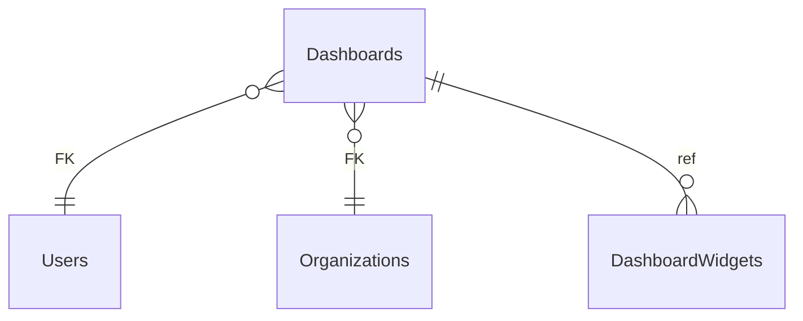

# Dashboards

**Table:** `analytics.dashboards`

**Base path:** `/dashboards`

## Related Tables

### Parent Tables

_Tables this table references via foreign keys._

| Parent Table | FK Column | References | Link |
|-------------|-----------|------------|------|
| `users` | `owner_id` | `dashboards_owner_id_fkey` | [Users](./users) |
| `organizations` | `organization_id` | `dashboards_organization_id_fkey` | [Organizations](./organizations) |

### Child Tables

_Tables that reference this table via foreign keys._

| Child Table | FK Column | References | Link |
|------------|-----------|------------|------|
| `dashboard_widgets` | `dashboard_id` | `dashboard_widgets_dashboard_id_fkey` | [DashboardWidgets](./dashboard_widgets) |


## Entity Relationship Diagram



::::tabs

=== FullStack

## Columns

| # | Column | SQL Type | Go Type | TS Type | Nullable | Default | Constraints | Description |
|---|--------|----------|---------|---------|----------|---------|-------------|-------------|
| 1 | `id` | `uuid` | `uuid.UUID` | `string` | NO | `gen_random_uuid()` | `PK` | Primary key |
| 2 | `name` | `text` | `string` | `string` | NO | - | - | - |
| 3 | `description` | `text` | `string` | `string` | NO | `''::text` | - | - |
| 4 | `owner_id` | `uuid` | `uuid.UUID` | `string` | NO | - | `FK` | → References `users` |
| 5 | `organization_id` | `uuid` | `uuid.UUID` | `string` | YES | - | `FK` | → References `organizations` |
| 6 | `is_public` | `boolean` | `bool` | `boolean` | NO | `false` | - | - |
| 7 | `layout` | `jsonb` | `json.RawMessage` | `Record<string, unknown>` | NO | `'{}'::jsonb` | - | - |
| 8 | `created_at` | `timestamp with time zone` | `time.Time` | `string` | NO | `now()` | - | Auto-filled from session |
| 9 | `updated_at` | `timestamp with time zone` | `time.Time` | `string` | NO | `now()` | - | Auto-filled from session |

## Primary Keys

- `id` (`uuid`)

## Foreign Keys & Relationships

| Column | References | Constraint |
|--------|-----------|------------|
| `owner_id` | `users` | `dashboards_owner_id_fkey` |
| `organization_id` | `organizations` | `dashboards_organization_id_fkey` |


## Go Generated Code

> 📂 Source: [📄 `Dashboards.go`](https://github.com/meftunca/data-bridge-examples/blob/main//analytics/structures/Dashboards.go) · [📄 `Dashboards.go`](https://github.com/meftunca/data-bridge-examples/blob/main//analytics/services/Dashboards.go) · [📄 `Dashboards.go`](https://github.com/meftunca/data-bridge-examples/blob/main//analytics/controllers/Dashboards.go)

### Structs

:::tabs

== Form

#### DashboardsForm [](https://github.com/meftunca/data-bridge-examples/blob/main//analytics/structures/Dashboards.go#:~:text=type%20DashboardsForm%20struct)

_Create payload — excludes auto-generated PK fields_

| Field | Go Type | JSON Key | Nullable |
|-------|---------|----------|----------|
| `Name` | `string` | `name` | NO |
| `Description` | `string` | `description` | NO |
| `OwnerId` | `uuid.UUID` | `ownerId` | NO |
| `OrganizationId` | `*uuid.UUID` | `organizationId` | YES |
| `IsPublic` | `bool` | `isPublic` | NO |
| `Layout` | `json.RawMessage` | `layout` | NO |
| `CreatedAt` | `time.Time` | `createdAt` | NO |
| `UpdatedAt` | `time.Time` | `updatedAt` | NO |

== Model

#### Dashboards [](https://github.com/meftunca/data-bridge-examples/blob/main//analytics/structures/Dashboards.go#:~:text=type%20Dashboards%20struct)

_Full model — all columns + GORM/JSON tags + preload relations_

| Field | Go Type | JSON Key | Nullable |
|-------|---------|----------|----------|
| `Id` | `uuid.UUID` | `id` | NO |
| `Name` | `string` | `name` | NO |
| `Description` | `string` | `description` | NO |
| `OwnerId` | `uuid.UUID` | `ownerId` | NO |
| `OrganizationId` | `*uuid.UUID` | `organizationId` | YES |
| `IsPublic` | `bool` | `isPublic` | NO |
| `Layout` | `json.RawMessage` | `layout` | NO |
| `CreatedAt` | `time.Time` | `createdAt` | NO |
| `UpdatedAt` | `time.Time` | `updatedAt` | NO |

== Edit

#### DashboardsEdit [](https://github.com/meftunca/data-bridge-examples/blob/main//analytics/structures/Dashboards.go#:~:text=type%20DashboardsEdit%20struct)

_Update payload — all fields are pointers (partial update)_

| Field | Go Type | JSON Key | Nullable |
|-------|---------|----------|----------|
| `Id` | `*uuid.UUID` | `id` | YES |
| `Name` | `*string` | `name` | YES |
| `Description` | `*string` | `description` | YES |
| `OwnerId` | `*uuid.UUID` | `ownerId` | YES |
| `OrganizationId` | `*uuid.UUID` | `organizationId` | YES |
| `IsPublic` | `*bool` | `isPublic` | YES |
| `Layout` | `*json.RawMessage` | `layout` | YES |
| `CreatedAt` | `*time.Time` | `createdAt` | YES |
| `UpdatedAt` | `*time.Time` | `updatedAt` | YES |

== Filter

#### DashboardsFilter [](https://github.com/meftunca/data-bridge-examples/blob/main//analytics/structures/Dashboards.go#:~:text=type%20DashboardsFilter%20struct)

_Query filter — all fields are pointers_

| Field | Go Type | JSON Key | Nullable |
|-------|---------|----------|----------|
| `Id` | `*uuid.UUID` | `id` | YES |
| `Name` | `*string` | `name` | YES |
| `Description` | `*string` | `description` | YES |
| `OwnerId` | `*uuid.UUID` | `ownerId` | YES |
| `OrganizationId` | `*uuid.UUID` | `organizationId` | YES |
| `IsPublic` | `*bool` | `isPublic` | YES |
| `Layout` | `*json.RawMessage` | `layout` | YES |
| `CreatedAt` | `*time.Time` | `createdAt` | YES |
| `UpdatedAt` | `*time.Time` | `updatedAt` | YES |

== Page

#### DashboardsPage [](https://github.com/meftunca/data-bridge-examples/blob/main//analytics/structures/Dashboards.go#:~:text=type%20DashboardsPage%20struct)

_Paginated response wrapper_

| Field | Go Type | JSON Key | Nullable |
|-------|---------|----------|----------|
| `Id` | `uuid.UUID` | `id` | NO |
| `Name` | `string` | `name` | NO |
| `Description` | `string` | `description` | NO |
| `OwnerId` | `uuid.UUID` | `ownerId` | NO |
| `OrganizationId` | `*uuid.UUID` | `organizationId` | YES |
| `IsPublic` | `bool` | `isPublic` | NO |
| `Layout` | `json.RawMessage` | `layout` | NO |
| `CreatedAt` | `time.Time` | `createdAt` | NO |
| `UpdatedAt` | `time.Time` | `updatedAt` | NO |

== BatchUpdate

#### DashboardsBatchUpdate [](https://github.com/meftunca/data-bridge-examples/blob/main//analytics/structures/Dashboards.go#:~:text=type%20DashboardsBatchUpdate%20struct)

```go
type DashboardsBatchUpdate struct {
    Data       json.RawMessage `json:"data"`
    PathParams struct {
        Id uuid.UUID
    } `json:"pathParams"`
}
```

:::

### Service & Endpoints

:::tabs

== Service Methods

| Method | Signature |
|---------|-----------|
| [Create](https://github.com/meftunca/data-bridge-examples/blob/main//analytics/services/Dashboards.go#:~:text=%29%20CreateDashboards%28%29) | `(DashboardsService) CreateDashboards(data DashboardsForm) (DashboardsForm, error)` |
| [Create Multiple](https://github.com/meftunca/data-bridge-examples/blob/main//analytics/services/Dashboards.go#:~:text=%29%20CreateDashboardsMultiple%28%29) | `(DashboardsService) CreateDashboardsMultiple(data []DashboardsForm) ([]DashboardsForm, error)` |
| [Update](https://github.com/meftunca/data-bridge-examples/blob/main//analytics/services/Dashboards.go#:~:text=%29%20UpdateDashboards%28%29) | `(DashboardsService) UpdateDashboards(id uuid.UUID, data interface{}) error` |
| [Update Multiple](https://github.com/meftunca/data-bridge-examples/blob/main//analytics/services/Dashboards.go#:~:text=%29%20UpdateDashboardsMultiple%28%29) | `(DashboardsService) UpdateDashboardsMultiple(data []DashboardsBatchUpdate) error` |
| [Delete](https://github.com/meftunca/data-bridge-examples/blob/main//analytics/services/Dashboards.go#:~:text=%29%20DeleteDashboards%28%29) | `(DashboardsService) DeleteDashboards(id uuid.UUID) error` |

== Endpoints

| Method | Path | Description |
|--------|------|-------------|
| `GET` | `/dashboards/` | Search with query params |
| `GET` | `/dashboards/pagination` | Paginated listing |
| `POST` | `/dashboards/` | Create single record |
| `POST` | `/dashboards/bulk/` | Create multiple records |
| `PUT` | `/dashboards/bulk/` | Batch update |
| `GET` | `/dashboards/with-id/:id` | Get by ID |
| `PUT` | `/dashboards/with-id/:id` | Update by ID |
| `DELETE` | `/dashboards/with-id/:id` | Delete by ID |

== Query & Filters

| Parameter | Type | Description |
|-----------|------|-------------|
| `page` | `int` | Page number (default: 1) |
| `size` | `int` | Items per page (default: 10) |
| `sort` | `string` | Sort field. Prefix `-` for descending. Example: `-created_at` |
| `fields` | `string` | Comma-separated column list to select |
| `preloads` | `string` | Comma-separated relation names to preload |
| `filters` | `array` | Filter rules: `[[field, op, value], ...]` |
| `groupby` | `string` | Group by field name |
| `aggregations` | `json` | Aggregation specs: `[{func,field,alias}]` |

**Filter Operators:** `eq` `neq` `gt` `gte` `lt` `lte` `in` `notin` `like` `ilike` `is` `isnot` `between`

:::

### RPC Functions

| Function | Parameters | Return | Endpoint |
|----------|-----------|--------|----------|
| `dashboard_count` | - | `integer` | `/rpc/dashboard_count` |
| `event_count_by_severity` | `p_severity text` | `integer` | `/rpc/event_count_by_severity` |
| `unread_notification_count` | `p_user_id uuid` | `integer` | `/rpc/unread_notification_count` |


=== Frontend

## TypeScript Types & Hooks

:::tabs

== Interfaces

```typescript
export interface Dashboards {
  id: string;
  name: string;
  description: string;
  ownerId: string;
  organizationId?: string;
  isPublic: boolean;
  layout: Record<string, unknown>;
  createdAt: string;
  updatedAt: string;
}

export interface DashboardsForm {
  name: string;
  description: string;
  ownerId: string;
  organizationId?: string;
  isPublic: boolean;
  layout: Record<string, unknown>;
  createdAt: string;
  updatedAt: string;
}

export interface DashboardsEdit {
  id: string;
  name: string;
  description: string;
  ownerId: string;
  organizationId?: string;
  isPublic: boolean;
  layout: Record<string, unknown>;
  createdAt: string;
  updatedAt: string;
}

export interface DashboardsPage {
  data: Dashboards[];
  total: number;
  page: number;
  size: number;
  totalPages: number;
}

export type DashboardsPathQuery = {
  page?: number;
  size?: number;
  sort?: string;
  fields?: string;
  preloads?: string;
  filters?: string;
};

```

== React Query

```typescript
import { useQuery, useMutation, useQueryClient } from "@tanstack/react-query";

const DashboardsKeys = {
  all: ["dashboards"] as const,
  lists: () => [...DashboardsKeys.all, "list"] as const,
  detail: (id: any) => [...DashboardsKeys.all, "detail", id] as const,
} as const;

export function useDashboardsList(query?: DashboardsPathQuery) {
  return useQuery({
    queryKey: [...DashboardsKeys.lists(), query],
    queryFn: () => fetch(`/dashboards/pagination`, { method: "GET" }).then(r => r.json()) as Promise<DashboardsPage>,
  });
}

export function useDashboardsDetail(id: any) {
  return useQuery({
    queryKey: DashboardsKeys.detail(id),
    queryFn: () => fetch(`/dashboards/with-id/:id`).then(r => r.json()) as Promise<Dashboards>,
  });
}

export function useCreateDashboards() {
  const qc = useQueryClient();
  return useMutation({
    mutationFn: (data: DashboardsForm) =>
      fetch("/dashboards/", { method: "POST", body: JSON.stringify(data) }).then(r => r.json()),
    onSuccess: () => qc.invalidateQueries({ queryKey: DashboardsKeys.lists() }),
  });
}

export function useUpdateDashboards() {
  const qc = useQueryClient();
  return useMutation({
    mutationFn: ({ id, data }: { id: any: any; data: DashboardsEdit }) =>
      fetch(`/dashboards/with-id/:id`, { method: "PUT", body: JSON.stringify(data) }).then(r => r.json()),
    onSuccess: () => qc.invalidateQueries({ queryKey: DashboardsKeys.all }),
  });
}

export function useDeleteDashboards() {
  const qc = useQueryClient();
  return useMutation({
    mutationFn: (id: any) =>
      fetch(`/dashboards/with-id/:id`, { method: "DELETE" }).then(r => r.json()),
    onSuccess: () => qc.invalidateQueries({ queryKey: DashboardsKeys.all }),
  });
}

```

== Zod Validation

```typescript
import { z } from "zod";

export const DashboardsFormSchema = z.object({
  name: z.string(),
  description: z.string(),
  ownerId: z.string().uuid(),
  organizationId: z.string().uuid().optional(),
  isPublic: z.boolean(),
  layout: z.record(z.unknown()),
  createdAt: z.string().datetime(),
  updatedAt: z.string().datetime(),
});

export type DashboardsFormInput = z.infer<typeof DashboardsFormSchema>;

```

:::


=== API

<script setup>
import { useOpenapi } from 'vitepress-openapi'
import spec from './dashboards.openapi.json'
useOpenapi({ spec })
</script>


## API Reference

:::tabs

== Search

#### <Badge type="info" text="GET" /> Search Dashboards

```
GET /api/v1/dashboards/
```

> Retrieve list filtered by query parameters.

**Headers:**

| Header | Required | Description |
|--------|----------|-------------|
| `Authorization` | Yes | Bearer token |
| `x-company` | Yes | Company ID |

**Query Parameters:**

| Parameter | Type | Required | Description |
|-----------|------|----------|-------------|
| `size` | `integer` | No | Max results (default: 10) |
| `sort` | `string` | No | Sort field. Prefix `-` for DESC. e.g. `-created_at` |
| `fields` | `string` | No | Comma-separated columns to select |
| `preloads` | `string` | No | Available: DashboardWidgetsList, DashboardWidgetsList.DashboardIdDetail, DashboardWidgetsList.DashboardIdDetail.DashboardWidgetsList |
| `joins` | `string` | No | Available: Users, Organizations |
| `id` | `string (uuid)` | No | Filter by id |
| `name` | `string` | No | Filter by name |
| `description` | `string` | No | Filter by description |
| `ownerId` | `string (uuid)` | No | Filter by owner_id |
| `organizationId` | `string (uuid)` | No | Filter by organization_id |
| `isPublic` | `boolean` | No | Filter by is_public |
| `layout` | `string` | No | Filter by layout |

**Response:** `Dashboards[]`

<details>
<summary>curl example</summary>

```bash
curl -X GET \
  -H "Authorization: Bearer $TOKEN" \
  -H "x-company: $COMPANY_ID" \
  "http://localhost:3000/api/v1/dashboards/"
```

</details>

---

#### <Badge type="tip" text="POST" /> Search Dashboards (POST)

```
POST /api/v1/dashboards/search
```

> Search with body filters. Auto-used when query string > 2KB.

**Headers:**

| Header | Required | Description |
|--------|----------|-------------|
| `Authorization` | Yes | Bearer token |
| `x-company` | Yes | Company ID |

**Request Body:**

```typescript
{
  size?: number  // e.g. 10
  sort?: string[]  // e.g. ["-createdAt"]
  filters?: FilterRule[]  // e.g. [["name", "eq", "value"]]
  fields?: string[]
  preloads?: string[]
}
```

**Response:** `Dashboards[]`

<details>
<summary>curl example</summary>

```bash
curl -X POST \
  -H "Authorization: Bearer $TOKEN" \
  -H "x-company: $COMPANY_ID" \
  -H "Content-Type: application/json" \
  -d '{}' \
  "http://localhost:3000/api/v1/dashboards/search"
```

</details>

---

== Pagination

#### <Badge type="info" text="GET" /> Paginate Dashboards

```
GET /api/v1/dashboards/pagination
```

> Paginated listing.

**Headers:**

| Header | Required | Description |
|--------|----------|-------------|
| `Authorization` | Yes | Bearer token |
| `x-company` | Yes | Company ID |

**Query Parameters:**

| Parameter | Type | Required | Description |
|-----------|------|----------|-------------|
| `page` | `integer` | No | Page number (default: 1) |
| `size` | `integer` | No | Max results (default: 10) |
| `sort` | `string` | No | Sort field. Prefix `-` for DESC. e.g. `-created_at` |
| `fields` | `string` | No | Comma-separated columns to select |
| `preloads` | `string` | No | Available: DashboardWidgetsList, DashboardWidgetsList.DashboardIdDetail, DashboardWidgetsList.DashboardIdDetail.DashboardWidgetsList |
| `joins` | `string` | No | Available: Users, Organizations |
| `id` | `string (uuid)` | No | Filter by id |
| `name` | `string` | No | Filter by name |
| `description` | `string` | No | Filter by description |
| `ownerId` | `string (uuid)` | No | Filter by owner_id |
| `organizationId` | `string (uuid)` | No | Filter by organization_id |
| `isPublic` | `boolean` | No | Filter by is_public |
| `layout` | `string` | No | Filter by layout |

**Response:** `PaginationResponse<Dashboards>`

<details>
<summary>curl example</summary>

```bash
curl -X GET \
  -H "Authorization: Bearer $TOKEN" \
  -H "x-company: $COMPANY_ID" \
  "http://localhost:3000/api/v1/dashboards/pagination"
```

</details>

---

#### <Badge type="tip" text="POST" /> Paginate Dashboards (POST)

```
POST /api/v1/dashboards/pagination
```

> Paginated listing with body filters.

**Headers:**

| Header | Required | Description |
|--------|----------|-------------|
| `Authorization` | Yes | Bearer token |
| `x-company` | Yes | Company ID |

**Request Body:**

```typescript
{
  page?: number  // e.g. 1
  size?: number  // e.g. 10
  sort?: string[]  // e.g. ["-createdAt"]
  filters?: FilterRule[]  // e.g. [["name", "eq", "value"]]
  fields?: string[]
  preloads?: string[]
}
```

**Response:** `PaginationResponse<Dashboards>`

<details>
<summary>curl example</summary>

```bash
curl -X POST \
  -H "Authorization: Bearer $TOKEN" \
  -H "x-company: $COMPANY_ID" \
  -H "Content-Type: application/json" \
  -d '{}' \
  "http://localhost:3000/api/v1/dashboards/pagination"
```

</details>

---

== Create

#### <Badge type="tip" text="POST" /> Create Dashboards

```
POST /api/v1/dashboards/
```

> Create a new record.

**Headers:**

| Header | Required | Description |
|--------|----------|-------------|
| `Authorization` | Yes | Bearer token |
| `x-company` | Yes | Company ID |

**Request Body:**

```typescript
{
  name: string  // e.g. example_name
  description?: string  // e.g. example_description
  ownerId: string  // e.g. 550e8400-e29b-41d4-a716-446655440000
  organizationId?: string  // e.g. 550e8400-e29b-41d4-a716-446655440000
  isPublic?: boolean  // e.g. true
  layout?: Record<string, unknown>  // e.g. map[]
}
```

**Response:** `Dashboards`

<details>
<summary>curl example</summary>

```bash
curl -X POST \
  -H "Authorization: Bearer $TOKEN" \
  -H "x-company: $COMPANY_ID" \
  -H "Content-Type: application/json" \
  -d '{}' \
  "http://localhost:3000/api/v1/dashboards/"
```

</details>

---

#### <Badge type="tip" text="POST" /> Bulk Create Dashboards

```
POST /api/v1/dashboards/bulk/
```

> Create multiple records in one request.

**Headers:**

| Header | Required | Description |
|--------|----------|-------------|
| `Authorization` | Yes | Bearer token |
| `x-company` | Yes | Company ID |

**Request Body:**

```typescript
{
  name: string  // e.g. example_name
  description?: string  // e.g. example_description
  ownerId: string  // e.g. 550e8400-e29b-41d4-a716-446655440000
  organizationId?: string  // e.g. 550e8400-e29b-41d4-a716-446655440000
  isPublic?: boolean  // e.g. true
  layout?: Record<string, unknown>  // e.g. map[]
}
```

**Response:** `Dashboards[]`

<details>
<summary>curl example</summary>

```bash
curl -X POST \
  -H "Authorization: Bearer $TOKEN" \
  -H "x-company: $COMPANY_ID" \
  -H "Content-Type: application/json" \
  -d '{}' \
  "http://localhost:3000/api/v1/dashboards/bulk/"
```

</details>

---

== Find & Update

#### <Badge type="info" text="GET" /> Find Dashboards by ID

```
GET /api/v1/dashboards/with-id/:id
```

> Retrieve a single record by primary key.

**Headers:**

| Header | Required | Description |
|--------|----------|-------------|
| `Authorization` | Yes | Bearer token |
| `x-company` | Yes | Company ID |

**Query Parameters:**

| Parameter | Type | Required | Description |
|-----------|------|----------|-------------|
| `Id` | `string (uuid)` | Yes | Primary key (uuid) |

**Response:** `Dashboards`

<details>
<summary>curl example</summary>

```bash
curl -X GET \
  -H "Authorization: Bearer $TOKEN" \
  -H "x-company: $COMPANY_ID" \
  "http://localhost:3000/api/v1/dashboards/with-id/:id"
```

</details>

---

#### <Badge type="warning" text="PUT" /> Update Dashboards

```
PUT /api/v1/dashboards/with-id/:id
```

> Partial update — send only the fields to change.

**Headers:**

| Header | Required | Description |
|--------|----------|-------------|
| `Authorization` | Yes | Bearer token |
| `x-company` | Yes | Company ID |

**Query Parameters:**

| Parameter | Type | Required | Description |
|-----------|------|----------|-------------|
| `Id` | `string (uuid)` | Yes | Primary key (uuid) |

**Request Body:**

```typescript
{
  name?: string
  description?: string
  ownerId?: string
  organizationId?: string
  isPublic?: boolean
  layout?: Record<string, unknown>
}
```

**Response:** `Success`

<details>
<summary>curl example</summary>

```bash
curl -X PUT \
  -H "Authorization: Bearer $TOKEN" \
  -H "x-company: $COMPANY_ID" \
  -H "Content-Type: application/json" \
  -d '{}' \
  "http://localhost:3000/api/v1/dashboards/with-id/:id"
```

</details>

---

#### <Badge type="warning" text="PUT" /> Bulk Update Dashboards

```
PUT /api/v1/dashboards/bulk/
```

> Batch update multiple records.

**Headers:**

| Header | Required | Description |
|--------|----------|-------------|
| `Authorization` | Yes | Bearer token |
| `x-company` | Yes | Company ID |

**Request Body:** Array of { pathParams, data: DashboardsEdit }

**Response:** `Success`

<details>
<summary>curl example</summary>

```bash
curl -X PUT \
  -H "Authorization: Bearer $TOKEN" \
  -H "x-company: $COMPANY_ID" \
  -H "Content-Type: application/json" \
  -d '{}' \
  "http://localhost:3000/api/v1/dashboards/bulk/"
```

</details>

---

== Delete

#### <Badge type="danger" text="DELETE" /> Delete Dashboards

```
DELETE /api/v1/dashboards/with-id/:id
```

> Soft-delete (sets deleted_at + deleted_by).

**Headers:**

| Header | Required | Description |
|--------|----------|-------------|
| `Authorization` | Yes | Bearer token |
| `x-company` | Yes | Company ID |

**Query Parameters:**

| Parameter | Type | Required | Description |
|-----------|------|----------|-------------|
| `Id` | `string (uuid)` | Yes | Primary key (uuid) |

**Response:** `Success`

<details>
<summary>curl example</summary>

```bash
curl -X DELETE \
  -H "Authorization: Bearer $TOKEN" \
  -H "x-company: $COMPANY_ID" \
  "http://localhost:3000/api/v1/dashboards/with-id/:id"
```

</details>

---

:::


::::
