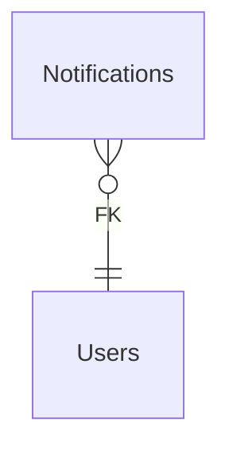

# Notifications

**Table:** `analytics.notifications`

**Base path:** `/notifications`

## Related Tables

### Parent Tables

_Tables this table references via foreign keys._

| Parent Table | FK Column | References | Link |
|-------------|-----------|------------|------|
| `users` | `user_id` | `notifications_user_id_fkey` | [Users](./users) |


## Entity Relationship Diagram



::::tabs

=== FullStack

## Columns

| # | Column | SQL Type | Go Type | TS Type | Nullable | Default | Constraints | Description |
|---|--------|----------|---------|---------|----------|---------|-------------|-------------|
| 1 | `id` | `uuid` | `uuid.UUID` | `string` | NO | `gen_random_uuid()` | `PK` | Primary key |
| 2 | `name` | `text` | `string` | `string` | NO | `''::text` | - | - |
| 3 | `user_id` | `uuid` | `uuid.UUID` | `string` | NO | - | `FK` | → References `users` |
| 4 | `title` | `text` | `string` | `string` | NO | `''::text` | - | - |
| 5 | `message` | `text` | `string` | `string` | NO | `''::text` | - | - |
| 6 | `channel` | `text` | `string` | `string` | NO | `'in_app'::text` | - | - |
| 7 | `is_read` | `boolean` | `bool` | `boolean` | NO | `false` | - | - |
| 8 | `action_url` | `text` | `string` | `string` | NO | `''::text` | - | - |
| 9 | `metadata` | `jsonb` | `json.RawMessage` | `Record<string, unknown>` | NO | `'{}'::jsonb` | - | - |
| 10 | `read_at` | `timestamp with time zone` | `time.Time` | `string` | YES | - | - | - |
| 11 | `created_at` | `timestamp with time zone` | `time.Time` | `string` | NO | `now()` | - | Auto-filled from session |

## Primary Keys

- `id` (`uuid`)

## Foreign Keys & Relationships

| Column | References | Constraint |
|--------|-----------|------------|
| `user_id` | `users` | `notifications_user_id_fkey` |


## Go Generated Code

> 📂 Source: [📄 `Notifications.go`](https://github.com/meftunca/data-bridge-examples/blob/main//analytics/structures/Notifications.go) · [📄 `Notifications.go`](https://github.com/meftunca/data-bridge-examples/blob/main//analytics/services/Notifications.go) · [📄 `Notifications.go`](https://github.com/meftunca/data-bridge-examples/blob/main//analytics/controllers/Notifications.go)

### Structs

:::tabs

== Form

#### NotificationsForm [](https://github.com/meftunca/data-bridge-examples/blob/main//analytics/structures/Notifications.go#:~:text=type%20NotificationsForm%20struct)

_Create payload — excludes auto-generated PK fields_

| Field | Go Type | JSON Key | Nullable |
|-------|---------|----------|----------|
| `Name` | `string` | `name` | NO |
| `UserId` | `uuid.UUID` | `userId` | NO |
| `Title` | `string` | `title` | NO |
| `Message` | `string` | `message` | NO |
| `Channel` | `string` | `channel` | NO |
| `IsRead` | `bool` | `isRead` | NO |
| `ActionUrl` | `string` | `actionUrl` | NO |
| `Metadata` | `json.RawMessage` | `metadata` | NO |
| `ReadAt` | `*time.Time` | `readAt` | YES |
| `CreatedAt` | `time.Time` | `createdAt` | NO |

== Model

#### Notifications [](https://github.com/meftunca/data-bridge-examples/blob/main//analytics/structures/Notifications.go#:~:text=type%20Notifications%20struct)

_Full model — all columns + GORM/JSON tags + preload relations_

| Field | Go Type | JSON Key | Nullable |
|-------|---------|----------|----------|
| `Id` | `uuid.UUID` | `id` | NO |
| `Name` | `string` | `name` | NO |
| `UserId` | `uuid.UUID` | `userId` | NO |
| `Title` | `string` | `title` | NO |
| `Message` | `string` | `message` | NO |
| `Channel` | `string` | `channel` | NO |
| `IsRead` | `bool` | `isRead` | NO |
| `ActionUrl` | `string` | `actionUrl` | NO |
| `Metadata` | `json.RawMessage` | `metadata` | NO |
| `ReadAt` | `*time.Time` | `readAt` | YES |
| `CreatedAt` | `time.Time` | `createdAt` | NO |

== Edit

#### NotificationsEdit [](https://github.com/meftunca/data-bridge-examples/blob/main//analytics/structures/Notifications.go#:~:text=type%20NotificationsEdit%20struct)

_Update payload — all fields are pointers (partial update)_

| Field | Go Type | JSON Key | Nullable |
|-------|---------|----------|----------|
| `Id` | `*uuid.UUID` | `id` | YES |
| `Name` | `*string` | `name` | YES |
| `UserId` | `*uuid.UUID` | `userId` | YES |
| `Title` | `*string` | `title` | YES |
| `Message` | `*string` | `message` | YES |
| `Channel` | `*string` | `channel` | YES |
| `IsRead` | `*bool` | `isRead` | YES |
| `ActionUrl` | `*string` | `actionUrl` | YES |
| `Metadata` | `*json.RawMessage` | `metadata` | YES |
| `ReadAt` | `*time.Time` | `readAt` | YES |
| `CreatedAt` | `*time.Time` | `createdAt` | YES |

== Filter

#### NotificationsFilter [](https://github.com/meftunca/data-bridge-examples/blob/main//analytics/structures/Notifications.go#:~:text=type%20NotificationsFilter%20struct)

_Query filter — all fields are pointers_

| Field | Go Type | JSON Key | Nullable |
|-------|---------|----------|----------|
| `Id` | `*uuid.UUID` | `id` | YES |
| `Name` | `*string` | `name` | YES |
| `UserId` | `*uuid.UUID` | `userId` | YES |
| `Title` | `*string` | `title` | YES |
| `Message` | `*string` | `message` | YES |
| `Channel` | `*string` | `channel` | YES |
| `IsRead` | `*bool` | `isRead` | YES |
| `ActionUrl` | `*string` | `actionUrl` | YES |
| `Metadata` | `*json.RawMessage` | `metadata` | YES |
| `ReadAt` | `*time.Time` | `readAt` | YES |
| `CreatedAt` | `*time.Time` | `createdAt` | YES |

== Page

#### NotificationsPage [](https://github.com/meftunca/data-bridge-examples/blob/main//analytics/structures/Notifications.go#:~:text=type%20NotificationsPage%20struct)

_Paginated response wrapper_

| Field | Go Type | JSON Key | Nullable |
|-------|---------|----------|----------|
| `Id` | `uuid.UUID` | `id` | NO |
| `Name` | `string` | `name` | NO |
| `UserId` | `uuid.UUID` | `userId` | NO |
| `Title` | `string` | `title` | NO |
| `Message` | `string` | `message` | NO |
| `Channel` | `string` | `channel` | NO |
| `IsRead` | `bool` | `isRead` | NO |
| `ActionUrl` | `string` | `actionUrl` | NO |
| `Metadata` | `json.RawMessage` | `metadata` | NO |
| `ReadAt` | `*time.Time` | `readAt` | YES |
| `CreatedAt` | `time.Time` | `createdAt` | NO |

== BatchUpdate

#### NotificationsBatchUpdate [](https://github.com/meftunca/data-bridge-examples/blob/main//analytics/structures/Notifications.go#:~:text=type%20NotificationsBatchUpdate%20struct)

```go
type NotificationsBatchUpdate struct {
    Data       json.RawMessage `json:"data"`
    PathParams struct {
        Id uuid.UUID
    } `json:"pathParams"`
}
```

:::

### Service & Endpoints

:::tabs

== Service Methods

| Method | Signature |
|---------|-----------|
| [Create](https://github.com/meftunca/data-bridge-examples/blob/main//analytics/services/Notifications.go#:~:text=%29%20CreateNotifications%28%29) | `(NotificationsService) CreateNotifications(data NotificationsForm) (NotificationsForm, error)` |
| [Create Multiple](https://github.com/meftunca/data-bridge-examples/blob/main//analytics/services/Notifications.go#:~:text=%29%20CreateNotificationsMultiple%28%29) | `(NotificationsService) CreateNotificationsMultiple(data []NotificationsForm) ([]NotificationsForm, error)` |
| [Update](https://github.com/meftunca/data-bridge-examples/blob/main//analytics/services/Notifications.go#:~:text=%29%20UpdateNotifications%28%29) | `(NotificationsService) UpdateNotifications(id uuid.UUID, data interface{}) error` |
| [Update Multiple](https://github.com/meftunca/data-bridge-examples/blob/main//analytics/services/Notifications.go#:~:text=%29%20UpdateNotificationsMultiple%28%29) | `(NotificationsService) UpdateNotificationsMultiple(data []NotificationsBatchUpdate) error` |
| [Delete](https://github.com/meftunca/data-bridge-examples/blob/main//analytics/services/Notifications.go#:~:text=%29%20DeleteNotifications%28%29) | `(NotificationsService) DeleteNotifications(id uuid.UUID) error` |

== Endpoints

| Method | Path | Description |
|--------|------|-------------|
| `GET` | `/notifications/` | Search with query params |
| `GET` | `/notifications/pagination` | Paginated listing |
| `POST` | `/notifications/` | Create single record |
| `POST` | `/notifications/bulk/` | Create multiple records |
| `PUT` | `/notifications/bulk/` | Batch update |
| `GET` | `/notifications/with-id/:id` | Get by ID |
| `PUT` | `/notifications/with-id/:id` | Update by ID |
| `DELETE` | `/notifications/with-id/:id` | Delete by ID |

== Query & Filters

| Parameter | Type | Description |
|-----------|------|-------------|
| `page` | `int` | Page number (default: 1) |
| `size` | `int` | Items per page (default: 10) |
| `sort` | `string` | Sort field. Prefix `-` for descending. Example: `-created_at` |
| `fields` | `string` | Comma-separated column list to select |
| `preloads` | `string` | Comma-separated relation names to preload |
| `filters` | `array` | Filter rules: `[[field, op, value], ...]` |
| `groupby` | `string` | Group by field name |
| `aggregations` | `json` | Aggregation specs: `[{func,field,alias}]` |

**Filter Operators:** `eq` `neq` `gt` `gte` `lt` `lte` `in` `notin` `like` `ilike` `is` `isnot` `between`

:::

### RPC Functions

| Function | Parameters | Return | Endpoint |
|----------|-----------|--------|----------|
| `dashboard_count` | - | `integer` | `/rpc/dashboard_count` |
| `event_count_by_severity` | `p_severity text` | `integer` | `/rpc/event_count_by_severity` |
| `unread_notification_count` | `p_user_id uuid` | `integer` | `/rpc/unread_notification_count` |


=== Frontend

## TypeScript Types & Hooks

:::tabs

== Interfaces

```typescript
export interface Notifications {
  id: string;
  name: string;
  userId: string;
  title: string;
  message: string;
  channel: string;
  isRead: boolean;
  actionUrl: string;
  metadata: Record<string, unknown>;
  readAt?: string;
  createdAt: string;
}

export interface NotificationsForm {
  name: string;
  userId: string;
  title: string;
  message: string;
  channel: string;
  isRead: boolean;
  actionUrl: string;
  metadata: Record<string, unknown>;
  readAt?: string;
  createdAt: string;
}

export interface NotificationsEdit {
  id: string;
  name: string;
  userId: string;
  title: string;
  message: string;
  channel: string;
  isRead: boolean;
  actionUrl: string;
  metadata: Record<string, unknown>;
  readAt?: string;
  createdAt: string;
}

export interface NotificationsPage {
  data: Notifications[];
  total: number;
  page: number;
  size: number;
  totalPages: number;
}

export type NotificationsPathQuery = {
  page?: number;
  size?: number;
  sort?: string;
  fields?: string;
  preloads?: string;
  filters?: string;
};

```

== React Query

```typescript
import { useQuery, useMutation, useQueryClient } from "@tanstack/react-query";

const NotificationsKeys = {
  all: ["notifications"] as const,
  lists: () => [...NotificationsKeys.all, "list"] as const,
  detail: (id: any) => [...NotificationsKeys.all, "detail", id] as const,
} as const;

export function useNotificationsList(query?: NotificationsPathQuery) {
  return useQuery({
    queryKey: [...NotificationsKeys.lists(), query],
    queryFn: () => fetch(`/notifications/pagination`, { method: "GET" }).then(r => r.json()) as Promise<NotificationsPage>,
  });
}

export function useNotificationsDetail(id: any) {
  return useQuery({
    queryKey: NotificationsKeys.detail(id),
    queryFn: () => fetch(`/notifications/with-id/:id`).then(r => r.json()) as Promise<Notifications>,
  });
}

export function useCreateNotifications() {
  const qc = useQueryClient();
  return useMutation({
    mutationFn: (data: NotificationsForm) =>
      fetch("/notifications/", { method: "POST", body: JSON.stringify(data) }).then(r => r.json()),
    onSuccess: () => qc.invalidateQueries({ queryKey: NotificationsKeys.lists() }),
  });
}

export function useUpdateNotifications() {
  const qc = useQueryClient();
  return useMutation({
    mutationFn: ({ id, data }: { id: any: any; data: NotificationsEdit }) =>
      fetch(`/notifications/with-id/:id`, { method: "PUT", body: JSON.stringify(data) }).then(r => r.json()),
    onSuccess: () => qc.invalidateQueries({ queryKey: NotificationsKeys.all }),
  });
}

export function useDeleteNotifications() {
  const qc = useQueryClient();
  return useMutation({
    mutationFn: (id: any) =>
      fetch(`/notifications/with-id/:id`, { method: "DELETE" }).then(r => r.json()),
    onSuccess: () => qc.invalidateQueries({ queryKey: NotificationsKeys.all }),
  });
}

```

== Zod Validation

```typescript
import { z } from "zod";

export const NotificationsFormSchema = z.object({
  name: z.string(),
  userId: z.string().uuid(),
  title: z.string(),
  message: z.string(),
  channel: z.string(),
  isRead: z.boolean(),
  actionUrl: z.string(),
  metadata: z.record(z.unknown()),
  readAt: z.string().datetime().optional(),
  createdAt: z.string().datetime(),
});

export type NotificationsFormInput = z.infer<typeof NotificationsFormSchema>;

```

:::


=== API

<script setup>
import { useOpenapi } from 'vitepress-openapi'
import spec from './notifications.openapi.json'
useOpenapi({ spec })
</script>


## API Reference

:::tabs

== Search

#### <Badge type="info" text="GET" /> Search Notifications

```
GET /api/v1/notifications/
```

> Retrieve list filtered by query parameters.

**Headers:**

| Header | Required | Description |
|--------|----------|-------------|
| `Authorization` | Yes | Bearer token |
| `x-company` | Yes | Company ID |

**Query Parameters:**

| Parameter | Type | Required | Description |
|-----------|------|----------|-------------|
| `size` | `integer` | No | Max results (default: 10) |
| `sort` | `string` | No | Sort field. Prefix `-` for DESC. e.g. `-created_at` |
| `fields` | `string` | No | Comma-separated columns to select |
| `preloads` | `string` | No | Comma-separated relations to preload |
| `joins` | `string` | No | Available: Users |
| `id` | `string (uuid)` | No | Filter by id |
| `name` | `string` | No | Filter by name |
| `userId` | `string (uuid)` | No | Filter by user_id |
| `title` | `string` | No | Filter by title |
| `message` | `string` | No | Filter by message |
| `channel` | `string` | No | Filter by channel |
| `isRead` | `boolean` | No | Filter by is_read |
| `actionUrl` | `string` | No | Filter by action_url |
| `metadata` | `string` | No | Filter by metadata |
| `readAt` | `string (date-time)` | No | Filter by read_at |

**Response:** `Notifications[]`

<details>
<summary>curl example</summary>

```bash
curl -X GET \
  -H "Authorization: Bearer $TOKEN" \
  -H "x-company: $COMPANY_ID" \
  "http://localhost:3000/api/v1/notifications/"
```

</details>

---

#### <Badge type="tip" text="POST" /> Search Notifications (POST)

```
POST /api/v1/notifications/search
```

> Search with body filters. Auto-used when query string > 2KB.

**Headers:**

| Header | Required | Description |
|--------|----------|-------------|
| `Authorization` | Yes | Bearer token |
| `x-company` | Yes | Company ID |

**Request Body:**

```typescript
{
  size?: number  // e.g. 10
  sort?: string[]  // e.g. ["-createdAt"]
  filters?: FilterRule[]  // e.g. [["name", "eq", "value"]]
  fields?: string[]
  preloads?: string[]
}
```

**Response:** `Notifications[]`

<details>
<summary>curl example</summary>

```bash
curl -X POST \
  -H "Authorization: Bearer $TOKEN" \
  -H "x-company: $COMPANY_ID" \
  -H "Content-Type: application/json" \
  -d '{}' \
  "http://localhost:3000/api/v1/notifications/search"
```

</details>

---

== Pagination

#### <Badge type="info" text="GET" /> Paginate Notifications

```
GET /api/v1/notifications/pagination
```

> Paginated listing.

**Headers:**

| Header | Required | Description |
|--------|----------|-------------|
| `Authorization` | Yes | Bearer token |
| `x-company` | Yes | Company ID |

**Query Parameters:**

| Parameter | Type | Required | Description |
|-----------|------|----------|-------------|
| `page` | `integer` | No | Page number (default: 1) |
| `size` | `integer` | No | Max results (default: 10) |
| `sort` | `string` | No | Sort field. Prefix `-` for DESC. e.g. `-created_at` |
| `fields` | `string` | No | Comma-separated columns to select |
| `preloads` | `string` | No | Comma-separated relations to preload |
| `joins` | `string` | No | Available: Users |
| `id` | `string (uuid)` | No | Filter by id |
| `name` | `string` | No | Filter by name |
| `userId` | `string (uuid)` | No | Filter by user_id |
| `title` | `string` | No | Filter by title |
| `message` | `string` | No | Filter by message |
| `channel` | `string` | No | Filter by channel |
| `isRead` | `boolean` | No | Filter by is_read |
| `actionUrl` | `string` | No | Filter by action_url |
| `metadata` | `string` | No | Filter by metadata |
| `readAt` | `string (date-time)` | No | Filter by read_at |

**Response:** `PaginationResponse<Notifications>`

<details>
<summary>curl example</summary>

```bash
curl -X GET \
  -H "Authorization: Bearer $TOKEN" \
  -H "x-company: $COMPANY_ID" \
  "http://localhost:3000/api/v1/notifications/pagination"
```

</details>

---

#### <Badge type="tip" text="POST" /> Paginate Notifications (POST)

```
POST /api/v1/notifications/pagination
```

> Paginated listing with body filters.

**Headers:**

| Header | Required | Description |
|--------|----------|-------------|
| `Authorization` | Yes | Bearer token |
| `x-company` | Yes | Company ID |

**Request Body:**

```typescript
{
  page?: number  // e.g. 1
  size?: number  // e.g. 10
  sort?: string[]  // e.g. ["-createdAt"]
  filters?: FilterRule[]  // e.g. [["name", "eq", "value"]]
  fields?: string[]
  preloads?: string[]
}
```

**Response:** `PaginationResponse<Notifications>`

<details>
<summary>curl example</summary>

```bash
curl -X POST \
  -H "Authorization: Bearer $TOKEN" \
  -H "x-company: $COMPANY_ID" \
  -H "Content-Type: application/json" \
  -d '{}' \
  "http://localhost:3000/api/v1/notifications/pagination"
```

</details>

---

== Create

#### <Badge type="tip" text="POST" /> Create Notifications

```
POST /api/v1/notifications/
```

> Create a new record.

**Headers:**

| Header | Required | Description |
|--------|----------|-------------|
| `Authorization` | Yes | Bearer token |
| `x-company` | Yes | Company ID |

**Request Body:**

```typescript
{
  name?: string  // e.g. example_name
  userId: string  // e.g. 550e8400-e29b-41d4-a716-446655440000
  title?: string  // e.g. example_title
  message?: string  // e.g. example_message
  channel?: string  // e.g. example_channel
  isRead?: boolean  // e.g. true
  actionUrl?: string  // e.g. example_action_url
  metadata?: Record<string, unknown>  // e.g. map[]
  readAt?: string  // e.g. 2026-01-15T10:30:00Z
}
```

**Response:** `Notifications`

<details>
<summary>curl example</summary>

```bash
curl -X POST \
  -H "Authorization: Bearer $TOKEN" \
  -H "x-company: $COMPANY_ID" \
  -H "Content-Type: application/json" \
  -d '{}' \
  "http://localhost:3000/api/v1/notifications/"
```

</details>

---

#### <Badge type="tip" text="POST" /> Bulk Create Notifications

```
POST /api/v1/notifications/bulk/
```

> Create multiple records in one request.

**Headers:**

| Header | Required | Description |
|--------|----------|-------------|
| `Authorization` | Yes | Bearer token |
| `x-company` | Yes | Company ID |

**Request Body:**

```typescript
{
  name?: string  // e.g. example_name
  userId: string  // e.g. 550e8400-e29b-41d4-a716-446655440000
  title?: string  // e.g. example_title
  message?: string  // e.g. example_message
  channel?: string  // e.g. example_channel
  isRead?: boolean  // e.g. true
  actionUrl?: string  // e.g. example_action_url
  metadata?: Record<string, unknown>  // e.g. map[]
  readAt?: string  // e.g. 2026-01-15T10:30:00Z
}
```

**Response:** `Notifications[]`

<details>
<summary>curl example</summary>

```bash
curl -X POST \
  -H "Authorization: Bearer $TOKEN" \
  -H "x-company: $COMPANY_ID" \
  -H "Content-Type: application/json" \
  -d '{}' \
  "http://localhost:3000/api/v1/notifications/bulk/"
```

</details>

---

== Find & Update

#### <Badge type="info" text="GET" /> Find Notifications by ID

```
GET /api/v1/notifications/with-id/:id
```

> Retrieve a single record by primary key.

**Headers:**

| Header | Required | Description |
|--------|----------|-------------|
| `Authorization` | Yes | Bearer token |
| `x-company` | Yes | Company ID |

**Query Parameters:**

| Parameter | Type | Required | Description |
|-----------|------|----------|-------------|
| `Id` | `string (uuid)` | Yes | Primary key (uuid) |

**Response:** `Notifications`

<details>
<summary>curl example</summary>

```bash
curl -X GET \
  -H "Authorization: Bearer $TOKEN" \
  -H "x-company: $COMPANY_ID" \
  "http://localhost:3000/api/v1/notifications/with-id/:id"
```

</details>

---

#### <Badge type="warning" text="PUT" /> Update Notifications

```
PUT /api/v1/notifications/with-id/:id
```

> Partial update — send only the fields to change.

**Headers:**

| Header | Required | Description |
|--------|----------|-------------|
| `Authorization` | Yes | Bearer token |
| `x-company` | Yes | Company ID |

**Query Parameters:**

| Parameter | Type | Required | Description |
|-----------|------|----------|-------------|
| `Id` | `string (uuid)` | Yes | Primary key (uuid) |

**Request Body:**

```typescript
{
  name?: string
  userId?: string
  title?: string
  message?: string
  channel?: string
  isRead?: boolean
  actionUrl?: string
  metadata?: Record<string, unknown>
  readAt?: string
}
```

**Response:** `Success`

<details>
<summary>curl example</summary>

```bash
curl -X PUT \
  -H "Authorization: Bearer $TOKEN" \
  -H "x-company: $COMPANY_ID" \
  -H "Content-Type: application/json" \
  -d '{}' \
  "http://localhost:3000/api/v1/notifications/with-id/:id"
```

</details>

---

#### <Badge type="warning" text="PUT" /> Bulk Update Notifications

```
PUT /api/v1/notifications/bulk/
```

> Batch update multiple records.

**Headers:**

| Header | Required | Description |
|--------|----------|-------------|
| `Authorization` | Yes | Bearer token |
| `x-company` | Yes | Company ID |

**Request Body:** Array of { pathParams, data: NotificationsEdit }

**Response:** `Success`

<details>
<summary>curl example</summary>

```bash
curl -X PUT \
  -H "Authorization: Bearer $TOKEN" \
  -H "x-company: $COMPANY_ID" \
  -H "Content-Type: application/json" \
  -d '{}' \
  "http://localhost:3000/api/v1/notifications/bulk/"
```

</details>

---

== Delete

#### <Badge type="danger" text="DELETE" /> Delete Notifications

```
DELETE /api/v1/notifications/with-id/:id
```

> Soft-delete (sets deleted_at + deleted_by).

**Headers:**

| Header | Required | Description |
|--------|----------|-------------|
| `Authorization` | Yes | Bearer token |
| `x-company` | Yes | Company ID |

**Query Parameters:**

| Parameter | Type | Required | Description |
|-----------|------|----------|-------------|
| `Id` | `string (uuid)` | Yes | Primary key (uuid) |

**Response:** `Success`

<details>
<summary>curl example</summary>

```bash
curl -X DELETE \
  -H "Authorization: Bearer $TOKEN" \
  -H "x-company: $COMPANY_ID" \
  "http://localhost:3000/api/v1/notifications/with-id/:id"
```

</details>

---

:::


::::
