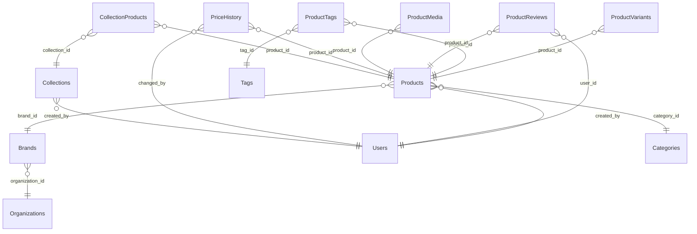

# Catalog Schema

> Generated by DataBridge Doc Generator — 2026-04-03 12:39:58

## Tables

| Name | SQL Name | Type | Info |
|------|----------|------|------|
| [Brands](./brands.md) | `brands` | TABLE | 9 columns |
| [Categories](./categories.md) | `categories` | TABLE | 10 columns |
| [CollectionProducts](./collection_products.md) | `collection_products` | TABLE | 6 columns |
| [Collections](./collections.md) | `collections` | TABLE | 11 columns |
| [PriceHistory](./price_history.md) | `price_history` | TABLE | 8 columns |
| [ProductMedia](./product_media.md) | `product_media` | TABLE | 11 columns |
| [ProductReviews](./product_reviews.md) | `product_reviews` | TABLE | 11 columns |
| [ProductTags](./product_tags.md) | `product_tags` | TABLE | 4 columns |
| [ProductVariants](./product_variants.md) | `product_variants` | TABLE | 10 columns |
| [Products](./products.md) | `products` | TABLE | 22 columns |
| [Tags](./tags.md) | `tags` | TABLE | 4 columns |

## Entity Relationship Diagram

## Enum Types

| Enum | Values |
|------|--------|
| `catalog.media_type` | `image`, `video`, `document`, `audio`, `3d_model` |
| `catalog.product_status` | `draft`, `active`, `discontinued`, `archived` |

