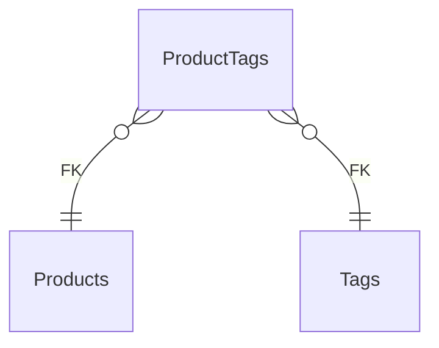

# ProductTags

**Table:** `catalog.product_tags`

**Base path:** `/product-tags`

## Related Tables

### Parent Tables

_Tables this table references via foreign keys._

| Parent Table | FK Column | References | Link |
|-------------|-----------|------------|------|
| `products` | `product_id` | `product_tags_product_id_fkey` | [Products](./products) |
| `tags` | `tag_id` | `product_tags_tag_id_fkey` | [Tags](./tags) |


## Entity Relationship Diagram



::::tabs

=== FullStack

## Columns

| # | Column | SQL Type | Go Type | TS Type | Nullable | Default | Constraints | Description |
|---|--------|----------|---------|---------|----------|---------|-------------|-------------|
| 1 | `product_id` | `uuid` | `uuid.UUID` | `string` | NO | - | `PK` `FK` | → References `products` |
| 2 | `tag_id` | `uuid` | `uuid.UUID` | `string` | NO | - | `PK` `FK` | → References `tags` |
| 3 | `name` | `text` | `string` | `string` | NO | `''::text` | - | - |
| 4 | `created_at` | `timestamp with time zone` | `time.Time` | `string` | NO | `now()` | - | Auto-filled from session |

## Primary Keys

- `product_id` (`uuid`)
- `tag_id` (`uuid`)

## Foreign Keys & Relationships

| Column | References | Constraint |
|--------|-----------|------------|
| `product_id` | `products` | `product_tags_product_id_fkey` |
| `tag_id` | `tags` | `product_tags_tag_id_fkey` |


## Go Generated Code

> 📂 Source: [📄 `ProductTags.go`](https://github.com/meftunca/data-bridge-examples/blob/main//catalog/structures/ProductTags.go) · [📄 `ProductTags.go`](https://github.com/meftunca/data-bridge-examples/blob/main//catalog/services/ProductTags.go) · [📄 `ProductTags.go`](https://github.com/meftunca/data-bridge-examples/blob/main//catalog/controllers/ProductTags.go)

### Structs

:::tabs

== Form

#### ProductTagsForm [](https://github.com/meftunca/data-bridge-examples/blob/main//catalog/structures/ProductTags.go#:~:text=type%20ProductTagsForm%20struct)

_Create payload — excludes auto-generated PK fields_

| Field | Go Type | JSON Key | Nullable |
|-------|---------|----------|----------|
| `ProductId` | `uuid.UUID` | `productId` | NO |
| `TagId` | `uuid.UUID` | `tagId` | NO |
| `Name` | `string` | `name` | NO |
| `CreatedAt` | `time.Time` | `createdAt` | NO |

== Model

#### ProductTags [](https://github.com/meftunca/data-bridge-examples/blob/main//catalog/structures/ProductTags.go#:~:text=type%20ProductTags%20struct)

_Full model — all columns + GORM/JSON tags + preload relations_

| Field | Go Type | JSON Key | Nullable |
|-------|---------|----------|----------|
| `ProductId` | `uuid.UUID` | `productId` | NO |
| `TagId` | `uuid.UUID` | `tagId` | NO |
| `Name` | `string` | `name` | NO |
| `CreatedAt` | `time.Time` | `createdAt` | NO |

== Edit

#### ProductTagsEdit [](https://github.com/meftunca/data-bridge-examples/blob/main//catalog/structures/ProductTags.go#:~:text=type%20ProductTagsEdit%20struct)

_Update payload — all fields are pointers (partial update)_

| Field | Go Type | JSON Key | Nullable |
|-------|---------|----------|----------|
| `ProductId` | `*uuid.UUID` | `productId` | YES |
| `TagId` | `*uuid.UUID` | `tagId` | YES |
| `Name` | `*string` | `name` | YES |
| `CreatedAt` | `*time.Time` | `createdAt` | YES |

== Filter

#### ProductTagsFilter [](https://github.com/meftunca/data-bridge-examples/blob/main//catalog/structures/ProductTags.go#:~:text=type%20ProductTagsFilter%20struct)

_Query filter — all fields are pointers_

| Field | Go Type | JSON Key | Nullable |
|-------|---------|----------|----------|
| `ProductId` | `*uuid.UUID` | `productId` | YES |
| `TagId` | `*uuid.UUID` | `tagId` | YES |
| `Name` | `*string` | `name` | YES |
| `CreatedAt` | `*time.Time` | `createdAt` | YES |

== Page

#### ProductTagsPage [](https://github.com/meftunca/data-bridge-examples/blob/main//catalog/structures/ProductTags.go#:~:text=type%20ProductTagsPage%20struct)

_Paginated response wrapper_

| Field | Go Type | JSON Key | Nullable |
|-------|---------|----------|----------|
| `ProductId` | `uuid.UUID` | `productId` | NO |
| `TagId` | `uuid.UUID` | `tagId` | NO |
| `Name` | `string` | `name` | NO |
| `CreatedAt` | `time.Time` | `createdAt` | NO |

== BatchUpdate

#### ProductTagsBatchUpdate [](https://github.com/meftunca/data-bridge-examples/blob/main//catalog/structures/ProductTags.go#:~:text=type%20ProductTagsBatchUpdate%20struct)

```go
type ProductTagsBatchUpdate struct {
    Data       json.RawMessage `json:"data"`
    PathParams struct {
        ProductId uuid.UUID
        TagId uuid.UUID
    } `json:"pathParams"`
}
```

:::

### Service & Endpoints

:::tabs

== Service Methods

| Method | Signature |
|---------|-----------|
| [Create](https://github.com/meftunca/data-bridge-examples/blob/main//catalog/services/ProductTags.go#:~:text=%29%20CreateProductTags%28%29) | `(ProductTagsService) CreateProductTags(data ProductTagsForm) (ProductTagsForm, error)` |
| [Create Multiple](https://github.com/meftunca/data-bridge-examples/blob/main//catalog/services/ProductTags.go#:~:text=%29%20CreateProductTagsMultiple%28%29) | `(ProductTagsService) CreateProductTagsMultiple(data []ProductTagsForm) ([]ProductTagsForm, error)` |
| [Update](https://github.com/meftunca/data-bridge-examples/blob/main//catalog/services/ProductTags.go#:~:text=%29%20UpdateProductTags%28%29) | `(ProductTagsService) UpdateProductTags(productId uuid.UUID, tagId uuid.UUID, data interface{}) error` |
| [Update Multiple](https://github.com/meftunca/data-bridge-examples/blob/main//catalog/services/ProductTags.go#:~:text=%29%20UpdateProductTagsMultiple%28%29) | `(ProductTagsService) UpdateProductTagsMultiple(data []ProductTagsBatchUpdate) error` |
| [Delete](https://github.com/meftunca/data-bridge-examples/blob/main//catalog/services/ProductTags.go#:~:text=%29%20DeleteProductTags%28%29) | `(ProductTagsService) DeleteProductTags(productId uuid.UUID, tagId uuid.UUID) error` |

== Endpoints

| Method | Path | Description |
|--------|------|-------------|
| `GET` | `/product-tags/` | Search with query params |
| `GET` | `/product-tags/pagination` | Paginated listing |
| `POST` | `/product-tags/` | Create single record |
| `POST` | `/product-tags/bulk/` | Create multiple records |
| `PUT` | `/product-tags/bulk/` | Batch update |
| `GET` | `/product-tags/with-id/:product_id/:tag_id` | Get by ID |
| `PUT` | `/product-tags/with-id/:product_id/:tag_id` | Update by ID |
| `DELETE` | `/product-tags/with-id/:product_id/:tag_id` | Delete by ID |

== Query & Filters

| Parameter | Type | Description |
|-----------|------|-------------|
| `page` | `int` | Page number (default: 1) |
| `size` | `int` | Items per page (default: 10) |
| `sort` | `string` | Sort field. Prefix `-` for descending. Example: `-created_at` |
| `fields` | `string` | Comma-separated column list to select |
| `preloads` | `string` | Comma-separated relation names to preload |
| `filters` | `array` | Filter rules: `[[field, op, value], ...]` |
| `groupby` | `string` | Group by field name |
| `aggregations` | `json` | Aggregation specs: `[{func,field,alias}]` |

**Filter Operators:** `eq` `neq` `gt` `gte` `lt` `lte` `in` `notin` `like` `ilike` `is` `isnot` `between`

:::

### RPC Functions

| Function | Parameters | Return | Endpoint |
|----------|-----------|--------|----------|
| `avg_product_rating` | `p_product_id uuid` | `numeric` | `/rpc/avg_product_rating` |
| `count_active_products` | - | `integer` | `/rpc/count_active_products` |
| `products_by_category` | `p_category_id uuid` | `integer` | `/rpc/products_by_category` |


=== Frontend

## TypeScript Types & Hooks

:::tabs

== Interfaces

```typescript
export interface ProductTags {
  productId: string;
  tagId: string;
  name: string;
  createdAt: string;
}

export interface ProductTagsForm {
  productId: string;
  tagId: string;
  name: string;
  createdAt: string;
}

export interface ProductTagsEdit {
  productId: string;
  tagId: string;
  name: string;
  createdAt: string;
}

export interface ProductTagsPage {
  data: ProductTags[];
  total: number;
  page: number;
  size: number;
  totalPages: number;
}

export type ProductTagsPathQuery = {
  page?: number;
  size?: number;
  sort?: string;
  fields?: string;
  preloads?: string;
  filters?: string;
};

```

== React Query

```typescript
import { useQuery, useMutation, useQueryClient } from "@tanstack/react-query";

const ProductTagsKeys = {
  all: ["product_tags"] as const,
  lists: () => [...ProductTagsKeys.all, "list"] as const,
  detail: (productId, tagId: any) => [...ProductTagsKeys.all, "detail", productId, tagId] as const,
} as const;

export function useProductTagsList(query?: ProductTagsPathQuery) {
  return useQuery({
    queryKey: [...ProductTagsKeys.lists(), query],
    queryFn: () => fetch(`/product-tags/pagination`, { method: "GET" }).then(r => r.json()) as Promise<ProductTagsPage>,
  });
}

export function useProductTagsDetail(productId, tagId: any) {
  return useQuery({
    queryKey: ProductTagsKeys.detail(productId, tagId),
    queryFn: () => fetch(`/product-tags/with-id/:product_id/:tag_id`).then(r => r.json()) as Promise<ProductTags>,
  });
}

export function useCreateProductTags() {
  const qc = useQueryClient();
  return useMutation({
    mutationFn: (data: ProductTagsForm) =>
      fetch("/product-tags/", { method: "POST", body: JSON.stringify(data) }).then(r => r.json()),
    onSuccess: () => qc.invalidateQueries({ queryKey: ProductTagsKeys.lists() }),
  });
}

export function useUpdateProductTags() {
  const qc = useQueryClient();
  return useMutation({
    mutationFn: ({ productId, tagId, data }: { productId, tagId: any: any; data: ProductTagsEdit }) =>
      fetch(`/product-tags/with-id/:product_id/:tag_id`, { method: "PUT", body: JSON.stringify(data) }).then(r => r.json()),
    onSuccess: () => qc.invalidateQueries({ queryKey: ProductTagsKeys.all }),
  });
}

export function useDeleteProductTags() {
  const qc = useQueryClient();
  return useMutation({
    mutationFn: (productId, tagId: any) =>
      fetch(`/product-tags/with-id/:product_id/:tag_id`, { method: "DELETE" }).then(r => r.json()),
    onSuccess: () => qc.invalidateQueries({ queryKey: ProductTagsKeys.all }),
  });
}

```

== Zod Validation

```typescript
import { z } from "zod";

export const ProductTagsFormSchema = z.object({
  productId: z.string().uuid(),
  tagId: z.string().uuid(),
  name: z.string(),
  createdAt: z.string().datetime(),
});

export type ProductTagsFormInput = z.infer<typeof ProductTagsFormSchema>;

```

:::


=== API

<script setup>
import { useOpenapi } from 'vitepress-openapi'
import spec from './product_tags.openapi.json'
useOpenapi({ spec })
</script>


## API Reference

:::tabs

== Search

#### <Badge type="info" text="GET" /> Search ProductTags

```
GET /api/v1/product-tags/
```

> Retrieve list filtered by query parameters.

**Headers:**

| Header | Required | Description |
|--------|----------|-------------|
| `Authorization` | Yes | Bearer token |
| `x-company` | Yes | Company ID |

**Query Parameters:**

| Parameter | Type | Required | Description |
|-----------|------|----------|-------------|
| `size` | `integer` | No | Max results (default: 10) |
| `sort` | `string` | No | Sort field. Prefix `-` for DESC. e.g. `-created_at` |
| `fields` | `string` | No | Comma-separated columns to select |
| `preloads` | `string` | No | Available: ProductIdDetail, ProductIdDetail.ProductVariantsList, ProductIdDetail.ProductVariantsList.ProductIdDetail, ProductIdDetail.ProductMediaList, ProductIdDetail.ProductMediaList.ProductIdDetail, ProductIdDetail.ProductReviewsList, ProductIdDetail.ProductReviewsList.ProductIdDetail, ProductIdDetail.CollectionProductsList, ProductIdDetail.CollectionProductsList.CollectionIdDetail, ProductIdDetail.CollectionProductsList.ProductIdDetail, ProductIdDetail.ProductTagsList, ProductIdDetail.ProductTagsList.ProductIdDetail, ProductIdDetail.ProductTagsList.TagIdDetail, ProductIdDetail.PriceHistoryList, ProductIdDetail.PriceHistoryList.ProductIdDetail, ProductIdDetail.BrandIdDetail, ProductIdDetail.BrandIdDetail.ProductsList, ProductIdDetail.CategoryIdDetail, ProductIdDetail.CategoryIdDetail.CategoriesList, ProductIdDetail.CategoryIdDetail.ProductsList, ProductIdDetail.CategoryIdDetail.ParentIdDetail, TagIdDetail, TagIdDetail.ProductTagsList, TagIdDetail.ProductTagsList.ProductIdDetail, TagIdDetail.ProductTagsList.TagIdDetail |
| `joins` | `string` | No | Available: Products, Products.Brands, Products.Brands.Organizations, Products.Categories, Products.Categories.Categories, Products.Users, Tags |
| `productId` | `string (uuid)` | No | Filter by product_id |
| `tagId` | `string (uuid)` | No | Filter by tag_id |
| `name` | `string` | No | Filter by name |

**Response:** `ProductTags[]`

<details>
<summary>curl example</summary>

```bash
curl -X GET \
  -H "Authorization: Bearer $TOKEN" \
  -H "x-company: $COMPANY_ID" \
  "http://localhost:3000/api/v1/product-tags/"
```

</details>

---

#### <Badge type="tip" text="POST" /> Search ProductTags (POST)

```
POST /api/v1/product-tags/search
```

> Search with body filters. Auto-used when query string > 2KB.

**Headers:**

| Header | Required | Description |
|--------|----------|-------------|
| `Authorization` | Yes | Bearer token |
| `x-company` | Yes | Company ID |

**Request Body:**

```typescript
{
  size?: number  // e.g. 10
  sort?: string[]  // e.g. ["-createdAt"]
  filters?: FilterRule[]  // e.g. [["name", "eq", "value"]]
  fields?: string[]
  preloads?: string[]
}
```

**Response:** `ProductTags[]`

<details>
<summary>curl example</summary>

```bash
curl -X POST \
  -H "Authorization: Bearer $TOKEN" \
  -H "x-company: $COMPANY_ID" \
  -H "Content-Type: application/json" \
  -d '{}' \
  "http://localhost:3000/api/v1/product-tags/search"
```

</details>

---

== Pagination

#### <Badge type="info" text="GET" /> Paginate ProductTags

```
GET /api/v1/product-tags/pagination
```

> Paginated listing.

**Headers:**

| Header | Required | Description |
|--------|----------|-------------|
| `Authorization` | Yes | Bearer token |
| `x-company` | Yes | Company ID |

**Query Parameters:**

| Parameter | Type | Required | Description |
|-----------|------|----------|-------------|
| `page` | `integer` | No | Page number (default: 1) |
| `size` | `integer` | No | Max results (default: 10) |
| `sort` | `string` | No | Sort field. Prefix `-` for DESC. e.g. `-created_at` |
| `fields` | `string` | No | Comma-separated columns to select |
| `preloads` | `string` | No | Available: ProductIdDetail, ProductIdDetail.ProductVariantsList, ProductIdDetail.ProductVariantsList.ProductIdDetail, ProductIdDetail.ProductMediaList, ProductIdDetail.ProductMediaList.ProductIdDetail, ProductIdDetail.ProductReviewsList, ProductIdDetail.ProductReviewsList.ProductIdDetail, ProductIdDetail.CollectionProductsList, ProductIdDetail.CollectionProductsList.CollectionIdDetail, ProductIdDetail.CollectionProductsList.ProductIdDetail, ProductIdDetail.ProductTagsList, ProductIdDetail.ProductTagsList.ProductIdDetail, ProductIdDetail.ProductTagsList.TagIdDetail, ProductIdDetail.PriceHistoryList, ProductIdDetail.PriceHistoryList.ProductIdDetail, ProductIdDetail.BrandIdDetail, ProductIdDetail.BrandIdDetail.ProductsList, ProductIdDetail.CategoryIdDetail, ProductIdDetail.CategoryIdDetail.CategoriesList, ProductIdDetail.CategoryIdDetail.ProductsList, ProductIdDetail.CategoryIdDetail.ParentIdDetail, TagIdDetail, TagIdDetail.ProductTagsList, TagIdDetail.ProductTagsList.ProductIdDetail, TagIdDetail.ProductTagsList.TagIdDetail |
| `joins` | `string` | No | Available: Products, Products.Brands, Products.Brands.Organizations, Products.Categories, Products.Categories.Categories, Products.Users, Tags |
| `productId` | `string (uuid)` | No | Filter by product_id |
| `tagId` | `string (uuid)` | No | Filter by tag_id |
| `name` | `string` | No | Filter by name |

**Response:** `PaginationResponse<ProductTags>`

<details>
<summary>curl example</summary>

```bash
curl -X GET \
  -H "Authorization: Bearer $TOKEN" \
  -H "x-company: $COMPANY_ID" \
  "http://localhost:3000/api/v1/product-tags/pagination"
```

</details>

---

#### <Badge type="tip" text="POST" /> Paginate ProductTags (POST)

```
POST /api/v1/product-tags/pagination
```

> Paginated listing with body filters.

**Headers:**

| Header | Required | Description |
|--------|----------|-------------|
| `Authorization` | Yes | Bearer token |
| `x-company` | Yes | Company ID |

**Request Body:**

```typescript
{
  page?: number  // e.g. 1
  size?: number  // e.g. 10
  sort?: string[]  // e.g. ["-createdAt"]
  filters?: FilterRule[]  // e.g. [["name", "eq", "value"]]
  fields?: string[]
  preloads?: string[]
}
```

**Response:** `PaginationResponse<ProductTags>`

<details>
<summary>curl example</summary>

```bash
curl -X POST \
  -H "Authorization: Bearer $TOKEN" \
  -H "x-company: $COMPANY_ID" \
  -H "Content-Type: application/json" \
  -d '{}' \
  "http://localhost:3000/api/v1/product-tags/pagination"
```

</details>

---

== Create

#### <Badge type="tip" text="POST" /> Create ProductTags

```
POST /api/v1/product-tags/
```

> Create a new record.

**Headers:**

| Header | Required | Description |
|--------|----------|-------------|
| `Authorization` | Yes | Bearer token |
| `x-company` | Yes | Company ID |

**Request Body:**

```typescript
{
  productId: string  // e.g. 550e8400-e29b-41d4-a716-446655440000
  tagId: string  // e.g. 550e8400-e29b-41d4-a716-446655440000
  name?: string  // e.g. example_name
}
```

**Response:** `ProductTags`

<details>
<summary>curl example</summary>

```bash
curl -X POST \
  -H "Authorization: Bearer $TOKEN" \
  -H "x-company: $COMPANY_ID" \
  -H "Content-Type: application/json" \
  -d '{}' \
  "http://localhost:3000/api/v1/product-tags/"
```

</details>

---

#### <Badge type="tip" text="POST" /> Bulk Create ProductTags

```
POST /api/v1/product-tags/bulk/
```

> Create multiple records in one request.

**Headers:**

| Header | Required | Description |
|--------|----------|-------------|
| `Authorization` | Yes | Bearer token |
| `x-company` | Yes | Company ID |

**Request Body:**

```typescript
{
  productId: string  // e.g. 550e8400-e29b-41d4-a716-446655440000
  tagId: string  // e.g. 550e8400-e29b-41d4-a716-446655440000
  name?: string  // e.g. example_name
}
```

**Response:** `ProductTags[]`

<details>
<summary>curl example</summary>

```bash
curl -X POST \
  -H "Authorization: Bearer $TOKEN" \
  -H "x-company: $COMPANY_ID" \
  -H "Content-Type: application/json" \
  -d '{}' \
  "http://localhost:3000/api/v1/product-tags/bulk/"
```

</details>

---

== Find & Update

#### <Badge type="info" text="GET" /> Find ProductTags by ID

```
GET /api/v1/product-tags/with-id/:id
```

> Retrieve a single record by primary key.

**Headers:**

| Header | Required | Description |
|--------|----------|-------------|
| `Authorization` | Yes | Bearer token |
| `x-company` | Yes | Company ID |

**Query Parameters:**

| Parameter | Type | Required | Description |
|-----------|------|----------|-------------|
| `ProductId` | `string (uuid)` | Yes | Primary key (uuid) |
| `TagId` | `string (uuid)` | Yes | Primary key (uuid) |

**Response:** `ProductTags`

<details>
<summary>curl example</summary>

```bash
curl -X GET \
  -H "Authorization: Bearer $TOKEN" \
  -H "x-company: $COMPANY_ID" \
  "http://localhost:3000/api/v1/product-tags/with-id/:id"
```

</details>

---

#### <Badge type="warning" text="PUT" /> Update ProductTags

```
PUT /api/v1/product-tags/with-id/:id
```

> Partial update — send only the fields to change.

**Headers:**

| Header | Required | Description |
|--------|----------|-------------|
| `Authorization` | Yes | Bearer token |
| `x-company` | Yes | Company ID |

**Query Parameters:**

| Parameter | Type | Required | Description |
|-----------|------|----------|-------------|
| `ProductId` | `string (uuid)` | Yes | Primary key (uuid) |
| `TagId` | `string (uuid)` | Yes | Primary key (uuid) |

**Request Body:**

```typescript
{
  name?: string
}
```

**Response:** `Success`

<details>
<summary>curl example</summary>

```bash
curl -X PUT \
  -H "Authorization: Bearer $TOKEN" \
  -H "x-company: $COMPANY_ID" \
  -H "Content-Type: application/json" \
  -d '{}' \
  "http://localhost:3000/api/v1/product-tags/with-id/:id"
```

</details>

---

#### <Badge type="warning" text="PUT" /> Bulk Update ProductTags

```
PUT /api/v1/product-tags/bulk/
```

> Batch update multiple records.

**Headers:**

| Header | Required | Description |
|--------|----------|-------------|
| `Authorization` | Yes | Bearer token |
| `x-company` | Yes | Company ID |

**Request Body:** Array of { pathParams, data: ProductTagsEdit }

**Response:** `Success`

<details>
<summary>curl example</summary>

```bash
curl -X PUT \
  -H "Authorization: Bearer $TOKEN" \
  -H "x-company: $COMPANY_ID" \
  -H "Content-Type: application/json" \
  -d '{}' \
  "http://localhost:3000/api/v1/product-tags/bulk/"
```

</details>

---

== Delete

#### <Badge type="danger" text="DELETE" /> Delete ProductTags

```
DELETE /api/v1/product-tags/with-id/:id
```

> Soft-delete (sets deleted_at + deleted_by).

**Headers:**

| Header | Required | Description |
|--------|----------|-------------|
| `Authorization` | Yes | Bearer token |
| `x-company` | Yes | Company ID |

**Query Parameters:**

| Parameter | Type | Required | Description |
|-----------|------|----------|-------------|
| `ProductId` | `string (uuid)` | Yes | Primary key (uuid) |
| `TagId` | `string (uuid)` | Yes | Primary key (uuid) |

**Response:** `Success`

<details>
<summary>curl example</summary>

```bash
curl -X DELETE \
  -H "Authorization: Bearer $TOKEN" \
  -H "x-company: $COMPANY_ID" \
  "http://localhost:3000/api/v1/product-tags/with-id/:id"
```

</details>

---

:::


::::
