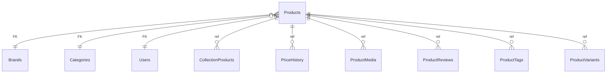

# Products

**Table:** `catalog.products`

**Base path:** `/products`

## Related Tables

### Parent Tables

_Tables this table references via foreign keys._

| Parent Table | FK Column | References | Link |
|-------------|-----------|------------|------|
| `brands` | `brand_id` | `products_brand_id_fkey` | [Brands](./brands) |
| `categories` | `category_id` | `products_category_id_fkey` | [Categories](./categories) |
| `users` | `created_by` | `products_created_by_fkey` | [Users](./users) |
| `users` | `updated_by` | `products_updated_by_fkey` | [Users](./users) |

### Child Tables

_Tables that reference this table via foreign keys._

| Child Table | FK Column | References | Link |
|------------|-----------|------------|------|
| `inventory` | `product_id` | `inventory_product_id_fkey` | [Inventory](./inventory) |
| `purchase_order_items` | `product_id` | `purchase_order_items_product_id_fkey` | [PurchaseOrderItems](./purchase_order_items) |
| `collection_products` | `product_id` | `collection_products_product_id_fkey` | [CollectionProducts](./collection_products) |
| `price_history` | `product_id` | `price_history_product_id_fkey` | [PriceHistory](./price_history) |
| `product_media` | `product_id` | `product_media_product_id_fkey` | [ProductMedia](./product_media) |
| `product_reviews` | `product_id` | `product_reviews_product_id_fkey` | [ProductReviews](./product_reviews) |
| `product_tags` | `product_id` | `product_tags_product_id_fkey` | [ProductTags](./product_tags) |
| `product_variants` | `product_id` | `product_variants_product_id_fkey` | [ProductVariants](./product_variants) |
| `cart_items` | `product_id` | `cart_items_product_id_fkey` | [CartItems](./cart_items) |
| `order_items` | `product_id` | `order_items_product_id_fkey` | [OrderItems](./order_items) |


## Entity Relationship Diagram



::::tabs

=== FullStack

## Columns

| # | Column | SQL Type | Go Type | TS Type | Nullable | Default | Constraints | Description |
|---|--------|----------|---------|---------|----------|---------|-------------|-------------|
| 1 | `id` | `uuid` | `uuid.UUID` | `string` | NO | `gen_random_uuid()` | `PK` | Primary key |
| 2 | `name` | `text` | `string` | `string` | NO | - | - | - |
| 3 | `slug` | `text` | `string` | `string` | NO | - | `UQ` | - |
| 4 | `sku` | `text` | `string` | `string` | NO | - | `UQ` | - |
| 5 | `description` | `text` | `string` | `string` | NO | `''::text` | - | - |
| 6 | `short_description` | `text` | `string` | `string` | NO | `''::text` | - | - |
| 7 | `status` | `USER-DEFINED` | `CatalogProductStatus` | `"draft" \| "active" \| "discontinued" \| "archived"` | NO | `'draft'::catalog.product_status` | - | - |
| 8 | `brand_id` | `uuid` | `uuid.UUID` | `string` | YES | - | `FK` | → References `brands` |
| 9 | `category_id` | `uuid` | `uuid.UUID` | `string` | YES | - | `FK` | → References `categories` |
| 10 | `base_price` | `numeric` | `float64` | `number` | NO | `0.00` | - | - |
| 11 | `currency` | `text` | `string` | `string` | NO | `'USD'::text` | - | - |
| 12 | `weight_kg` | `numeric` | `float64` | `number` | YES | - | - | - |
| 13 | `dimensions_cm` | `jsonb` | `json.RawMessage` | `Record<string, unknown>` | NO | `'{}'::jsonb` | - | - |
| 14 | `attributes` | `jsonb` | `json.RawMessage` | `Record<string, unknown>` | NO | `'{}'::jsonb` | - | - |
| 15 | `tags` | `ARRAY` | `pq.StringArray` | `string[]` | NO | `'{}'::text[]` | - | - |
| 16 | `is_featured` | `boolean` | `bool` | `boolean` | NO | `false` | - | - |
| 17 | `created_by` | `uuid` | `uuid.UUID` | `string` | YES | - | `FK` | Auto-filled from session |
| 18 | `updated_by` | `uuid` | `uuid.UUID` | `string` | YES | - | `FK` | Auto-filled from session |
| 19 | `search_vector` | `tsvector` | `interface{}` | `unknown` | YES | - | - | - |
| 20 | `created_at` | `timestamp with time zone` | `time.Time` | `string` | NO | `now()` | - | Auto-filled from session |
| 21 | `updated_at` | `timestamp with time zone` | `time.Time` | `string` | NO | `now()` | - | Auto-filled from session |
| 22 | `deleted_at` | `timestamp with time zone` | `time.Time` | `string` | YES | - | - | Auto-filled from session |

## Primary Keys

- `id` (`uuid`)

## Foreign Keys & Relationships

| Column | References | Constraint |
|--------|-----------|------------|
| `brand_id` | `brands` | `products_brand_id_fkey` |
| `category_id` | `categories` | `products_category_id_fkey` |
| `created_by` | `users` | `products_created_by_fkey` |
| `updated_by` | `users` | `products_updated_by_fkey` |

## Unique Keys

- `slug` (`text`)
- `sku` (`text`)

## Enum Types

### ProductStatus

| Value | Go Constant |
|-------|-------------|
| `draft` | `CatalogProductStatusDraft` |
| `active` | `CatalogProductStatusActive` |
| `discontinued` | `CatalogProductStatusDiscontinued` |
| `archived` | `CatalogProductStatusArchived` |


## Go Generated Code

> 📂 Source: [📄 `Products.go`](https://github.com/meftunca/data-bridge-examples/blob/main//catalog/structures/Products.go) · [📄 `Products.go`](https://github.com/meftunca/data-bridge-examples/blob/main//catalog/services/Products.go) · [📄 `Products.go`](https://github.com/meftunca/data-bridge-examples/blob/main//catalog/controllers/Products.go)

### Structs

:::tabs

== Form

#### ProductsForm [](https://github.com/meftunca/data-bridge-examples/blob/main//catalog/structures/Products.go#:~:text=type%20ProductsForm%20struct)

_Create payload — excludes auto-generated PK fields_

| Field | Go Type | JSON Key | Nullable |
|-------|---------|----------|----------|
| `Name` | `string` | `name` | NO |
| `Slug` | `string` | `slug` | NO |
| `Sku` | `string` | `sku` | NO |
| `Description` | `string` | `description` | NO |
| `ShortDescription` | `string` | `shortDescription` | NO |
| `Status` | `CatalogProductStatus` | `status` | NO |
| `BrandId` | `*uuid.UUID` | `brandId` | YES |
| `CategoryId` | `*uuid.UUID` | `categoryId` | YES |
| `BasePrice` | `float64` | `basePrice` | NO |
| `Currency` | `string` | `currency` | NO |
| `WeightKg` | `*float64` | `weightKg` | YES |
| `DimensionsCm` | `json.RawMessage` | `dimensionsCm` | NO |
| `Attributes` | `json.RawMessage` | `attributes` | NO |
| `Tags` | `pq.StringArray` | `tags` | NO |
| `IsFeatured` | `bool` | `isFeatured` | NO |
| `CreatedBy` | `*uuid.UUID` | `createdBy` | YES |
| `UpdatedBy` | `*uuid.UUID` | `updatedBy` | YES |
| `SearchVector` | `*interface{}` | `searchVector` | YES |
| `CreatedAt` | `time.Time` | `createdAt` | NO |
| `UpdatedAt` | `time.Time` | `updatedAt` | NO |
| `DeletedAt` | `*time.Time` | `deletedAt` | YES |

== Model

#### Products [](https://github.com/meftunca/data-bridge-examples/blob/main//catalog/structures/Products.go#:~:text=type%20Products%20struct)

_Full model — all columns + GORM/JSON tags + preload relations_

| Field | Go Type | JSON Key | Nullable |
|-------|---------|----------|----------|
| `Id` | `uuid.UUID` | `id` | NO |
| `Name` | `string` | `name` | NO |
| `Slug` | `string` | `slug` | NO |
| `Sku` | `string` | `sku` | NO |
| `Description` | `string` | `description` | NO |
| `ShortDescription` | `string` | `shortDescription` | NO |
| `Status` | `CatalogProductStatus` | `status` | NO |
| `BrandId` | `*uuid.UUID` | `brandId` | YES |
| `CategoryId` | `*uuid.UUID` | `categoryId` | YES |
| `BasePrice` | `float64` | `basePrice` | NO |
| `Currency` | `string` | `currency` | NO |
| `WeightKg` | `*float64` | `weightKg` | YES |
| `DimensionsCm` | `json.RawMessage` | `dimensionsCm` | NO |
| `Attributes` | `json.RawMessage` | `attributes` | NO |
| `Tags` | `pq.StringArray` | `tags` | NO |
| `IsFeatured` | `bool` | `isFeatured` | NO |
| `CreatedBy` | `*uuid.UUID` | `createdBy` | YES |
| `UpdatedBy` | `*uuid.UUID` | `updatedBy` | YES |
| `SearchVector` | `*interface{}` | `searchVector` | YES |
| `CreatedAt` | `time.Time` | `createdAt` | NO |
| `UpdatedAt` | `time.Time` | `updatedAt` | NO |
| `DeletedAt` | `*time.Time` | `deletedAt` | YES |

== Edit

#### ProductsEdit [](https://github.com/meftunca/data-bridge-examples/blob/main//catalog/structures/Products.go#:~:text=type%20ProductsEdit%20struct)

_Update payload — all fields are pointers (partial update)_

| Field | Go Type | JSON Key | Nullable |
|-------|---------|----------|----------|
| `Id` | `*uuid.UUID` | `id` | YES |
| `Name` | `*string` | `name` | YES |
| `Slug` | `*string` | `slug` | YES |
| `Sku` | `*string` | `sku` | YES |
| `Description` | `*string` | `description` | YES |
| `ShortDescription` | `*string` | `shortDescription` | YES |
| `Status` | `*CatalogProductStatus` | `status` | YES |
| `BrandId` | `*uuid.UUID` | `brandId` | YES |
| `CategoryId` | `*uuid.UUID` | `categoryId` | YES |
| `BasePrice` | `*float64` | `basePrice` | YES |
| `Currency` | `*string` | `currency` | YES |
| `WeightKg` | `*float64` | `weightKg` | YES |
| `DimensionsCm` | `*json.RawMessage` | `dimensionsCm` | YES |
| `Attributes` | `*json.RawMessage` | `attributes` | YES |
| `Tags` | `*pq.StringArray` | `tags` | YES |
| `IsFeatured` | `*bool` | `isFeatured` | YES |
| `CreatedBy` | `*uuid.UUID` | `createdBy` | YES |
| `UpdatedBy` | `*uuid.UUID` | `updatedBy` | YES |
| `SearchVector` | `*interface{}` | `searchVector` | YES |
| `CreatedAt` | `*time.Time` | `createdAt` | YES |
| `UpdatedAt` | `*time.Time` | `updatedAt` | YES |
| `DeletedAt` | `*time.Time` | `deletedAt` | YES |

== Filter

#### ProductsFilter [](https://github.com/meftunca/data-bridge-examples/blob/main//catalog/structures/Products.go#:~:text=type%20ProductsFilter%20struct)

_Query filter — all fields are pointers_

| Field | Go Type | JSON Key | Nullable |
|-------|---------|----------|----------|
| `Id` | `*uuid.UUID` | `id` | YES |
| `Name` | `*string` | `name` | YES |
| `Slug` | `*string` | `slug` | YES |
| `Sku` | `*string` | `sku` | YES |
| `Description` | `*string` | `description` | YES |
| `ShortDescription` | `*string` | `shortDescription` | YES |
| `Status` | `*CatalogProductStatus` | `status` | YES |
| `BrandId` | `*uuid.UUID` | `brandId` | YES |
| `CategoryId` | `*uuid.UUID` | `categoryId` | YES |
| `BasePrice` | `*float64` | `basePrice` | YES |
| `Currency` | `*string` | `currency` | YES |
| `WeightKg` | `*float64` | `weightKg` | YES |
| `DimensionsCm` | `*json.RawMessage` | `dimensionsCm` | YES |
| `Attributes` | `*json.RawMessage` | `attributes` | YES |
| `Tags` | `*pq.StringArray` | `tags` | YES |
| `IsFeatured` | `*bool` | `isFeatured` | YES |
| `CreatedBy` | `*uuid.UUID` | `createdBy` | YES |
| `UpdatedBy` | `*uuid.UUID` | `updatedBy` | YES |
| `SearchVector` | `*interface{}` | `searchVector` | YES |
| `CreatedAt` | `*time.Time` | `createdAt` | YES |
| `UpdatedAt` | `*time.Time` | `updatedAt` | YES |
| `DeletedAt` | `*time.Time` | `deletedAt` | YES |

== Page

#### ProductsPage [](https://github.com/meftunca/data-bridge-examples/blob/main//catalog/structures/Products.go#:~:text=type%20ProductsPage%20struct)

_Paginated response wrapper_

| Field | Go Type | JSON Key | Nullable |
|-------|---------|----------|----------|
| `Id` | `uuid.UUID` | `id` | NO |
| `Name` | `string` | `name` | NO |
| `Slug` | `string` | `slug` | NO |
| `Sku` | `string` | `sku` | NO |
| `Description` | `string` | `description` | NO |
| `ShortDescription` | `string` | `shortDescription` | NO |
| `Status` | `CatalogProductStatus` | `status` | NO |
| `BrandId` | `*uuid.UUID` | `brandId` | YES |
| `CategoryId` | `*uuid.UUID` | `categoryId` | YES |
| `BasePrice` | `float64` | `basePrice` | NO |
| `Currency` | `string` | `currency` | NO |
| `WeightKg` | `*float64` | `weightKg` | YES |
| `DimensionsCm` | `json.RawMessage` | `dimensionsCm` | NO |
| `Attributes` | `json.RawMessage` | `attributes` | NO |
| `Tags` | `pq.StringArray` | `tags` | NO |
| `IsFeatured` | `bool` | `isFeatured` | NO |
| `CreatedBy` | `*uuid.UUID` | `createdBy` | YES |
| `UpdatedBy` | `*uuid.UUID` | `updatedBy` | YES |
| `SearchVector` | `*interface{}` | `searchVector` | YES |
| `CreatedAt` | `time.Time` | `createdAt` | NO |
| `UpdatedAt` | `time.Time` | `updatedAt` | NO |
| `DeletedAt` | `*time.Time` | `deletedAt` | YES |

== BatchUpdate

#### ProductsBatchUpdate [](https://github.com/meftunca/data-bridge-examples/blob/main//catalog/structures/Products.go#:~:text=type%20ProductsBatchUpdate%20struct)

```go
type ProductsBatchUpdate struct {
    Data       json.RawMessage `json:"data"`
    PathParams struct {
        Id uuid.UUID
    } `json:"pathParams"`
}
```

:::

### Service & Endpoints

:::tabs

== Service Methods

| Method | Signature |
|---------|-----------|
| [Create](https://github.com/meftunca/data-bridge-examples/blob/main//catalog/services/Products.go#:~:text=%29%20CreateProducts%28%29) | `(ProductsService) CreateProducts(data ProductsForm) (ProductsForm, error)` |
| [Create Multiple](https://github.com/meftunca/data-bridge-examples/blob/main//catalog/services/Products.go#:~:text=%29%20CreateProductsMultiple%28%29) | `(ProductsService) CreateProductsMultiple(data []ProductsForm) ([]ProductsForm, error)` |
| [Update](https://github.com/meftunca/data-bridge-examples/blob/main//catalog/services/Products.go#:~:text=%29%20UpdateProducts%28%29) | `(ProductsService) UpdateProducts(id uuid.UUID, data interface{}) error` |
| [Update Multiple](https://github.com/meftunca/data-bridge-examples/blob/main//catalog/services/Products.go#:~:text=%29%20UpdateProductsMultiple%28%29) | `(ProductsService) UpdateProductsMultiple(data []ProductsBatchUpdate) error` |
| [Delete](https://github.com/meftunca/data-bridge-examples/blob/main//catalog/services/Products.go#:~:text=%29%20DeleteProducts%28%29) | `(ProductsService) DeleteProducts(id uuid.UUID) error` |

== Endpoints

| Method | Path | Description |
|--------|------|-------------|
| `GET` | `/products/` | Search with query params |
| `GET` | `/products/pagination` | Paginated listing |
| `POST` | `/products/` | Create single record |
| `POST` | `/products/bulk/` | Create multiple records |
| `PUT` | `/products/bulk/` | Batch update |
| `GET` | `/products/with-id/:id` | Get by ID |
| `PUT` | `/products/with-id/:id` | Update by ID |
| `DELETE` | `/products/with-id/:id` | Delete by ID |

== Query & Filters

| Parameter | Type | Description |
|-----------|------|-------------|
| `page` | `int` | Page number (default: 1) |
| `size` | `int` | Items per page (default: 10) |
| `sort` | `string` | Sort field. Prefix `-` for descending. Example: `-created_at` |
| `fields` | `string` | Comma-separated column list to select |
| `preloads` | `string` | Comma-separated relation names to preload |
| `filters` | `array` | Filter rules: `[[field, op, value], ...]` |
| `groupby` | `string` | Group by field name |
| `aggregations` | `json` | Aggregation specs: `[{func,field,alias}]` |

**Filter Operators:** `eq` `neq` `gt` `gte` `lt` `lte` `in` `notin` `like` `ilike` `is` `isnot` `between`

:::

### RPC Functions

| Function | Parameters | Return | Endpoint |
|----------|-----------|--------|----------|
| `avg_product_rating` | `p_product_id uuid` | `numeric` | `/rpc/avg_product_rating` |
| `count_active_products` | - | `integer` | `/rpc/count_active_products` |
| `products_by_category` | `p_category_id uuid` | `integer` | `/rpc/products_by_category` |


=== Frontend

## TypeScript Types & Hooks

:::tabs

== Interfaces

```typescript
export type CatalogProductStatus =
  | "draft"
  | "active"
  | "discontinued"
  | "archived"

export const CatalogProductStatusValues = ["draft", "active", "discontinued", "archived"] as const;

export interface Products {
  id: string;
  name: string;
  slug: string;
  sku: string;
  description: string;
  shortDescription: string;
  status: CatalogProductStatus;
  brandId?: string;
  categoryId?: string;
  basePrice: number;
  currency: string;
  weightKg?: number;
  dimensionsCm: Record<string, unknown>;
  attributes: Record<string, unknown>;
  tags: string[];
  isFeatured: boolean;
  createdBy?: string;
  updatedBy?: string;
  searchVector?: unknown;
  createdAt: string;
  updatedAt: string;
  deletedAt?: string;
}

export interface ProductsForm {
  name: string;
  slug: string;
  sku: string;
  description: string;
  shortDescription: string;
  status: CatalogProductStatus;
  brandId?: string;
  categoryId?: string;
  basePrice: number;
  currency: string;
  weightKg?: number;
  dimensionsCm: Record<string, unknown>;
  attributes: Record<string, unknown>;
  tags: string[];
  isFeatured: boolean;
  createdBy?: string;
  updatedBy?: string;
  searchVector?: unknown;
  createdAt: string;
  updatedAt: string;
  deletedAt?: string;
}

export interface ProductsEdit {
  id: string;
  name: string;
  slug: string;
  sku: string;
  description: string;
  shortDescription: string;
  status: CatalogProductStatus;
  brandId?: string;
  categoryId?: string;
  basePrice: number;
  currency: string;
  weightKg?: number;
  dimensionsCm: Record<string, unknown>;
  attributes: Record<string, unknown>;
  tags: string[];
  isFeatured: boolean;
  createdBy?: string;
  updatedBy?: string;
  searchVector?: unknown;
  createdAt: string;
  updatedAt: string;
  deletedAt?: string;
}

export interface ProductsPage {
  data: Products[];
  total: number;
  page: number;
  size: number;
  totalPages: number;
}

export type ProductsPathQuery = {
  page?: number;
  size?: number;
  sort?: string;
  fields?: string;
  preloads?: string;
  filters?: string;
};

```

== React Query

```typescript
import { useQuery, useMutation, useQueryClient } from "@tanstack/react-query";

const ProductsKeys = {
  all: ["products"] as const,
  lists: () => [...ProductsKeys.all, "list"] as const,
  detail: (id: any) => [...ProductsKeys.all, "detail", id] as const,
} as const;

export function useProductsList(query?: ProductsPathQuery) {
  return useQuery({
    queryKey: [...ProductsKeys.lists(), query],
    queryFn: () => fetch(`/products/pagination`, { method: "GET" }).then(r => r.json()) as Promise<ProductsPage>,
  });
}

export function useProductsDetail(id: any) {
  return useQuery({
    queryKey: ProductsKeys.detail(id),
    queryFn: () => fetch(`/products/with-id/:id`).then(r => r.json()) as Promise<Products>,
  });
}

export function useCreateProducts() {
  const qc = useQueryClient();
  return useMutation({
    mutationFn: (data: ProductsForm) =>
      fetch("/products/", { method: "POST", body: JSON.stringify(data) }).then(r => r.json()),
    onSuccess: () => qc.invalidateQueries({ queryKey: ProductsKeys.lists() }),
  });
}

export function useUpdateProducts() {
  const qc = useQueryClient();
  return useMutation({
    mutationFn: ({ id, data }: { id: any: any; data: ProductsEdit }) =>
      fetch(`/products/with-id/:id`, { method: "PUT", body: JSON.stringify(data) }).then(r => r.json()),
    onSuccess: () => qc.invalidateQueries({ queryKey: ProductsKeys.all }),
  });
}

export function useDeleteProducts() {
  const qc = useQueryClient();
  return useMutation({
    mutationFn: (id: any) =>
      fetch(`/products/with-id/:id`, { method: "DELETE" }).then(r => r.json()),
    onSuccess: () => qc.invalidateQueries({ queryKey: ProductsKeys.all }),
  });
}

```

== Zod Validation

```typescript
import { z } from "zod";

const CatalogProductStatusSchema = z.enum(["draft", "active", "discontinued", "archived"]);

export const ProductsFormSchema = z.object({
  name: z.string(),
  slug: z.string(),
  sku: z.string(),
  description: z.string(),
  shortDescription: z.string(),
  status: CatalogProductStatusSchema,
  brandId: z.string().uuid().optional(),
  categoryId: z.string().uuid().optional(),
  basePrice: z.number(),
  currency: z.string(),
  weightKg: z.number().optional(),
  dimensionsCm: z.record(z.unknown()),
  attributes: z.record(z.unknown()),
  tags: z.array(z.unknown()),
  isFeatured: z.boolean(),
  createdBy: z.string().uuid().optional(),
  updatedBy: z.string().uuid().optional(),
  searchVector: z.unknown().optional(),
  createdAt: z.string().datetime(),
  updatedAt: z.string().datetime(),
  deletedAt: z.string().datetime().optional(),
});

export type ProductsFormInput = z.infer<typeof ProductsFormSchema>;

```

:::


=== API

<script setup>
import { useOpenapi } from 'vitepress-openapi'
import spec from './products.openapi.json'
useOpenapi({ spec })
</script>


## API Reference

:::tabs

== Search

#### <Badge type="info" text="GET" /> Search Products

```
GET /api/v1/products/
```

> Retrieve list filtered by query parameters.

**Headers:**

| Header | Required | Description |
|--------|----------|-------------|
| `Authorization` | Yes | Bearer token |
| `x-company` | Yes | Company ID |

**Query Parameters:**

| Parameter | Type | Required | Description |
|-----------|------|----------|-------------|
| `size` | `integer` | No | Max results (default: 10) |
| `sort` | `string` | No | Sort field. Prefix `-` for DESC. e.g. `-created_at` |
| `fields` | `string` | No | Comma-separated columns to select |
| `preloads` | `string` | No | Available: ProductVariantsList, ProductVariantsList.ProductIdDetail, ProductVariantsList.ProductIdDetail.ProductVariantsList, ProductVariantsList.ProductIdDetail.ProductMediaList, ProductVariantsList.ProductIdDetail.ProductReviewsList, ProductVariantsList.ProductIdDetail.CollectionProductsList, ProductVariantsList.ProductIdDetail.ProductTagsList, ProductVariantsList.ProductIdDetail.PriceHistoryList, ProductVariantsList.ProductIdDetail.BrandIdDetail, ProductVariantsList.ProductIdDetail.CategoryIdDetail, ProductMediaList, ProductMediaList.ProductIdDetail, ProductMediaList.ProductIdDetail.ProductVariantsList, ProductMediaList.ProductIdDetail.ProductMediaList, ProductMediaList.ProductIdDetail.ProductReviewsList, ProductMediaList.ProductIdDetail.CollectionProductsList, ProductMediaList.ProductIdDetail.ProductTagsList, ProductMediaList.ProductIdDetail.PriceHistoryList, ProductMediaList.ProductIdDetail.BrandIdDetail, ProductMediaList.ProductIdDetail.CategoryIdDetail, ProductReviewsList, ProductReviewsList.ProductIdDetail, ProductReviewsList.ProductIdDetail.ProductVariantsList, ProductReviewsList.ProductIdDetail.ProductMediaList, ProductReviewsList.ProductIdDetail.ProductReviewsList, ProductReviewsList.ProductIdDetail.CollectionProductsList, ProductReviewsList.ProductIdDetail.ProductTagsList, ProductReviewsList.ProductIdDetail.PriceHistoryList, ProductReviewsList.ProductIdDetail.BrandIdDetail, ProductReviewsList.ProductIdDetail.CategoryIdDetail, CollectionProductsList, CollectionProductsList.CollectionIdDetail, CollectionProductsList.CollectionIdDetail.CollectionProductsList, CollectionProductsList.ProductIdDetail, CollectionProductsList.ProductIdDetail.ProductVariantsList, CollectionProductsList.ProductIdDetail.ProductMediaList, CollectionProductsList.ProductIdDetail.ProductReviewsList, CollectionProductsList.ProductIdDetail.CollectionProductsList, CollectionProductsList.ProductIdDetail.ProductTagsList, CollectionProductsList.ProductIdDetail.PriceHistoryList, CollectionProductsList.ProductIdDetail.BrandIdDetail, CollectionProductsList.ProductIdDetail.CategoryIdDetail, ProductTagsList, ProductTagsList.ProductIdDetail, ProductTagsList.ProductIdDetail.ProductVariantsList, ProductTagsList.ProductIdDetail.ProductMediaList, ProductTagsList.ProductIdDetail.ProductReviewsList, ProductTagsList.ProductIdDetail.CollectionProductsList, ProductTagsList.ProductIdDetail.ProductTagsList, ProductTagsList.ProductIdDetail.PriceHistoryList, ProductTagsList.ProductIdDetail.BrandIdDetail, ProductTagsList.ProductIdDetail.CategoryIdDetail, ProductTagsList.TagIdDetail, ProductTagsList.TagIdDetail.ProductTagsList, PriceHistoryList, PriceHistoryList.ProductIdDetail, PriceHistoryList.ProductIdDetail.ProductVariantsList, PriceHistoryList.ProductIdDetail.ProductMediaList, PriceHistoryList.ProductIdDetail.ProductReviewsList, PriceHistoryList.ProductIdDetail.CollectionProductsList, PriceHistoryList.ProductIdDetail.ProductTagsList, PriceHistoryList.ProductIdDetail.PriceHistoryList, PriceHistoryList.ProductIdDetail.BrandIdDetail, PriceHistoryList.ProductIdDetail.CategoryIdDetail, BrandIdDetail, BrandIdDetail.ProductsList, BrandIdDetail.ProductsList.ProductVariantsList, BrandIdDetail.ProductsList.ProductMediaList, BrandIdDetail.ProductsList.ProductReviewsList, BrandIdDetail.ProductsList.CollectionProductsList, BrandIdDetail.ProductsList.ProductTagsList, BrandIdDetail.ProductsList.PriceHistoryList, BrandIdDetail.ProductsList.BrandIdDetail, BrandIdDetail.ProductsList.CategoryIdDetail, CategoryIdDetail, CategoryIdDetail.CategoriesList, CategoryIdDetail.ProductsList, CategoryIdDetail.ProductsList.ProductVariantsList, CategoryIdDetail.ProductsList.ProductMediaList, CategoryIdDetail.ProductsList.ProductReviewsList, CategoryIdDetail.ProductsList.CollectionProductsList, CategoryIdDetail.ProductsList.ProductTagsList, CategoryIdDetail.ProductsList.PriceHistoryList, CategoryIdDetail.ProductsList.BrandIdDetail, CategoryIdDetail.ProductsList.CategoryIdDetail, CategoryIdDetail.ParentIdDetail |
| `joins` | `string` | No | Available: Brands, Brands.Organizations, Categories, Categories.Categories, Users |
| `id` | `string (uuid)` | No | Filter by id |
| `name` | `string` | No | Filter by name |
| `slug` | `string` | No | Filter by slug |
| `sku` | `string` | No | Filter by sku |
| `description` | `string` | No | Filter by description |
| `shortDescription` | `string` | No | Filter by short_description |
| `status` | `string` | No | Filter by status |
| `brandId` | `string (uuid)` | No | Filter by brand_id |
| `categoryId` | `string (uuid)` | No | Filter by category_id |
| `basePrice` | `number` | No | Filter by base_price |
| `currency` | `string` | No | Filter by currency |
| `weightKg` | `number` | No | Filter by weight_kg |
| `dimensionsCm` | `string` | No | Filter by dimensions_cm |
| `attributes` | `string` | No | Filter by attributes |
| `tags` | `string` | No | Filter by tags |
| `isFeatured` | `boolean` | No | Filter by is_featured |
| `searchVector` | `string` | No | Filter by search_vector |

**Response:** `Products[]`

<details>
<summary>curl example</summary>

```bash
curl -X GET \
  -H "Authorization: Bearer $TOKEN" \
  -H "x-company: $COMPANY_ID" \
  "http://localhost:3000/api/v1/products/"
```

</details>

---

#### <Badge type="tip" text="POST" /> Search Products (POST)

```
POST /api/v1/products/search
```

> Search with body filters. Auto-used when query string > 2KB.

**Headers:**

| Header | Required | Description |
|--------|----------|-------------|
| `Authorization` | Yes | Bearer token |
| `x-company` | Yes | Company ID |

**Request Body:**

```typescript
{
  size?: number  // e.g. 10
  sort?: string[]  // e.g. ["-createdAt"]
  filters?: FilterRule[]  // e.g. [["name", "eq", "value"]]
  fields?: string[]
  preloads?: string[]
}
```

**Response:** `Products[]`

<details>
<summary>curl example</summary>

```bash
curl -X POST \
  -H "Authorization: Bearer $TOKEN" \
  -H "x-company: $COMPANY_ID" \
  -H "Content-Type: application/json" \
  -d '{}' \
  "http://localhost:3000/api/v1/products/search"
```

</details>

---

== Pagination

#### <Badge type="info" text="GET" /> Paginate Products

```
GET /api/v1/products/pagination
```

> Paginated listing.

**Headers:**

| Header | Required | Description |
|--------|----------|-------------|
| `Authorization` | Yes | Bearer token |
| `x-company` | Yes | Company ID |

**Query Parameters:**

| Parameter | Type | Required | Description |
|-----------|------|----------|-------------|
| `page` | `integer` | No | Page number (default: 1) |
| `size` | `integer` | No | Max results (default: 10) |
| `sort` | `string` | No | Sort field. Prefix `-` for DESC. e.g. `-created_at` |
| `fields` | `string` | No | Comma-separated columns to select |
| `preloads` | `string` | No | Available: ProductVariantsList, ProductVariantsList.ProductIdDetail, ProductVariantsList.ProductIdDetail.ProductVariantsList, ProductVariantsList.ProductIdDetail.ProductMediaList, ProductVariantsList.ProductIdDetail.ProductReviewsList, ProductVariantsList.ProductIdDetail.CollectionProductsList, ProductVariantsList.ProductIdDetail.ProductTagsList, ProductVariantsList.ProductIdDetail.PriceHistoryList, ProductVariantsList.ProductIdDetail.BrandIdDetail, ProductVariantsList.ProductIdDetail.CategoryIdDetail, ProductMediaList, ProductMediaList.ProductIdDetail, ProductMediaList.ProductIdDetail.ProductVariantsList, ProductMediaList.ProductIdDetail.ProductMediaList, ProductMediaList.ProductIdDetail.ProductReviewsList, ProductMediaList.ProductIdDetail.CollectionProductsList, ProductMediaList.ProductIdDetail.ProductTagsList, ProductMediaList.ProductIdDetail.PriceHistoryList, ProductMediaList.ProductIdDetail.BrandIdDetail, ProductMediaList.ProductIdDetail.CategoryIdDetail, ProductReviewsList, ProductReviewsList.ProductIdDetail, ProductReviewsList.ProductIdDetail.ProductVariantsList, ProductReviewsList.ProductIdDetail.ProductMediaList, ProductReviewsList.ProductIdDetail.ProductReviewsList, ProductReviewsList.ProductIdDetail.CollectionProductsList, ProductReviewsList.ProductIdDetail.ProductTagsList, ProductReviewsList.ProductIdDetail.PriceHistoryList, ProductReviewsList.ProductIdDetail.BrandIdDetail, ProductReviewsList.ProductIdDetail.CategoryIdDetail, CollectionProductsList, CollectionProductsList.CollectionIdDetail, CollectionProductsList.CollectionIdDetail.CollectionProductsList, CollectionProductsList.ProductIdDetail, CollectionProductsList.ProductIdDetail.ProductVariantsList, CollectionProductsList.ProductIdDetail.ProductMediaList, CollectionProductsList.ProductIdDetail.ProductReviewsList, CollectionProductsList.ProductIdDetail.CollectionProductsList, CollectionProductsList.ProductIdDetail.ProductTagsList, CollectionProductsList.ProductIdDetail.PriceHistoryList, CollectionProductsList.ProductIdDetail.BrandIdDetail, CollectionProductsList.ProductIdDetail.CategoryIdDetail, ProductTagsList, ProductTagsList.ProductIdDetail, ProductTagsList.ProductIdDetail.ProductVariantsList, ProductTagsList.ProductIdDetail.ProductMediaList, ProductTagsList.ProductIdDetail.ProductReviewsList, ProductTagsList.ProductIdDetail.CollectionProductsList, ProductTagsList.ProductIdDetail.ProductTagsList, ProductTagsList.ProductIdDetail.PriceHistoryList, ProductTagsList.ProductIdDetail.BrandIdDetail, ProductTagsList.ProductIdDetail.CategoryIdDetail, ProductTagsList.TagIdDetail, ProductTagsList.TagIdDetail.ProductTagsList, PriceHistoryList, PriceHistoryList.ProductIdDetail, PriceHistoryList.ProductIdDetail.ProductVariantsList, PriceHistoryList.ProductIdDetail.ProductMediaList, PriceHistoryList.ProductIdDetail.ProductReviewsList, PriceHistoryList.ProductIdDetail.CollectionProductsList, PriceHistoryList.ProductIdDetail.ProductTagsList, PriceHistoryList.ProductIdDetail.PriceHistoryList, PriceHistoryList.ProductIdDetail.BrandIdDetail, PriceHistoryList.ProductIdDetail.CategoryIdDetail, BrandIdDetail, BrandIdDetail.ProductsList, BrandIdDetail.ProductsList.ProductVariantsList, BrandIdDetail.ProductsList.ProductMediaList, BrandIdDetail.ProductsList.ProductReviewsList, BrandIdDetail.ProductsList.CollectionProductsList, BrandIdDetail.ProductsList.ProductTagsList, BrandIdDetail.ProductsList.PriceHistoryList, BrandIdDetail.ProductsList.BrandIdDetail, BrandIdDetail.ProductsList.CategoryIdDetail, CategoryIdDetail, CategoryIdDetail.CategoriesList, CategoryIdDetail.ProductsList, CategoryIdDetail.ProductsList.ProductVariantsList, CategoryIdDetail.ProductsList.ProductMediaList, CategoryIdDetail.ProductsList.ProductReviewsList, CategoryIdDetail.ProductsList.CollectionProductsList, CategoryIdDetail.ProductsList.ProductTagsList, CategoryIdDetail.ProductsList.PriceHistoryList, CategoryIdDetail.ProductsList.BrandIdDetail, CategoryIdDetail.ProductsList.CategoryIdDetail, CategoryIdDetail.ParentIdDetail |
| `joins` | `string` | No | Available: Brands, Brands.Organizations, Categories, Categories.Categories, Users |
| `id` | `string (uuid)` | No | Filter by id |
| `name` | `string` | No | Filter by name |
| `slug` | `string` | No | Filter by slug |
| `sku` | `string` | No | Filter by sku |
| `description` | `string` | No | Filter by description |
| `shortDescription` | `string` | No | Filter by short_description |
| `status` | `string` | No | Filter by status |
| `brandId` | `string (uuid)` | No | Filter by brand_id |
| `categoryId` | `string (uuid)` | No | Filter by category_id |
| `basePrice` | `number` | No | Filter by base_price |
| `currency` | `string` | No | Filter by currency |
| `weightKg` | `number` | No | Filter by weight_kg |
| `dimensionsCm` | `string` | No | Filter by dimensions_cm |
| `attributes` | `string` | No | Filter by attributes |
| `tags` | `string` | No | Filter by tags |
| `isFeatured` | `boolean` | No | Filter by is_featured |
| `searchVector` | `string` | No | Filter by search_vector |

**Response:** `PaginationResponse<Products>`

<details>
<summary>curl example</summary>

```bash
curl -X GET \
  -H "Authorization: Bearer $TOKEN" \
  -H "x-company: $COMPANY_ID" \
  "http://localhost:3000/api/v1/products/pagination"
```

</details>

---

#### <Badge type="tip" text="POST" /> Paginate Products (POST)

```
POST /api/v1/products/pagination
```

> Paginated listing with body filters.

**Headers:**

| Header | Required | Description |
|--------|----------|-------------|
| `Authorization` | Yes | Bearer token |
| `x-company` | Yes | Company ID |

**Request Body:**

```typescript
{
  page?: number  // e.g. 1
  size?: number  // e.g. 10
  sort?: string[]  // e.g. ["-createdAt"]
  filters?: FilterRule[]  // e.g. [["name", "eq", "value"]]
  fields?: string[]
  preloads?: string[]
}
```

**Response:** `PaginationResponse<Products>`

<details>
<summary>curl example</summary>

```bash
curl -X POST \
  -H "Authorization: Bearer $TOKEN" \
  -H "x-company: $COMPANY_ID" \
  -H "Content-Type: application/json" \
  -d '{}' \
  "http://localhost:3000/api/v1/products/pagination"
```

</details>

---

== Create

#### <Badge type="tip" text="POST" /> Create Products

```
POST /api/v1/products/
```

> Create a new record.

**Headers:**

| Header | Required | Description |
|--------|----------|-------------|
| `Authorization` | Yes | Bearer token |
| `x-company` | Yes | Company ID |

**Request Body:**

```typescript
{
  name: string  // e.g. example_name
  slug: string  // e.g. example_slug
  sku: string  // e.g. example_sku
  description?: string  // e.g. example_description
  shortDescription?: string  // e.g. example_short_description
  status?: "draft" | "active" | "discontinued" | "archived"  // e.g. draft
  brandId?: string  // e.g. 550e8400-e29b-41d4-a716-446655440000
  categoryId?: string  // e.g. 550e8400-e29b-41d4-a716-446655440000
  basePrice?: number  // e.g. 99.99
  currency?: string  // e.g. example_currency
  weightKg?: number  // e.g. 99.99
  dimensionsCm?: Record<string, unknown>  // e.g. map[]
  attributes?: Record<string, unknown>  // e.g. map[]
  tags?: string[]  // e.g. [value1 value2]
  isFeatured?: boolean  // e.g. true
  searchVector?: unknown  // e.g. value
}
```

**Response:** `Products`

<details>
<summary>curl example</summary>

```bash
curl -X POST \
  -H "Authorization: Bearer $TOKEN" \
  -H "x-company: $COMPANY_ID" \
  -H "Content-Type: application/json" \
  -d '{}' \
  "http://localhost:3000/api/v1/products/"
```

</details>

---

#### <Badge type="tip" text="POST" /> Bulk Create Products

```
POST /api/v1/products/bulk/
```

> Create multiple records in one request.

**Headers:**

| Header | Required | Description |
|--------|----------|-------------|
| `Authorization` | Yes | Bearer token |
| `x-company` | Yes | Company ID |

**Request Body:**

```typescript
{
  name: string  // e.g. example_name
  slug: string  // e.g. example_slug
  sku: string  // e.g. example_sku
  description?: string  // e.g. example_description
  shortDescription?: string  // e.g. example_short_description
  status?: "draft" | "active" | "discontinued" | "archived"  // e.g. draft
  brandId?: string  // e.g. 550e8400-e29b-41d4-a716-446655440000
  categoryId?: string  // e.g. 550e8400-e29b-41d4-a716-446655440000
  basePrice?: number  // e.g. 99.99
  currency?: string  // e.g. example_currency
  weightKg?: number  // e.g. 99.99
  dimensionsCm?: Record<string, unknown>  // e.g. map[]
  attributes?: Record<string, unknown>  // e.g. map[]
  tags?: string[]  // e.g. [value1 value2]
  isFeatured?: boolean  // e.g. true
  searchVector?: unknown  // e.g. value
}
```

**Response:** `Products[]`

<details>
<summary>curl example</summary>

```bash
curl -X POST \
  -H "Authorization: Bearer $TOKEN" \
  -H "x-company: $COMPANY_ID" \
  -H "Content-Type: application/json" \
  -d '{}' \
  "http://localhost:3000/api/v1/products/bulk/"
```

</details>

---

== Find & Update

#### <Badge type="info" text="GET" /> Find Products by ID

```
GET /api/v1/products/with-id/:id
```

> Retrieve a single record by primary key.

**Headers:**

| Header | Required | Description |
|--------|----------|-------------|
| `Authorization` | Yes | Bearer token |
| `x-company` | Yes | Company ID |

**Query Parameters:**

| Parameter | Type | Required | Description |
|-----------|------|----------|-------------|
| `Id` | `string (uuid)` | Yes | Primary key (uuid) |

**Response:** `Products`

<details>
<summary>curl example</summary>

```bash
curl -X GET \
  -H "Authorization: Bearer $TOKEN" \
  -H "x-company: $COMPANY_ID" \
  "http://localhost:3000/api/v1/products/with-id/:id"
```

</details>

---

#### <Badge type="warning" text="PUT" /> Update Products

```
PUT /api/v1/products/with-id/:id
```

> Partial update — send only the fields to change.

**Headers:**

| Header | Required | Description |
|--------|----------|-------------|
| `Authorization` | Yes | Bearer token |
| `x-company` | Yes | Company ID |

**Query Parameters:**

| Parameter | Type | Required | Description |
|-----------|------|----------|-------------|
| `Id` | `string (uuid)` | Yes | Primary key (uuid) |

**Request Body:**

```typescript
{
  name?: string
  slug?: string
  sku?: string
  description?: string
  shortDescription?: string
  status?: "draft" | "active" | "discontinued" | "archived"
  brandId?: string
  categoryId?: string
  basePrice?: number
  currency?: string
  weightKg?: number
  dimensionsCm?: Record<string, unknown>
  attributes?: Record<string, unknown>
  tags?: string[]
  isFeatured?: boolean
  searchVector?: unknown
}
```

**Response:** `Success`

<details>
<summary>curl example</summary>

```bash
curl -X PUT \
  -H "Authorization: Bearer $TOKEN" \
  -H "x-company: $COMPANY_ID" \
  -H "Content-Type: application/json" \
  -d '{}' \
  "http://localhost:3000/api/v1/products/with-id/:id"
```

</details>

---

#### <Badge type="warning" text="PUT" /> Bulk Update Products

```
PUT /api/v1/products/bulk/
```

> Batch update multiple records.

**Headers:**

| Header | Required | Description |
|--------|----------|-------------|
| `Authorization` | Yes | Bearer token |
| `x-company` | Yes | Company ID |

**Request Body:** Array of { pathParams, data: ProductsEdit }

**Response:** `Success`

<details>
<summary>curl example</summary>

```bash
curl -X PUT \
  -H "Authorization: Bearer $TOKEN" \
  -H "x-company: $COMPANY_ID" \
  -H "Content-Type: application/json" \
  -d '{}' \
  "http://localhost:3000/api/v1/products/bulk/"
```

</details>

---

== Delete

#### <Badge type="danger" text="DELETE" /> Delete Products

```
DELETE /api/v1/products/with-id/:id
```

> Soft-delete (sets deleted_at + deleted_by).

**Headers:**

| Header | Required | Description |
|--------|----------|-------------|
| `Authorization` | Yes | Bearer token |
| `x-company` | Yes | Company ID |

**Query Parameters:**

| Parameter | Type | Required | Description |
|-----------|------|----------|-------------|
| `Id` | `string (uuid)` | Yes | Primary key (uuid) |

**Response:** `Success`

<details>
<summary>curl example</summary>

```bash
curl -X DELETE \
  -H "Authorization: Bearer $TOKEN" \
  -H "x-company: $COMPANY_ID" \
  "http://localhost:3000/api/v1/products/with-id/:id"
```

</details>

---

:::


::::
