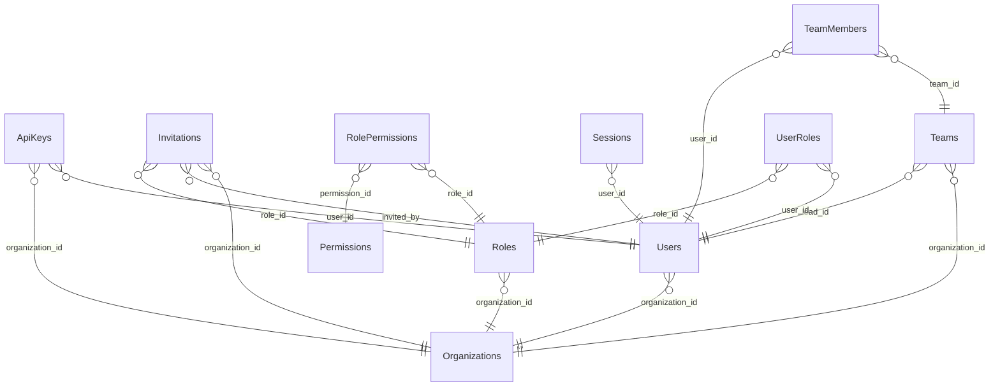

# Iam Schema

> Generated by DataBridge Doc Generator — 2026-04-03 12:39:58

## Tables

| Name | SQL Name | Type | Info |
|------|----------|------|------|
| [ApiKeys](./api_keys.md) | `api_keys` | TABLE | 11 columns |
| [Invitations](./invitations.md) | `invitations` | TABLE | 10 columns |
| [Organizations](./organizations.md) | `organizations` | TABLE | 11 columns |
| [Permissions](./permissions.md) | `permissions` | TABLE | 7 columns |
| [RolePermissions](./role_permissions.md) | `role_permissions` | TABLE | 5 columns |
| [Roles](./roles.md) | `roles` | TABLE | 8 columns |
| [Sessions](./sessions.md) | `sessions` | TABLE | 8 columns |
| [TeamMembers](./team_members.md) | `team_members` | TABLE | 7 columns |
| [Teams](./teams.md) | `teams` | TABLE | 8 columns |
| [UserRoles](./user_roles.md) | `user_roles` | TABLE | 8 columns |
| [Users](./users.md) | `users` | TABLE | 15 columns |

## Entity Relationship Diagram

## Enum Types

| Enum | Values |
|------|--------|
| `iam.auth_provider` | `local`, `google`, `github`, `azure_ad`, `saml` |
| `iam.user_status` | `active`, `inactive`, `suspended`, `pending_verification` |

