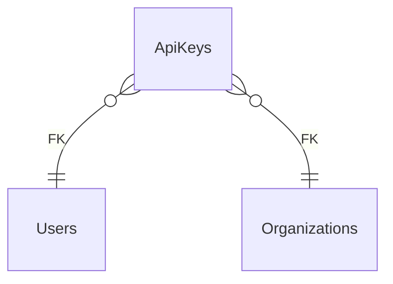

# ApiKeys

**Table:** `iam.api_keys`

**Base path:** `/api-keys`

## Related Tables

### Parent Tables

_Tables this table references via foreign keys._

| Parent Table | FK Column | References | Link |
|-------------|-----------|------------|------|
| `users` | `user_id` | `api_keys_user_id_fkey` | [Users](./users) |
| `organizations` | `organization_id` | `api_keys_organization_id_fkey` | [Organizations](./organizations) |


## Entity Relationship Diagram



::::tabs

=== FullStack

## Columns

| # | Column | SQL Type | Go Type | TS Type | Nullable | Default | Constraints | Description |
|---|--------|----------|---------|---------|----------|---------|-------------|-------------|
| 1 | `id` | `uuid` | `uuid.UUID` | `string` | NO | `gen_random_uuid()` | `PK` | Primary key |
| 2 | `name` | `text` | `string` | `string` | NO | - | - | - |
| 3 | `key_hash` | `text` | `string` | `string` | NO | - | - | - |
| 4 | `user_id` | `uuid` | `uuid.UUID` | `string` | NO | - | `FK` | → References `users` |
| 5 | `organization_id` | `uuid` | `uuid.UUID` | `string` | NO | - | `FK` | → References `organizations` |
| 6 | `scopes` | `ARRAY` | `pq.StringArray` | `string[]` | NO | `'{}'::text[]` | - | - |
| 7 | `is_active` | `boolean` | `bool` | `boolean` | NO | `true` | - | - |
| 8 | `last_used_at` | `timestamp with time zone` | `time.Time` | `string` | YES | - | - | - |
| 9 | `expires_at` | `timestamp with time zone` | `time.Time` | `string` | YES | - | - | - |
| 10 | `created_at` | `timestamp with time zone` | `time.Time` | `string` | NO | `now()` | - | Auto-filled from session |
| 11 | `updated_at` | `timestamp with time zone` | `time.Time` | `string` | NO | `now()` | - | Auto-filled from session |

## Primary Keys

- `id` (`uuid`)

## Foreign Keys & Relationships

| Column | References | Constraint |
|--------|-----------|------------|
| `user_id` | `users` | `api_keys_user_id_fkey` |
| `organization_id` | `organizations` | `api_keys_organization_id_fkey` |


## Go Generated Code

> 📂 Source: [📄 `ApiKeys.go`](https://github.com/meftunca/data-bridge-examples/blob/main//iam/structures/ApiKeys.go) · [📄 `ApiKeys.go`](https://github.com/meftunca/data-bridge-examples/blob/main//iam/services/ApiKeys.go) · [📄 `ApiKeys.go`](https://github.com/meftunca/data-bridge-examples/blob/main//iam/controllers/ApiKeys.go)

### Structs

:::tabs

== Form

#### ApiKeysForm [](https://github.com/meftunca/data-bridge-examples/blob/main//iam/structures/ApiKeys.go#:~:text=type%20ApiKeysForm%20struct)

_Create payload — excludes auto-generated PK fields_

| Field | Go Type | JSON Key | Nullable |
|-------|---------|----------|----------|
| `Name` | `string` | `name` | NO |
| `KeyHash` | `string` | `keyHash` | NO |
| `UserId` | `uuid.UUID` | `userId` | NO |
| `OrganizationId` | `uuid.UUID` | `organizationId` | NO |
| `Scopes` | `pq.StringArray` | `scopes` | NO |
| `IsActive` | `bool` | `isActive` | NO |
| `LastUsedAt` | `*time.Time` | `lastUsedAt` | YES |
| `ExpiresAt` | `*time.Time` | `expiresAt` | YES |
| `CreatedAt` | `time.Time` | `createdAt` | NO |
| `UpdatedAt` | `time.Time` | `updatedAt` | NO |

== Model

#### ApiKeys [](https://github.com/meftunca/data-bridge-examples/blob/main//iam/structures/ApiKeys.go#:~:text=type%20ApiKeys%20struct)

_Full model — all columns + GORM/JSON tags + preload relations_

| Field | Go Type | JSON Key | Nullable |
|-------|---------|----------|----------|
| `Id` | `uuid.UUID` | `id` | NO |
| `Name` | `string` | `name` | NO |
| `KeyHash` | `string` | `keyHash` | NO |
| `UserId` | `uuid.UUID` | `userId` | NO |
| `OrganizationId` | `uuid.UUID` | `organizationId` | NO |
| `Scopes` | `pq.StringArray` | `scopes` | NO |
| `IsActive` | `bool` | `isActive` | NO |
| `LastUsedAt` | `*time.Time` | `lastUsedAt` | YES |
| `ExpiresAt` | `*time.Time` | `expiresAt` | YES |
| `CreatedAt` | `time.Time` | `createdAt` | NO |
| `UpdatedAt` | `time.Time` | `updatedAt` | NO |

== Edit

#### ApiKeysEdit [](https://github.com/meftunca/data-bridge-examples/blob/main//iam/structures/ApiKeys.go#:~:text=type%20ApiKeysEdit%20struct)

_Update payload — all fields are pointers (partial update)_

| Field | Go Type | JSON Key | Nullable |
|-------|---------|----------|----------|
| `Id` | `*uuid.UUID` | `id` | YES |
| `Name` | `*string` | `name` | YES |
| `KeyHash` | `*string` | `keyHash` | YES |
| `UserId` | `*uuid.UUID` | `userId` | YES |
| `OrganizationId` | `*uuid.UUID` | `organizationId` | YES |
| `Scopes` | `*pq.StringArray` | `scopes` | YES |
| `IsActive` | `*bool` | `isActive` | YES |
| `LastUsedAt` | `*time.Time` | `lastUsedAt` | YES |
| `ExpiresAt` | `*time.Time` | `expiresAt` | YES |
| `CreatedAt` | `*time.Time` | `createdAt` | YES |
| `UpdatedAt` | `*time.Time` | `updatedAt` | YES |

== Filter

#### ApiKeysFilter [](https://github.com/meftunca/data-bridge-examples/blob/main//iam/structures/ApiKeys.go#:~:text=type%20ApiKeysFilter%20struct)

_Query filter — all fields are pointers_

| Field | Go Type | JSON Key | Nullable |
|-------|---------|----------|----------|
| `Id` | `*uuid.UUID` | `id` | YES |
| `Name` | `*string` | `name` | YES |
| `KeyHash` | `*string` | `keyHash` | YES |
| `UserId` | `*uuid.UUID` | `userId` | YES |
| `OrganizationId` | `*uuid.UUID` | `organizationId` | YES |
| `Scopes` | `*pq.StringArray` | `scopes` | YES |
| `IsActive` | `*bool` | `isActive` | YES |
| `LastUsedAt` | `*time.Time` | `lastUsedAt` | YES |
| `ExpiresAt` | `*time.Time` | `expiresAt` | YES |
| `CreatedAt` | `*time.Time` | `createdAt` | YES |
| `UpdatedAt` | `*time.Time` | `updatedAt` | YES |

== Page

#### ApiKeysPage [](https://github.com/meftunca/data-bridge-examples/blob/main//iam/structures/ApiKeys.go#:~:text=type%20ApiKeysPage%20struct)

_Paginated response wrapper_

| Field | Go Type | JSON Key | Nullable |
|-------|---------|----------|----------|
| `Id` | `uuid.UUID` | `id` | NO |
| `Name` | `string` | `name` | NO |
| `KeyHash` | `string` | `keyHash` | NO |
| `UserId` | `uuid.UUID` | `userId` | NO |
| `OrganizationId` | `uuid.UUID` | `organizationId` | NO |
| `Scopes` | `pq.StringArray` | `scopes` | NO |
| `IsActive` | `bool` | `isActive` | NO |
| `LastUsedAt` | `*time.Time` | `lastUsedAt` | YES |
| `ExpiresAt` | `*time.Time` | `expiresAt` | YES |
| `CreatedAt` | `time.Time` | `createdAt` | NO |
| `UpdatedAt` | `time.Time` | `updatedAt` | NO |

== BatchUpdate

#### ApiKeysBatchUpdate [](https://github.com/meftunca/data-bridge-examples/blob/main//iam/structures/ApiKeys.go#:~:text=type%20ApiKeysBatchUpdate%20struct)

```go
type ApiKeysBatchUpdate struct {
    Data       json.RawMessage `json:"data"`
    PathParams struct {
        Id uuid.UUID
    } `json:"pathParams"`
}
```

:::

### Service & Endpoints

:::tabs

== Service Methods

| Method | Signature |
|---------|-----------|
| [Create](https://github.com/meftunca/data-bridge-examples/blob/main//iam/services/ApiKeys.go#:~:text=%29%20CreateApiKeys%28%29) | `(ApiKeysService) CreateApiKeys(data ApiKeysForm) (ApiKeysForm, error)` |
| [Create Multiple](https://github.com/meftunca/data-bridge-examples/blob/main//iam/services/ApiKeys.go#:~:text=%29%20CreateApiKeysMultiple%28%29) | `(ApiKeysService) CreateApiKeysMultiple(data []ApiKeysForm) ([]ApiKeysForm, error)` |
| [Update](https://github.com/meftunca/data-bridge-examples/blob/main//iam/services/ApiKeys.go#:~:text=%29%20UpdateApiKeys%28%29) | `(ApiKeysService) UpdateApiKeys(id uuid.UUID, data interface{}) error` |
| [Update Multiple](https://github.com/meftunca/data-bridge-examples/blob/main//iam/services/ApiKeys.go#:~:text=%29%20UpdateApiKeysMultiple%28%29) | `(ApiKeysService) UpdateApiKeysMultiple(data []ApiKeysBatchUpdate) error` |
| [Delete](https://github.com/meftunca/data-bridge-examples/blob/main//iam/services/ApiKeys.go#:~:text=%29%20DeleteApiKeys%28%29) | `(ApiKeysService) DeleteApiKeys(id uuid.UUID) error` |

== Endpoints

| Method | Path | Description |
|--------|------|-------------|
| `GET` | `/api-keys/` | Search with query params |
| `GET` | `/api-keys/pagination` | Paginated listing |
| `POST` | `/api-keys/` | Create single record |
| `POST` | `/api-keys/bulk/` | Create multiple records |
| `PUT` | `/api-keys/bulk/` | Batch update |
| `GET` | `/api-keys/with-id/:id` | Get by ID |
| `PUT` | `/api-keys/with-id/:id` | Update by ID |
| `DELETE` | `/api-keys/with-id/:id` | Delete by ID |

== Query & Filters

| Parameter | Type | Description |
|-----------|------|-------------|
| `page` | `int` | Page number (default: 1) |
| `size` | `int` | Items per page (default: 10) |
| `sort` | `string` | Sort field. Prefix `-` for descending. Example: `-created_at` |
| `fields` | `string` | Comma-separated column list to select |
| `preloads` | `string` | Comma-separated relation names to preload |
| `filters` | `array` | Filter rules: `[[field, op, value], ...]` |
| `groupby` | `string` | Group by field name |
| `aggregations` | `json` | Aggregation specs: `[{func,field,alias}]` |

**Filter Operators:** `eq` `neq` `gt` `gte` `lt` `lte` `in` `notin` `like` `ilike` `is` `isnot` `between`

:::

### RPC Functions

| Function | Parameters | Return | Endpoint |
|----------|-----------|--------|----------|
| `count_active_users` | - | `integer` | `/rpc/count_active_users` |
| `user_permissions` | `p_user_id uuid`, `resource text`, `action text` | `record` | `/rpc/user_permissions` |
| `users_by_organization` | `p_org_id uuid` | `integer` | `/rpc/users_by_organization` |


=== Frontend

## TypeScript Types & Hooks

:::tabs

== Interfaces

```typescript
export interface ApiKeys {
  id: string;
  name: string;
  keyHash: string;
  userId: string;
  organizationId: string;
  scopes: string[];
  isActive: boolean;
  lastUsedAt?: string;
  expiresAt?: string;
  createdAt: string;
  updatedAt: string;
}

export interface ApiKeysForm {
  name: string;
  keyHash: string;
  userId: string;
  organizationId: string;
  scopes: string[];
  isActive: boolean;
  lastUsedAt?: string;
  expiresAt?: string;
  createdAt: string;
  updatedAt: string;
}

export interface ApiKeysEdit {
  id: string;
  name: string;
  keyHash: string;
  userId: string;
  organizationId: string;
  scopes: string[];
  isActive: boolean;
  lastUsedAt?: string;
  expiresAt?: string;
  createdAt: string;
  updatedAt: string;
}

export interface ApiKeysPage {
  data: ApiKeys[];
  total: number;
  page: number;
  size: number;
  totalPages: number;
}

export type ApiKeysPathQuery = {
  page?: number;
  size?: number;
  sort?: string;
  fields?: string;
  preloads?: string;
  filters?: string;
};

```

== React Query

```typescript
import { useQuery, useMutation, useQueryClient } from "@tanstack/react-query";

const ApiKeysKeys = {
  all: ["api_keys"] as const,
  lists: () => [...ApiKeysKeys.all, "list"] as const,
  detail: (id: any) => [...ApiKeysKeys.all, "detail", id] as const,
} as const;

export function useApiKeysList(query?: ApiKeysPathQuery) {
  return useQuery({
    queryKey: [...ApiKeysKeys.lists(), query],
    queryFn: () => fetch(`/api-keys/pagination`, { method: "GET" }).then(r => r.json()) as Promise<ApiKeysPage>,
  });
}

export function useApiKeysDetail(id: any) {
  return useQuery({
    queryKey: ApiKeysKeys.detail(id),
    queryFn: () => fetch(`/api-keys/with-id/:id`).then(r => r.json()) as Promise<ApiKeys>,
  });
}

export function useCreateApiKeys() {
  const qc = useQueryClient();
  return useMutation({
    mutationFn: (data: ApiKeysForm) =>
      fetch("/api-keys/", { method: "POST", body: JSON.stringify(data) }).then(r => r.json()),
    onSuccess: () => qc.invalidateQueries({ queryKey: ApiKeysKeys.lists() }),
  });
}

export function useUpdateApiKeys() {
  const qc = useQueryClient();
  return useMutation({
    mutationFn: ({ id, data }: { id: any: any; data: ApiKeysEdit }) =>
      fetch(`/api-keys/with-id/:id`, { method: "PUT", body: JSON.stringify(data) }).then(r => r.json()),
    onSuccess: () => qc.invalidateQueries({ queryKey: ApiKeysKeys.all }),
  });
}

export function useDeleteApiKeys() {
  const qc = useQueryClient();
  return useMutation({
    mutationFn: (id: any) =>
      fetch(`/api-keys/with-id/:id`, { method: "DELETE" }).then(r => r.json()),
    onSuccess: () => qc.invalidateQueries({ queryKey: ApiKeysKeys.all }),
  });
}

```

== Zod Validation

```typescript
import { z } from "zod";

export const ApiKeysFormSchema = z.object({
  name: z.string(),
  keyHash: z.string(),
  userId: z.string().uuid(),
  organizationId: z.string().uuid(),
  scopes: z.array(z.unknown()),
  isActive: z.boolean(),
  lastUsedAt: z.string().datetime().optional(),
  expiresAt: z.string().datetime().optional(),
  createdAt: z.string().datetime(),
  updatedAt: z.string().datetime(),
});

export type ApiKeysFormInput = z.infer<typeof ApiKeysFormSchema>;

```

:::


=== API

<script setup>
import { useOpenapi } from 'vitepress-openapi'
import spec from './api_keys.openapi.json'
useOpenapi({ spec })
</script>


## API Reference

:::tabs

== Search

#### <Badge type="info" text="GET" /> Search ApiKeys

```
GET /api/v1/api-keys/
```

> Retrieve list filtered by query parameters.

**Headers:**

| Header | Required | Description |
|--------|----------|-------------|
| `Authorization` | Yes | Bearer token |
| `x-company` | Yes | Company ID |

**Query Parameters:**

| Parameter | Type | Required | Description |
|-----------|------|----------|-------------|
| `size` | `integer` | No | Max results (default: 10) |
| `sort` | `string` | No | Sort field. Prefix `-` for DESC. e.g. `-created_at` |
| `fields` | `string` | No | Comma-separated columns to select |
| `preloads` | `string` | No | Available: UserIdDetail, UserIdDetail.UserRolesList, UserIdDetail.UserRolesList.UserIdDetail, UserIdDetail.UserRolesList.RoleIdDetail, UserIdDetail.UserRolesList.GrantedByDetail, UserIdDetail.TeamsList, UserIdDetail.TeamsList.TeamMembersList, UserIdDetail.TeamsList.OrganizationIdDetail, UserIdDetail.TeamsList.LeadIdDetail, UserIdDetail.TeamMembersList, UserIdDetail.TeamMembersList.TeamIdDetail, UserIdDetail.TeamMembersList.UserIdDetail, UserIdDetail.ApiKeysList, UserIdDetail.ApiKeysList.UserIdDetail, UserIdDetail.ApiKeysList.OrganizationIdDetail, UserIdDetail.SessionsList, UserIdDetail.SessionsList.UserIdDetail, UserIdDetail.InvitationsList, UserIdDetail.InvitationsList.OrganizationIdDetail, UserIdDetail.InvitationsList.InvitedByDetail, UserIdDetail.InvitationsList.RoleIdDetail, UserIdDetail.OrganizationIdDetail, UserIdDetail.OrganizationIdDetail.OrganizationsList, UserIdDetail.OrganizationIdDetail.UsersList, UserIdDetail.OrganizationIdDetail.RolesList, UserIdDetail.OrganizationIdDetail.TeamsList, UserIdDetail.OrganizationIdDetail.ApiKeysList, UserIdDetail.OrganizationIdDetail.InvitationsList, UserIdDetail.OrganizationIdDetail.ParentIdDetail, OrganizationIdDetail, OrganizationIdDetail.OrganizationsList, OrganizationIdDetail.UsersList, OrganizationIdDetail.UsersList.UserRolesList, OrganizationIdDetail.UsersList.TeamsList, OrganizationIdDetail.UsersList.TeamMembersList, OrganizationIdDetail.UsersList.ApiKeysList, OrganizationIdDetail.UsersList.SessionsList, OrganizationIdDetail.UsersList.InvitationsList, OrganizationIdDetail.UsersList.OrganizationIdDetail, OrganizationIdDetail.RolesList, OrganizationIdDetail.RolesList.RolePermissionsList, OrganizationIdDetail.RolesList.UserRolesList, OrganizationIdDetail.RolesList.InvitationsList, OrganizationIdDetail.RolesList.OrganizationIdDetail, OrganizationIdDetail.TeamsList, OrganizationIdDetail.TeamsList.TeamMembersList, OrganizationIdDetail.TeamsList.OrganizationIdDetail, OrganizationIdDetail.TeamsList.LeadIdDetail, OrganizationIdDetail.ApiKeysList, OrganizationIdDetail.ApiKeysList.UserIdDetail, OrganizationIdDetail.ApiKeysList.OrganizationIdDetail, OrganizationIdDetail.InvitationsList, OrganizationIdDetail.InvitationsList.OrganizationIdDetail, OrganizationIdDetail.InvitationsList.InvitedByDetail, OrganizationIdDetail.InvitationsList.RoleIdDetail, OrganizationIdDetail.ParentIdDetail |
| `joins` | `string` | No | Available: Users, Users.Organizations, Users.Organizations.Organizations, Organizations, Organizations.Organizations |
| `id` | `string (uuid)` | No | Filter by id |
| `name` | `string` | No | Filter by name |
| `keyHash` | `string` | No | Filter by key_hash |
| `userId` | `string (uuid)` | No | Filter by user_id |
| `organizationId` | `string (uuid)` | No | Filter by organization_id |
| `scopes` | `string` | No | Filter by scopes |
| `isActive` | `boolean` | No | Filter by is_active |
| `lastUsedAt` | `string (date-time)` | No | Filter by last_used_at |
| `expiresAt` | `string (date-time)` | No | Filter by expires_at |

**Response:** `ApiKeys[]`

<details>
<summary>curl example</summary>

```bash
curl -X GET \
  -H "Authorization: Bearer $TOKEN" \
  -H "x-company: $COMPANY_ID" \
  "http://localhost:3000/api/v1/api-keys/"
```

</details>

---

#### <Badge type="tip" text="POST" /> Search ApiKeys (POST)

```
POST /api/v1/api-keys/search
```

> Search with body filters. Auto-used when query string > 2KB.

**Headers:**

| Header | Required | Description |
|--------|----------|-------------|
| `Authorization` | Yes | Bearer token |
| `x-company` | Yes | Company ID |

**Request Body:**

```typescript
{
  size?: number  // e.g. 10
  sort?: string[]  // e.g. ["-createdAt"]
  filters?: FilterRule[]  // e.g. [["name", "eq", "value"]]
  fields?: string[]
  preloads?: string[]
}
```

**Response:** `ApiKeys[]`

<details>
<summary>curl example</summary>

```bash
curl -X POST \
  -H "Authorization: Bearer $TOKEN" \
  -H "x-company: $COMPANY_ID" \
  -H "Content-Type: application/json" \
  -d '{}' \
  "http://localhost:3000/api/v1/api-keys/search"
```

</details>

---

== Pagination

#### <Badge type="info" text="GET" /> Paginate ApiKeys

```
GET /api/v1/api-keys/pagination
```

> Paginated listing.

**Headers:**

| Header | Required | Description |
|--------|----------|-------------|
| `Authorization` | Yes | Bearer token |
| `x-company` | Yes | Company ID |

**Query Parameters:**

| Parameter | Type | Required | Description |
|-----------|------|----------|-------------|
| `page` | `integer` | No | Page number (default: 1) |
| `size` | `integer` | No | Max results (default: 10) |
| `sort` | `string` | No | Sort field. Prefix `-` for DESC. e.g. `-created_at` |
| `fields` | `string` | No | Comma-separated columns to select |
| `preloads` | `string` | No | Available: UserIdDetail, UserIdDetail.UserRolesList, UserIdDetail.UserRolesList.UserIdDetail, UserIdDetail.UserRolesList.RoleIdDetail, UserIdDetail.UserRolesList.GrantedByDetail, UserIdDetail.TeamsList, UserIdDetail.TeamsList.TeamMembersList, UserIdDetail.TeamsList.OrganizationIdDetail, UserIdDetail.TeamsList.LeadIdDetail, UserIdDetail.TeamMembersList, UserIdDetail.TeamMembersList.TeamIdDetail, UserIdDetail.TeamMembersList.UserIdDetail, UserIdDetail.ApiKeysList, UserIdDetail.ApiKeysList.UserIdDetail, UserIdDetail.ApiKeysList.OrganizationIdDetail, UserIdDetail.SessionsList, UserIdDetail.SessionsList.UserIdDetail, UserIdDetail.InvitationsList, UserIdDetail.InvitationsList.OrganizationIdDetail, UserIdDetail.InvitationsList.InvitedByDetail, UserIdDetail.InvitationsList.RoleIdDetail, UserIdDetail.OrganizationIdDetail, UserIdDetail.OrganizationIdDetail.OrganizationsList, UserIdDetail.OrganizationIdDetail.UsersList, UserIdDetail.OrganizationIdDetail.RolesList, UserIdDetail.OrganizationIdDetail.TeamsList, UserIdDetail.OrganizationIdDetail.ApiKeysList, UserIdDetail.OrganizationIdDetail.InvitationsList, UserIdDetail.OrganizationIdDetail.ParentIdDetail, OrganizationIdDetail, OrganizationIdDetail.OrganizationsList, OrganizationIdDetail.UsersList, OrganizationIdDetail.UsersList.UserRolesList, OrganizationIdDetail.UsersList.TeamsList, OrganizationIdDetail.UsersList.TeamMembersList, OrganizationIdDetail.UsersList.ApiKeysList, OrganizationIdDetail.UsersList.SessionsList, OrganizationIdDetail.UsersList.InvitationsList, OrganizationIdDetail.UsersList.OrganizationIdDetail, OrganizationIdDetail.RolesList, OrganizationIdDetail.RolesList.RolePermissionsList, OrganizationIdDetail.RolesList.UserRolesList, OrganizationIdDetail.RolesList.InvitationsList, OrganizationIdDetail.RolesList.OrganizationIdDetail, OrganizationIdDetail.TeamsList, OrganizationIdDetail.TeamsList.TeamMembersList, OrganizationIdDetail.TeamsList.OrganizationIdDetail, OrganizationIdDetail.TeamsList.LeadIdDetail, OrganizationIdDetail.ApiKeysList, OrganizationIdDetail.ApiKeysList.UserIdDetail, OrganizationIdDetail.ApiKeysList.OrganizationIdDetail, OrganizationIdDetail.InvitationsList, OrganizationIdDetail.InvitationsList.OrganizationIdDetail, OrganizationIdDetail.InvitationsList.InvitedByDetail, OrganizationIdDetail.InvitationsList.RoleIdDetail, OrganizationIdDetail.ParentIdDetail |
| `joins` | `string` | No | Available: Users, Users.Organizations, Users.Organizations.Organizations, Organizations, Organizations.Organizations |
| `id` | `string (uuid)` | No | Filter by id |
| `name` | `string` | No | Filter by name |
| `keyHash` | `string` | No | Filter by key_hash |
| `userId` | `string (uuid)` | No | Filter by user_id |
| `organizationId` | `string (uuid)` | No | Filter by organization_id |
| `scopes` | `string` | No | Filter by scopes |
| `isActive` | `boolean` | No | Filter by is_active |
| `lastUsedAt` | `string (date-time)` | No | Filter by last_used_at |
| `expiresAt` | `string (date-time)` | No | Filter by expires_at |

**Response:** `PaginationResponse<ApiKeys>`

<details>
<summary>curl example</summary>

```bash
curl -X GET \
  -H "Authorization: Bearer $TOKEN" \
  -H "x-company: $COMPANY_ID" \
  "http://localhost:3000/api/v1/api-keys/pagination"
```

</details>

---

#### <Badge type="tip" text="POST" /> Paginate ApiKeys (POST)

```
POST /api/v1/api-keys/pagination
```

> Paginated listing with body filters.

**Headers:**

| Header | Required | Description |
|--------|----------|-------------|
| `Authorization` | Yes | Bearer token |
| `x-company` | Yes | Company ID |

**Request Body:**

```typescript
{
  page?: number  // e.g. 1
  size?: number  // e.g. 10
  sort?: string[]  // e.g. ["-createdAt"]
  filters?: FilterRule[]  // e.g. [["name", "eq", "value"]]
  fields?: string[]
  preloads?: string[]
}
```

**Response:** `PaginationResponse<ApiKeys>`

<details>
<summary>curl example</summary>

```bash
curl -X POST \
  -H "Authorization: Bearer $TOKEN" \
  -H "x-company: $COMPANY_ID" \
  -H "Content-Type: application/json" \
  -d '{}' \
  "http://localhost:3000/api/v1/api-keys/pagination"
```

</details>

---

== Create

#### <Badge type="tip" text="POST" /> Create ApiKeys

```
POST /api/v1/api-keys/
```

> Create a new record.

**Headers:**

| Header | Required | Description |
|--------|----------|-------------|
| `Authorization` | Yes | Bearer token |
| `x-company` | Yes | Company ID |

**Request Body:**

```typescript
{
  name: string  // e.g. example_name
  keyHash: string  // e.g. example_key_hash
  userId: string  // e.g. 550e8400-e29b-41d4-a716-446655440000
  organizationId: string  // e.g. 550e8400-e29b-41d4-a716-446655440000
  scopes?: string[]  // e.g. [value1 value2]
  isActive?: boolean  // e.g. true
  lastUsedAt?: string  // e.g. 2026-01-15T10:30:00Z
  expiresAt?: string  // e.g. 2026-01-15T10:30:00Z
}
```

**Response:** `ApiKeys`

<details>
<summary>curl example</summary>

```bash
curl -X POST \
  -H "Authorization: Bearer $TOKEN" \
  -H "x-company: $COMPANY_ID" \
  -H "Content-Type: application/json" \
  -d '{}' \
  "http://localhost:3000/api/v1/api-keys/"
```

</details>

---

#### <Badge type="tip" text="POST" /> Bulk Create ApiKeys

```
POST /api/v1/api-keys/bulk/
```

> Create multiple records in one request.

**Headers:**

| Header | Required | Description |
|--------|----------|-------------|
| `Authorization` | Yes | Bearer token |
| `x-company` | Yes | Company ID |

**Request Body:**

```typescript
{
  name: string  // e.g. example_name
  keyHash: string  // e.g. example_key_hash
  userId: string  // e.g. 550e8400-e29b-41d4-a716-446655440000
  organizationId: string  // e.g. 550e8400-e29b-41d4-a716-446655440000
  scopes?: string[]  // e.g. [value1 value2]
  isActive?: boolean  // e.g. true
  lastUsedAt?: string  // e.g. 2026-01-15T10:30:00Z
  expiresAt?: string  // e.g. 2026-01-15T10:30:00Z
}
```

**Response:** `ApiKeys[]`

<details>
<summary>curl example</summary>

```bash
curl -X POST \
  -H "Authorization: Bearer $TOKEN" \
  -H "x-company: $COMPANY_ID" \
  -H "Content-Type: application/json" \
  -d '{}' \
  "http://localhost:3000/api/v1/api-keys/bulk/"
```

</details>

---

== Find & Update

#### <Badge type="info" text="GET" /> Find ApiKeys by ID

```
GET /api/v1/api-keys/with-id/:id
```

> Retrieve a single record by primary key.

**Headers:**

| Header | Required | Description |
|--------|----------|-------------|
| `Authorization` | Yes | Bearer token |
| `x-company` | Yes | Company ID |

**Query Parameters:**

| Parameter | Type | Required | Description |
|-----------|------|----------|-------------|
| `Id` | `string (uuid)` | Yes | Primary key (uuid) |

**Response:** `ApiKeys`

<details>
<summary>curl example</summary>

```bash
curl -X GET \
  -H "Authorization: Bearer $TOKEN" \
  -H "x-company: $COMPANY_ID" \
  "http://localhost:3000/api/v1/api-keys/with-id/:id"
```

</details>

---

#### <Badge type="warning" text="PUT" /> Update ApiKeys

```
PUT /api/v1/api-keys/with-id/:id
```

> Partial update — send only the fields to change.

**Headers:**

| Header | Required | Description |
|--------|----------|-------------|
| `Authorization` | Yes | Bearer token |
| `x-company` | Yes | Company ID |

**Query Parameters:**

| Parameter | Type | Required | Description |
|-----------|------|----------|-------------|
| `Id` | `string (uuid)` | Yes | Primary key (uuid) |

**Request Body:**

```typescript
{
  name?: string
  keyHash?: string
  userId?: string
  organizationId?: string
  scopes?: string[]
  isActive?: boolean
  lastUsedAt?: string
  expiresAt?: string
}
```

**Response:** `Success`

<details>
<summary>curl example</summary>

```bash
curl -X PUT \
  -H "Authorization: Bearer $TOKEN" \
  -H "x-company: $COMPANY_ID" \
  -H "Content-Type: application/json" \
  -d '{}' \
  "http://localhost:3000/api/v1/api-keys/with-id/:id"
```

</details>

---

#### <Badge type="warning" text="PUT" /> Bulk Update ApiKeys

```
PUT /api/v1/api-keys/bulk/
```

> Batch update multiple records.

**Headers:**

| Header | Required | Description |
|--------|----------|-------------|
| `Authorization` | Yes | Bearer token |
| `x-company` | Yes | Company ID |

**Request Body:** Array of { pathParams, data: ApiKeysEdit }

**Response:** `Success`

<details>
<summary>curl example</summary>

```bash
curl -X PUT \
  -H "Authorization: Bearer $TOKEN" \
  -H "x-company: $COMPANY_ID" \
  -H "Content-Type: application/json" \
  -d '{}' \
  "http://localhost:3000/api/v1/api-keys/bulk/"
```

</details>

---

== Delete

#### <Badge type="danger" text="DELETE" /> Delete ApiKeys

```
DELETE /api/v1/api-keys/with-id/:id
```

> Soft-delete (sets deleted_at + deleted_by).

**Headers:**

| Header | Required | Description |
|--------|----------|-------------|
| `Authorization` | Yes | Bearer token |
| `x-company` | Yes | Company ID |

**Query Parameters:**

| Parameter | Type | Required | Description |
|-----------|------|----------|-------------|
| `Id` | `string (uuid)` | Yes | Primary key (uuid) |

**Response:** `Success`

<details>
<summary>curl example</summary>

```bash
curl -X DELETE \
  -H "Authorization: Bearer $TOKEN" \
  -H "x-company: $COMPANY_ID" \
  "http://localhost:3000/api/v1/api-keys/with-id/:id"
```

</details>

---

:::


::::
