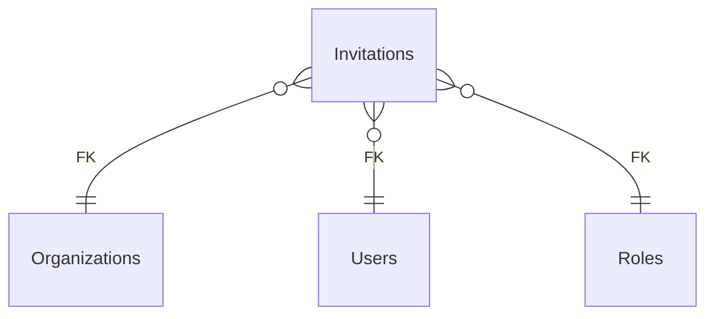

# Invitations

**Table:** `iam.invitations`

**Base path:** `/invitations`

## Related Tables

### Parent Tables

_Tables this table references via foreign keys._

| Parent Table | FK Column | References | Link |
|-------------|-----------|------------|------|
| `organizations` | `organization_id` | `invitations_organization_id_fkey` | [Organizations](./organizations) |
| `users` | `invited_by` | `invitations_invited_by_fkey` | [Users](./users) |
| `roles` | `role_id` | `invitations_role_id_fkey` | [Roles](./roles) |


## Entity Relationship Diagram



::::tabs

=== FullStack

## Columns

| # | Column | SQL Type | Go Type | TS Type | Nullable | Default | Constraints | Description |
|---|--------|----------|---------|---------|----------|---------|-------------|-------------|
| 1 | `id` | `uuid` | `uuid.UUID` | `string` | NO | `gen_random_uuid()` | `PK` | Primary key |
| 2 | `name` | `text` | `string` | `string` | NO | `''::text` | - | - |
| 3 | `email` | `text` | `string` | `string` | NO | - | - | - |
| 4 | `organization_id` | `uuid` | `uuid.UUID` | `string` | NO | - | `FK` | → References `organizations` |
| 5 | `invited_by` | `uuid` | `uuid.UUID` | `string` | NO | - | `FK` | → References `users` |
| 6 | `role_id` | `uuid` | `uuid.UUID` | `string` | YES | - | `FK` | → References `roles` |
| 7 | `token` | `text` | `string` | `string` | NO | - | `UQ` | - |
| 8 | `accepted_at` | `timestamp with time zone` | `time.Time` | `string` | YES | - | - | - |
| 9 | `expires_at` | `timestamp with time zone` | `time.Time` | `string` | NO | - | - | - |
| 10 | `created_at` | `timestamp with time zone` | `time.Time` | `string` | NO | `now()` | - | Auto-filled from session |

## Primary Keys

- `id` (`uuid`)

## Foreign Keys & Relationships

| Column | References | Constraint |
|--------|-----------|------------|
| `organization_id` | `organizations` | `invitations_organization_id_fkey` |
| `invited_by` | `users` | `invitations_invited_by_fkey` |
| `role_id` | `roles` | `invitations_role_id_fkey` |

## Unique Keys

- `token` (`text`)


## Go Generated Code

> 📂 Source: [📄 `Invitations.go`](https://github.com/meftunca/data-bridge-examples/blob/main//iam/structures/Invitations.go) · [📄 `Invitations.go`](https://github.com/meftunca/data-bridge-examples/blob/main//iam/services/Invitations.go) · [📄 `Invitations.go`](https://github.com/meftunca/data-bridge-examples/blob/main//iam/controllers/Invitations.go)

### Structs

:::tabs

== Form

#### InvitationsForm [](https://github.com/meftunca/data-bridge-examples/blob/main//iam/structures/Invitations.go#:~:text=type%20InvitationsForm%20struct)

_Create payload — excludes auto-generated PK fields_

| Field | Go Type | JSON Key | Nullable |
|-------|---------|----------|----------|
| `Name` | `string` | `name` | NO |
| `Email` | `string` | `email` | NO |
| `OrganizationId` | `uuid.UUID` | `organizationId` | NO |
| `InvitedBy` | `uuid.UUID` | `invitedBy` | NO |
| `RoleId` | `*uuid.UUID` | `roleId` | YES |
| `Token` | `string` | `token` | NO |
| `AcceptedAt` | `*time.Time` | `acceptedAt` | YES |
| `ExpiresAt` | `time.Time` | `expiresAt` | NO |
| `CreatedAt` | `time.Time` | `createdAt` | NO |

== Model

#### Invitations [](https://github.com/meftunca/data-bridge-examples/blob/main//iam/structures/Invitations.go#:~:text=type%20Invitations%20struct)

_Full model — all columns + GORM/JSON tags + preload relations_

| Field | Go Type | JSON Key | Nullable |
|-------|---------|----------|----------|
| `Id` | `uuid.UUID` | `id` | NO |
| `Name` | `string` | `name` | NO |
| `Email` | `string` | `email` | NO |
| `OrganizationId` | `uuid.UUID` | `organizationId` | NO |
| `InvitedBy` | `uuid.UUID` | `invitedBy` | NO |
| `RoleId` | `*uuid.UUID` | `roleId` | YES |
| `Token` | `string` | `token` | NO |
| `AcceptedAt` | `*time.Time` | `acceptedAt` | YES |
| `ExpiresAt` | `time.Time` | `expiresAt` | NO |
| `CreatedAt` | `time.Time` | `createdAt` | NO |

== Edit

#### InvitationsEdit [](https://github.com/meftunca/data-bridge-examples/blob/main//iam/structures/Invitations.go#:~:text=type%20InvitationsEdit%20struct)

_Update payload — all fields are pointers (partial update)_

| Field | Go Type | JSON Key | Nullable |
|-------|---------|----------|----------|
| `Id` | `*uuid.UUID` | `id` | YES |
| `Name` | `*string` | `name` | YES |
| `Email` | `*string` | `email` | YES |
| `OrganizationId` | `*uuid.UUID` | `organizationId` | YES |
| `InvitedBy` | `*uuid.UUID` | `invitedBy` | YES |
| `RoleId` | `*uuid.UUID` | `roleId` | YES |
| `Token` | `*string` | `token` | YES |
| `AcceptedAt` | `*time.Time` | `acceptedAt` | YES |
| `ExpiresAt` | `*time.Time` | `expiresAt` | YES |
| `CreatedAt` | `*time.Time` | `createdAt` | YES |

== Filter

#### InvitationsFilter [](https://github.com/meftunca/data-bridge-examples/blob/main//iam/structures/Invitations.go#:~:text=type%20InvitationsFilter%20struct)

_Query filter — all fields are pointers_

| Field | Go Type | JSON Key | Nullable |
|-------|---------|----------|----------|
| `Id` | `*uuid.UUID` | `id` | YES |
| `Name` | `*string` | `name` | YES |
| `Email` | `*string` | `email` | YES |
| `OrganizationId` | `*uuid.UUID` | `organizationId` | YES |
| `InvitedBy` | `*uuid.UUID` | `invitedBy` | YES |
| `RoleId` | `*uuid.UUID` | `roleId` | YES |
| `Token` | `*string` | `token` | YES |
| `AcceptedAt` | `*time.Time` | `acceptedAt` | YES |
| `ExpiresAt` | `*time.Time` | `expiresAt` | YES |
| `CreatedAt` | `*time.Time` | `createdAt` | YES |

== Page

#### InvitationsPage [](https://github.com/meftunca/data-bridge-examples/blob/main//iam/structures/Invitations.go#:~:text=type%20InvitationsPage%20struct)

_Paginated response wrapper_

| Field | Go Type | JSON Key | Nullable |
|-------|---------|----------|----------|
| `Id` | `uuid.UUID` | `id` | NO |
| `Name` | `string` | `name` | NO |
| `Email` | `string` | `email` | NO |
| `OrganizationId` | `uuid.UUID` | `organizationId` | NO |
| `InvitedBy` | `uuid.UUID` | `invitedBy` | NO |
| `RoleId` | `*uuid.UUID` | `roleId` | YES |
| `Token` | `string` | `token` | NO |
| `AcceptedAt` | `*time.Time` | `acceptedAt` | YES |
| `ExpiresAt` | `time.Time` | `expiresAt` | NO |
| `CreatedAt` | `time.Time` | `createdAt` | NO |

== BatchUpdate

#### InvitationsBatchUpdate [](https://github.com/meftunca/data-bridge-examples/blob/main//iam/structures/Invitations.go#:~:text=type%20InvitationsBatchUpdate%20struct)

```go
type InvitationsBatchUpdate struct {
    Data       json.RawMessage `json:"data"`
    PathParams struct {
        Id uuid.UUID
    } `json:"pathParams"`
}
```

:::

### Service & Endpoints

:::tabs

== Service Methods

| Method | Signature |
|---------|-----------|
| [Create](https://github.com/meftunca/data-bridge-examples/blob/main//iam/services/Invitations.go#:~:text=%29%20CreateInvitations%28%29) | `(InvitationsService) CreateInvitations(data InvitationsForm) (InvitationsForm, error)` |
| [Create Multiple](https://github.com/meftunca/data-bridge-examples/blob/main//iam/services/Invitations.go#:~:text=%29%20CreateInvitationsMultiple%28%29) | `(InvitationsService) CreateInvitationsMultiple(data []InvitationsForm) ([]InvitationsForm, error)` |
| [Update](https://github.com/meftunca/data-bridge-examples/blob/main//iam/services/Invitations.go#:~:text=%29%20UpdateInvitations%28%29) | `(InvitationsService) UpdateInvitations(id uuid.UUID, data interface{}) error` |
| [Update Multiple](https://github.com/meftunca/data-bridge-examples/blob/main//iam/services/Invitations.go#:~:text=%29%20UpdateInvitationsMultiple%28%29) | `(InvitationsService) UpdateInvitationsMultiple(data []InvitationsBatchUpdate) error` |
| [Delete](https://github.com/meftunca/data-bridge-examples/blob/main//iam/services/Invitations.go#:~:text=%29%20DeleteInvitations%28%29) | `(InvitationsService) DeleteInvitations(id uuid.UUID) error` |

== Endpoints

| Method | Path | Description |
|--------|------|-------------|
| `GET` | `/invitations/` | Search with query params |
| `GET` | `/invitations/pagination` | Paginated listing |
| `POST` | `/invitations/` | Create single record |
| `POST` | `/invitations/bulk/` | Create multiple records |
| `PUT` | `/invitations/bulk/` | Batch update |
| `GET` | `/invitations/with-id/:id` | Get by ID |
| `PUT` | `/invitations/with-id/:id` | Update by ID |
| `DELETE` | `/invitations/with-id/:id` | Delete by ID |

== Query & Filters

| Parameter | Type | Description |
|-----------|------|-------------|
| `page` | `int` | Page number (default: 1) |
| `size` | `int` | Items per page (default: 10) |
| `sort` | `string` | Sort field. Prefix `-` for descending. Example: `-created_at` |
| `fields` | `string` | Comma-separated column list to select |
| `preloads` | `string` | Comma-separated relation names to preload |
| `filters` | `array` | Filter rules: `[[field, op, value], ...]` |
| `groupby` | `string` | Group by field name |
| `aggregations` | `json` | Aggregation specs: `[{func,field,alias}]` |

**Filter Operators:** `eq` `neq` `gt` `gte` `lt` `lte` `in` `notin` `like` `ilike` `is` `isnot` `between`

:::

### RPC Functions

| Function | Parameters | Return | Endpoint |
|----------|-----------|--------|----------|
| `count_active_users` | - | `integer` | `/rpc/count_active_users` |
| `user_permissions` | `p_user_id uuid`, `resource text`, `action text` | `record` | `/rpc/user_permissions` |
| `users_by_organization` | `p_org_id uuid` | `integer` | `/rpc/users_by_organization` |


=== Frontend

## TypeScript Types & Hooks

:::tabs

== Interfaces

```typescript
export interface Invitations {
  id: string;
  name: string;
  email: string;
  organizationId: string;
  invitedBy: string;
  roleId?: string;
  token: string;
  acceptedAt?: string;
  expiresAt: string;
  createdAt: string;
}

export interface InvitationsForm {
  name: string;
  email: string;
  organizationId: string;
  invitedBy: string;
  roleId?: string;
  token: string;
  acceptedAt?: string;
  expiresAt: string;
  createdAt: string;
}

export interface InvitationsEdit {
  id: string;
  name: string;
  email: string;
  organizationId: string;
  invitedBy: string;
  roleId?: string;
  token: string;
  acceptedAt?: string;
  expiresAt: string;
  createdAt: string;
}

export interface InvitationsPage {
  data: Invitations[];
  total: number;
  page: number;
  size: number;
  totalPages: number;
}

export type InvitationsPathQuery = {
  page?: number;
  size?: number;
  sort?: string;
  fields?: string;
  preloads?: string;
  filters?: string;
};

```

== React Query

```typescript
import { useQuery, useMutation, useQueryClient } from "@tanstack/react-query";

const InvitationsKeys = {
  all: ["invitations"] as const,
  lists: () => [...InvitationsKeys.all, "list"] as const,
  detail: (id: any) => [...InvitationsKeys.all, "detail", id] as const,
} as const;

export function useInvitationsList(query?: InvitationsPathQuery) {
  return useQuery({
    queryKey: [...InvitationsKeys.lists(), query],
    queryFn: () => fetch(`/invitations/pagination`, { method: "GET" }).then(r => r.json()) as Promise<InvitationsPage>,
  });
}

export function useInvitationsDetail(id: any) {
  return useQuery({
    queryKey: InvitationsKeys.detail(id),
    queryFn: () => fetch(`/invitations/with-id/:id`).then(r => r.json()) as Promise<Invitations>,
  });
}

export function useCreateInvitations() {
  const qc = useQueryClient();
  return useMutation({
    mutationFn: (data: InvitationsForm) =>
      fetch("/invitations/", { method: "POST", body: JSON.stringify(data) }).then(r => r.json()),
    onSuccess: () => qc.invalidateQueries({ queryKey: InvitationsKeys.lists() }),
  });
}

export function useUpdateInvitations() {
  const qc = useQueryClient();
  return useMutation({
    mutationFn: ({ id, data }: { id: any: any; data: InvitationsEdit }) =>
      fetch(`/invitations/with-id/:id`, { method: "PUT", body: JSON.stringify(data) }).then(r => r.json()),
    onSuccess: () => qc.invalidateQueries({ queryKey: InvitationsKeys.all }),
  });
}

export function useDeleteInvitations() {
  const qc = useQueryClient();
  return useMutation({
    mutationFn: (id: any) =>
      fetch(`/invitations/with-id/:id`, { method: "DELETE" }).then(r => r.json()),
    onSuccess: () => qc.invalidateQueries({ queryKey: InvitationsKeys.all }),
  });
}

```

== Zod Validation

```typescript
import { z } from "zod";

export const InvitationsFormSchema = z.object({
  name: z.string(),
  email: z.string(),
  organizationId: z.string().uuid(),
  invitedBy: z.string().uuid(),
  roleId: z.string().uuid().optional(),
  token: z.string(),
  acceptedAt: z.string().datetime().optional(),
  expiresAt: z.string().datetime(),
  createdAt: z.string().datetime(),
});

export type InvitationsFormInput = z.infer<typeof InvitationsFormSchema>;

```

:::


=== API

<script setup>
import { useOpenapi } from 'vitepress-openapi'
import spec from './invitations.openapi.json'
useOpenapi({ spec })
</script>


## API Reference

:::tabs

== Search

#### <Badge type="info" text="GET" /> Search Invitations

```
GET /api/v1/invitations/
```

> Retrieve list filtered by query parameters.

**Headers:**

| Header | Required | Description |
|--------|----------|-------------|
| `Authorization` | Yes | Bearer token |
| `x-company` | Yes | Company ID |

**Query Parameters:**

| Parameter | Type | Required | Description |
|-----------|------|----------|-------------|
| `size` | `integer` | No | Max results (default: 10) |
| `sort` | `string` | No | Sort field. Prefix `-` for DESC. e.g. `-created_at` |
| `fields` | `string` | No | Comma-separated columns to select |
| `preloads` | `string` | No | Available: OrganizationIdDetail, OrganizationIdDetail.OrganizationsList, OrganizationIdDetail.UsersList, OrganizationIdDetail.UsersList.UserRolesList, OrganizationIdDetail.UsersList.TeamsList, OrganizationIdDetail.UsersList.TeamMembersList, OrganizationIdDetail.UsersList.ApiKeysList, OrganizationIdDetail.UsersList.SessionsList, OrganizationIdDetail.UsersList.InvitationsList, OrganizationIdDetail.UsersList.OrganizationIdDetail, OrganizationIdDetail.RolesList, OrganizationIdDetail.RolesList.RolePermissionsList, OrganizationIdDetail.RolesList.UserRolesList, OrganizationIdDetail.RolesList.InvitationsList, OrganizationIdDetail.RolesList.OrganizationIdDetail, OrganizationIdDetail.TeamsList, OrganizationIdDetail.TeamsList.TeamMembersList, OrganizationIdDetail.TeamsList.OrganizationIdDetail, OrganizationIdDetail.TeamsList.LeadIdDetail, OrganizationIdDetail.ApiKeysList, OrganizationIdDetail.ApiKeysList.UserIdDetail, OrganizationIdDetail.ApiKeysList.OrganizationIdDetail, OrganizationIdDetail.InvitationsList, OrganizationIdDetail.InvitationsList.OrganizationIdDetail, OrganizationIdDetail.InvitationsList.InvitedByDetail, OrganizationIdDetail.InvitationsList.RoleIdDetail, OrganizationIdDetail.ParentIdDetail, InvitedByDetail, InvitedByDetail.UserRolesList, InvitedByDetail.UserRolesList.UserIdDetail, InvitedByDetail.UserRolesList.RoleIdDetail, InvitedByDetail.UserRolesList.GrantedByDetail, InvitedByDetail.TeamsList, InvitedByDetail.TeamsList.TeamMembersList, InvitedByDetail.TeamsList.OrganizationIdDetail, InvitedByDetail.TeamsList.LeadIdDetail, InvitedByDetail.TeamMembersList, InvitedByDetail.TeamMembersList.TeamIdDetail, InvitedByDetail.TeamMembersList.UserIdDetail, InvitedByDetail.ApiKeysList, InvitedByDetail.ApiKeysList.UserIdDetail, InvitedByDetail.ApiKeysList.OrganizationIdDetail, InvitedByDetail.SessionsList, InvitedByDetail.SessionsList.UserIdDetail, InvitedByDetail.InvitationsList, InvitedByDetail.InvitationsList.OrganizationIdDetail, InvitedByDetail.InvitationsList.InvitedByDetail, InvitedByDetail.InvitationsList.RoleIdDetail, InvitedByDetail.OrganizationIdDetail, InvitedByDetail.OrganizationIdDetail.OrganizationsList, InvitedByDetail.OrganizationIdDetail.UsersList, InvitedByDetail.OrganizationIdDetail.RolesList, InvitedByDetail.OrganizationIdDetail.TeamsList, InvitedByDetail.OrganizationIdDetail.ApiKeysList, InvitedByDetail.OrganizationIdDetail.InvitationsList, InvitedByDetail.OrganizationIdDetail.ParentIdDetail, RoleIdDetail, RoleIdDetail.RolePermissionsList, RoleIdDetail.RolePermissionsList.RoleIdDetail, RoleIdDetail.RolePermissionsList.PermissionIdDetail, RoleIdDetail.UserRolesList, RoleIdDetail.UserRolesList.UserIdDetail, RoleIdDetail.UserRolesList.RoleIdDetail, RoleIdDetail.UserRolesList.GrantedByDetail, RoleIdDetail.InvitationsList, RoleIdDetail.InvitationsList.OrganizationIdDetail, RoleIdDetail.InvitationsList.InvitedByDetail, RoleIdDetail.InvitationsList.RoleIdDetail, RoleIdDetail.OrganizationIdDetail, RoleIdDetail.OrganizationIdDetail.OrganizationsList, RoleIdDetail.OrganizationIdDetail.UsersList, RoleIdDetail.OrganizationIdDetail.RolesList, RoleIdDetail.OrganizationIdDetail.TeamsList, RoleIdDetail.OrganizationIdDetail.ApiKeysList, RoleIdDetail.OrganizationIdDetail.InvitationsList, RoleIdDetail.OrganizationIdDetail.ParentIdDetail |
| `joins` | `string` | No | Available: Organizations, Organizations.Organizations, Users, Users.Organizations, Users.Organizations.Organizations, Roles, Roles.Organizations, Roles.Organizations.Organizations |
| `id` | `string (uuid)` | No | Filter by id |
| `name` | `string` | No | Filter by name |
| `email` | `string` | No | Filter by email |
| `organizationId` | `string (uuid)` | No | Filter by organization_id |
| `invitedBy` | `string (uuid)` | No | Filter by invited_by |
| `roleId` | `string (uuid)` | No | Filter by role_id |
| `token` | `string` | No | Filter by token |
| `acceptedAt` | `string (date-time)` | No | Filter by accepted_at |
| `expiresAt` | `string (date-time)` | No | Filter by expires_at |

**Response:** `Invitations[]`

<details>
<summary>curl example</summary>

```bash
curl -X GET \
  -H "Authorization: Bearer $TOKEN" \
  -H "x-company: $COMPANY_ID" \
  "http://localhost:3000/api/v1/invitations/"
```

</details>

---

#### <Badge type="tip" text="POST" /> Search Invitations (POST)

```
POST /api/v1/invitations/search
```

> Search with body filters. Auto-used when query string > 2KB.

**Headers:**

| Header | Required | Description |
|--------|----------|-------------|
| `Authorization` | Yes | Bearer token |
| `x-company` | Yes | Company ID |

**Request Body:**

```typescript
{
  size?: number  // e.g. 10
  sort?: string[]  // e.g. ["-createdAt"]
  filters?: FilterRule[]  // e.g. [["name", "eq", "value"]]
  fields?: string[]
  preloads?: string[]
}
```

**Response:** `Invitations[]`

<details>
<summary>curl example</summary>

```bash
curl -X POST \
  -H "Authorization: Bearer $TOKEN" \
  -H "x-company: $COMPANY_ID" \
  -H "Content-Type: application/json" \
  -d '{}' \
  "http://localhost:3000/api/v1/invitations/search"
```

</details>

---

== Pagination

#### <Badge type="info" text="GET" /> Paginate Invitations

```
GET /api/v1/invitations/pagination
```

> Paginated listing.

**Headers:**

| Header | Required | Description |
|--------|----------|-------------|
| `Authorization` | Yes | Bearer token |
| `x-company` | Yes | Company ID |

**Query Parameters:**

| Parameter | Type | Required | Description |
|-----------|------|----------|-------------|
| `page` | `integer` | No | Page number (default: 1) |
| `size` | `integer` | No | Max results (default: 10) |
| `sort` | `string` | No | Sort field. Prefix `-` for DESC. e.g. `-created_at` |
| `fields` | `string` | No | Comma-separated columns to select |
| `preloads` | `string` | No | Available: OrganizationIdDetail, OrganizationIdDetail.OrganizationsList, OrganizationIdDetail.UsersList, OrganizationIdDetail.UsersList.UserRolesList, OrganizationIdDetail.UsersList.TeamsList, OrganizationIdDetail.UsersList.TeamMembersList, OrganizationIdDetail.UsersList.ApiKeysList, OrganizationIdDetail.UsersList.SessionsList, OrganizationIdDetail.UsersList.InvitationsList, OrganizationIdDetail.UsersList.OrganizationIdDetail, OrganizationIdDetail.RolesList, OrganizationIdDetail.RolesList.RolePermissionsList, OrganizationIdDetail.RolesList.UserRolesList, OrganizationIdDetail.RolesList.InvitationsList, OrganizationIdDetail.RolesList.OrganizationIdDetail, OrganizationIdDetail.TeamsList, OrganizationIdDetail.TeamsList.TeamMembersList, OrganizationIdDetail.TeamsList.OrganizationIdDetail, OrganizationIdDetail.TeamsList.LeadIdDetail, OrganizationIdDetail.ApiKeysList, OrganizationIdDetail.ApiKeysList.UserIdDetail, OrganizationIdDetail.ApiKeysList.OrganizationIdDetail, OrganizationIdDetail.InvitationsList, OrganizationIdDetail.InvitationsList.OrganizationIdDetail, OrganizationIdDetail.InvitationsList.InvitedByDetail, OrganizationIdDetail.InvitationsList.RoleIdDetail, OrganizationIdDetail.ParentIdDetail, InvitedByDetail, InvitedByDetail.UserRolesList, InvitedByDetail.UserRolesList.UserIdDetail, InvitedByDetail.UserRolesList.RoleIdDetail, InvitedByDetail.UserRolesList.GrantedByDetail, InvitedByDetail.TeamsList, InvitedByDetail.TeamsList.TeamMembersList, InvitedByDetail.TeamsList.OrganizationIdDetail, InvitedByDetail.TeamsList.LeadIdDetail, InvitedByDetail.TeamMembersList, InvitedByDetail.TeamMembersList.TeamIdDetail, InvitedByDetail.TeamMembersList.UserIdDetail, InvitedByDetail.ApiKeysList, InvitedByDetail.ApiKeysList.UserIdDetail, InvitedByDetail.ApiKeysList.OrganizationIdDetail, InvitedByDetail.SessionsList, InvitedByDetail.SessionsList.UserIdDetail, InvitedByDetail.InvitationsList, InvitedByDetail.InvitationsList.OrganizationIdDetail, InvitedByDetail.InvitationsList.InvitedByDetail, InvitedByDetail.InvitationsList.RoleIdDetail, InvitedByDetail.OrganizationIdDetail, InvitedByDetail.OrganizationIdDetail.OrganizationsList, InvitedByDetail.OrganizationIdDetail.UsersList, InvitedByDetail.OrganizationIdDetail.RolesList, InvitedByDetail.OrganizationIdDetail.TeamsList, InvitedByDetail.OrganizationIdDetail.ApiKeysList, InvitedByDetail.OrganizationIdDetail.InvitationsList, InvitedByDetail.OrganizationIdDetail.ParentIdDetail, RoleIdDetail, RoleIdDetail.RolePermissionsList, RoleIdDetail.RolePermissionsList.RoleIdDetail, RoleIdDetail.RolePermissionsList.PermissionIdDetail, RoleIdDetail.UserRolesList, RoleIdDetail.UserRolesList.UserIdDetail, RoleIdDetail.UserRolesList.RoleIdDetail, RoleIdDetail.UserRolesList.GrantedByDetail, RoleIdDetail.InvitationsList, RoleIdDetail.InvitationsList.OrganizationIdDetail, RoleIdDetail.InvitationsList.InvitedByDetail, RoleIdDetail.InvitationsList.RoleIdDetail, RoleIdDetail.OrganizationIdDetail, RoleIdDetail.OrganizationIdDetail.OrganizationsList, RoleIdDetail.OrganizationIdDetail.UsersList, RoleIdDetail.OrganizationIdDetail.RolesList, RoleIdDetail.OrganizationIdDetail.TeamsList, RoleIdDetail.OrganizationIdDetail.ApiKeysList, RoleIdDetail.OrganizationIdDetail.InvitationsList, RoleIdDetail.OrganizationIdDetail.ParentIdDetail |
| `joins` | `string` | No | Available: Organizations, Organizations.Organizations, Users, Users.Organizations, Users.Organizations.Organizations, Roles, Roles.Organizations, Roles.Organizations.Organizations |
| `id` | `string (uuid)` | No | Filter by id |
| `name` | `string` | No | Filter by name |
| `email` | `string` | No | Filter by email |
| `organizationId` | `string (uuid)` | No | Filter by organization_id |
| `invitedBy` | `string (uuid)` | No | Filter by invited_by |
| `roleId` | `string (uuid)` | No | Filter by role_id |
| `token` | `string` | No | Filter by token |
| `acceptedAt` | `string (date-time)` | No | Filter by accepted_at |
| `expiresAt` | `string (date-time)` | No | Filter by expires_at |

**Response:** `PaginationResponse<Invitations>`

<details>
<summary>curl example</summary>

```bash
curl -X GET \
  -H "Authorization: Bearer $TOKEN" \
  -H "x-company: $COMPANY_ID" \
  "http://localhost:3000/api/v1/invitations/pagination"
```

</details>

---

#### <Badge type="tip" text="POST" /> Paginate Invitations (POST)

```
POST /api/v1/invitations/pagination
```

> Paginated listing with body filters.

**Headers:**

| Header | Required | Description |
|--------|----------|-------------|
| `Authorization` | Yes | Bearer token |
| `x-company` | Yes | Company ID |

**Request Body:**

```typescript
{
  page?: number  // e.g. 1
  size?: number  // e.g. 10
  sort?: string[]  // e.g. ["-createdAt"]
  filters?: FilterRule[]  // e.g. [["name", "eq", "value"]]
  fields?: string[]
  preloads?: string[]
}
```

**Response:** `PaginationResponse<Invitations>`

<details>
<summary>curl example</summary>

```bash
curl -X POST \
  -H "Authorization: Bearer $TOKEN" \
  -H "x-company: $COMPANY_ID" \
  -H "Content-Type: application/json" \
  -d '{}' \
  "http://localhost:3000/api/v1/invitations/pagination"
```

</details>

---

== Create

#### <Badge type="tip" text="POST" /> Create Invitations

```
POST /api/v1/invitations/
```

> Create a new record.

**Headers:**

| Header | Required | Description |
|--------|----------|-------------|
| `Authorization` | Yes | Bearer token |
| `x-company` | Yes | Company ID |

**Request Body:**

```typescript
{
  name?: string  // e.g. example_name
  email: string  // e.g. example_email
  organizationId: string  // e.g. 550e8400-e29b-41d4-a716-446655440000
  invitedBy: string  // e.g. 550e8400-e29b-41d4-a716-446655440000
  roleId?: string  // e.g. 550e8400-e29b-41d4-a716-446655440000
  token: string  // e.g. example_token
  acceptedAt?: string  // e.g. 2026-01-15T10:30:00Z
  expiresAt: string  // e.g. 2026-01-15T10:30:00Z
}
```

**Response:** `Invitations`

<details>
<summary>curl example</summary>

```bash
curl -X POST \
  -H "Authorization: Bearer $TOKEN" \
  -H "x-company: $COMPANY_ID" \
  -H "Content-Type: application/json" \
  -d '{}' \
  "http://localhost:3000/api/v1/invitations/"
```

</details>

---

#### <Badge type="tip" text="POST" /> Bulk Create Invitations

```
POST /api/v1/invitations/bulk/
```

> Create multiple records in one request.

**Headers:**

| Header | Required | Description |
|--------|----------|-------------|
| `Authorization` | Yes | Bearer token |
| `x-company` | Yes | Company ID |

**Request Body:**

```typescript
{
  name?: string  // e.g. example_name
  email: string  // e.g. example_email
  organizationId: string  // e.g. 550e8400-e29b-41d4-a716-446655440000
  invitedBy: string  // e.g. 550e8400-e29b-41d4-a716-446655440000
  roleId?: string  // e.g. 550e8400-e29b-41d4-a716-446655440000
  token: string  // e.g. example_token
  acceptedAt?: string  // e.g. 2026-01-15T10:30:00Z
  expiresAt: string  // e.g. 2026-01-15T10:30:00Z
}
```

**Response:** `Invitations[]`

<details>
<summary>curl example</summary>

```bash
curl -X POST \
  -H "Authorization: Bearer $TOKEN" \
  -H "x-company: $COMPANY_ID" \
  -H "Content-Type: application/json" \
  -d '{}' \
  "http://localhost:3000/api/v1/invitations/bulk/"
```

</details>

---

== Find & Update

#### <Badge type="info" text="GET" /> Find Invitations by ID

```
GET /api/v1/invitations/with-id/:id
```

> Retrieve a single record by primary key.

**Headers:**

| Header | Required | Description |
|--------|----------|-------------|
| `Authorization` | Yes | Bearer token |
| `x-company` | Yes | Company ID |

**Query Parameters:**

| Parameter | Type | Required | Description |
|-----------|------|----------|-------------|
| `Id` | `string (uuid)` | Yes | Primary key (uuid) |

**Response:** `Invitations`

<details>
<summary>curl example</summary>

```bash
curl -X GET \
  -H "Authorization: Bearer $TOKEN" \
  -H "x-company: $COMPANY_ID" \
  "http://localhost:3000/api/v1/invitations/with-id/:id"
```

</details>

---

#### <Badge type="warning" text="PUT" /> Update Invitations

```
PUT /api/v1/invitations/with-id/:id
```

> Partial update — send only the fields to change.

**Headers:**

| Header | Required | Description |
|--------|----------|-------------|
| `Authorization` | Yes | Bearer token |
| `x-company` | Yes | Company ID |

**Query Parameters:**

| Parameter | Type | Required | Description |
|-----------|------|----------|-------------|
| `Id` | `string (uuid)` | Yes | Primary key (uuid) |

**Request Body:**

```typescript
{
  name?: string
  email?: string
  organizationId?: string
  invitedBy?: string
  roleId?: string
  token?: string
  acceptedAt?: string
  expiresAt?: string
}
```

**Response:** `Success`

<details>
<summary>curl example</summary>

```bash
curl -X PUT \
  -H "Authorization: Bearer $TOKEN" \
  -H "x-company: $COMPANY_ID" \
  -H "Content-Type: application/json" \
  -d '{}' \
  "http://localhost:3000/api/v1/invitations/with-id/:id"
```

</details>

---

#### <Badge type="warning" text="PUT" /> Bulk Update Invitations

```
PUT /api/v1/invitations/bulk/
```

> Batch update multiple records.

**Headers:**

| Header | Required | Description |
|--------|----------|-------------|
| `Authorization` | Yes | Bearer token |
| `x-company` | Yes | Company ID |

**Request Body:** Array of { pathParams, data: InvitationsEdit }

**Response:** `Success`

<details>
<summary>curl example</summary>

```bash
curl -X PUT \
  -H "Authorization: Bearer $TOKEN" \
  -H "x-company: $COMPANY_ID" \
  -H "Content-Type: application/json" \
  -d '{}' \
  "http://localhost:3000/api/v1/invitations/bulk/"
```

</details>

---

== Delete

#### <Badge type="danger" text="DELETE" /> Delete Invitations

```
DELETE /api/v1/invitations/with-id/:id
```

> Soft-delete (sets deleted_at + deleted_by).

**Headers:**

| Header | Required | Description |
|--------|----------|-------------|
| `Authorization` | Yes | Bearer token |
| `x-company` | Yes | Company ID |

**Query Parameters:**

| Parameter | Type | Required | Description |
|-----------|------|----------|-------------|
| `Id` | `string (uuid)` | Yes | Primary key (uuid) |

**Response:** `Success`

<details>
<summary>curl example</summary>

```bash
curl -X DELETE \
  -H "Authorization: Bearer $TOKEN" \
  -H "x-company: $COMPANY_ID" \
  "http://localhost:3000/api/v1/invitations/with-id/:id"
```

</details>

---

:::


::::
