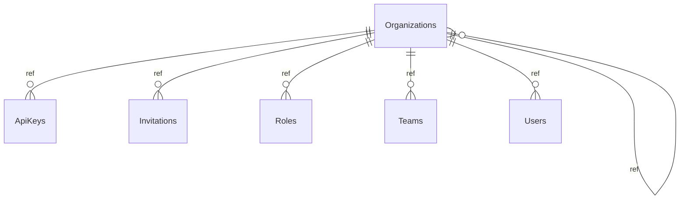

# Organizations

**Table:** `iam.organizations`

**Base path:** `/organizations`

## Related Tables

### Child Tables

_Tables that reference this table via foreign keys._

| Child Table | FK Column | References | Link |
|------------|-----------|------------|------|
| `api_keys` | `organization_id` | `api_keys_organization_id_fkey` | [ApiKeys](./api_keys) |
| `invitations` | `organization_id` | `invitations_organization_id_fkey` | [Invitations](./invitations) |
| `roles` | `organization_id` | `roles_organization_id_fkey` | [Roles](./roles) |
| `teams` | `organization_id` | `teams_organization_id_fkey` | [Teams](./teams) |
| `users` | `organization_id` | `users_organization_id_fkey` | [Users](./users) |
| `brands` | `organization_id` | `brands_organization_id_fkey` | [Brands](./brands) |
| `customers` | `organization_id` | `customers_organization_id_fkey` | [Customers](./customers) |
| `warehouses` | `organization_id` | `warehouses_organization_id_fkey` | [Warehouses](./warehouses) |
| `dashboards` | `organization_id` | `dashboards_organization_id_fkey` | [Dashboards](./dashboards) |
| `reports` | `organization_id` | `reports_organization_id_fkey` | [Reports](./reports) |


## Entity Relationship Diagram



::::tabs

:::tab FullStack

## Columns

| # | Column | SQL Type | Go Type | TS Type | Nullable | Default | Constraints | Description |
|---|--------|----------|---------|---------|----------|---------|-------------|-------------|
| 1 | `id` | `uuid` | `uuid.UUID` | `string` | NO | `gen_random_uuid()` | `PK` | Primary key |
| 2 | `name` | `text` | `string` | `string` | NO | - | - | - |
| 3 | `slug` | `text` | `string` | `string` | NO | - | `UQ` | - |
| 4 | `description` | `text` | `string` | `string` | NO | `''::text` | - | - |
| 5 | `logo_url` | `text` | `string` | `string` | NO | `''::text` | - | - |
| 6 | `parent_id` | `uuid` | `uuid.UUID` | `string` | YES | - | `FK` | → References `organizations` |
| 7 | `settings` | `jsonb` | `json.RawMessage` | `Record<string, unknown>` | NO | `'{}'::jsonb` | - | - |
| 8 | `is_active` | `boolean` | `bool` | `boolean` | NO | `true` | - | - |
| 9 | `created_at` | `timestamp with time zone` | `time.Time` | `string` | NO | `now()` | - | Auto-filled from session |
| 10 | `updated_at` | `timestamp with time zone` | `time.Time` | `string` | NO | `now()` | - | Auto-filled from session |
| 11 | `deleted_at` | `timestamp with time zone` | `time.Time` | `string` | YES | - | - | Auto-filled from session |

## Primary Keys

- `id` (`uuid`)

## Foreign Keys & Relationships

| Column | References | Constraint |
|--------|-----------|------------|
| `parent_id` | `organizations` | `organizations_parent_id_fkey` |

## Unique Keys

- `slug` (`text`)


## Go Generated Code

> 📂 Source: [📄 `Organizations.go`](https://github.com/meftunca/data-bridge-examples/blob/main//iam/structures/Organizations.go) · [📄 `Organizations.go`](https://github.com/meftunca/data-bridge-examples/blob/main//iam/services/Organizations.go) · [📄 `Organizations.go`](https://github.com/meftunca/data-bridge-examples/blob/main//iam/controllers/Organizations.go)

### Structs

::::tabs

:::tab Form

#### OrganizationsForm [](https://github.com/meftunca/data-bridge-examples/blob/main//iam/structures/Organizations.go#:~:text=type%20OrganizationsForm%20struct)

_Create payload — excludes auto-generated PK fields_

| Field | Go Type | JSON Key | Nullable |
|-------|---------|----------|----------|
| `Name` | `string` | `name` | NO |
| `Slug` | `string` | `slug` | NO |
| `Description` | `string` | `description` | NO |
| `LogoUrl` | `string` | `logoUrl` | NO |
| `ParentId` | `*uuid.UUID` | `parentId` | YES |
| `Settings` | `json.RawMessage` | `settings` | NO |
| `IsActive` | `bool` | `isActive` | NO |
| `CreatedAt` | `time.Time` | `createdAt` | NO |
| `UpdatedAt` | `time.Time` | `updatedAt` | NO |
| `DeletedAt` | `*time.Time` | `deletedAt` | YES |

:::tab Model

#### Organizations [](https://github.com/meftunca/data-bridge-examples/blob/main//iam/structures/Organizations.go#:~:text=type%20Organizations%20struct)

_Full model — all columns + GORM/JSON tags + preload relations_

| Field | Go Type | JSON Key | Nullable |
|-------|---------|----------|----------|
| `Id` | `uuid.UUID` | `id` | NO |
| `Name` | `string` | `name` | NO |
| `Slug` | `string` | `slug` | NO |
| `Description` | `string` | `description` | NO |
| `LogoUrl` | `string` | `logoUrl` | NO |
| `ParentId` | `*uuid.UUID` | `parentId` | YES |
| `Settings` | `json.RawMessage` | `settings` | NO |
| `IsActive` | `bool` | `isActive` | NO |
| `CreatedAt` | `time.Time` | `createdAt` | NO |
| `UpdatedAt` | `time.Time` | `updatedAt` | NO |
| `DeletedAt` | `*time.Time` | `deletedAt` | YES |

:::tab Edit

#### OrganizationsEdit [](https://github.com/meftunca/data-bridge-examples/blob/main//iam/structures/Organizations.go#:~:text=type%20OrganizationsEdit%20struct)

_Update payload — all fields are pointers (partial update)_

| Field | Go Type | JSON Key | Nullable |
|-------|---------|----------|----------|
| `Id` | `*uuid.UUID` | `id` | YES |
| `Name` | `*string` | `name` | YES |
| `Slug` | `*string` | `slug` | YES |
| `Description` | `*string` | `description` | YES |
| `LogoUrl` | `*string` | `logoUrl` | YES |
| `ParentId` | `*uuid.UUID` | `parentId` | YES |
| `Settings` | `*json.RawMessage` | `settings` | YES |
| `IsActive` | `*bool` | `isActive` | YES |
| `CreatedAt` | `*time.Time` | `createdAt` | YES |
| `UpdatedAt` | `*time.Time` | `updatedAt` | YES |
| `DeletedAt` | `*time.Time` | `deletedAt` | YES |

:::tab Filter

#### OrganizationsFilter [](https://github.com/meftunca/data-bridge-examples/blob/main//iam/structures/Organizations.go#:~:text=type%20OrganizationsFilter%20struct)

_Query filter — all fields are pointers_

| Field | Go Type | JSON Key | Nullable |
|-------|---------|----------|----------|
| `Id` | `*uuid.UUID` | `id` | YES |
| `Name` | `*string` | `name` | YES |
| `Slug` | `*string` | `slug` | YES |
| `Description` | `*string` | `description` | YES |
| `LogoUrl` | `*string` | `logoUrl` | YES |
| `ParentId` | `*uuid.UUID` | `parentId` | YES |
| `Settings` | `*json.RawMessage` | `settings` | YES |
| `IsActive` | `*bool` | `isActive` | YES |
| `CreatedAt` | `*time.Time` | `createdAt` | YES |
| `UpdatedAt` | `*time.Time` | `updatedAt` | YES |
| `DeletedAt` | `*time.Time` | `deletedAt` | YES |

:::tab Page

#### OrganizationsPage [](https://github.com/meftunca/data-bridge-examples/blob/main//iam/structures/Organizations.go#:~:text=type%20OrganizationsPage%20struct)

_Paginated response wrapper_

| Field | Go Type | JSON Key | Nullable |
|-------|---------|----------|----------|
| `Id` | `uuid.UUID` | `id` | NO |
| `Name` | `string` | `name` | NO |
| `Slug` | `string` | `slug` | NO |
| `Description` | `string` | `description` | NO |
| `LogoUrl` | `string` | `logoUrl` | NO |
| `ParentId` | `*uuid.UUID` | `parentId` | YES |
| `Settings` | `json.RawMessage` | `settings` | NO |
| `IsActive` | `bool` | `isActive` | NO |
| `CreatedAt` | `time.Time` | `createdAt` | NO |
| `UpdatedAt` | `time.Time` | `updatedAt` | NO |
| `DeletedAt` | `*time.Time` | `deletedAt` | YES |

:::tab BatchUpdate

#### OrganizationsBatchUpdate [](https://github.com/meftunca/data-bridge-examples/blob/main//iam/structures/Organizations.go#:~:text=type%20OrganizationsBatchUpdate%20struct)

```go
type OrganizationsBatchUpdate struct {
    Data       json.RawMessage `json:"data"`
    PathParams struct {
        Id uuid.UUID
    } `json:"pathParams"`
}
```

::::

### Service & Endpoints

::::tabs

:::tab Service Methods

| Method | Signature |
|---------|-----------|
| [Create](https://github.com/meftunca/data-bridge-examples/blob/main//iam/services/Organizations.go#:~:text=)%20CreateOrganizations() | `(OrganizationsService) CreateOrganizations(data OrganizationsForm) (OrganizationsForm, error)` |
| [Create Multiple](https://github.com/meftunca/data-bridge-examples/blob/main//iam/services/Organizations.go#:~:text=)%20CreateOrganizationsMultiple() | `(OrganizationsService) CreateOrganizationsMultiple(data []OrganizationsForm) ([]OrganizationsForm, error)` |
| [Update](https://github.com/meftunca/data-bridge-examples/blob/main//iam/services/Organizations.go#:~:text=)%20UpdateOrganizations() | `(OrganizationsService) UpdateOrganizations(id uuid.UUID, data interface{}) error` |
| [Update Multiple](https://github.com/meftunca/data-bridge-examples/blob/main//iam/services/Organizations.go#:~:text=)%20UpdateOrganizationsMultiple() | `(OrganizationsService) UpdateOrganizationsMultiple(data []OrganizationsBatchUpdate) error` |
| [Delete](https://github.com/meftunca/data-bridge-examples/blob/main//iam/services/Organizations.go#:~:text=)%20DeleteOrganizations() | `(OrganizationsService) DeleteOrganizations(id uuid.UUID) error` |

:::tab Endpoints

| Method | Path | Description |
|--------|------|-------------|
| `GET` | `/organizations/` | Search with query params |
| `GET` | `/organizations/pagination` | Paginated listing |
| `POST` | `/organizations/` | Create single record |
| `POST` | `/organizations/bulk/` | Create multiple records |
| `PUT` | `/organizations/bulk/` | Batch update |
| `GET` | `/organizations/with-id/:id` | Get by ID |
| `PUT` | `/organizations/with-id/:id` | Update by ID |
| `DELETE` | `/organizations/with-id/:id` | Delete by ID |

:::tab Query & Filters

| Parameter | Type | Description |
|-----------|------|-------------|
| `page` | `int` | Page number (default: 1) |
| `size` | `int` | Items per page (default: 10) |
| `sort` | `string` | Sort field. Prefix `-` for descending. Example: `-created_at` |
| `fields` | `string` | Comma-separated column list to select |
| `preloads` | `string` | Comma-separated relation names to preload |
| `filters` | `array` | Filter rules: `[[field, op, value], ...]` |
| `groupby` | `string` | Group by field name |
| `aggregations` | `json` | Aggregation specs: `[{func,field,alias}]` |

**Filter Operators:** `eq` `neq` `gt` `gte` `lt` `lte` `in` `notin` `like` `ilike` `is` `isnot` `between`

::::

### RPC Functions

| Function | Parameters | Return | Endpoint |
|----------|-----------|--------|----------|
| `count_active_users` | - | `integer` | `/rpc/count_active_users` |
| `user_permissions` | `p_user_id uuid`, `resource text`, `action text` | `record` | `/rpc/user_permissions` |
| `users_by_organization` | `p_org_id uuid` | `integer` | `/rpc/users_by_organization` |


:::tab Frontend

## TypeScript Types & Hooks

::::tabs

:::tab Interfaces

```typescript
export interface Organizations {
  id: string;
  name: string;
  slug: string;
  description: string;
  logoUrl: string;
  parentId?: string;
  settings: Record<string, unknown>;
  isActive: boolean;
  createdAt: string;
  updatedAt: string;
  deletedAt?: string;
}

export interface OrganizationsForm {
  name: string;
  slug: string;
  description: string;
  logoUrl: string;
  parentId?: string;
  settings: Record<string, unknown>;
  isActive: boolean;
  createdAt: string;
  updatedAt: string;
  deletedAt?: string;
}

export interface OrganizationsEdit {
  id: string;
  name: string;
  slug: string;
  description: string;
  logoUrl: string;
  parentId?: string;
  settings: Record<string, unknown>;
  isActive: boolean;
  createdAt: string;
  updatedAt: string;
  deletedAt?: string;
}

export interface OrganizationsPage {
  data: Organizations[];
  total: number;
  page: number;
  size: number;
  totalPages: number;
}

export type OrganizationsPathQuery = {
  page?: number;
  size?: number;
  sort?: string;
  fields?: string;
  preloads?: string;
  filters?: string;
};

```

:::tab React Query

```typescript
import { useQuery, useMutation, useQueryClient } from "@tanstack/react-query";

const OrganizationsKeys = {
  all: ["organizations"] as const,
  lists: () => [...OrganizationsKeys.all, "list"] as const,
  detail: (id: any) => [...OrganizationsKeys.all, "detail", id] as const,
} as const;

export function useOrganizationsList(query?: OrganizationsPathQuery) {
  return useQuery({
    queryKey: [...OrganizationsKeys.lists(), query],
    queryFn: () => fetch(`/organizations/pagination`, { method: "GET" }).then(r => r.json()) as Promise<OrganizationsPage>,
  });
}

export function useOrganizationsDetail(id: any) {
  return useQuery({
    queryKey: OrganizationsKeys.detail(id),
    queryFn: () => fetch(`/organizations/with-id/:id`).then(r => r.json()) as Promise<Organizations>,
  });
}

export function useCreateOrganizations() {
  const qc = useQueryClient();
  return useMutation({
    mutationFn: (data: OrganizationsForm) =>
      fetch("/organizations/", { method: "POST", body: JSON.stringify(data) }).then(r => r.json()),
    onSuccess: () => qc.invalidateQueries({ queryKey: OrganizationsKeys.lists() }),
  });
}

export function useUpdateOrganizations() {
  const qc = useQueryClient();
  return useMutation({
    mutationFn: ({ id, data }: { id: any: any; data: OrganizationsEdit }) =>
      fetch(`/organizations/with-id/:id`, { method: "PUT", body: JSON.stringify(data) }).then(r => r.json()),
    onSuccess: () => qc.invalidateQueries({ queryKey: OrganizationsKeys.all }),
  });
}

export function useDeleteOrganizations() {
  const qc = useQueryClient();
  return useMutation({
    mutationFn: (id: any) =>
      fetch(`/organizations/with-id/:id`, { method: "DELETE" }).then(r => r.json()),
    onSuccess: () => qc.invalidateQueries({ queryKey: OrganizationsKeys.all }),
  });
}

```

:::tab Zod Validation

```typescript
import { z } from "zod";

export const OrganizationsFormSchema = z.object({
  name: z.string(),
  slug: z.string(),
  description: z.string(),
  logoUrl: z.string(),
  parentId: z.string().uuid().optional(),
  settings: z.record(z.unknown()),
  isActive: z.boolean(),
  createdAt: z.string().datetime(),
  updatedAt: z.string().datetime(),
  deletedAt: z.string().datetime().optional(),
});

export type OrganizationsFormInput = z.infer<typeof OrganizationsFormSchema>;

```

::::


:::tab API

<script setup>
import { useOpenapi } from 'vitepress-openapi'
import spec from './organizations.openapi.json'
useOpenapi({ spec })
</script>


## API Reference

::::tabs

:::tab Search

#### <Badge type="info" text="GET" /> Search Organizations

```
GET /api/v1/organizations/
```

> Retrieve list filtered by query parameters.

**Headers:**

| Header | Required | Description |
|--------|----------|-------------|
| `Authorization` | Yes | Bearer token |
| `x-company` | Yes | Company ID |

**Query Parameters:**

| Parameter | Type | Required | Description |
|-----------|------|----------|-------------|
| `size` | `integer` | No | Max results (default: 10) |
| `sort` | `string` | No | Sort field. Prefix `-` for DESC. e.g. `-created_at` |
| `fields` | `string` | No | Comma-separated columns to select |
| `preloads` | `string` | No | Available: OrganizationsList, OrganizationsList.OrganizationsList, OrganizationsList.UsersList, OrganizationsList.UsersList.UserRolesList, OrganizationsList.UsersList.TeamsList, OrganizationsList.UsersList.TeamMembersList, OrganizationsList.UsersList.ApiKeysList, OrganizationsList.UsersList.SessionsList, OrganizationsList.UsersList.InvitationsList, OrganizationsList.UsersList.OrganizationIdDetail, OrganizationsList.RolesList, OrganizationsList.RolesList.RolePermissionsList, OrganizationsList.RolesList.UserRolesList, OrganizationsList.RolesList.InvitationsList, OrganizationsList.RolesList.OrganizationIdDetail, OrganizationsList.TeamsList, OrganizationsList.TeamsList.TeamMembersList, OrganizationsList.TeamsList.OrganizationIdDetail, OrganizationsList.TeamsList.LeadIdDetail, OrganizationsList.ApiKeysList, OrganizationsList.ApiKeysList.UserIdDetail, OrganizationsList.ApiKeysList.OrganizationIdDetail, OrganizationsList.InvitationsList, OrganizationsList.InvitationsList.OrganizationIdDetail, OrganizationsList.InvitationsList.InvitedByDetail, OrganizationsList.InvitationsList.RoleIdDetail, OrganizationsList.ParentIdDetail, UsersList, UsersList.UserRolesList, UsersList.UserRolesList.UserIdDetail, UsersList.UserRolesList.RoleIdDetail, UsersList.UserRolesList.GrantedByDetail, UsersList.TeamsList, UsersList.TeamsList.TeamMembersList, UsersList.TeamsList.OrganizationIdDetail, UsersList.TeamsList.LeadIdDetail, UsersList.TeamMembersList, UsersList.TeamMembersList.TeamIdDetail, UsersList.TeamMembersList.UserIdDetail, UsersList.ApiKeysList, UsersList.ApiKeysList.UserIdDetail, UsersList.ApiKeysList.OrganizationIdDetail, UsersList.SessionsList, UsersList.SessionsList.UserIdDetail, UsersList.InvitationsList, UsersList.InvitationsList.OrganizationIdDetail, UsersList.InvitationsList.InvitedByDetail, UsersList.InvitationsList.RoleIdDetail, UsersList.OrganizationIdDetail, UsersList.OrganizationIdDetail.OrganizationsList, UsersList.OrganizationIdDetail.UsersList, UsersList.OrganizationIdDetail.RolesList, UsersList.OrganizationIdDetail.TeamsList, UsersList.OrganizationIdDetail.ApiKeysList, UsersList.OrganizationIdDetail.InvitationsList, UsersList.OrganizationIdDetail.ParentIdDetail, RolesList, RolesList.RolePermissionsList, RolesList.RolePermissionsList.RoleIdDetail, RolesList.RolePermissionsList.PermissionIdDetail, RolesList.UserRolesList, RolesList.UserRolesList.UserIdDetail, RolesList.UserRolesList.RoleIdDetail, RolesList.UserRolesList.GrantedByDetail, RolesList.InvitationsList, RolesList.InvitationsList.OrganizationIdDetail, RolesList.InvitationsList.InvitedByDetail, RolesList.InvitationsList.RoleIdDetail, RolesList.OrganizationIdDetail, RolesList.OrganizationIdDetail.OrganizationsList, RolesList.OrganizationIdDetail.UsersList, RolesList.OrganizationIdDetail.RolesList, RolesList.OrganizationIdDetail.TeamsList, RolesList.OrganizationIdDetail.ApiKeysList, RolesList.OrganizationIdDetail.InvitationsList, RolesList.OrganizationIdDetail.ParentIdDetail, TeamsList, TeamsList.TeamMembersList, TeamsList.TeamMembersList.TeamIdDetail, TeamsList.TeamMembersList.UserIdDetail, TeamsList.OrganizationIdDetail, TeamsList.OrganizationIdDetail.OrganizationsList, TeamsList.OrganizationIdDetail.UsersList, TeamsList.OrganizationIdDetail.RolesList, TeamsList.OrganizationIdDetail.TeamsList, TeamsList.OrganizationIdDetail.ApiKeysList, TeamsList.OrganizationIdDetail.InvitationsList, TeamsList.OrganizationIdDetail.ParentIdDetail, TeamsList.LeadIdDetail, TeamsList.LeadIdDetail.UserRolesList, TeamsList.LeadIdDetail.TeamsList, TeamsList.LeadIdDetail.TeamMembersList, TeamsList.LeadIdDetail.ApiKeysList, TeamsList.LeadIdDetail.SessionsList, TeamsList.LeadIdDetail.InvitationsList, TeamsList.LeadIdDetail.OrganizationIdDetail, ApiKeysList, ApiKeysList.UserIdDetail, ApiKeysList.UserIdDetail.UserRolesList, ApiKeysList.UserIdDetail.TeamsList, ApiKeysList.UserIdDetail.TeamMembersList, ApiKeysList.UserIdDetail.ApiKeysList, ApiKeysList.UserIdDetail.SessionsList, ApiKeysList.UserIdDetail.InvitationsList, ApiKeysList.UserIdDetail.OrganizationIdDetail, ApiKeysList.OrganizationIdDetail, ApiKeysList.OrganizationIdDetail.OrganizationsList, ApiKeysList.OrganizationIdDetail.UsersList, ApiKeysList.OrganizationIdDetail.RolesList, ApiKeysList.OrganizationIdDetail.TeamsList, ApiKeysList.OrganizationIdDetail.ApiKeysList, ApiKeysList.OrganizationIdDetail.InvitationsList, ApiKeysList.OrganizationIdDetail.ParentIdDetail, InvitationsList, InvitationsList.OrganizationIdDetail, InvitationsList.OrganizationIdDetail.OrganizationsList, InvitationsList.OrganizationIdDetail.UsersList, InvitationsList.OrganizationIdDetail.RolesList, InvitationsList.OrganizationIdDetail.TeamsList, InvitationsList.OrganizationIdDetail.ApiKeysList, InvitationsList.OrganizationIdDetail.InvitationsList, InvitationsList.OrganizationIdDetail.ParentIdDetail, InvitationsList.InvitedByDetail, InvitationsList.InvitedByDetail.UserRolesList, InvitationsList.InvitedByDetail.TeamsList, InvitationsList.InvitedByDetail.TeamMembersList, InvitationsList.InvitedByDetail.ApiKeysList, InvitationsList.InvitedByDetail.SessionsList, InvitationsList.InvitedByDetail.InvitationsList, InvitationsList.InvitedByDetail.OrganizationIdDetail, InvitationsList.RoleIdDetail, InvitationsList.RoleIdDetail.RolePermissionsList, InvitationsList.RoleIdDetail.UserRolesList, InvitationsList.RoleIdDetail.InvitationsList, InvitationsList.RoleIdDetail.OrganizationIdDetail, ParentIdDetail, ParentIdDetail.OrganizationsList, ParentIdDetail.UsersList, ParentIdDetail.UsersList.UserRolesList, ParentIdDetail.UsersList.TeamsList, ParentIdDetail.UsersList.TeamMembersList, ParentIdDetail.UsersList.ApiKeysList, ParentIdDetail.UsersList.SessionsList, ParentIdDetail.UsersList.InvitationsList, ParentIdDetail.UsersList.OrganizationIdDetail, ParentIdDetail.RolesList, ParentIdDetail.RolesList.RolePermissionsList, ParentIdDetail.RolesList.UserRolesList, ParentIdDetail.RolesList.InvitationsList, ParentIdDetail.RolesList.OrganizationIdDetail, ParentIdDetail.TeamsList, ParentIdDetail.TeamsList.TeamMembersList, ParentIdDetail.TeamsList.OrganizationIdDetail, ParentIdDetail.TeamsList.LeadIdDetail, ParentIdDetail.ApiKeysList, ParentIdDetail.ApiKeysList.UserIdDetail, ParentIdDetail.ApiKeysList.OrganizationIdDetail, ParentIdDetail.InvitationsList, ParentIdDetail.InvitationsList.OrganizationIdDetail, ParentIdDetail.InvitationsList.InvitedByDetail, ParentIdDetail.InvitationsList.RoleIdDetail, ParentIdDetail.ParentIdDetail |
| `joins` | `string` | No | Available: Organizations, Organizations.Organizations |
| `id` | `string (uuid)` | No | Filter by id |
| `name` | `string` | No | Filter by name |
| `slug` | `string` | No | Filter by slug |
| `description` | `string` | No | Filter by description |
| `logoUrl` | `string` | No | Filter by logo_url |
| `parentId` | `string (uuid)` | No | Filter by parent_id |
| `settings` | `string` | No | Filter by settings |
| `isActive` | `boolean` | No | Filter by is_active |

**Response:** `Organizations[]`

<details>
<summary>curl example</summary>

```bash
curl -X GET \
  -H "Authorization: Bearer $TOKEN" \
  -H "x-company: $COMPANY_ID" \
  "http://localhost:3000/api/v1/organizations/"
```

</details>

---

#### <Badge type="tip" text="POST" /> Search Organizations (POST)

```
POST /api/v1/organizations/search
```

> Search with body filters. Auto-used when query string > 2KB.

**Headers:**

| Header | Required | Description |
|--------|----------|-------------|
| `Authorization` | Yes | Bearer token |
| `x-company` | Yes | Company ID |

**Request Body:**

```typescript
{
  size?: number  // e.g. 10
  sort?: string[]  // e.g. ["-createdAt"]
  filters?: FilterRule[]  // e.g. [["name", "eq", "value"]]
  fields?: string[]
  preloads?: string[]
}
```

**Response:** `Organizations[]`

<details>
<summary>curl example</summary>

```bash
curl -X POST \
  -H "Authorization: Bearer $TOKEN" \
  -H "x-company: $COMPANY_ID" \
  -H "Content-Type: application/json" \
  -d '{}' \
  "http://localhost:3000/api/v1/organizations/search"
```

</details>

---

:::tab Pagination

#### <Badge type="info" text="GET" /> Paginate Organizations

```
GET /api/v1/organizations/pagination
```

> Paginated listing.

**Headers:**

| Header | Required | Description |
|--------|----------|-------------|
| `Authorization` | Yes | Bearer token |
| `x-company` | Yes | Company ID |

**Query Parameters:**

| Parameter | Type | Required | Description |
|-----------|------|----------|-------------|
| `page` | `integer` | No | Page number (default: 1) |
| `size` | `integer` | No | Max results (default: 10) |
| `sort` | `string` | No | Sort field. Prefix `-` for DESC. e.g. `-created_at` |
| `fields` | `string` | No | Comma-separated columns to select |
| `preloads` | `string` | No | Available: OrganizationsList, OrganizationsList.OrganizationsList, OrganizationsList.UsersList, OrganizationsList.UsersList.UserRolesList, OrganizationsList.UsersList.TeamsList, OrganizationsList.UsersList.TeamMembersList, OrganizationsList.UsersList.ApiKeysList, OrganizationsList.UsersList.SessionsList, OrganizationsList.UsersList.InvitationsList, OrganizationsList.UsersList.OrganizationIdDetail, OrganizationsList.RolesList, OrganizationsList.RolesList.RolePermissionsList, OrganizationsList.RolesList.UserRolesList, OrganizationsList.RolesList.InvitationsList, OrganizationsList.RolesList.OrganizationIdDetail, OrganizationsList.TeamsList, OrganizationsList.TeamsList.TeamMembersList, OrganizationsList.TeamsList.OrganizationIdDetail, OrganizationsList.TeamsList.LeadIdDetail, OrganizationsList.ApiKeysList, OrganizationsList.ApiKeysList.UserIdDetail, OrganizationsList.ApiKeysList.OrganizationIdDetail, OrganizationsList.InvitationsList, OrganizationsList.InvitationsList.OrganizationIdDetail, OrganizationsList.InvitationsList.InvitedByDetail, OrganizationsList.InvitationsList.RoleIdDetail, OrganizationsList.ParentIdDetail, UsersList, UsersList.UserRolesList, UsersList.UserRolesList.UserIdDetail, UsersList.UserRolesList.RoleIdDetail, UsersList.UserRolesList.GrantedByDetail, UsersList.TeamsList, UsersList.TeamsList.TeamMembersList, UsersList.TeamsList.OrganizationIdDetail, UsersList.TeamsList.LeadIdDetail, UsersList.TeamMembersList, UsersList.TeamMembersList.TeamIdDetail, UsersList.TeamMembersList.UserIdDetail, UsersList.ApiKeysList, UsersList.ApiKeysList.UserIdDetail, UsersList.ApiKeysList.OrganizationIdDetail, UsersList.SessionsList, UsersList.SessionsList.UserIdDetail, UsersList.InvitationsList, UsersList.InvitationsList.OrganizationIdDetail, UsersList.InvitationsList.InvitedByDetail, UsersList.InvitationsList.RoleIdDetail, UsersList.OrganizationIdDetail, UsersList.OrganizationIdDetail.OrganizationsList, UsersList.OrganizationIdDetail.UsersList, UsersList.OrganizationIdDetail.RolesList, UsersList.OrganizationIdDetail.TeamsList, UsersList.OrganizationIdDetail.ApiKeysList, UsersList.OrganizationIdDetail.InvitationsList, UsersList.OrganizationIdDetail.ParentIdDetail, RolesList, RolesList.RolePermissionsList, RolesList.RolePermissionsList.RoleIdDetail, RolesList.RolePermissionsList.PermissionIdDetail, RolesList.UserRolesList, RolesList.UserRolesList.UserIdDetail, RolesList.UserRolesList.RoleIdDetail, RolesList.UserRolesList.GrantedByDetail, RolesList.InvitationsList, RolesList.InvitationsList.OrganizationIdDetail, RolesList.InvitationsList.InvitedByDetail, RolesList.InvitationsList.RoleIdDetail, RolesList.OrganizationIdDetail, RolesList.OrganizationIdDetail.OrganizationsList, RolesList.OrganizationIdDetail.UsersList, RolesList.OrganizationIdDetail.RolesList, RolesList.OrganizationIdDetail.TeamsList, RolesList.OrganizationIdDetail.ApiKeysList, RolesList.OrganizationIdDetail.InvitationsList, RolesList.OrganizationIdDetail.ParentIdDetail, TeamsList, TeamsList.TeamMembersList, TeamsList.TeamMembersList.TeamIdDetail, TeamsList.TeamMembersList.UserIdDetail, TeamsList.OrganizationIdDetail, TeamsList.OrganizationIdDetail.OrganizationsList, TeamsList.OrganizationIdDetail.UsersList, TeamsList.OrganizationIdDetail.RolesList, TeamsList.OrganizationIdDetail.TeamsList, TeamsList.OrganizationIdDetail.ApiKeysList, TeamsList.OrganizationIdDetail.InvitationsList, TeamsList.OrganizationIdDetail.ParentIdDetail, TeamsList.LeadIdDetail, TeamsList.LeadIdDetail.UserRolesList, TeamsList.LeadIdDetail.TeamsList, TeamsList.LeadIdDetail.TeamMembersList, TeamsList.LeadIdDetail.ApiKeysList, TeamsList.LeadIdDetail.SessionsList, TeamsList.LeadIdDetail.InvitationsList, TeamsList.LeadIdDetail.OrganizationIdDetail, ApiKeysList, ApiKeysList.UserIdDetail, ApiKeysList.UserIdDetail.UserRolesList, ApiKeysList.UserIdDetail.TeamsList, ApiKeysList.UserIdDetail.TeamMembersList, ApiKeysList.UserIdDetail.ApiKeysList, ApiKeysList.UserIdDetail.SessionsList, ApiKeysList.UserIdDetail.InvitationsList, ApiKeysList.UserIdDetail.OrganizationIdDetail, ApiKeysList.OrganizationIdDetail, ApiKeysList.OrganizationIdDetail.OrganizationsList, ApiKeysList.OrganizationIdDetail.UsersList, ApiKeysList.OrganizationIdDetail.RolesList, ApiKeysList.OrganizationIdDetail.TeamsList, ApiKeysList.OrganizationIdDetail.ApiKeysList, ApiKeysList.OrganizationIdDetail.InvitationsList, ApiKeysList.OrganizationIdDetail.ParentIdDetail, InvitationsList, InvitationsList.OrganizationIdDetail, InvitationsList.OrganizationIdDetail.OrganizationsList, InvitationsList.OrganizationIdDetail.UsersList, InvitationsList.OrganizationIdDetail.RolesList, InvitationsList.OrganizationIdDetail.TeamsList, InvitationsList.OrganizationIdDetail.ApiKeysList, InvitationsList.OrganizationIdDetail.InvitationsList, InvitationsList.OrganizationIdDetail.ParentIdDetail, InvitationsList.InvitedByDetail, InvitationsList.InvitedByDetail.UserRolesList, InvitationsList.InvitedByDetail.TeamsList, InvitationsList.InvitedByDetail.TeamMembersList, InvitationsList.InvitedByDetail.ApiKeysList, InvitationsList.InvitedByDetail.SessionsList, InvitationsList.InvitedByDetail.InvitationsList, InvitationsList.InvitedByDetail.OrganizationIdDetail, InvitationsList.RoleIdDetail, InvitationsList.RoleIdDetail.RolePermissionsList, InvitationsList.RoleIdDetail.UserRolesList, InvitationsList.RoleIdDetail.InvitationsList, InvitationsList.RoleIdDetail.OrganizationIdDetail, ParentIdDetail, ParentIdDetail.OrganizationsList, ParentIdDetail.UsersList, ParentIdDetail.UsersList.UserRolesList, ParentIdDetail.UsersList.TeamsList, ParentIdDetail.UsersList.TeamMembersList, ParentIdDetail.UsersList.ApiKeysList, ParentIdDetail.UsersList.SessionsList, ParentIdDetail.UsersList.InvitationsList, ParentIdDetail.UsersList.OrganizationIdDetail, ParentIdDetail.RolesList, ParentIdDetail.RolesList.RolePermissionsList, ParentIdDetail.RolesList.UserRolesList, ParentIdDetail.RolesList.InvitationsList, ParentIdDetail.RolesList.OrganizationIdDetail, ParentIdDetail.TeamsList, ParentIdDetail.TeamsList.TeamMembersList, ParentIdDetail.TeamsList.OrganizationIdDetail, ParentIdDetail.TeamsList.LeadIdDetail, ParentIdDetail.ApiKeysList, ParentIdDetail.ApiKeysList.UserIdDetail, ParentIdDetail.ApiKeysList.OrganizationIdDetail, ParentIdDetail.InvitationsList, ParentIdDetail.InvitationsList.OrganizationIdDetail, ParentIdDetail.InvitationsList.InvitedByDetail, ParentIdDetail.InvitationsList.RoleIdDetail, ParentIdDetail.ParentIdDetail |
| `joins` | `string` | No | Available: Organizations, Organizations.Organizations |
| `id` | `string (uuid)` | No | Filter by id |
| `name` | `string` | No | Filter by name |
| `slug` | `string` | No | Filter by slug |
| `description` | `string` | No | Filter by description |
| `logoUrl` | `string` | No | Filter by logo_url |
| `parentId` | `string (uuid)` | No | Filter by parent_id |
| `settings` | `string` | No | Filter by settings |
| `isActive` | `boolean` | No | Filter by is_active |

**Response:** `PaginationResponse<Organizations>`

<details>
<summary>curl example</summary>

```bash
curl -X GET \
  -H "Authorization: Bearer $TOKEN" \
  -H "x-company: $COMPANY_ID" \
  "http://localhost:3000/api/v1/organizations/pagination"
```

</details>

---

#### <Badge type="tip" text="POST" /> Paginate Organizations (POST)

```
POST /api/v1/organizations/pagination
```

> Paginated listing with body filters.

**Headers:**

| Header | Required | Description |
|--------|----------|-------------|
| `Authorization` | Yes | Bearer token |
| `x-company` | Yes | Company ID |

**Request Body:**

```typescript
{
  page?: number  // e.g. 1
  size?: number  // e.g. 10
  sort?: string[]  // e.g. ["-createdAt"]
  filters?: FilterRule[]  // e.g. [["name", "eq", "value"]]
  fields?: string[]
  preloads?: string[]
}
```

**Response:** `PaginationResponse<Organizations>`

<details>
<summary>curl example</summary>

```bash
curl -X POST \
  -H "Authorization: Bearer $TOKEN" \
  -H "x-company: $COMPANY_ID" \
  -H "Content-Type: application/json" \
  -d '{}' \
  "http://localhost:3000/api/v1/organizations/pagination"
```

</details>

---

:::tab Create

#### <Badge type="tip" text="POST" /> Create Organizations

```
POST /api/v1/organizations/
```

> Create a new record.

**Headers:**

| Header | Required | Description |
|--------|----------|-------------|
| `Authorization` | Yes | Bearer token |
| `x-company` | Yes | Company ID |

**Request Body:**

```typescript
{
  name: string  // e.g. example_name
  slug: string  // e.g. example_slug
  description?: string  // e.g. example_description
  logoUrl?: string  // e.g. example_logo_url
  parentId?: string  // e.g. 550e8400-e29b-41d4-a716-446655440000
  settings?: Record<string, unknown>  // e.g. map[]
  isActive?: boolean  // e.g. true
}
```

**Response:** `Organizations`

<details>
<summary>curl example</summary>

```bash
curl -X POST \
  -H "Authorization: Bearer $TOKEN" \
  -H "x-company: $COMPANY_ID" \
  -H "Content-Type: application/json" \
  -d '{}' \
  "http://localhost:3000/api/v1/organizations/"
```

</details>

---

#### <Badge type="tip" text="POST" /> Bulk Create Organizations

```
POST /api/v1/organizations/bulk/
```

> Create multiple records in one request.

**Headers:**

| Header | Required | Description |
|--------|----------|-------------|
| `Authorization` | Yes | Bearer token |
| `x-company` | Yes | Company ID |

**Request Body:**

```typescript
{
  name: string  // e.g. example_name
  slug: string  // e.g. example_slug
  description?: string  // e.g. example_description
  logoUrl?: string  // e.g. example_logo_url
  parentId?: string  // e.g. 550e8400-e29b-41d4-a716-446655440000
  settings?: Record<string, unknown>  // e.g. map[]
  isActive?: boolean  // e.g. true
}
```

**Response:** `Organizations[]`

<details>
<summary>curl example</summary>

```bash
curl -X POST \
  -H "Authorization: Bearer $TOKEN" \
  -H "x-company: $COMPANY_ID" \
  -H "Content-Type: application/json" \
  -d '{}' \
  "http://localhost:3000/api/v1/organizations/bulk/"
```

</details>

---

:::tab Find & Update

#### <Badge type="info" text="GET" /> Find Organizations by ID

```
GET /api/v1/organizations/with-id/:id
```

> Retrieve a single record by primary key.

**Headers:**

| Header | Required | Description |
|--------|----------|-------------|
| `Authorization` | Yes | Bearer token |
| `x-company` | Yes | Company ID |

**Query Parameters:**

| Parameter | Type | Required | Description |
|-----------|------|----------|-------------|
| `Id` | `string (uuid)` | Yes | Primary key (uuid) |

**Response:** `Organizations`

<details>
<summary>curl example</summary>

```bash
curl -X GET \
  -H "Authorization: Bearer $TOKEN" \
  -H "x-company: $COMPANY_ID" \
  "http://localhost:3000/api/v1/organizations/with-id/:id"
```

</details>

---

#### <Badge type="warning" text="PUT" /> Update Organizations

```
PUT /api/v1/organizations/with-id/:id
```

> Partial update — send only the fields to change.

**Headers:**

| Header | Required | Description |
|--------|----------|-------------|
| `Authorization` | Yes | Bearer token |
| `x-company` | Yes | Company ID |

**Query Parameters:**

| Parameter | Type | Required | Description |
|-----------|------|----------|-------------|
| `Id` | `string (uuid)` | Yes | Primary key (uuid) |

**Request Body:**

```typescript
{
  name?: string
  slug?: string
  description?: string
  logoUrl?: string
  parentId?: string
  settings?: Record<string, unknown>
  isActive?: boolean
}
```

**Response:** `Success`

<details>
<summary>curl example</summary>

```bash
curl -X PUT \
  -H "Authorization: Bearer $TOKEN" \
  -H "x-company: $COMPANY_ID" \
  -H "Content-Type: application/json" \
  -d '{}' \
  "http://localhost:3000/api/v1/organizations/with-id/:id"
```

</details>

---

#### <Badge type="warning" text="PUT" /> Bulk Update Organizations

```
PUT /api/v1/organizations/bulk/
```

> Batch update multiple records.

**Headers:**

| Header | Required | Description |
|--------|----------|-------------|
| `Authorization` | Yes | Bearer token |
| `x-company` | Yes | Company ID |

**Request Body:** Array of { pathParams, data: OrganizationsEdit }

**Response:** `Success`

<details>
<summary>curl example</summary>

```bash
curl -X PUT \
  -H "Authorization: Bearer $TOKEN" \
  -H "x-company: $COMPANY_ID" \
  -H "Content-Type: application/json" \
  -d '{}' \
  "http://localhost:3000/api/v1/organizations/bulk/"
```

</details>

---

:::tab Delete

#### <Badge type="danger" text="DELETE" /> Delete Organizations

```
DELETE /api/v1/organizations/with-id/:id
```

> Soft-delete (sets deleted_at + deleted_by).

**Headers:**

| Header | Required | Description |
|--------|----------|-------------|
| `Authorization` | Yes | Bearer token |
| `x-company` | Yes | Company ID |

**Query Parameters:**

| Parameter | Type | Required | Description |
|-----------|------|----------|-------------|
| `Id` | `string (uuid)` | Yes | Primary key (uuid) |

**Response:** `Success`

<details>
<summary>curl example</summary>

```bash
curl -X DELETE \
  -H "Authorization: Bearer $TOKEN" \
  -H "x-company: $COMPANY_ID" \
  "http://localhost:3000/api/v1/organizations/with-id/:id"
```

</details>

---

::::


::::
