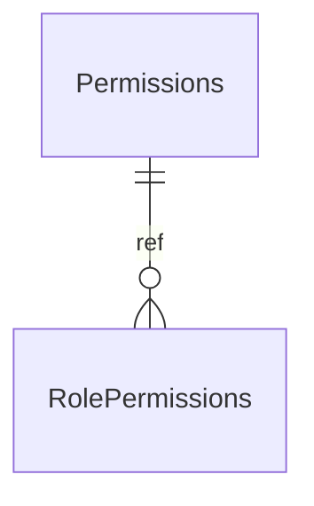

# Permissions

**Table:** `iam.permissions`

**Base path:** `/permissions`

## Related Tables

### Child Tables

_Tables that reference this table via foreign keys._

| Child Table | FK Column | References | Link |
|------------|-----------|------------|------|
| `role_permissions` | `permission_id` | `role_permissions_permission_id_fkey` | [RolePermissions](./role_permissions) |


## Entity Relationship Diagram



::::tabs

=== FullStack

## Columns

| # | Column | SQL Type | Go Type | TS Type | Nullable | Default | Constraints | Description |
|---|--------|----------|---------|---------|----------|---------|-------------|-------------|
| 1 | `id` | `uuid` | `uuid.UUID` | `string` | NO | `gen_random_uuid()` | `PK` | Primary key |
| 2 | `name` | `text` | `string` | `string` | NO | - | - | - |
| 3 | `resource` | `text` | `string` | `string` | NO | `'*'::text` | - | - |
| 4 | `action` | `text` | `string` | `string` | NO | `'read'::text` | - | - |
| 5 | `description` | `text` | `string` | `string` | NO | `''::text` | - | - |
| 6 | `created_at` | `timestamp with time zone` | `time.Time` | `string` | NO | `now()` | - | Auto-filled from session |
| 7 | `updated_at` | `timestamp with time zone` | `time.Time` | `string` | NO | `now()` | - | Auto-filled from session |

## Primary Keys

- `id` (`uuid`)


## Go Generated Code

> 📂 Source: [📄 `Permissions.go`](https://github.com/meftunca/data-bridge-examples/blob/main//iam/structures/Permissions.go) · [📄 `Permissions.go`](https://github.com/meftunca/data-bridge-examples/blob/main//iam/services/Permissions.go) · [📄 `Permissions.go`](https://github.com/meftunca/data-bridge-examples/blob/main//iam/controllers/Permissions.go)

### Structs

:::tabs

== Form

#### PermissionsForm [](https://github.com/meftunca/data-bridge-examples/blob/main//iam/structures/Permissions.go#:~:text=type%20PermissionsForm%20struct)

_Create payload — excludes auto-generated PK fields_

| Field | Go Type | JSON Key | Nullable |
|-------|---------|----------|----------|
| `Name` | `string` | `name` | NO |
| `Resource` | `string` | `resource` | NO |
| `Action` | `string` | `action` | NO |
| `Description` | `string` | `description` | NO |
| `CreatedAt` | `time.Time` | `createdAt` | NO |
| `UpdatedAt` | `time.Time` | `updatedAt` | NO |

== Model

#### Permissions [](https://github.com/meftunca/data-bridge-examples/blob/main//iam/structures/Permissions.go#:~:text=type%20Permissions%20struct)

_Full model — all columns + GORM/JSON tags + preload relations_

| Field | Go Type | JSON Key | Nullable |
|-------|---------|----------|----------|
| `Id` | `uuid.UUID` | `id` | NO |
| `Name` | `string` | `name` | NO |
| `Resource` | `string` | `resource` | NO |
| `Action` | `string` | `action` | NO |
| `Description` | `string` | `description` | NO |
| `CreatedAt` | `time.Time` | `createdAt` | NO |
| `UpdatedAt` | `time.Time` | `updatedAt` | NO |

== Edit

#### PermissionsEdit [](https://github.com/meftunca/data-bridge-examples/blob/main//iam/structures/Permissions.go#:~:text=type%20PermissionsEdit%20struct)

_Update payload — all fields are pointers (partial update)_

| Field | Go Type | JSON Key | Nullable |
|-------|---------|----------|----------|
| `Id` | `*uuid.UUID` | `id` | YES |
| `Name` | `*string` | `name` | YES |
| `Resource` | `*string` | `resource` | YES |
| `Action` | `*string` | `action` | YES |
| `Description` | `*string` | `description` | YES |
| `CreatedAt` | `*time.Time` | `createdAt` | YES |
| `UpdatedAt` | `*time.Time` | `updatedAt` | YES |

== Filter

#### PermissionsFilter [](https://github.com/meftunca/data-bridge-examples/blob/main//iam/structures/Permissions.go#:~:text=type%20PermissionsFilter%20struct)

_Query filter — all fields are pointers_

| Field | Go Type | JSON Key | Nullable |
|-------|---------|----------|----------|
| `Id` | `*uuid.UUID` | `id` | YES |
| `Name` | `*string` | `name` | YES |
| `Resource` | `*string` | `resource` | YES |
| `Action` | `*string` | `action` | YES |
| `Description` | `*string` | `description` | YES |
| `CreatedAt` | `*time.Time` | `createdAt` | YES |
| `UpdatedAt` | `*time.Time` | `updatedAt` | YES |

== Page

#### PermissionsPage [](https://github.com/meftunca/data-bridge-examples/blob/main//iam/structures/Permissions.go#:~:text=type%20PermissionsPage%20struct)

_Paginated response wrapper_

| Field | Go Type | JSON Key | Nullable |
|-------|---------|----------|----------|
| `Id` | `uuid.UUID` | `id` | NO |
| `Name` | `string` | `name` | NO |
| `Resource` | `string` | `resource` | NO |
| `Action` | `string` | `action` | NO |
| `Description` | `string` | `description` | NO |
| `CreatedAt` | `time.Time` | `createdAt` | NO |
| `UpdatedAt` | `time.Time` | `updatedAt` | NO |

== BatchUpdate

#### PermissionsBatchUpdate [](https://github.com/meftunca/data-bridge-examples/blob/main//iam/structures/Permissions.go#:~:text=type%20PermissionsBatchUpdate%20struct)

```go
type PermissionsBatchUpdate struct {
    Data       json.RawMessage `json:"data"`
    PathParams struct {
        Id uuid.UUID
    } `json:"pathParams"`
}
```

:::

### Service & Endpoints

:::tabs

== Service Methods

| Method | Signature |
|---------|-----------|
| [Create](https://github.com/meftunca/data-bridge-examples/blob/main//iam/services/Permissions.go#:~:text=%29%20CreatePermissions%28%29) | `(PermissionsService) CreatePermissions(data PermissionsForm) (PermissionsForm, error)` |
| [Create Multiple](https://github.com/meftunca/data-bridge-examples/blob/main//iam/services/Permissions.go#:~:text=%29%20CreatePermissionsMultiple%28%29) | `(PermissionsService) CreatePermissionsMultiple(data []PermissionsForm) ([]PermissionsForm, error)` |
| [Update](https://github.com/meftunca/data-bridge-examples/blob/main//iam/services/Permissions.go#:~:text=%29%20UpdatePermissions%28%29) | `(PermissionsService) UpdatePermissions(id uuid.UUID, data interface{}) error` |
| [Update Multiple](https://github.com/meftunca/data-bridge-examples/blob/main//iam/services/Permissions.go#:~:text=%29%20UpdatePermissionsMultiple%28%29) | `(PermissionsService) UpdatePermissionsMultiple(data []PermissionsBatchUpdate) error` |
| [Delete](https://github.com/meftunca/data-bridge-examples/blob/main//iam/services/Permissions.go#:~:text=%29%20DeletePermissions%28%29) | `(PermissionsService) DeletePermissions(id uuid.UUID) error` |

== Endpoints

| Method | Path | Description |
|--------|------|-------------|
| `GET` | `/permissions/` | Search with query params |
| `GET` | `/permissions/pagination` | Paginated listing |
| `POST` | `/permissions/` | Create single record |
| `POST` | `/permissions/bulk/` | Create multiple records |
| `PUT` | `/permissions/bulk/` | Batch update |
| `GET` | `/permissions/with-id/:id` | Get by ID |
| `PUT` | `/permissions/with-id/:id` | Update by ID |
| `DELETE` | `/permissions/with-id/:id` | Delete by ID |

== Query & Filters

| Parameter | Type | Description |
|-----------|------|-------------|
| `page` | `int` | Page number (default: 1) |
| `size` | `int` | Items per page (default: 10) |
| `sort` | `string` | Sort field. Prefix `-` for descending. Example: `-created_at` |
| `fields` | `string` | Comma-separated column list to select |
| `preloads` | `string` | Comma-separated relation names to preload |
| `filters` | `array` | Filter rules: `[[field, op, value], ...]` |
| `groupby` | `string` | Group by field name |
| `aggregations` | `json` | Aggregation specs: `[{func,field,alias}]` |

**Filter Operators:** `eq` `neq` `gt` `gte` `lt` `lte` `in` `notin` `like` `ilike` `is` `isnot` `between`

:::

### RPC Functions

| Function | Parameters | Return | Endpoint |
|----------|-----------|--------|----------|
| `count_active_users` | - | `integer` | `/rpc/count_active_users` |
| `user_permissions` | `p_user_id uuid`, `resource text`, `action text` | `record` | `/rpc/user_permissions` |
| `users_by_organization` | `p_org_id uuid` | `integer` | `/rpc/users_by_organization` |


=== Frontend

## TypeScript Types & Hooks

:::tabs

== Interfaces

```typescript
export interface Permissions {
  id: string;
  name: string;
  resource: string;
  action: string;
  description: string;
  createdAt: string;
  updatedAt: string;
}

export interface PermissionsForm {
  name: string;
  resource: string;
  action: string;
  description: string;
  createdAt: string;
  updatedAt: string;
}

export interface PermissionsEdit {
  id: string;
  name: string;
  resource: string;
  action: string;
  description: string;
  createdAt: string;
  updatedAt: string;
}

export interface PermissionsPage {
  data: Permissions[];
  total: number;
  page: number;
  size: number;
  totalPages: number;
}

export type PermissionsPathQuery = {
  page?: number;
  size?: number;
  sort?: string;
  fields?: string;
  preloads?: string;
  filters?: string;
};

```

== React Query

```typescript
import { useQuery, useMutation, useQueryClient } from "@tanstack/react-query";

const PermissionsKeys = {
  all: ["permissions"] as const,
  lists: () => [...PermissionsKeys.all, "list"] as const,
  detail: (id: any) => [...PermissionsKeys.all, "detail", id] as const,
} as const;

export function usePermissionsList(query?: PermissionsPathQuery) {
  return useQuery({
    queryKey: [...PermissionsKeys.lists(), query],
    queryFn: () => fetch(`/permissions/pagination`, { method: "GET" }).then(r => r.json()) as Promise<PermissionsPage>,
  });
}

export function usePermissionsDetail(id: any) {
  return useQuery({
    queryKey: PermissionsKeys.detail(id),
    queryFn: () => fetch(`/permissions/with-id/:id`).then(r => r.json()) as Promise<Permissions>,
  });
}

export function useCreatePermissions() {
  const qc = useQueryClient();
  return useMutation({
    mutationFn: (data: PermissionsForm) =>
      fetch("/permissions/", { method: "POST", body: JSON.stringify(data) }).then(r => r.json()),
    onSuccess: () => qc.invalidateQueries({ queryKey: PermissionsKeys.lists() }),
  });
}

export function useUpdatePermissions() {
  const qc = useQueryClient();
  return useMutation({
    mutationFn: ({ id, data }: { id: any: any; data: PermissionsEdit }) =>
      fetch(`/permissions/with-id/:id`, { method: "PUT", body: JSON.stringify(data) }).then(r => r.json()),
    onSuccess: () => qc.invalidateQueries({ queryKey: PermissionsKeys.all }),
  });
}

export function useDeletePermissions() {
  const qc = useQueryClient();
  return useMutation({
    mutationFn: (id: any) =>
      fetch(`/permissions/with-id/:id`, { method: "DELETE" }).then(r => r.json()),
    onSuccess: () => qc.invalidateQueries({ queryKey: PermissionsKeys.all }),
  });
}

```

== Zod Validation

```typescript
import { z } from "zod";

export const PermissionsFormSchema = z.object({
  name: z.string(),
  resource: z.string(),
  action: z.string(),
  description: z.string(),
  createdAt: z.string().datetime(),
  updatedAt: z.string().datetime(),
});

export type PermissionsFormInput = z.infer<typeof PermissionsFormSchema>;

```

:::


=== API

<script setup>
import { useOpenapi } from 'vitepress-openapi'
import spec from './permissions.openapi.json'
useOpenapi({ spec })
</script>


## API Reference

:::tabs

== Search

#### <Badge type="info" text="GET" /> Search Permissions

```
GET /api/v1/permissions/
```

> Retrieve list filtered by query parameters.

**Headers:**

| Header | Required | Description |
|--------|----------|-------------|
| `Authorization` | Yes | Bearer token |
| `x-company` | Yes | Company ID |

**Query Parameters:**

| Parameter | Type | Required | Description |
|-----------|------|----------|-------------|
| `size` | `integer` | No | Max results (default: 10) |
| `sort` | `string` | No | Sort field. Prefix `-` for DESC. e.g. `-created_at` |
| `fields` | `string` | No | Comma-separated columns to select |
| `preloads` | `string` | No | Available: RolePermissionsList, RolePermissionsList.RoleIdDetail, RolePermissionsList.RoleIdDetail.RolePermissionsList, RolePermissionsList.RoleIdDetail.UserRolesList, RolePermissionsList.RoleIdDetail.InvitationsList, RolePermissionsList.RoleIdDetail.OrganizationIdDetail, RolePermissionsList.PermissionIdDetail, RolePermissionsList.PermissionIdDetail.RolePermissionsList |
| `joins` | `string` | No | Comma-separated relations to join |
| `id` | `string (uuid)` | No | Filter by id |
| `name` | `string` | No | Filter by name |
| `resource` | `string` | No | Filter by resource |
| `action` | `string` | No | Filter by action |
| `description` | `string` | No | Filter by description |

**Response:** `Permissions[]`

<details>
<summary>curl example</summary>

```bash
curl -X GET \
  -H "Authorization: Bearer $TOKEN" \
  -H "x-company: $COMPANY_ID" \
  "http://localhost:3000/api/v1/permissions/"
```

</details>

---

#### <Badge type="tip" text="POST" /> Search Permissions (POST)

```
POST /api/v1/permissions/search
```

> Search with body filters. Auto-used when query string > 2KB.

**Headers:**

| Header | Required | Description |
|--------|----------|-------------|
| `Authorization` | Yes | Bearer token |
| `x-company` | Yes | Company ID |

**Request Body:**

```typescript
{
  size?: number  // e.g. 10
  sort?: string[]  // e.g. ["-createdAt"]
  filters?: FilterRule[]  // e.g. [["name", "eq", "value"]]
  fields?: string[]
  preloads?: string[]
}
```

**Response:** `Permissions[]`

<details>
<summary>curl example</summary>

```bash
curl -X POST \
  -H "Authorization: Bearer $TOKEN" \
  -H "x-company: $COMPANY_ID" \
  -H "Content-Type: application/json" \
  -d '{}' \
  "http://localhost:3000/api/v1/permissions/search"
```

</details>

---

== Pagination

#### <Badge type="info" text="GET" /> Paginate Permissions

```
GET /api/v1/permissions/pagination
```

> Paginated listing.

**Headers:**

| Header | Required | Description |
|--------|----------|-------------|
| `Authorization` | Yes | Bearer token |
| `x-company` | Yes | Company ID |

**Query Parameters:**

| Parameter | Type | Required | Description |
|-----------|------|----------|-------------|
| `page` | `integer` | No | Page number (default: 1) |
| `size` | `integer` | No | Max results (default: 10) |
| `sort` | `string` | No | Sort field. Prefix `-` for DESC. e.g. `-created_at` |
| `fields` | `string` | No | Comma-separated columns to select |
| `preloads` | `string` | No | Available: RolePermissionsList, RolePermissionsList.RoleIdDetail, RolePermissionsList.RoleIdDetail.RolePermissionsList, RolePermissionsList.RoleIdDetail.UserRolesList, RolePermissionsList.RoleIdDetail.InvitationsList, RolePermissionsList.RoleIdDetail.OrganizationIdDetail, RolePermissionsList.PermissionIdDetail, RolePermissionsList.PermissionIdDetail.RolePermissionsList |
| `joins` | `string` | No | Comma-separated relations to join |
| `id` | `string (uuid)` | No | Filter by id |
| `name` | `string` | No | Filter by name |
| `resource` | `string` | No | Filter by resource |
| `action` | `string` | No | Filter by action |
| `description` | `string` | No | Filter by description |

**Response:** `PaginationResponse<Permissions>`

<details>
<summary>curl example</summary>

```bash
curl -X GET \
  -H "Authorization: Bearer $TOKEN" \
  -H "x-company: $COMPANY_ID" \
  "http://localhost:3000/api/v1/permissions/pagination"
```

</details>

---

#### <Badge type="tip" text="POST" /> Paginate Permissions (POST)

```
POST /api/v1/permissions/pagination
```

> Paginated listing with body filters.

**Headers:**

| Header | Required | Description |
|--------|----------|-------------|
| `Authorization` | Yes | Bearer token |
| `x-company` | Yes | Company ID |

**Request Body:**

```typescript
{
  page?: number  // e.g. 1
  size?: number  // e.g. 10
  sort?: string[]  // e.g. ["-createdAt"]
  filters?: FilterRule[]  // e.g. [["name", "eq", "value"]]
  fields?: string[]
  preloads?: string[]
}
```

**Response:** `PaginationResponse<Permissions>`

<details>
<summary>curl example</summary>

```bash
curl -X POST \
  -H "Authorization: Bearer $TOKEN" \
  -H "x-company: $COMPANY_ID" \
  -H "Content-Type: application/json" \
  -d '{}' \
  "http://localhost:3000/api/v1/permissions/pagination"
```

</details>

---

== Create

#### <Badge type="tip" text="POST" /> Create Permissions

```
POST /api/v1/permissions/
```

> Create a new record.

**Headers:**

| Header | Required | Description |
|--------|----------|-------------|
| `Authorization` | Yes | Bearer token |
| `x-company` | Yes | Company ID |

**Request Body:**

```typescript
{
  name: string  // e.g. example_name
  resource?: string  // e.g. example_resource
  action?: string  // e.g. example_action
  description?: string  // e.g. example_description
}
```

**Response:** `Permissions`

<details>
<summary>curl example</summary>

```bash
curl -X POST \
  -H "Authorization: Bearer $TOKEN" \
  -H "x-company: $COMPANY_ID" \
  -H "Content-Type: application/json" \
  -d '{}' \
  "http://localhost:3000/api/v1/permissions/"
```

</details>

---

#### <Badge type="tip" text="POST" /> Bulk Create Permissions

```
POST /api/v1/permissions/bulk/
```

> Create multiple records in one request.

**Headers:**

| Header | Required | Description |
|--------|----------|-------------|
| `Authorization` | Yes | Bearer token |
| `x-company` | Yes | Company ID |

**Request Body:**

```typescript
{
  name: string  // e.g. example_name
  resource?: string  // e.g. example_resource
  action?: string  // e.g. example_action
  description?: string  // e.g. example_description
}
```

**Response:** `Permissions[]`

<details>
<summary>curl example</summary>

```bash
curl -X POST \
  -H "Authorization: Bearer $TOKEN" \
  -H "x-company: $COMPANY_ID" \
  -H "Content-Type: application/json" \
  -d '{}' \
  "http://localhost:3000/api/v1/permissions/bulk/"
```

</details>

---

== Find & Update

#### <Badge type="info" text="GET" /> Find Permissions by ID

```
GET /api/v1/permissions/with-id/:id
```

> Retrieve a single record by primary key.

**Headers:**

| Header | Required | Description |
|--------|----------|-------------|
| `Authorization` | Yes | Bearer token |
| `x-company` | Yes | Company ID |

**Query Parameters:**

| Parameter | Type | Required | Description |
|-----------|------|----------|-------------|
| `Id` | `string (uuid)` | Yes | Primary key (uuid) |

**Response:** `Permissions`

<details>
<summary>curl example</summary>

```bash
curl -X GET \
  -H "Authorization: Bearer $TOKEN" \
  -H "x-company: $COMPANY_ID" \
  "http://localhost:3000/api/v1/permissions/with-id/:id"
```

</details>

---

#### <Badge type="warning" text="PUT" /> Update Permissions

```
PUT /api/v1/permissions/with-id/:id
```

> Partial update — send only the fields to change.

**Headers:**

| Header | Required | Description |
|--------|----------|-------------|
| `Authorization` | Yes | Bearer token |
| `x-company` | Yes | Company ID |

**Query Parameters:**

| Parameter | Type | Required | Description |
|-----------|------|----------|-------------|
| `Id` | `string (uuid)` | Yes | Primary key (uuid) |

**Request Body:**

```typescript
{
  name?: string
  resource?: string
  action?: string
  description?: string
}
```

**Response:** `Success`

<details>
<summary>curl example</summary>

```bash
curl -X PUT \
  -H "Authorization: Bearer $TOKEN" \
  -H "x-company: $COMPANY_ID" \
  -H "Content-Type: application/json" \
  -d '{}' \
  "http://localhost:3000/api/v1/permissions/with-id/:id"
```

</details>

---

#### <Badge type="warning" text="PUT" /> Bulk Update Permissions

```
PUT /api/v1/permissions/bulk/
```

> Batch update multiple records.

**Headers:**

| Header | Required | Description |
|--------|----------|-------------|
| `Authorization` | Yes | Bearer token |
| `x-company` | Yes | Company ID |

**Request Body:** Array of { pathParams, data: PermissionsEdit }

**Response:** `Success`

<details>
<summary>curl example</summary>

```bash
curl -X PUT \
  -H "Authorization: Bearer $TOKEN" \
  -H "x-company: $COMPANY_ID" \
  -H "Content-Type: application/json" \
  -d '{}' \
  "http://localhost:3000/api/v1/permissions/bulk/"
```

</details>

---

== Delete

#### <Badge type="danger" text="DELETE" /> Delete Permissions

```
DELETE /api/v1/permissions/with-id/:id
```

> Soft-delete (sets deleted_at + deleted_by).

**Headers:**

| Header | Required | Description |
|--------|----------|-------------|
| `Authorization` | Yes | Bearer token |
| `x-company` | Yes | Company ID |

**Query Parameters:**

| Parameter | Type | Required | Description |
|-----------|------|----------|-------------|
| `Id` | `string (uuid)` | Yes | Primary key (uuid) |

**Response:** `Success`

<details>
<summary>curl example</summary>

```bash
curl -X DELETE \
  -H "Authorization: Bearer $TOKEN" \
  -H "x-company: $COMPANY_ID" \
  "http://localhost:3000/api/v1/permissions/with-id/:id"
```

</details>

---

:::


::::
