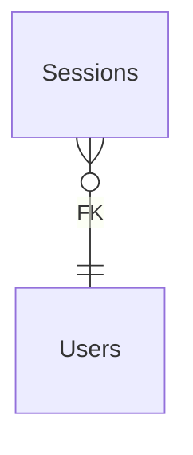

# Sessions

**Table:** `iam.sessions`

**Base path:** `/sessions`

## Related Tables

### Parent Tables

_Tables this table references via foreign keys._

| Parent Table | FK Column | References | Link |
|-------------|-----------|------------|------|
| `users` | `user_id` | `sessions_user_id_fkey` | [Users](./users) |


## Entity Relationship Diagram



::::tabs

:::tab FullStack

## Columns

| # | Column | SQL Type | Go Type | TS Type | Nullable | Default | Constraints | Description |
|---|--------|----------|---------|---------|----------|---------|-------------|-------------|
| 1 | `id` | `uuid` | `uuid.UUID` | `string` | NO | `gen_random_uuid()` | `PK` | Primary key |
| 2 | `name` | `text` | `string` | `string` | NO | `''::text` | - | - |
| 3 | `user_id` | `uuid` | `uuid.UUID` | `string` | NO | - | `FK` | → References `users` |
| 4 | `ip_address` | `inet` | `interface{}` | `unknown` | YES | - | - | - |
| 5 | `user_agent` | `text` | `string` | `string` | NO | `''::text` | - | - |
| 6 | `is_active` | `boolean` | `bool` | `boolean` | NO | `true` | - | - |
| 7 | `expires_at` | `timestamp with time zone` | `time.Time` | `string` | NO | - | - | - |
| 8 | `created_at` | `timestamp with time zone` | `time.Time` | `string` | NO | `now()` | - | Auto-filled from session |

## Primary Keys

- `id` (`uuid`)

## Foreign Keys & Relationships

| Column | References | Constraint |
|--------|-----------|------------|
| `user_id` | `users` | `sessions_user_id_fkey` |


## Go Generated Code

> 📂 Source: [📄 `Sessions.go`](https://github.com/meftunca/data-bridge-examples/blob/main//iam/structures/Sessions.go) · [📄 `Sessions.go`](https://github.com/meftunca/data-bridge-examples/blob/main//iam/services/Sessions.go) · [📄 `Sessions.go`](https://github.com/meftunca/data-bridge-examples/blob/main//iam/controllers/Sessions.go)

### Structs

::::tabs

:::tab Form

#### SessionsForm [](https://github.com/meftunca/data-bridge-examples/blob/main//iam/structures/Sessions.go#:~:text=type%20SessionsForm%20struct)

_Create payload — excludes auto-generated PK fields_

| Field | Go Type | JSON Key | Nullable |
|-------|---------|----------|----------|
| `Name` | `string` | `name` | NO |
| `UserId` | `uuid.UUID` | `userId` | NO |
| `IpAddress` | `*interface{}` | `ipAddress` | YES |
| `UserAgent` | `string` | `userAgent` | NO |
| `IsActive` | `bool` | `isActive` | NO |
| `ExpiresAt` | `time.Time` | `expiresAt` | NO |
| `CreatedAt` | `time.Time` | `createdAt` | NO |

:::tab Model

#### Sessions [](https://github.com/meftunca/data-bridge-examples/blob/main//iam/structures/Sessions.go#:~:text=type%20Sessions%20struct)

_Full model — all columns + GORM/JSON tags + preload relations_

| Field | Go Type | JSON Key | Nullable |
|-------|---------|----------|----------|
| `Id` | `uuid.UUID` | `id` | NO |
| `Name` | `string` | `name` | NO |
| `UserId` | `uuid.UUID` | `userId` | NO |
| `IpAddress` | `*interface{}` | `ipAddress` | YES |
| `UserAgent` | `string` | `userAgent` | NO |
| `IsActive` | `bool` | `isActive` | NO |
| `ExpiresAt` | `time.Time` | `expiresAt` | NO |
| `CreatedAt` | `time.Time` | `createdAt` | NO |

:::tab Edit

#### SessionsEdit [](https://github.com/meftunca/data-bridge-examples/blob/main//iam/structures/Sessions.go#:~:text=type%20SessionsEdit%20struct)

_Update payload — all fields are pointers (partial update)_

| Field | Go Type | JSON Key | Nullable |
|-------|---------|----------|----------|
| `Id` | `*uuid.UUID` | `id` | YES |
| `Name` | `*string` | `name` | YES |
| `UserId` | `*uuid.UUID` | `userId` | YES |
| `IpAddress` | `*interface{}` | `ipAddress` | YES |
| `UserAgent` | `*string` | `userAgent` | YES |
| `IsActive` | `*bool` | `isActive` | YES |
| `ExpiresAt` | `*time.Time` | `expiresAt` | YES |
| `CreatedAt` | `*time.Time` | `createdAt` | YES |

:::tab Filter

#### SessionsFilter [](https://github.com/meftunca/data-bridge-examples/blob/main//iam/structures/Sessions.go#:~:text=type%20SessionsFilter%20struct)

_Query filter — all fields are pointers_

| Field | Go Type | JSON Key | Nullable |
|-------|---------|----------|----------|
| `Id` | `*uuid.UUID` | `id` | YES |
| `Name` | `*string` | `name` | YES |
| `UserId` | `*uuid.UUID` | `userId` | YES |
| `IpAddress` | `*interface{}` | `ipAddress` | YES |
| `UserAgent` | `*string` | `userAgent` | YES |
| `IsActive` | `*bool` | `isActive` | YES |
| `ExpiresAt` | `*time.Time` | `expiresAt` | YES |
| `CreatedAt` | `*time.Time` | `createdAt` | YES |

:::tab Page

#### SessionsPage [](https://github.com/meftunca/data-bridge-examples/blob/main//iam/structures/Sessions.go#:~:text=type%20SessionsPage%20struct)

_Paginated response wrapper_

| Field | Go Type | JSON Key | Nullable |
|-------|---------|----------|----------|
| `Id` | `uuid.UUID` | `id` | NO |
| `Name` | `string` | `name` | NO |
| `UserId` | `uuid.UUID` | `userId` | NO |
| `IpAddress` | `*interface{}` | `ipAddress` | YES |
| `UserAgent` | `string` | `userAgent` | NO |
| `IsActive` | `bool` | `isActive` | NO |
| `ExpiresAt` | `time.Time` | `expiresAt` | NO |
| `CreatedAt` | `time.Time` | `createdAt` | NO |

:::tab BatchUpdate

#### SessionsBatchUpdate [](https://github.com/meftunca/data-bridge-examples/blob/main//iam/structures/Sessions.go#:~:text=type%20SessionsBatchUpdate%20struct)

```go
type SessionsBatchUpdate struct {
    Data       json.RawMessage `json:"data"`
    PathParams struct {
        Id uuid.UUID
    } `json:"pathParams"`
}
```

::::

### Service & Endpoints

::::tabs

:::tab Service Methods

| Method | Signature |
|---------|-----------|
| [Create](https://github.com/meftunca/data-bridge-examples/blob/main//iam/services/Sessions.go#:~:text=)%20CreateSessions() | `(SessionsService) CreateSessions(data SessionsForm) (SessionsForm, error)` |
| [Create Multiple](https://github.com/meftunca/data-bridge-examples/blob/main//iam/services/Sessions.go#:~:text=)%20CreateSessionsMultiple() | `(SessionsService) CreateSessionsMultiple(data []SessionsForm) ([]SessionsForm, error)` |
| [Update](https://github.com/meftunca/data-bridge-examples/blob/main//iam/services/Sessions.go#:~:text=)%20UpdateSessions() | `(SessionsService) UpdateSessions(id uuid.UUID, data interface{}) error` |
| [Update Multiple](https://github.com/meftunca/data-bridge-examples/blob/main//iam/services/Sessions.go#:~:text=)%20UpdateSessionsMultiple() | `(SessionsService) UpdateSessionsMultiple(data []SessionsBatchUpdate) error` |
| [Delete](https://github.com/meftunca/data-bridge-examples/blob/main//iam/services/Sessions.go#:~:text=)%20DeleteSessions() | `(SessionsService) DeleteSessions(id uuid.UUID) error` |

:::tab Endpoints

| Method | Path | Description |
|--------|------|-------------|
| `GET` | `/sessions/` | Search with query params |
| `GET` | `/sessions/pagination` | Paginated listing |
| `POST` | `/sessions/` | Create single record |
| `POST` | `/sessions/bulk/` | Create multiple records |
| `PUT` | `/sessions/bulk/` | Batch update |
| `GET` | `/sessions/with-id/:id` | Get by ID |
| `PUT` | `/sessions/with-id/:id` | Update by ID |
| `DELETE` | `/sessions/with-id/:id` | Delete by ID |

:::tab Query & Filters

| Parameter | Type | Description |
|-----------|------|-------------|
| `page` | `int` | Page number (default: 1) |
| `size` | `int` | Items per page (default: 10) |
| `sort` | `string` | Sort field. Prefix `-` for descending. Example: `-created_at` |
| `fields` | `string` | Comma-separated column list to select |
| `preloads` | `string` | Comma-separated relation names to preload |
| `filters` | `array` | Filter rules: `[[field, op, value], ...]` |
| `groupby` | `string` | Group by field name |
| `aggregations` | `json` | Aggregation specs: `[{func,field,alias}]` |

**Filter Operators:** `eq` `neq` `gt` `gte` `lt` `lte` `in` `notin` `like` `ilike` `is` `isnot` `between`

::::

### RPC Functions

| Function | Parameters | Return | Endpoint |
|----------|-----------|--------|----------|
| `count_active_users` | - | `integer` | `/rpc/count_active_users` |
| `user_permissions` | `p_user_id uuid`, `resource text`, `action text` | `record` | `/rpc/user_permissions` |
| `users_by_organization` | `p_org_id uuid` | `integer` | `/rpc/users_by_organization` |


:::tab Frontend

## TypeScript Types & Hooks

::::tabs

:::tab Interfaces

```typescript
export interface Sessions {
  id: string;
  name: string;
  userId: string;
  ipAddress?: unknown;
  userAgent: string;
  isActive: boolean;
  expiresAt: string;
  createdAt: string;
}

export interface SessionsForm {
  name: string;
  userId: string;
  ipAddress?: unknown;
  userAgent: string;
  isActive: boolean;
  expiresAt: string;
  createdAt: string;
}

export interface SessionsEdit {
  id: string;
  name: string;
  userId: string;
  ipAddress?: unknown;
  userAgent: string;
  isActive: boolean;
  expiresAt: string;
  createdAt: string;
}

export interface SessionsPage {
  data: Sessions[];
  total: number;
  page: number;
  size: number;
  totalPages: number;
}

export type SessionsPathQuery = {
  page?: number;
  size?: number;
  sort?: string;
  fields?: string;
  preloads?: string;
  filters?: string;
};

```

:::tab React Query

```typescript
import { useQuery, useMutation, useQueryClient } from "@tanstack/react-query";

const SessionsKeys = {
  all: ["sessions"] as const,
  lists: () => [...SessionsKeys.all, "list"] as const,
  detail: (id: any) => [...SessionsKeys.all, "detail", id] as const,
} as const;

export function useSessionsList(query?: SessionsPathQuery) {
  return useQuery({
    queryKey: [...SessionsKeys.lists(), query],
    queryFn: () => fetch(`/sessions/pagination`, { method: "GET" }).then(r => r.json()) as Promise<SessionsPage>,
  });
}

export function useSessionsDetail(id: any) {
  return useQuery({
    queryKey: SessionsKeys.detail(id),
    queryFn: () => fetch(`/sessions/with-id/:id`).then(r => r.json()) as Promise<Sessions>,
  });
}

export function useCreateSessions() {
  const qc = useQueryClient();
  return useMutation({
    mutationFn: (data: SessionsForm) =>
      fetch("/sessions/", { method: "POST", body: JSON.stringify(data) }).then(r => r.json()),
    onSuccess: () => qc.invalidateQueries({ queryKey: SessionsKeys.lists() }),
  });
}

export function useUpdateSessions() {
  const qc = useQueryClient();
  return useMutation({
    mutationFn: ({ id, data }: { id: any: any; data: SessionsEdit }) =>
      fetch(`/sessions/with-id/:id`, { method: "PUT", body: JSON.stringify(data) }).then(r => r.json()),
    onSuccess: () => qc.invalidateQueries({ queryKey: SessionsKeys.all }),
  });
}

export function useDeleteSessions() {
  const qc = useQueryClient();
  return useMutation({
    mutationFn: (id: any) =>
      fetch(`/sessions/with-id/:id`, { method: "DELETE" }).then(r => r.json()),
    onSuccess: () => qc.invalidateQueries({ queryKey: SessionsKeys.all }),
  });
}

```

:::tab Zod Validation

```typescript
import { z } from "zod";

export const SessionsFormSchema = z.object({
  name: z.string(),
  userId: z.string().uuid(),
  ipAddress: z.unknown().optional(),
  userAgent: z.string(),
  isActive: z.boolean(),
  expiresAt: z.string().datetime(),
  createdAt: z.string().datetime(),
});

export type SessionsFormInput = z.infer<typeof SessionsFormSchema>;

```

::::


:::tab API

<script setup>
import { useOpenapi } from 'vitepress-openapi'
import spec from './sessions.openapi.json'
useOpenapi({ spec })
</script>


## API Reference

::::tabs

:::tab Search

#### <Badge type="info" text="GET" /> Search Sessions

```
GET /api/v1/sessions/
```

> Retrieve list filtered by query parameters.

**Headers:**

| Header | Required | Description |
|--------|----------|-------------|
| `Authorization` | Yes | Bearer token |
| `x-company` | Yes | Company ID |

**Query Parameters:**

| Parameter | Type | Required | Description |
|-----------|------|----------|-------------|
| `size` | `integer` | No | Max results (default: 10) |
| `sort` | `string` | No | Sort field. Prefix `-` for DESC. e.g. `-created_at` |
| `fields` | `string` | No | Comma-separated columns to select |
| `preloads` | `string` | No | Available: UserIdDetail, UserIdDetail.UserRolesList, UserIdDetail.UserRolesList.UserIdDetail, UserIdDetail.UserRolesList.RoleIdDetail, UserIdDetail.UserRolesList.GrantedByDetail, UserIdDetail.TeamsList, UserIdDetail.TeamsList.TeamMembersList, UserIdDetail.TeamsList.OrganizationIdDetail, UserIdDetail.TeamsList.LeadIdDetail, UserIdDetail.TeamMembersList, UserIdDetail.TeamMembersList.TeamIdDetail, UserIdDetail.TeamMembersList.UserIdDetail, UserIdDetail.ApiKeysList, UserIdDetail.ApiKeysList.UserIdDetail, UserIdDetail.ApiKeysList.OrganizationIdDetail, UserIdDetail.SessionsList, UserIdDetail.SessionsList.UserIdDetail, UserIdDetail.InvitationsList, UserIdDetail.InvitationsList.OrganizationIdDetail, UserIdDetail.InvitationsList.InvitedByDetail, UserIdDetail.InvitationsList.RoleIdDetail, UserIdDetail.OrganizationIdDetail, UserIdDetail.OrganizationIdDetail.OrganizationsList, UserIdDetail.OrganizationIdDetail.UsersList, UserIdDetail.OrganizationIdDetail.RolesList, UserIdDetail.OrganizationIdDetail.TeamsList, UserIdDetail.OrganizationIdDetail.ApiKeysList, UserIdDetail.OrganizationIdDetail.InvitationsList, UserIdDetail.OrganizationIdDetail.ParentIdDetail |
| `joins` | `string` | No | Available: Users, Users.Organizations, Users.Organizations.Organizations |
| `id` | `string (uuid)` | No | Filter by id |
| `name` | `string` | No | Filter by name |
| `userId` | `string (uuid)` | No | Filter by user_id |
| `ipAddress` | `string` | No | Filter by ip_address |
| `userAgent` | `string` | No | Filter by user_agent |
| `isActive` | `boolean` | No | Filter by is_active |
| `expiresAt` | `string (date-time)` | No | Filter by expires_at |

**Response:** `Sessions[]`

<details>
<summary>curl example</summary>

```bash
curl -X GET \
  -H "Authorization: Bearer $TOKEN" \
  -H "x-company: $COMPANY_ID" \
  "http://localhost:3000/api/v1/sessions/"
```

</details>

---

#### <Badge type="tip" text="POST" /> Search Sessions (POST)

```
POST /api/v1/sessions/search
```

> Search with body filters. Auto-used when query string > 2KB.

**Headers:**

| Header | Required | Description |
|--------|----------|-------------|
| `Authorization` | Yes | Bearer token |
| `x-company` | Yes | Company ID |

**Request Body:**

```typescript
{
  size?: number  // e.g. 10
  sort?: string[]  // e.g. ["-createdAt"]
  filters?: FilterRule[]  // e.g. [["name", "eq", "value"]]
  fields?: string[]
  preloads?: string[]
}
```

**Response:** `Sessions[]`

<details>
<summary>curl example</summary>

```bash
curl -X POST \
  -H "Authorization: Bearer $TOKEN" \
  -H "x-company: $COMPANY_ID" \
  -H "Content-Type: application/json" \
  -d '{}' \
  "http://localhost:3000/api/v1/sessions/search"
```

</details>

---

:::tab Pagination

#### <Badge type="info" text="GET" /> Paginate Sessions

```
GET /api/v1/sessions/pagination
```

> Paginated listing.

**Headers:**

| Header | Required | Description |
|--------|----------|-------------|
| `Authorization` | Yes | Bearer token |
| `x-company` | Yes | Company ID |

**Query Parameters:**

| Parameter | Type | Required | Description |
|-----------|------|----------|-------------|
| `page` | `integer` | No | Page number (default: 1) |
| `size` | `integer` | No | Max results (default: 10) |
| `sort` | `string` | No | Sort field. Prefix `-` for DESC. e.g. `-created_at` |
| `fields` | `string` | No | Comma-separated columns to select |
| `preloads` | `string` | No | Available: UserIdDetail, UserIdDetail.UserRolesList, UserIdDetail.UserRolesList.UserIdDetail, UserIdDetail.UserRolesList.RoleIdDetail, UserIdDetail.UserRolesList.GrantedByDetail, UserIdDetail.TeamsList, UserIdDetail.TeamsList.TeamMembersList, UserIdDetail.TeamsList.OrganizationIdDetail, UserIdDetail.TeamsList.LeadIdDetail, UserIdDetail.TeamMembersList, UserIdDetail.TeamMembersList.TeamIdDetail, UserIdDetail.TeamMembersList.UserIdDetail, UserIdDetail.ApiKeysList, UserIdDetail.ApiKeysList.UserIdDetail, UserIdDetail.ApiKeysList.OrganizationIdDetail, UserIdDetail.SessionsList, UserIdDetail.SessionsList.UserIdDetail, UserIdDetail.InvitationsList, UserIdDetail.InvitationsList.OrganizationIdDetail, UserIdDetail.InvitationsList.InvitedByDetail, UserIdDetail.InvitationsList.RoleIdDetail, UserIdDetail.OrganizationIdDetail, UserIdDetail.OrganizationIdDetail.OrganizationsList, UserIdDetail.OrganizationIdDetail.UsersList, UserIdDetail.OrganizationIdDetail.RolesList, UserIdDetail.OrganizationIdDetail.TeamsList, UserIdDetail.OrganizationIdDetail.ApiKeysList, UserIdDetail.OrganizationIdDetail.InvitationsList, UserIdDetail.OrganizationIdDetail.ParentIdDetail |
| `joins` | `string` | No | Available: Users, Users.Organizations, Users.Organizations.Organizations |
| `id` | `string (uuid)` | No | Filter by id |
| `name` | `string` | No | Filter by name |
| `userId` | `string (uuid)` | No | Filter by user_id |
| `ipAddress` | `string` | No | Filter by ip_address |
| `userAgent` | `string` | No | Filter by user_agent |
| `isActive` | `boolean` | No | Filter by is_active |
| `expiresAt` | `string (date-time)` | No | Filter by expires_at |

**Response:** `PaginationResponse<Sessions>`

<details>
<summary>curl example</summary>

```bash
curl -X GET \
  -H "Authorization: Bearer $TOKEN" \
  -H "x-company: $COMPANY_ID" \
  "http://localhost:3000/api/v1/sessions/pagination"
```

</details>

---

#### <Badge type="tip" text="POST" /> Paginate Sessions (POST)

```
POST /api/v1/sessions/pagination
```

> Paginated listing with body filters.

**Headers:**

| Header | Required | Description |
|--------|----------|-------------|
| `Authorization` | Yes | Bearer token |
| `x-company` | Yes | Company ID |

**Request Body:**

```typescript
{
  page?: number  // e.g. 1
  size?: number  // e.g. 10
  sort?: string[]  // e.g. ["-createdAt"]
  filters?: FilterRule[]  // e.g. [["name", "eq", "value"]]
  fields?: string[]
  preloads?: string[]
}
```

**Response:** `PaginationResponse<Sessions>`

<details>
<summary>curl example</summary>

```bash
curl -X POST \
  -H "Authorization: Bearer $TOKEN" \
  -H "x-company: $COMPANY_ID" \
  -H "Content-Type: application/json" \
  -d '{}' \
  "http://localhost:3000/api/v1/sessions/pagination"
```

</details>

---

:::tab Create

#### <Badge type="tip" text="POST" /> Create Sessions

```
POST /api/v1/sessions/
```

> Create a new record.

**Headers:**

| Header | Required | Description |
|--------|----------|-------------|
| `Authorization` | Yes | Bearer token |
| `x-company` | Yes | Company ID |

**Request Body:**

```typescript
{
  name?: string  // e.g. example_name
  userId: string  // e.g. 550e8400-e29b-41d4-a716-446655440000
  ipAddress?: unknown  // e.g. value
  userAgent?: string  // e.g. example_user_agent
  isActive?: boolean  // e.g. true
  expiresAt: string  // e.g. 2026-01-15T10:30:00Z
}
```

**Response:** `Sessions`

<details>
<summary>curl example</summary>

```bash
curl -X POST \
  -H "Authorization: Bearer $TOKEN" \
  -H "x-company: $COMPANY_ID" \
  -H "Content-Type: application/json" \
  -d '{}' \
  "http://localhost:3000/api/v1/sessions/"
```

</details>

---

#### <Badge type="tip" text="POST" /> Bulk Create Sessions

```
POST /api/v1/sessions/bulk/
```

> Create multiple records in one request.

**Headers:**

| Header | Required | Description |
|--------|----------|-------------|
| `Authorization` | Yes | Bearer token |
| `x-company` | Yes | Company ID |

**Request Body:**

```typescript
{
  name?: string  // e.g. example_name
  userId: string  // e.g. 550e8400-e29b-41d4-a716-446655440000
  ipAddress?: unknown  // e.g. value
  userAgent?: string  // e.g. example_user_agent
  isActive?: boolean  // e.g. true
  expiresAt: string  // e.g. 2026-01-15T10:30:00Z
}
```

**Response:** `Sessions[]`

<details>
<summary>curl example</summary>

```bash
curl -X POST \
  -H "Authorization: Bearer $TOKEN" \
  -H "x-company: $COMPANY_ID" \
  -H "Content-Type: application/json" \
  -d '{}' \
  "http://localhost:3000/api/v1/sessions/bulk/"
```

</details>

---

:::tab Find & Update

#### <Badge type="info" text="GET" /> Find Sessions by ID

```
GET /api/v1/sessions/with-id/:id
```

> Retrieve a single record by primary key.

**Headers:**

| Header | Required | Description |
|--------|----------|-------------|
| `Authorization` | Yes | Bearer token |
| `x-company` | Yes | Company ID |

**Query Parameters:**

| Parameter | Type | Required | Description |
|-----------|------|----------|-------------|
| `Id` | `string (uuid)` | Yes | Primary key (uuid) |

**Response:** `Sessions`

<details>
<summary>curl example</summary>

```bash
curl -X GET \
  -H "Authorization: Bearer $TOKEN" \
  -H "x-company: $COMPANY_ID" \
  "http://localhost:3000/api/v1/sessions/with-id/:id"
```

</details>

---

#### <Badge type="warning" text="PUT" /> Update Sessions

```
PUT /api/v1/sessions/with-id/:id
```

> Partial update — send only the fields to change.

**Headers:**

| Header | Required | Description |
|--------|----------|-------------|
| `Authorization` | Yes | Bearer token |
| `x-company` | Yes | Company ID |

**Query Parameters:**

| Parameter | Type | Required | Description |
|-----------|------|----------|-------------|
| `Id` | `string (uuid)` | Yes | Primary key (uuid) |

**Request Body:**

```typescript
{
  name?: string
  userId?: string
  ipAddress?: unknown
  userAgent?: string
  isActive?: boolean
  expiresAt?: string
}
```

**Response:** `Success`

<details>
<summary>curl example</summary>

```bash
curl -X PUT \
  -H "Authorization: Bearer $TOKEN" \
  -H "x-company: $COMPANY_ID" \
  -H "Content-Type: application/json" \
  -d '{}' \
  "http://localhost:3000/api/v1/sessions/with-id/:id"
```

</details>

---

#### <Badge type="warning" text="PUT" /> Bulk Update Sessions

```
PUT /api/v1/sessions/bulk/
```

> Batch update multiple records.

**Headers:**

| Header | Required | Description |
|--------|----------|-------------|
| `Authorization` | Yes | Bearer token |
| `x-company` | Yes | Company ID |

**Request Body:** Array of { pathParams, data: SessionsEdit }

**Response:** `Success`

<details>
<summary>curl example</summary>

```bash
curl -X PUT \
  -H "Authorization: Bearer $TOKEN" \
  -H "x-company: $COMPANY_ID" \
  -H "Content-Type: application/json" \
  -d '{}' \
  "http://localhost:3000/api/v1/sessions/bulk/"
```

</details>

---

:::tab Delete

#### <Badge type="danger" text="DELETE" /> Delete Sessions

```
DELETE /api/v1/sessions/with-id/:id
```

> Soft-delete (sets deleted_at + deleted_by).

**Headers:**

| Header | Required | Description |
|--------|----------|-------------|
| `Authorization` | Yes | Bearer token |
| `x-company` | Yes | Company ID |

**Query Parameters:**

| Parameter | Type | Required | Description |
|-----------|------|----------|-------------|
| `Id` | `string (uuid)` | Yes | Primary key (uuid) |

**Response:** `Success`

<details>
<summary>curl example</summary>

```bash
curl -X DELETE \
  -H "Authorization: Bearer $TOKEN" \
  -H "x-company: $COMPANY_ID" \
  "http://localhost:3000/api/v1/sessions/with-id/:id"
```

</details>

---

::::


::::
