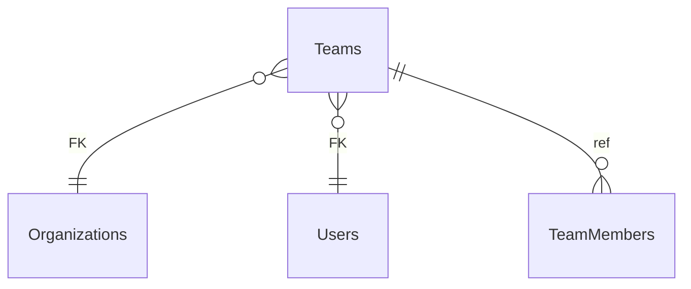

# Teams

**Table:** `iam.teams`

**Base path:** `/teams`

## Related Tables

### Parent Tables

_Tables this table references via foreign keys._

| Parent Table | FK Column | References | Link |
|-------------|-----------|------------|------|
| `organizations` | `organization_id` | `teams_organization_id_fkey` | [Organizations](./organizations) |
| `users` | `lead_id` | `teams_lead_id_fkey` | [Users](./users) |

### Child Tables

_Tables that reference this table via foreign keys._

| Child Table | FK Column | References | Link |
|------------|-----------|------------|------|
| `team_members` | `team_id` | `team_members_team_id_fkey` | [TeamMembers](./team_members) |


## Entity Relationship Diagram



::::tabs

:::tab FullStack

## Columns

| # | Column | SQL Type | Go Type | TS Type | Nullable | Default | Constraints | Description |
|---|--------|----------|---------|---------|----------|---------|-------------|-------------|
| 1 | `id` | `uuid` | `uuid.UUID` | `string` | NO | `gen_random_uuid()` | `PK` | Primary key |
| 2 | `name` | `text` | `string` | `string` | NO | - | - | - |
| 3 | `description` | `text` | `string` | `string` | NO | `''::text` | - | - |
| 4 | `organization_id` | `uuid` | `uuid.UUID` | `string` | NO | - | `FK` | → References `organizations` |
| 5 | `lead_id` | `uuid` | `uuid.UUID` | `string` | YES | - | `FK` | → References `users` |
| 6 | `tags` | `ARRAY` | `pq.StringArray` | `string[]` | NO | `'{}'::text[]` | - | - |
| 7 | `created_at` | `timestamp with time zone` | `time.Time` | `string` | NO | `now()` | - | Auto-filled from session |
| 8 | `updated_at` | `timestamp with time zone` | `time.Time` | `string` | NO | `now()` | - | Auto-filled from session |

## Primary Keys

- `id` (`uuid`)

## Foreign Keys & Relationships

| Column | References | Constraint |
|--------|-----------|------------|
| `organization_id` | `organizations` | `teams_organization_id_fkey` |
| `lead_id` | `users` | `teams_lead_id_fkey` |


## Go Generated Code

> 📂 Source: [📄 `Teams.go`](https://github.com/meftunca/data-bridge-examples/blob/main//iam/structures/Teams.go) · [📄 `Teams.go`](https://github.com/meftunca/data-bridge-examples/blob/main//iam/services/Teams.go) · [📄 `Teams.go`](https://github.com/meftunca/data-bridge-examples/blob/main//iam/controllers/Teams.go)

### Structs

::::tabs

:::tab Form

#### TeamsForm [](https://github.com/meftunca/data-bridge-examples/blob/main//iam/structures/Teams.go#:~:text=type%20TeamsForm%20struct)

_Create payload — excludes auto-generated PK fields_

| Field | Go Type | JSON Key | Nullable |
|-------|---------|----------|----------|
| `Name` | `string` | `name` | NO |
| `Description` | `string` | `description` | NO |
| `OrganizationId` | `uuid.UUID` | `organizationId` | NO |
| `LeadId` | `*uuid.UUID` | `leadId` | YES |
| `Tags` | `pq.StringArray` | `tags` | NO |
| `CreatedAt` | `time.Time` | `createdAt` | NO |
| `UpdatedAt` | `time.Time` | `updatedAt` | NO |

:::tab Model

#### Teams [](https://github.com/meftunca/data-bridge-examples/blob/main//iam/structures/Teams.go#:~:text=type%20Teams%20struct)

_Full model — all columns + GORM/JSON tags + preload relations_

| Field | Go Type | JSON Key | Nullable |
|-------|---------|----------|----------|
| `Id` | `uuid.UUID` | `id` | NO |
| `Name` | `string` | `name` | NO |
| `Description` | `string` | `description` | NO |
| `OrganizationId` | `uuid.UUID` | `organizationId` | NO |
| `LeadId` | `*uuid.UUID` | `leadId` | YES |
| `Tags` | `pq.StringArray` | `tags` | NO |
| `CreatedAt` | `time.Time` | `createdAt` | NO |
| `UpdatedAt` | `time.Time` | `updatedAt` | NO |

:::tab Edit

#### TeamsEdit [](https://github.com/meftunca/data-bridge-examples/blob/main//iam/structures/Teams.go#:~:text=type%20TeamsEdit%20struct)

_Update payload — all fields are pointers (partial update)_

| Field | Go Type | JSON Key | Nullable |
|-------|---------|----------|----------|
| `Id` | `*uuid.UUID` | `id` | YES |
| `Name` | `*string` | `name` | YES |
| `Description` | `*string` | `description` | YES |
| `OrganizationId` | `*uuid.UUID` | `organizationId` | YES |
| `LeadId` | `*uuid.UUID` | `leadId` | YES |
| `Tags` | `*pq.StringArray` | `tags` | YES |
| `CreatedAt` | `*time.Time` | `createdAt` | YES |
| `UpdatedAt` | `*time.Time` | `updatedAt` | YES |

:::tab Filter

#### TeamsFilter [](https://github.com/meftunca/data-bridge-examples/blob/main//iam/structures/Teams.go#:~:text=type%20TeamsFilter%20struct)

_Query filter — all fields are pointers_

| Field | Go Type | JSON Key | Nullable |
|-------|---------|----------|----------|
| `Id` | `*uuid.UUID` | `id` | YES |
| `Name` | `*string` | `name` | YES |
| `Description` | `*string` | `description` | YES |
| `OrganizationId` | `*uuid.UUID` | `organizationId` | YES |
| `LeadId` | `*uuid.UUID` | `leadId` | YES |
| `Tags` | `*pq.StringArray` | `tags` | YES |
| `CreatedAt` | `*time.Time` | `createdAt` | YES |
| `UpdatedAt` | `*time.Time` | `updatedAt` | YES |

:::tab Page

#### TeamsPage [](https://github.com/meftunca/data-bridge-examples/blob/main//iam/structures/Teams.go#:~:text=type%20TeamsPage%20struct)

_Paginated response wrapper_

| Field | Go Type | JSON Key | Nullable |
|-------|---------|----------|----------|
| `Id` | `uuid.UUID` | `id` | NO |
| `Name` | `string` | `name` | NO |
| `Description` | `string` | `description` | NO |
| `OrganizationId` | `uuid.UUID` | `organizationId` | NO |
| `LeadId` | `*uuid.UUID` | `leadId` | YES |
| `Tags` | `pq.StringArray` | `tags` | NO |
| `CreatedAt` | `time.Time` | `createdAt` | NO |
| `UpdatedAt` | `time.Time` | `updatedAt` | NO |

:::tab BatchUpdate

#### TeamsBatchUpdate [](https://github.com/meftunca/data-bridge-examples/blob/main//iam/structures/Teams.go#:~:text=type%20TeamsBatchUpdate%20struct)

```go
type TeamsBatchUpdate struct {
    Data       json.RawMessage `json:"data"`
    PathParams struct {
        Id uuid.UUID
    } `json:"pathParams"`
}
```

::::

### Service & Endpoints

::::tabs

:::tab Service Methods

| Method | Signature |
|---------|-----------|
| [Create](https://github.com/meftunca/data-bridge-examples/blob/main//iam/services/Teams.go#:~:text=)%20CreateTeams() | `(TeamsService) CreateTeams(data TeamsForm) (TeamsForm, error)` |
| [Create Multiple](https://github.com/meftunca/data-bridge-examples/blob/main//iam/services/Teams.go#:~:text=)%20CreateTeamsMultiple() | `(TeamsService) CreateTeamsMultiple(data []TeamsForm) ([]TeamsForm, error)` |
| [Update](https://github.com/meftunca/data-bridge-examples/blob/main//iam/services/Teams.go#:~:text=)%20UpdateTeams() | `(TeamsService) UpdateTeams(id uuid.UUID, data interface{}) error` |
| [Update Multiple](https://github.com/meftunca/data-bridge-examples/blob/main//iam/services/Teams.go#:~:text=)%20UpdateTeamsMultiple() | `(TeamsService) UpdateTeamsMultiple(data []TeamsBatchUpdate) error` |
| [Delete](https://github.com/meftunca/data-bridge-examples/blob/main//iam/services/Teams.go#:~:text=)%20DeleteTeams() | `(TeamsService) DeleteTeams(id uuid.UUID) error` |

:::tab Endpoints

| Method | Path | Description |
|--------|------|-------------|
| `GET` | `/teams/` | Search with query params |
| `GET` | `/teams/pagination` | Paginated listing |
| `POST` | `/teams/` | Create single record |
| `POST` | `/teams/bulk/` | Create multiple records |
| `PUT` | `/teams/bulk/` | Batch update |
| `GET` | `/teams/with-id/:id` | Get by ID |
| `PUT` | `/teams/with-id/:id` | Update by ID |
| `DELETE` | `/teams/with-id/:id` | Delete by ID |

:::tab Query & Filters

| Parameter | Type | Description |
|-----------|------|-------------|
| `page` | `int` | Page number (default: 1) |
| `size` | `int` | Items per page (default: 10) |
| `sort` | `string` | Sort field. Prefix `-` for descending. Example: `-created_at` |
| `fields` | `string` | Comma-separated column list to select |
| `preloads` | `string` | Comma-separated relation names to preload |
| `filters` | `array` | Filter rules: `[[field, op, value], ...]` |
| `groupby` | `string` | Group by field name |
| `aggregations` | `json` | Aggregation specs: `[{func,field,alias}]` |

**Filter Operators:** `eq` `neq` `gt` `gte` `lt` `lte` `in` `notin` `like` `ilike` `is` `isnot` `between`

::::

### RPC Functions

| Function | Parameters | Return | Endpoint |
|----------|-----------|--------|----------|
| `count_active_users` | - | `integer` | `/rpc/count_active_users` |
| `user_permissions` | `p_user_id uuid`, `resource text`, `action text` | `record` | `/rpc/user_permissions` |
| `users_by_organization` | `p_org_id uuid` | `integer` | `/rpc/users_by_organization` |


:::tab Frontend

## TypeScript Types & Hooks

::::tabs

:::tab Interfaces

```typescript
export interface Teams {
  id: string;
  name: string;
  description: string;
  organizationId: string;
  leadId?: string;
  tags: string[];
  createdAt: string;
  updatedAt: string;
}

export interface TeamsForm {
  name: string;
  description: string;
  organizationId: string;
  leadId?: string;
  tags: string[];
  createdAt: string;
  updatedAt: string;
}

export interface TeamsEdit {
  id: string;
  name: string;
  description: string;
  organizationId: string;
  leadId?: string;
  tags: string[];
  createdAt: string;
  updatedAt: string;
}

export interface TeamsPage {
  data: Teams[];
  total: number;
  page: number;
  size: number;
  totalPages: number;
}

export type TeamsPathQuery = {
  page?: number;
  size?: number;
  sort?: string;
  fields?: string;
  preloads?: string;
  filters?: string;
};

```

:::tab React Query

```typescript
import { useQuery, useMutation, useQueryClient } from "@tanstack/react-query";

const TeamsKeys = {
  all: ["teams"] as const,
  lists: () => [...TeamsKeys.all, "list"] as const,
  detail: (id: any) => [...TeamsKeys.all, "detail", id] as const,
} as const;

export function useTeamsList(query?: TeamsPathQuery) {
  return useQuery({
    queryKey: [...TeamsKeys.lists(), query],
    queryFn: () => fetch(`/teams/pagination`, { method: "GET" }).then(r => r.json()) as Promise<TeamsPage>,
  });
}

export function useTeamsDetail(id: any) {
  return useQuery({
    queryKey: TeamsKeys.detail(id),
    queryFn: () => fetch(`/teams/with-id/:id`).then(r => r.json()) as Promise<Teams>,
  });
}

export function useCreateTeams() {
  const qc = useQueryClient();
  return useMutation({
    mutationFn: (data: TeamsForm) =>
      fetch("/teams/", { method: "POST", body: JSON.stringify(data) }).then(r => r.json()),
    onSuccess: () => qc.invalidateQueries({ queryKey: TeamsKeys.lists() }),
  });
}

export function useUpdateTeams() {
  const qc = useQueryClient();
  return useMutation({
    mutationFn: ({ id, data }: { id: any: any; data: TeamsEdit }) =>
      fetch(`/teams/with-id/:id`, { method: "PUT", body: JSON.stringify(data) }).then(r => r.json()),
    onSuccess: () => qc.invalidateQueries({ queryKey: TeamsKeys.all }),
  });
}

export function useDeleteTeams() {
  const qc = useQueryClient();
  return useMutation({
    mutationFn: (id: any) =>
      fetch(`/teams/with-id/:id`, { method: "DELETE" }).then(r => r.json()),
    onSuccess: () => qc.invalidateQueries({ queryKey: TeamsKeys.all }),
  });
}

```

:::tab Zod Validation

```typescript
import { z } from "zod";

export const TeamsFormSchema = z.object({
  name: z.string(),
  description: z.string(),
  organizationId: z.string().uuid(),
  leadId: z.string().uuid().optional(),
  tags: z.array(z.unknown()),
  createdAt: z.string().datetime(),
  updatedAt: z.string().datetime(),
});

export type TeamsFormInput = z.infer<typeof TeamsFormSchema>;

```

::::


:::tab API

<script setup>
import { useOpenapi } from 'vitepress-openapi'
import spec from './teams.openapi.json'
useOpenapi({ spec })
</script>


## API Reference

::::tabs

:::tab Search

#### <Badge type="info" text="GET" /> Search Teams

```
GET /api/v1/teams/
```

> Retrieve list filtered by query parameters.

**Headers:**

| Header | Required | Description |
|--------|----------|-------------|
| `Authorization` | Yes | Bearer token |
| `x-company` | Yes | Company ID |

**Query Parameters:**

| Parameter | Type | Required | Description |
|-----------|------|----------|-------------|
| `size` | `integer` | No | Max results (default: 10) |
| `sort` | `string` | No | Sort field. Prefix `-` for DESC. e.g. `-created_at` |
| `fields` | `string` | No | Comma-separated columns to select |
| `preloads` | `string` | No | Available: TeamMembersList, TeamMembersList.TeamIdDetail, TeamMembersList.TeamIdDetail.TeamMembersList, TeamMembersList.TeamIdDetail.OrganizationIdDetail, TeamMembersList.TeamIdDetail.LeadIdDetail, TeamMembersList.UserIdDetail, TeamMembersList.UserIdDetail.UserRolesList, TeamMembersList.UserIdDetail.TeamsList, TeamMembersList.UserIdDetail.TeamMembersList, TeamMembersList.UserIdDetail.ApiKeysList, TeamMembersList.UserIdDetail.SessionsList, TeamMembersList.UserIdDetail.InvitationsList, TeamMembersList.UserIdDetail.OrganizationIdDetail, OrganizationIdDetail, OrganizationIdDetail.OrganizationsList, OrganizationIdDetail.UsersList, OrganizationIdDetail.UsersList.UserRolesList, OrganizationIdDetail.UsersList.TeamsList, OrganizationIdDetail.UsersList.TeamMembersList, OrganizationIdDetail.UsersList.ApiKeysList, OrganizationIdDetail.UsersList.SessionsList, OrganizationIdDetail.UsersList.InvitationsList, OrganizationIdDetail.UsersList.OrganizationIdDetail, OrganizationIdDetail.RolesList, OrganizationIdDetail.RolesList.RolePermissionsList, OrganizationIdDetail.RolesList.UserRolesList, OrganizationIdDetail.RolesList.InvitationsList, OrganizationIdDetail.RolesList.OrganizationIdDetail, OrganizationIdDetail.TeamsList, OrganizationIdDetail.TeamsList.TeamMembersList, OrganizationIdDetail.TeamsList.OrganizationIdDetail, OrganizationIdDetail.TeamsList.LeadIdDetail, OrganizationIdDetail.ApiKeysList, OrganizationIdDetail.ApiKeysList.UserIdDetail, OrganizationIdDetail.ApiKeysList.OrganizationIdDetail, OrganizationIdDetail.InvitationsList, OrganizationIdDetail.InvitationsList.OrganizationIdDetail, OrganizationIdDetail.InvitationsList.InvitedByDetail, OrganizationIdDetail.InvitationsList.RoleIdDetail, OrganizationIdDetail.ParentIdDetail, LeadIdDetail, LeadIdDetail.UserRolesList, LeadIdDetail.UserRolesList.UserIdDetail, LeadIdDetail.UserRolesList.RoleIdDetail, LeadIdDetail.UserRolesList.GrantedByDetail, LeadIdDetail.TeamsList, LeadIdDetail.TeamsList.TeamMembersList, LeadIdDetail.TeamsList.OrganizationIdDetail, LeadIdDetail.TeamsList.LeadIdDetail, LeadIdDetail.TeamMembersList, LeadIdDetail.TeamMembersList.TeamIdDetail, LeadIdDetail.TeamMembersList.UserIdDetail, LeadIdDetail.ApiKeysList, LeadIdDetail.ApiKeysList.UserIdDetail, LeadIdDetail.ApiKeysList.OrganizationIdDetail, LeadIdDetail.SessionsList, LeadIdDetail.SessionsList.UserIdDetail, LeadIdDetail.InvitationsList, LeadIdDetail.InvitationsList.OrganizationIdDetail, LeadIdDetail.InvitationsList.InvitedByDetail, LeadIdDetail.InvitationsList.RoleIdDetail, LeadIdDetail.OrganizationIdDetail, LeadIdDetail.OrganizationIdDetail.OrganizationsList, LeadIdDetail.OrganizationIdDetail.UsersList, LeadIdDetail.OrganizationIdDetail.RolesList, LeadIdDetail.OrganizationIdDetail.TeamsList, LeadIdDetail.OrganizationIdDetail.ApiKeysList, LeadIdDetail.OrganizationIdDetail.InvitationsList, LeadIdDetail.OrganizationIdDetail.ParentIdDetail |
| `joins` | `string` | No | Available: Organizations, Organizations.Organizations, Users, Users.Organizations, Users.Organizations.Organizations |
| `id` | `string (uuid)` | No | Filter by id |
| `name` | `string` | No | Filter by name |
| `description` | `string` | No | Filter by description |
| `organizationId` | `string (uuid)` | No | Filter by organization_id |
| `leadId` | `string (uuid)` | No | Filter by lead_id |
| `tags` | `string` | No | Filter by tags |

**Response:** `Teams[]`

<details>
<summary>curl example</summary>

```bash
curl -X GET \
  -H "Authorization: Bearer $TOKEN" \
  -H "x-company: $COMPANY_ID" \
  "http://localhost:3000/api/v1/teams/"
```

</details>

---

#### <Badge type="tip" text="POST" /> Search Teams (POST)

```
POST /api/v1/teams/search
```

> Search with body filters. Auto-used when query string > 2KB.

**Headers:**

| Header | Required | Description |
|--------|----------|-------------|
| `Authorization` | Yes | Bearer token |
| `x-company` | Yes | Company ID |

**Request Body:**

```typescript
{
  size?: number  // e.g. 10
  sort?: string[]  // e.g. ["-createdAt"]
  filters?: FilterRule[]  // e.g. [["name", "eq", "value"]]
  fields?: string[]
  preloads?: string[]
}
```

**Response:** `Teams[]`

<details>
<summary>curl example</summary>

```bash
curl -X POST \
  -H "Authorization: Bearer $TOKEN" \
  -H "x-company: $COMPANY_ID" \
  -H "Content-Type: application/json" \
  -d '{}' \
  "http://localhost:3000/api/v1/teams/search"
```

</details>

---

:::tab Pagination

#### <Badge type="info" text="GET" /> Paginate Teams

```
GET /api/v1/teams/pagination
```

> Paginated listing.

**Headers:**

| Header | Required | Description |
|--------|----------|-------------|
| `Authorization` | Yes | Bearer token |
| `x-company` | Yes | Company ID |

**Query Parameters:**

| Parameter | Type | Required | Description |
|-----------|------|----------|-------------|
| `page` | `integer` | No | Page number (default: 1) |
| `size` | `integer` | No | Max results (default: 10) |
| `sort` | `string` | No | Sort field. Prefix `-` for DESC. e.g. `-created_at` |
| `fields` | `string` | No | Comma-separated columns to select |
| `preloads` | `string` | No | Available: TeamMembersList, TeamMembersList.TeamIdDetail, TeamMembersList.TeamIdDetail.TeamMembersList, TeamMembersList.TeamIdDetail.OrganizationIdDetail, TeamMembersList.TeamIdDetail.LeadIdDetail, TeamMembersList.UserIdDetail, TeamMembersList.UserIdDetail.UserRolesList, TeamMembersList.UserIdDetail.TeamsList, TeamMembersList.UserIdDetail.TeamMembersList, TeamMembersList.UserIdDetail.ApiKeysList, TeamMembersList.UserIdDetail.SessionsList, TeamMembersList.UserIdDetail.InvitationsList, TeamMembersList.UserIdDetail.OrganizationIdDetail, OrganizationIdDetail, OrganizationIdDetail.OrganizationsList, OrganizationIdDetail.UsersList, OrganizationIdDetail.UsersList.UserRolesList, OrganizationIdDetail.UsersList.TeamsList, OrganizationIdDetail.UsersList.TeamMembersList, OrganizationIdDetail.UsersList.ApiKeysList, OrganizationIdDetail.UsersList.SessionsList, OrganizationIdDetail.UsersList.InvitationsList, OrganizationIdDetail.UsersList.OrganizationIdDetail, OrganizationIdDetail.RolesList, OrganizationIdDetail.RolesList.RolePermissionsList, OrganizationIdDetail.RolesList.UserRolesList, OrganizationIdDetail.RolesList.InvitationsList, OrganizationIdDetail.RolesList.OrganizationIdDetail, OrganizationIdDetail.TeamsList, OrganizationIdDetail.TeamsList.TeamMembersList, OrganizationIdDetail.TeamsList.OrganizationIdDetail, OrganizationIdDetail.TeamsList.LeadIdDetail, OrganizationIdDetail.ApiKeysList, OrganizationIdDetail.ApiKeysList.UserIdDetail, OrganizationIdDetail.ApiKeysList.OrganizationIdDetail, OrganizationIdDetail.InvitationsList, OrganizationIdDetail.InvitationsList.OrganizationIdDetail, OrganizationIdDetail.InvitationsList.InvitedByDetail, OrganizationIdDetail.InvitationsList.RoleIdDetail, OrganizationIdDetail.ParentIdDetail, LeadIdDetail, LeadIdDetail.UserRolesList, LeadIdDetail.UserRolesList.UserIdDetail, LeadIdDetail.UserRolesList.RoleIdDetail, LeadIdDetail.UserRolesList.GrantedByDetail, LeadIdDetail.TeamsList, LeadIdDetail.TeamsList.TeamMembersList, LeadIdDetail.TeamsList.OrganizationIdDetail, LeadIdDetail.TeamsList.LeadIdDetail, LeadIdDetail.TeamMembersList, LeadIdDetail.TeamMembersList.TeamIdDetail, LeadIdDetail.TeamMembersList.UserIdDetail, LeadIdDetail.ApiKeysList, LeadIdDetail.ApiKeysList.UserIdDetail, LeadIdDetail.ApiKeysList.OrganizationIdDetail, LeadIdDetail.SessionsList, LeadIdDetail.SessionsList.UserIdDetail, LeadIdDetail.InvitationsList, LeadIdDetail.InvitationsList.OrganizationIdDetail, LeadIdDetail.InvitationsList.InvitedByDetail, LeadIdDetail.InvitationsList.RoleIdDetail, LeadIdDetail.OrganizationIdDetail, LeadIdDetail.OrganizationIdDetail.OrganizationsList, LeadIdDetail.OrganizationIdDetail.UsersList, LeadIdDetail.OrganizationIdDetail.RolesList, LeadIdDetail.OrganizationIdDetail.TeamsList, LeadIdDetail.OrganizationIdDetail.ApiKeysList, LeadIdDetail.OrganizationIdDetail.InvitationsList, LeadIdDetail.OrganizationIdDetail.ParentIdDetail |
| `joins` | `string` | No | Available: Organizations, Organizations.Organizations, Users, Users.Organizations, Users.Organizations.Organizations |
| `id` | `string (uuid)` | No | Filter by id |
| `name` | `string` | No | Filter by name |
| `description` | `string` | No | Filter by description |
| `organizationId` | `string (uuid)` | No | Filter by organization_id |
| `leadId` | `string (uuid)` | No | Filter by lead_id |
| `tags` | `string` | No | Filter by tags |

**Response:** `PaginationResponse<Teams>`

<details>
<summary>curl example</summary>

```bash
curl -X GET \
  -H "Authorization: Bearer $TOKEN" \
  -H "x-company: $COMPANY_ID" \
  "http://localhost:3000/api/v1/teams/pagination"
```

</details>

---

#### <Badge type="tip" text="POST" /> Paginate Teams (POST)

```
POST /api/v1/teams/pagination
```

> Paginated listing with body filters.

**Headers:**

| Header | Required | Description |
|--------|----------|-------------|
| `Authorization` | Yes | Bearer token |
| `x-company` | Yes | Company ID |

**Request Body:**

```typescript
{
  page?: number  // e.g. 1
  size?: number  // e.g. 10
  sort?: string[]  // e.g. ["-createdAt"]
  filters?: FilterRule[]  // e.g. [["name", "eq", "value"]]
  fields?: string[]
  preloads?: string[]
}
```

**Response:** `PaginationResponse<Teams>`

<details>
<summary>curl example</summary>

```bash
curl -X POST \
  -H "Authorization: Bearer $TOKEN" \
  -H "x-company: $COMPANY_ID" \
  -H "Content-Type: application/json" \
  -d '{}' \
  "http://localhost:3000/api/v1/teams/pagination"
```

</details>

---

:::tab Create

#### <Badge type="tip" text="POST" /> Create Teams

```
POST /api/v1/teams/
```

> Create a new record.

**Headers:**

| Header | Required | Description |
|--------|----------|-------------|
| `Authorization` | Yes | Bearer token |
| `x-company` | Yes | Company ID |

**Request Body:**

```typescript
{
  name: string  // e.g. example_name
  description?: string  // e.g. example_description
  organizationId: string  // e.g. 550e8400-e29b-41d4-a716-446655440000
  leadId?: string  // e.g. 550e8400-e29b-41d4-a716-446655440000
  tags?: string[]  // e.g. [value1 value2]
}
```

**Response:** `Teams`

<details>
<summary>curl example</summary>

```bash
curl -X POST \
  -H "Authorization: Bearer $TOKEN" \
  -H "x-company: $COMPANY_ID" \
  -H "Content-Type: application/json" \
  -d '{}' \
  "http://localhost:3000/api/v1/teams/"
```

</details>

---

#### <Badge type="tip" text="POST" /> Bulk Create Teams

```
POST /api/v1/teams/bulk/
```

> Create multiple records in one request.

**Headers:**

| Header | Required | Description |
|--------|----------|-------------|
| `Authorization` | Yes | Bearer token |
| `x-company` | Yes | Company ID |

**Request Body:**

```typescript
{
  name: string  // e.g. example_name
  description?: string  // e.g. example_description
  organizationId: string  // e.g. 550e8400-e29b-41d4-a716-446655440000
  leadId?: string  // e.g. 550e8400-e29b-41d4-a716-446655440000
  tags?: string[]  // e.g. [value1 value2]
}
```

**Response:** `Teams[]`

<details>
<summary>curl example</summary>

```bash
curl -X POST \
  -H "Authorization: Bearer $TOKEN" \
  -H "x-company: $COMPANY_ID" \
  -H "Content-Type: application/json" \
  -d '{}' \
  "http://localhost:3000/api/v1/teams/bulk/"
```

</details>

---

:::tab Find & Update

#### <Badge type="info" text="GET" /> Find Teams by ID

```
GET /api/v1/teams/with-id/:id
```

> Retrieve a single record by primary key.

**Headers:**

| Header | Required | Description |
|--------|----------|-------------|
| `Authorization` | Yes | Bearer token |
| `x-company` | Yes | Company ID |

**Query Parameters:**

| Parameter | Type | Required | Description |
|-----------|------|----------|-------------|
| `Id` | `string (uuid)` | Yes | Primary key (uuid) |

**Response:** `Teams`

<details>
<summary>curl example</summary>

```bash
curl -X GET \
  -H "Authorization: Bearer $TOKEN" \
  -H "x-company: $COMPANY_ID" \
  "http://localhost:3000/api/v1/teams/with-id/:id"
```

</details>

---

#### <Badge type="warning" text="PUT" /> Update Teams

```
PUT /api/v1/teams/with-id/:id
```

> Partial update — send only the fields to change.

**Headers:**

| Header | Required | Description |
|--------|----------|-------------|
| `Authorization` | Yes | Bearer token |
| `x-company` | Yes | Company ID |

**Query Parameters:**

| Parameter | Type | Required | Description |
|-----------|------|----------|-------------|
| `Id` | `string (uuid)` | Yes | Primary key (uuid) |

**Request Body:**

```typescript
{
  name?: string
  description?: string
  organizationId?: string
  leadId?: string
  tags?: string[]
}
```

**Response:** `Success`

<details>
<summary>curl example</summary>

```bash
curl -X PUT \
  -H "Authorization: Bearer $TOKEN" \
  -H "x-company: $COMPANY_ID" \
  -H "Content-Type: application/json" \
  -d '{}' \
  "http://localhost:3000/api/v1/teams/with-id/:id"
```

</details>

---

#### <Badge type="warning" text="PUT" /> Bulk Update Teams

```
PUT /api/v1/teams/bulk/
```

> Batch update multiple records.

**Headers:**

| Header | Required | Description |
|--------|----------|-------------|
| `Authorization` | Yes | Bearer token |
| `x-company` | Yes | Company ID |

**Request Body:** Array of { pathParams, data: TeamsEdit }

**Response:** `Success`

<details>
<summary>curl example</summary>

```bash
curl -X PUT \
  -H "Authorization: Bearer $TOKEN" \
  -H "x-company: $COMPANY_ID" \
  -H "Content-Type: application/json" \
  -d '{}' \
  "http://localhost:3000/api/v1/teams/bulk/"
```

</details>

---

:::tab Delete

#### <Badge type="danger" text="DELETE" /> Delete Teams

```
DELETE /api/v1/teams/with-id/:id
```

> Soft-delete (sets deleted_at + deleted_by).

**Headers:**

| Header | Required | Description |
|--------|----------|-------------|
| `Authorization` | Yes | Bearer token |
| `x-company` | Yes | Company ID |

**Query Parameters:**

| Parameter | Type | Required | Description |
|-----------|------|----------|-------------|
| `Id` | `string (uuid)` | Yes | Primary key (uuid) |

**Response:** `Success`

<details>
<summary>curl example</summary>

```bash
curl -X DELETE \
  -H "Authorization: Bearer $TOKEN" \
  -H "x-company: $COMPANY_ID" \
  "http://localhost:3000/api/v1/teams/with-id/:id"
```

</details>

---

::::


::::
