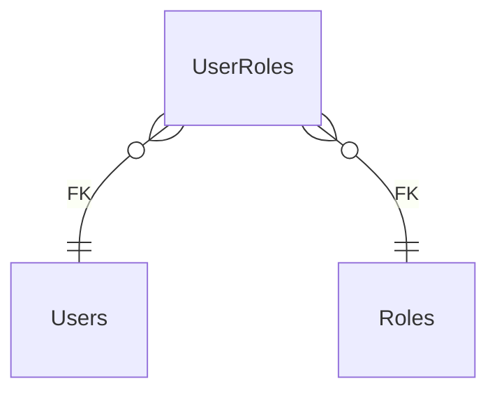

# UserRoles

**Table:** `iam.user_roles`

**Base path:** `/user-roles`

## Related Tables

### Parent Tables

_Tables this table references via foreign keys._

| Parent Table | FK Column | References | Link |
|-------------|-----------|------------|------|
| `users` | `user_id` | `user_roles_user_id_fkey` | [Users](./users) |
| `roles` | `role_id` | `user_roles_role_id_fkey` | [Roles](./roles) |
| `users` | `granted_by` | `user_roles_granted_by_fkey` | [Users](./users) |


## Entity Relationship Diagram



::::tabs

:::tab FullStack

## Columns

| # | Column | SQL Type | Go Type | TS Type | Nullable | Default | Constraints | Description |
|---|--------|----------|---------|---------|----------|---------|-------------|-------------|
| 1 | `id` | `uuid` | `uuid.UUID` | `string` | NO | `gen_random_uuid()` | `PK` | Primary key |
| 2 | `name` | `text` | `string` | `string` | NO | `''::text` | - | - |
| 3 | `user_id` | `uuid` | `uuid.UUID` | `string` | NO | - | `UQ` `FK` | → References `users` |
| 4 | `role_id` | `uuid` | `uuid.UUID` | `string` | NO | - | `UQ` `FK` | → References `roles` |
| 5 | `granted_by` | `uuid` | `uuid.UUID` | `string` | YES | - | `FK` | → References `users` |
| 6 | `granted_at` | `timestamp with time zone` | `time.Time` | `string` | NO | `now()` | - | - |
| 7 | `expires_at` | `timestamp with time zone` | `time.Time` | `string` | YES | - | - | - |
| 8 | `created_at` | `timestamp with time zone` | `time.Time` | `string` | NO | `now()` | - | Auto-filled from session |

## Primary Keys

- `id` (`uuid`)

## Foreign Keys & Relationships

| Column | References | Constraint |
|--------|-----------|------------|
| `user_id` | `users` | `user_roles_user_id_fkey` |
| `role_id` | `roles` | `user_roles_role_id_fkey` |
| `granted_by` | `users` | `user_roles_granted_by_fkey` |

## Unique Keys

- `user_id` (`uuid`)
- `role_id` (`uuid`)


## Go Generated Code

> 📂 Source: [📄 `UserRoles.go`](https://github.com/meftunca/data-bridge-examples/blob/main//iam/structures/UserRoles.go) · [📄 `UserRoles.go`](https://github.com/meftunca/data-bridge-examples/blob/main//iam/services/UserRoles.go) · [📄 `UserRoles.go`](https://github.com/meftunca/data-bridge-examples/blob/main//iam/controllers/UserRoles.go)

### Structs

::::tabs

:::tab Form

#### UserRolesForm [](https://github.com/meftunca/data-bridge-examples/blob/main//iam/structures/UserRoles.go#:~:text=type%20UserRolesForm%20struct)

_Create payload — excludes auto-generated PK fields_

| Field | Go Type | JSON Key | Nullable |
|-------|---------|----------|----------|
| `Name` | `string` | `name` | NO |
| `UserId` | `uuid.UUID` | `userId` | NO |
| `RoleId` | `uuid.UUID` | `roleId` | NO |
| `GrantedBy` | `*uuid.UUID` | `grantedBy` | YES |
| `GrantedAt` | `time.Time` | `grantedAt` | NO |
| `ExpiresAt` | `*time.Time` | `expiresAt` | YES |
| `CreatedAt` | `time.Time` | `createdAt` | NO |

:::tab Model

#### UserRoles [](https://github.com/meftunca/data-bridge-examples/blob/main//iam/structures/UserRoles.go#:~:text=type%20UserRoles%20struct)

_Full model — all columns + GORM/JSON tags + preload relations_

| Field | Go Type | JSON Key | Nullable |
|-------|---------|----------|----------|
| `Id` | `uuid.UUID` | `id` | NO |
| `Name` | `string` | `name` | NO |
| `UserId` | `uuid.UUID` | `userId` | NO |
| `RoleId` | `uuid.UUID` | `roleId` | NO |
| `GrantedBy` | `*uuid.UUID` | `grantedBy` | YES |
| `GrantedAt` | `time.Time` | `grantedAt` | NO |
| `ExpiresAt` | `*time.Time` | `expiresAt` | YES |
| `CreatedAt` | `time.Time` | `createdAt` | NO |

:::tab Edit

#### UserRolesEdit [](https://github.com/meftunca/data-bridge-examples/blob/main//iam/structures/UserRoles.go#:~:text=type%20UserRolesEdit%20struct)

_Update payload — all fields are pointers (partial update)_

| Field | Go Type | JSON Key | Nullable |
|-------|---------|----------|----------|
| `Id` | `*uuid.UUID` | `id` | YES |
| `Name` | `*string` | `name` | YES |
| `UserId` | `*uuid.UUID` | `userId` | YES |
| `RoleId` | `*uuid.UUID` | `roleId` | YES |
| `GrantedBy` | `*uuid.UUID` | `grantedBy` | YES |
| `GrantedAt` | `*time.Time` | `grantedAt` | YES |
| `ExpiresAt` | `*time.Time` | `expiresAt` | YES |
| `CreatedAt` | `*time.Time` | `createdAt` | YES |

:::tab Filter

#### UserRolesFilter [](https://github.com/meftunca/data-bridge-examples/blob/main//iam/structures/UserRoles.go#:~:text=type%20UserRolesFilter%20struct)

_Query filter — all fields are pointers_

| Field | Go Type | JSON Key | Nullable |
|-------|---------|----------|----------|
| `Id` | `*uuid.UUID` | `id` | YES |
| `Name` | `*string` | `name` | YES |
| `UserId` | `*uuid.UUID` | `userId` | YES |
| `RoleId` | `*uuid.UUID` | `roleId` | YES |
| `GrantedBy` | `*uuid.UUID` | `grantedBy` | YES |
| `GrantedAt` | `*time.Time` | `grantedAt` | YES |
| `ExpiresAt` | `*time.Time` | `expiresAt` | YES |
| `CreatedAt` | `*time.Time` | `createdAt` | YES |

:::tab Page

#### UserRolesPage [](https://github.com/meftunca/data-bridge-examples/blob/main//iam/structures/UserRoles.go#:~:text=type%20UserRolesPage%20struct)

_Paginated response wrapper_

| Field | Go Type | JSON Key | Nullable |
|-------|---------|----------|----------|
| `Id` | `uuid.UUID` | `id` | NO |
| `Name` | `string` | `name` | NO |
| `UserId` | `uuid.UUID` | `userId` | NO |
| `RoleId` | `uuid.UUID` | `roleId` | NO |
| `GrantedBy` | `*uuid.UUID` | `grantedBy` | YES |
| `GrantedAt` | `time.Time` | `grantedAt` | NO |
| `ExpiresAt` | `*time.Time` | `expiresAt` | YES |
| `CreatedAt` | `time.Time` | `createdAt` | NO |

:::tab BatchUpdate

#### UserRolesBatchUpdate [](https://github.com/meftunca/data-bridge-examples/blob/main//iam/structures/UserRoles.go#:~:text=type%20UserRolesBatchUpdate%20struct)

```go
type UserRolesBatchUpdate struct {
    Data       json.RawMessage `json:"data"`
    PathParams struct {
        Id uuid.UUID
    } `json:"pathParams"`
}
```

::::

### Service & Endpoints

::::tabs

:::tab Service Methods

| Method | Signature |
|---------|-----------|
| [Create](https://github.com/meftunca/data-bridge-examples/blob/main//iam/services/UserRoles.go#:~:text=)%20CreateUserRoles() | `(UserRolesService) CreateUserRoles(data UserRolesForm) (UserRolesForm, error)` |
| [Create Multiple](https://github.com/meftunca/data-bridge-examples/blob/main//iam/services/UserRoles.go#:~:text=)%20CreateUserRolesMultiple() | `(UserRolesService) CreateUserRolesMultiple(data []UserRolesForm) ([]UserRolesForm, error)` |
| [Update](https://github.com/meftunca/data-bridge-examples/blob/main//iam/services/UserRoles.go#:~:text=)%20UpdateUserRoles() | `(UserRolesService) UpdateUserRoles(id uuid.UUID, data interface{}) error` |
| [Update Multiple](https://github.com/meftunca/data-bridge-examples/blob/main//iam/services/UserRoles.go#:~:text=)%20UpdateUserRolesMultiple() | `(UserRolesService) UpdateUserRolesMultiple(data []UserRolesBatchUpdate) error` |
| [Delete](https://github.com/meftunca/data-bridge-examples/blob/main//iam/services/UserRoles.go#:~:text=)%20DeleteUserRoles() | `(UserRolesService) DeleteUserRoles(id uuid.UUID) error` |

:::tab Endpoints

| Method | Path | Description |
|--------|------|-------------|
| `GET` | `/user-roles/` | Search with query params |
| `GET` | `/user-roles/pagination` | Paginated listing |
| `POST` | `/user-roles/` | Create single record |
| `POST` | `/user-roles/bulk/` | Create multiple records |
| `PUT` | `/user-roles/bulk/` | Batch update |
| `GET` | `/user-roles/with-id/:id` | Get by ID |
| `PUT` | `/user-roles/with-id/:id` | Update by ID |
| `DELETE` | `/user-roles/with-id/:id` | Delete by ID |

:::tab Query & Filters

| Parameter | Type | Description |
|-----------|------|-------------|
| `page` | `int` | Page number (default: 1) |
| `size` | `int` | Items per page (default: 10) |
| `sort` | `string` | Sort field. Prefix `-` for descending. Example: `-created_at` |
| `fields` | `string` | Comma-separated column list to select |
| `preloads` | `string` | Comma-separated relation names to preload |
| `filters` | `array` | Filter rules: `[[field, op, value], ...]` |
| `groupby` | `string` | Group by field name |
| `aggregations` | `json` | Aggregation specs: `[{func,field,alias}]` |

**Filter Operators:** `eq` `neq` `gt` `gte` `lt` `lte` `in` `notin` `like` `ilike` `is` `isnot` `between`

::::

### RPC Functions

| Function | Parameters | Return | Endpoint |
|----------|-----------|--------|----------|
| `count_active_users` | - | `integer` | `/rpc/count_active_users` |
| `user_permissions` | `p_user_id uuid`, `resource text`, `action text` | `record` | `/rpc/user_permissions` |
| `users_by_organization` | `p_org_id uuid` | `integer` | `/rpc/users_by_organization` |


:::tab Frontend

## TypeScript Types & Hooks

::::tabs

:::tab Interfaces

```typescript
export interface UserRoles {
  id: string;
  name: string;
  userId: string;
  roleId: string;
  grantedBy?: string;
  grantedAt: string;
  expiresAt?: string;
  createdAt: string;
}

export interface UserRolesForm {
  name: string;
  userId: string;
  roleId: string;
  grantedBy?: string;
  grantedAt: string;
  expiresAt?: string;
  createdAt: string;
}

export interface UserRolesEdit {
  id: string;
  name: string;
  userId: string;
  roleId: string;
  grantedBy?: string;
  grantedAt: string;
  expiresAt?: string;
  createdAt: string;
}

export interface UserRolesPage {
  data: UserRoles[];
  total: number;
  page: number;
  size: number;
  totalPages: number;
}

export type UserRolesPathQuery = {
  page?: number;
  size?: number;
  sort?: string;
  fields?: string;
  preloads?: string;
  filters?: string;
};

```

:::tab React Query

```typescript
import { useQuery, useMutation, useQueryClient } from "@tanstack/react-query";

const UserRolesKeys = {
  all: ["user_roles"] as const,
  lists: () => [...UserRolesKeys.all, "list"] as const,
  detail: (id: any) => [...UserRolesKeys.all, "detail", id] as const,
} as const;

export function useUserRolesList(query?: UserRolesPathQuery) {
  return useQuery({
    queryKey: [...UserRolesKeys.lists(), query],
    queryFn: () => fetch(`/user-roles/pagination`, { method: "GET" }).then(r => r.json()) as Promise<UserRolesPage>,
  });
}

export function useUserRolesDetail(id: any) {
  return useQuery({
    queryKey: UserRolesKeys.detail(id),
    queryFn: () => fetch(`/user-roles/with-id/:id`).then(r => r.json()) as Promise<UserRoles>,
  });
}

export function useCreateUserRoles() {
  const qc = useQueryClient();
  return useMutation({
    mutationFn: (data: UserRolesForm) =>
      fetch("/user-roles/", { method: "POST", body: JSON.stringify(data) }).then(r => r.json()),
    onSuccess: () => qc.invalidateQueries({ queryKey: UserRolesKeys.lists() }),
  });
}

export function useUpdateUserRoles() {
  const qc = useQueryClient();
  return useMutation({
    mutationFn: ({ id, data }: { id: any: any; data: UserRolesEdit }) =>
      fetch(`/user-roles/with-id/:id`, { method: "PUT", body: JSON.stringify(data) }).then(r => r.json()),
    onSuccess: () => qc.invalidateQueries({ queryKey: UserRolesKeys.all }),
  });
}

export function useDeleteUserRoles() {
  const qc = useQueryClient();
  return useMutation({
    mutationFn: (id: any) =>
      fetch(`/user-roles/with-id/:id`, { method: "DELETE" }).then(r => r.json()),
    onSuccess: () => qc.invalidateQueries({ queryKey: UserRolesKeys.all }),
  });
}

```

:::tab Zod Validation

```typescript
import { z } from "zod";

export const UserRolesFormSchema = z.object({
  name: z.string(),
  userId: z.string().uuid(),
  roleId: z.string().uuid(),
  grantedBy: z.string().uuid().optional(),
  grantedAt: z.string().datetime(),
  expiresAt: z.string().datetime().optional(),
  createdAt: z.string().datetime(),
});

export type UserRolesFormInput = z.infer<typeof UserRolesFormSchema>;

```

::::


:::tab API

<script setup>
import { useOpenapi } from 'vitepress-openapi'
import spec from './user_roles.openapi.json'
useOpenapi({ spec })
</script>


## API Reference

::::tabs

:::tab Search

#### <Badge type="info" text="GET" /> Search UserRoles

```
GET /api/v1/user-roles/
```

> Retrieve list filtered by query parameters.

**Headers:**

| Header | Required | Description |
|--------|----------|-------------|
| `Authorization` | Yes | Bearer token |
| `x-company` | Yes | Company ID |

**Query Parameters:**

| Parameter | Type | Required | Description |
|-----------|------|----------|-------------|
| `size` | `integer` | No | Max results (default: 10) |
| `sort` | `string` | No | Sort field. Prefix `-` for DESC. e.g. `-created_at` |
| `fields` | `string` | No | Comma-separated columns to select |
| `preloads` | `string` | No | Available: UserIdDetail, UserIdDetail.UserRolesList, UserIdDetail.UserRolesList.UserIdDetail, UserIdDetail.UserRolesList.RoleIdDetail, UserIdDetail.UserRolesList.GrantedByDetail, UserIdDetail.TeamsList, UserIdDetail.TeamsList.TeamMembersList, UserIdDetail.TeamsList.OrganizationIdDetail, UserIdDetail.TeamsList.LeadIdDetail, UserIdDetail.TeamMembersList, UserIdDetail.TeamMembersList.TeamIdDetail, UserIdDetail.TeamMembersList.UserIdDetail, UserIdDetail.ApiKeysList, UserIdDetail.ApiKeysList.UserIdDetail, UserIdDetail.ApiKeysList.OrganizationIdDetail, UserIdDetail.SessionsList, UserIdDetail.SessionsList.UserIdDetail, UserIdDetail.InvitationsList, UserIdDetail.InvitationsList.OrganizationIdDetail, UserIdDetail.InvitationsList.InvitedByDetail, UserIdDetail.InvitationsList.RoleIdDetail, UserIdDetail.OrganizationIdDetail, UserIdDetail.OrganizationIdDetail.OrganizationsList, UserIdDetail.OrganizationIdDetail.UsersList, UserIdDetail.OrganizationIdDetail.RolesList, UserIdDetail.OrganizationIdDetail.TeamsList, UserIdDetail.OrganizationIdDetail.ApiKeysList, UserIdDetail.OrganizationIdDetail.InvitationsList, UserIdDetail.OrganizationIdDetail.ParentIdDetail, RoleIdDetail, RoleIdDetail.RolePermissionsList, RoleIdDetail.RolePermissionsList.RoleIdDetail, RoleIdDetail.RolePermissionsList.PermissionIdDetail, RoleIdDetail.UserRolesList, RoleIdDetail.UserRolesList.UserIdDetail, RoleIdDetail.UserRolesList.RoleIdDetail, RoleIdDetail.UserRolesList.GrantedByDetail, RoleIdDetail.InvitationsList, RoleIdDetail.InvitationsList.OrganizationIdDetail, RoleIdDetail.InvitationsList.InvitedByDetail, RoleIdDetail.InvitationsList.RoleIdDetail, RoleIdDetail.OrganizationIdDetail, RoleIdDetail.OrganizationIdDetail.OrganizationsList, RoleIdDetail.OrganizationIdDetail.UsersList, RoleIdDetail.OrganizationIdDetail.RolesList, RoleIdDetail.OrganizationIdDetail.TeamsList, RoleIdDetail.OrganizationIdDetail.ApiKeysList, RoleIdDetail.OrganizationIdDetail.InvitationsList, RoleIdDetail.OrganizationIdDetail.ParentIdDetail, GrantedByDetail, GrantedByDetail.UserRolesList, GrantedByDetail.UserRolesList.UserIdDetail, GrantedByDetail.UserRolesList.RoleIdDetail, GrantedByDetail.UserRolesList.GrantedByDetail, GrantedByDetail.TeamsList, GrantedByDetail.TeamsList.TeamMembersList, GrantedByDetail.TeamsList.OrganizationIdDetail, GrantedByDetail.TeamsList.LeadIdDetail, GrantedByDetail.TeamMembersList, GrantedByDetail.TeamMembersList.TeamIdDetail, GrantedByDetail.TeamMembersList.UserIdDetail, GrantedByDetail.ApiKeysList, GrantedByDetail.ApiKeysList.UserIdDetail, GrantedByDetail.ApiKeysList.OrganizationIdDetail, GrantedByDetail.SessionsList, GrantedByDetail.SessionsList.UserIdDetail, GrantedByDetail.InvitationsList, GrantedByDetail.InvitationsList.OrganizationIdDetail, GrantedByDetail.InvitationsList.InvitedByDetail, GrantedByDetail.InvitationsList.RoleIdDetail, GrantedByDetail.OrganizationIdDetail, GrantedByDetail.OrganizationIdDetail.OrganizationsList, GrantedByDetail.OrganizationIdDetail.UsersList, GrantedByDetail.OrganizationIdDetail.RolesList, GrantedByDetail.OrganizationIdDetail.TeamsList, GrantedByDetail.OrganizationIdDetail.ApiKeysList, GrantedByDetail.OrganizationIdDetail.InvitationsList, GrantedByDetail.OrganizationIdDetail.ParentIdDetail |
| `joins` | `string` | No | Available: Users, Users.Organizations, Users.Organizations.Organizations, Roles, Roles.Organizations, Roles.Organizations.Organizations |
| `id` | `string (uuid)` | No | Filter by id |
| `name` | `string` | No | Filter by name |
| `userId` | `string (uuid)` | No | Filter by user_id |
| `roleId` | `string (uuid)` | No | Filter by role_id |
| `grantedBy` | `string (uuid)` | No | Filter by granted_by |
| `grantedAt` | `string (date-time)` | No | Filter by granted_at |
| `expiresAt` | `string (date-time)` | No | Filter by expires_at |

**Response:** `UserRoles[]`

<details>
<summary>curl example</summary>

```bash
curl -X GET \
  -H "Authorization: Bearer $TOKEN" \
  -H "x-company: $COMPANY_ID" \
  "http://localhost:3000/api/v1/user-roles/"
```

</details>

---

#### <Badge type="tip" text="POST" /> Search UserRoles (POST)

```
POST /api/v1/user-roles/search
```

> Search with body filters. Auto-used when query string > 2KB.

**Headers:**

| Header | Required | Description |
|--------|----------|-------------|
| `Authorization` | Yes | Bearer token |
| `x-company` | Yes | Company ID |

**Request Body:**

```typescript
{
  size?: number  // e.g. 10
  sort?: string[]  // e.g. ["-createdAt"]
  filters?: FilterRule[]  // e.g. [["name", "eq", "value"]]
  fields?: string[]
  preloads?: string[]
}
```

**Response:** `UserRoles[]`

<details>
<summary>curl example</summary>

```bash
curl -X POST \
  -H "Authorization: Bearer $TOKEN" \
  -H "x-company: $COMPANY_ID" \
  -H "Content-Type: application/json" \
  -d '{}' \
  "http://localhost:3000/api/v1/user-roles/search"
```

</details>

---

:::tab Pagination

#### <Badge type="info" text="GET" /> Paginate UserRoles

```
GET /api/v1/user-roles/pagination
```

> Paginated listing.

**Headers:**

| Header | Required | Description |
|--------|----------|-------------|
| `Authorization` | Yes | Bearer token |
| `x-company` | Yes | Company ID |

**Query Parameters:**

| Parameter | Type | Required | Description |
|-----------|------|----------|-------------|
| `page` | `integer` | No | Page number (default: 1) |
| `size` | `integer` | No | Max results (default: 10) |
| `sort` | `string` | No | Sort field. Prefix `-` for DESC. e.g. `-created_at` |
| `fields` | `string` | No | Comma-separated columns to select |
| `preloads` | `string` | No | Available: UserIdDetail, UserIdDetail.UserRolesList, UserIdDetail.UserRolesList.UserIdDetail, UserIdDetail.UserRolesList.RoleIdDetail, UserIdDetail.UserRolesList.GrantedByDetail, UserIdDetail.TeamsList, UserIdDetail.TeamsList.TeamMembersList, UserIdDetail.TeamsList.OrganizationIdDetail, UserIdDetail.TeamsList.LeadIdDetail, UserIdDetail.TeamMembersList, UserIdDetail.TeamMembersList.TeamIdDetail, UserIdDetail.TeamMembersList.UserIdDetail, UserIdDetail.ApiKeysList, UserIdDetail.ApiKeysList.UserIdDetail, UserIdDetail.ApiKeysList.OrganizationIdDetail, UserIdDetail.SessionsList, UserIdDetail.SessionsList.UserIdDetail, UserIdDetail.InvitationsList, UserIdDetail.InvitationsList.OrganizationIdDetail, UserIdDetail.InvitationsList.InvitedByDetail, UserIdDetail.InvitationsList.RoleIdDetail, UserIdDetail.OrganizationIdDetail, UserIdDetail.OrganizationIdDetail.OrganizationsList, UserIdDetail.OrganizationIdDetail.UsersList, UserIdDetail.OrganizationIdDetail.RolesList, UserIdDetail.OrganizationIdDetail.TeamsList, UserIdDetail.OrganizationIdDetail.ApiKeysList, UserIdDetail.OrganizationIdDetail.InvitationsList, UserIdDetail.OrganizationIdDetail.ParentIdDetail, RoleIdDetail, RoleIdDetail.RolePermissionsList, RoleIdDetail.RolePermissionsList.RoleIdDetail, RoleIdDetail.RolePermissionsList.PermissionIdDetail, RoleIdDetail.UserRolesList, RoleIdDetail.UserRolesList.UserIdDetail, RoleIdDetail.UserRolesList.RoleIdDetail, RoleIdDetail.UserRolesList.GrantedByDetail, RoleIdDetail.InvitationsList, RoleIdDetail.InvitationsList.OrganizationIdDetail, RoleIdDetail.InvitationsList.InvitedByDetail, RoleIdDetail.InvitationsList.RoleIdDetail, RoleIdDetail.OrganizationIdDetail, RoleIdDetail.OrganizationIdDetail.OrganizationsList, RoleIdDetail.OrganizationIdDetail.UsersList, RoleIdDetail.OrganizationIdDetail.RolesList, RoleIdDetail.OrganizationIdDetail.TeamsList, RoleIdDetail.OrganizationIdDetail.ApiKeysList, RoleIdDetail.OrganizationIdDetail.InvitationsList, RoleIdDetail.OrganizationIdDetail.ParentIdDetail, GrantedByDetail, GrantedByDetail.UserRolesList, GrantedByDetail.UserRolesList.UserIdDetail, GrantedByDetail.UserRolesList.RoleIdDetail, GrantedByDetail.UserRolesList.GrantedByDetail, GrantedByDetail.TeamsList, GrantedByDetail.TeamsList.TeamMembersList, GrantedByDetail.TeamsList.OrganizationIdDetail, GrantedByDetail.TeamsList.LeadIdDetail, GrantedByDetail.TeamMembersList, GrantedByDetail.TeamMembersList.TeamIdDetail, GrantedByDetail.TeamMembersList.UserIdDetail, GrantedByDetail.ApiKeysList, GrantedByDetail.ApiKeysList.UserIdDetail, GrantedByDetail.ApiKeysList.OrganizationIdDetail, GrantedByDetail.SessionsList, GrantedByDetail.SessionsList.UserIdDetail, GrantedByDetail.InvitationsList, GrantedByDetail.InvitationsList.OrganizationIdDetail, GrantedByDetail.InvitationsList.InvitedByDetail, GrantedByDetail.InvitationsList.RoleIdDetail, GrantedByDetail.OrganizationIdDetail, GrantedByDetail.OrganizationIdDetail.OrganizationsList, GrantedByDetail.OrganizationIdDetail.UsersList, GrantedByDetail.OrganizationIdDetail.RolesList, GrantedByDetail.OrganizationIdDetail.TeamsList, GrantedByDetail.OrganizationIdDetail.ApiKeysList, GrantedByDetail.OrganizationIdDetail.InvitationsList, GrantedByDetail.OrganizationIdDetail.ParentIdDetail |
| `joins` | `string` | No | Available: Users, Users.Organizations, Users.Organizations.Organizations, Roles, Roles.Organizations, Roles.Organizations.Organizations |
| `id` | `string (uuid)` | No | Filter by id |
| `name` | `string` | No | Filter by name |
| `userId` | `string (uuid)` | No | Filter by user_id |
| `roleId` | `string (uuid)` | No | Filter by role_id |
| `grantedBy` | `string (uuid)` | No | Filter by granted_by |
| `grantedAt` | `string (date-time)` | No | Filter by granted_at |
| `expiresAt` | `string (date-time)` | No | Filter by expires_at |

**Response:** `PaginationResponse<UserRoles>`

<details>
<summary>curl example</summary>

```bash
curl -X GET \
  -H "Authorization: Bearer $TOKEN" \
  -H "x-company: $COMPANY_ID" \
  "http://localhost:3000/api/v1/user-roles/pagination"
```

</details>

---

#### <Badge type="tip" text="POST" /> Paginate UserRoles (POST)

```
POST /api/v1/user-roles/pagination
```

> Paginated listing with body filters.

**Headers:**

| Header | Required | Description |
|--------|----------|-------------|
| `Authorization` | Yes | Bearer token |
| `x-company` | Yes | Company ID |

**Request Body:**

```typescript
{
  page?: number  // e.g. 1
  size?: number  // e.g. 10
  sort?: string[]  // e.g. ["-createdAt"]
  filters?: FilterRule[]  // e.g. [["name", "eq", "value"]]
  fields?: string[]
  preloads?: string[]
}
```

**Response:** `PaginationResponse<UserRoles>`

<details>
<summary>curl example</summary>

```bash
curl -X POST \
  -H "Authorization: Bearer $TOKEN" \
  -H "x-company: $COMPANY_ID" \
  -H "Content-Type: application/json" \
  -d '{}' \
  "http://localhost:3000/api/v1/user-roles/pagination"
```

</details>

---

:::tab Create

#### <Badge type="tip" text="POST" /> Create UserRoles

```
POST /api/v1/user-roles/
```

> Create a new record.

**Headers:**

| Header | Required | Description |
|--------|----------|-------------|
| `Authorization` | Yes | Bearer token |
| `x-company` | Yes | Company ID |

**Request Body:**

```typescript
{
  name?: string  // e.g. example_name
  userId: string  // e.g. 550e8400-e29b-41d4-a716-446655440000
  roleId: string  // e.g. 550e8400-e29b-41d4-a716-446655440000
  grantedBy?: string  // e.g. 550e8400-e29b-41d4-a716-446655440000
  grantedAt?: string  // e.g. 2026-01-15T10:30:00Z
  expiresAt?: string  // e.g. 2026-01-15T10:30:00Z
}
```

**Response:** `UserRoles`

<details>
<summary>curl example</summary>

```bash
curl -X POST \
  -H "Authorization: Bearer $TOKEN" \
  -H "x-company: $COMPANY_ID" \
  -H "Content-Type: application/json" \
  -d '{}' \
  "http://localhost:3000/api/v1/user-roles/"
```

</details>

---

#### <Badge type="tip" text="POST" /> Bulk Create UserRoles

```
POST /api/v1/user-roles/bulk/
```

> Create multiple records in one request.

**Headers:**

| Header | Required | Description |
|--------|----------|-------------|
| `Authorization` | Yes | Bearer token |
| `x-company` | Yes | Company ID |

**Request Body:**

```typescript
{
  name?: string  // e.g. example_name
  userId: string  // e.g. 550e8400-e29b-41d4-a716-446655440000
  roleId: string  // e.g. 550e8400-e29b-41d4-a716-446655440000
  grantedBy?: string  // e.g. 550e8400-e29b-41d4-a716-446655440000
  grantedAt?: string  // e.g. 2026-01-15T10:30:00Z
  expiresAt?: string  // e.g. 2026-01-15T10:30:00Z
}
```

**Response:** `UserRoles[]`

<details>
<summary>curl example</summary>

```bash
curl -X POST \
  -H "Authorization: Bearer $TOKEN" \
  -H "x-company: $COMPANY_ID" \
  -H "Content-Type: application/json" \
  -d '{}' \
  "http://localhost:3000/api/v1/user-roles/bulk/"
```

</details>

---

:::tab Find & Update

#### <Badge type="info" text="GET" /> Find UserRoles by ID

```
GET /api/v1/user-roles/with-id/:id
```

> Retrieve a single record by primary key.

**Headers:**

| Header | Required | Description |
|--------|----------|-------------|
| `Authorization` | Yes | Bearer token |
| `x-company` | Yes | Company ID |

**Query Parameters:**

| Parameter | Type | Required | Description |
|-----------|------|----------|-------------|
| `Id` | `string (uuid)` | Yes | Primary key (uuid) |

**Response:** `UserRoles`

<details>
<summary>curl example</summary>

```bash
curl -X GET \
  -H "Authorization: Bearer $TOKEN" \
  -H "x-company: $COMPANY_ID" \
  "http://localhost:3000/api/v1/user-roles/with-id/:id"
```

</details>

---

#### <Badge type="warning" text="PUT" /> Update UserRoles

```
PUT /api/v1/user-roles/with-id/:id
```

> Partial update — send only the fields to change.

**Headers:**

| Header | Required | Description |
|--------|----------|-------------|
| `Authorization` | Yes | Bearer token |
| `x-company` | Yes | Company ID |

**Query Parameters:**

| Parameter | Type | Required | Description |
|-----------|------|----------|-------------|
| `Id` | `string (uuid)` | Yes | Primary key (uuid) |

**Request Body:**

```typescript
{
  name?: string
  userId?: string
  roleId?: string
  grantedBy?: string
  grantedAt?: string
  expiresAt?: string
}
```

**Response:** `Success`

<details>
<summary>curl example</summary>

```bash
curl -X PUT \
  -H "Authorization: Bearer $TOKEN" \
  -H "x-company: $COMPANY_ID" \
  -H "Content-Type: application/json" \
  -d '{}' \
  "http://localhost:3000/api/v1/user-roles/with-id/:id"
```

</details>

---

#### <Badge type="warning" text="PUT" /> Bulk Update UserRoles

```
PUT /api/v1/user-roles/bulk/
```

> Batch update multiple records.

**Headers:**

| Header | Required | Description |
|--------|----------|-------------|
| `Authorization` | Yes | Bearer token |
| `x-company` | Yes | Company ID |

**Request Body:** Array of { pathParams, data: UserRolesEdit }

**Response:** `Success`

<details>
<summary>curl example</summary>

```bash
curl -X PUT \
  -H "Authorization: Bearer $TOKEN" \
  -H "x-company: $COMPANY_ID" \
  -H "Content-Type: application/json" \
  -d '{}' \
  "http://localhost:3000/api/v1/user-roles/bulk/"
```

</details>

---

:::tab Delete

#### <Badge type="danger" text="DELETE" /> Delete UserRoles

```
DELETE /api/v1/user-roles/with-id/:id
```

> Soft-delete (sets deleted_at + deleted_by).

**Headers:**

| Header | Required | Description |
|--------|----------|-------------|
| `Authorization` | Yes | Bearer token |
| `x-company` | Yes | Company ID |

**Query Parameters:**

| Parameter | Type | Required | Description |
|-----------|------|----------|-------------|
| `Id` | `string (uuid)` | Yes | Primary key (uuid) |

**Response:** `Success`

<details>
<summary>curl example</summary>

```bash
curl -X DELETE \
  -H "Authorization: Bearer $TOKEN" \
  -H "x-company: $COMPANY_ID" \
  "http://localhost:3000/api/v1/user-roles/with-id/:id"
```

</details>

---

::::


::::
