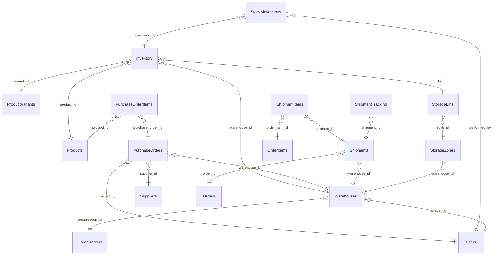

# Logistics Schema

> Generated by DataBridge Doc Generator — 2026-04-03 12:39:58

## Tables

| Name | SQL Name | Type | Info |
|------|----------|------|------|
| [Inventory](./inventory.md) | `inventory` | TABLE | 13 columns |
| [PurchaseOrderItems](./purchase_order_items.md) | `purchase_order_items` | TABLE | 9 columns |
| [PurchaseOrders](./purchase_orders.md) | `purchase_orders` | TABLE | 14 columns |
| [ShipmentItems](./shipment_items.md) | `shipment_items` | TABLE | 6 columns |
| [ShipmentTracking](./shipment_tracking.md) | `shipment_tracking` | TABLE | 8 columns |
| [Shipments](./shipments.md) | `shipments` | TABLE | 14 columns |
| [StockMovements](./stock_movements.md) | `stock_movements` | TABLE | 10 columns |
| [StorageBins](./storage_bins.md) | `storage_bins` | TABLE | 8 columns |
| [StorageZones](./storage_zones.md) | `storage_zones` | TABLE | 9 columns |
| [Suppliers](./suppliers.md) | `suppliers` | TABLE | 11 columns |
| [Warehouses](./warehouses.md) | `warehouses` | TABLE | 10 columns |

## Entity Relationship Diagram


```

## Enum Types

| Enum | Values |
|------|--------|
| `logistics.shipment_status` | `preparing`, `picked_up`, `in_transit`, `out_for_delivery`, `delivered`, `returned`, `lost` |
| `logistics.stock_level` | `out_of_stock`, `low`, `normal`, `high`, `overstock` |

