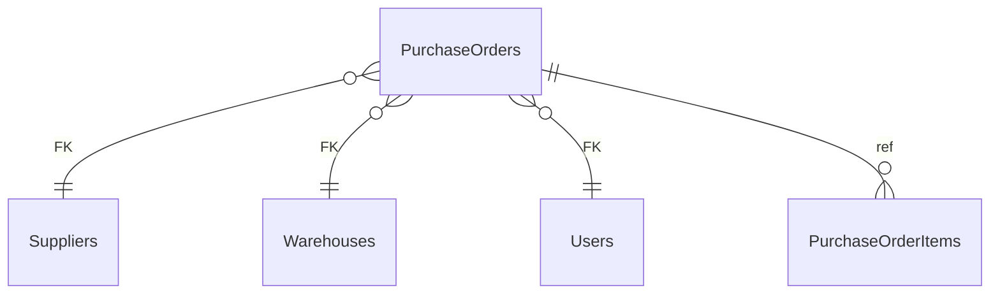

# PurchaseOrders

**Table:** `logistics.purchase_orders`

**Base path:** `/purchase-orders`

## Related Tables

### Parent Tables

_Tables this table references via foreign keys._

| Parent Table | FK Column | References | Link |
|-------------|-----------|------------|------|
| `suppliers` | `supplier_id` | `purchase_orders_supplier_id_fkey` | [Suppliers](./suppliers) |
| `warehouses` | `warehouse_id` | `purchase_orders_warehouse_id_fkey` | [Warehouses](./warehouses) |
| `users` | `created_by` | `purchase_orders_created_by_fkey` | [Users](./users) |
| `users` | `approved_by` | `purchase_orders_approved_by_fkey` | [Users](./users) |

### Child Tables

_Tables that reference this table via foreign keys._

| Child Table | FK Column | References | Link |
|------------|-----------|------------|------|
| `purchase_order_items` | `purchase_order_id` | `purchase_order_items_purchase_order_id_fkey` | [PurchaseOrderItems](./purchase_order_items) |


## Entity Relationship Diagram



::::tabs

=== FullStack

## Columns

| # | Column | SQL Type | Go Type | TS Type | Nullable | Default | Constraints | Description |
|---|--------|----------|---------|---------|----------|---------|-------------|-------------|
| 1 | `id` | `uuid` | `uuid.UUID` | `string` | NO | `gen_random_uuid()` | `PK` | Primary key |
| 2 | `name` | `text` | `string` | `string` | NO | `''::text` | - | - |
| 3 | `po_number` | `text` | `string` | `string` | NO | - | `UQ` | - |
| 4 | `supplier_id` | `uuid` | `uuid.UUID` | `string` | NO | - | `FK` | → References `suppliers` |
| 5 | `warehouse_id` | `uuid` | `uuid.UUID` | `string` | NO | - | `FK` | → References `warehouses` |
| 6 | `status` | `text` | `string` | `string` | NO | `'draft'::text` | - | - |
| 7 | `total_amount` | `numeric` | `float64` | `number` | NO | `0.00` | - | - |
| 8 | `expected_date` | `date` | `time.Time` | `string` | YES | - | - | - |
| 9 | `received_date` | `date` | `time.Time` | `string` | YES | - | - | - |
| 10 | `created_by` | `uuid` | `uuid.UUID` | `string` | YES | - | `FK` | Auto-filled from session |
| 11 | `approved_by` | `uuid` | `uuid.UUID` | `string` | YES | - | `FK` | → References `users` |
| 12 | `notes` | `text` | `string` | `string` | NO | `''::text` | - | - |
| 13 | `created_at` | `timestamp with time zone` | `time.Time` | `string` | NO | `now()` | - | Auto-filled from session |
| 14 | `updated_at` | `timestamp with time zone` | `time.Time` | `string` | NO | `now()` | - | Auto-filled from session |

## Primary Keys

- `id` (`uuid`)

## Foreign Keys & Relationships

| Column | References | Constraint |
|--------|-----------|------------|
| `supplier_id` | `suppliers` | `purchase_orders_supplier_id_fkey` |
| `warehouse_id` | `warehouses` | `purchase_orders_warehouse_id_fkey` |
| `created_by` | `users` | `purchase_orders_created_by_fkey` |
| `approved_by` | `users` | `purchase_orders_approved_by_fkey` |

## Unique Keys

- `po_number` (`text`)


## Go Generated Code

> 📂 Source: [📄 `PurchaseOrders.go`](https://github.com/meftunca/data-bridge-examples/blob/main//logistics/structures/PurchaseOrders.go) · [📄 `PurchaseOrders.go`](https://github.com/meftunca/data-bridge-examples/blob/main//logistics/services/PurchaseOrders.go) · [📄 `PurchaseOrders.go`](https://github.com/meftunca/data-bridge-examples/blob/main//logistics/controllers/PurchaseOrders.go)

### Structs

:::tabs

== Form

#### PurchaseOrdersForm [](https://github.com/meftunca/data-bridge-examples/blob/main//logistics/structures/PurchaseOrders.go#:~:text=type%20PurchaseOrdersForm%20struct)

_Create payload — excludes auto-generated PK fields_

| Field | Go Type | JSON Key | Nullable |
|-------|---------|----------|----------|
| `Name` | `string` | `name` | NO |
| `PoNumber` | `string` | `poNumber` | NO |
| `SupplierId` | `uuid.UUID` | `supplierId` | NO |
| `WarehouseId` | `uuid.UUID` | `warehouseId` | NO |
| `Status` | `string` | `status` | NO |
| `TotalAmount` | `float64` | `totalAmount` | NO |
| `ExpectedDate` | `*time.Time` | `expectedDate` | YES |
| `ReceivedDate` | `*time.Time` | `receivedDate` | YES |
| `CreatedBy` | `*uuid.UUID` | `createdBy` | YES |
| `ApprovedBy` | `*uuid.UUID` | `approvedBy` | YES |
| `Notes` | `string` | `notes` | NO |
| `CreatedAt` | `time.Time` | `createdAt` | NO |
| `UpdatedAt` | `time.Time` | `updatedAt` | NO |

== Model

#### PurchaseOrders [](https://github.com/meftunca/data-bridge-examples/blob/main//logistics/structures/PurchaseOrders.go#:~:text=type%20PurchaseOrders%20struct)

_Full model — all columns + GORM/JSON tags + preload relations_

| Field | Go Type | JSON Key | Nullable |
|-------|---------|----------|----------|
| `Id` | `uuid.UUID` | `id` | NO |
| `Name` | `string` | `name` | NO |
| `PoNumber` | `string` | `poNumber` | NO |
| `SupplierId` | `uuid.UUID` | `supplierId` | NO |
| `WarehouseId` | `uuid.UUID` | `warehouseId` | NO |
| `Status` | `string` | `status` | NO |
| `TotalAmount` | `float64` | `totalAmount` | NO |
| `ExpectedDate` | `*time.Time` | `expectedDate` | YES |
| `ReceivedDate` | `*time.Time` | `receivedDate` | YES |
| `CreatedBy` | `*uuid.UUID` | `createdBy` | YES |
| `ApprovedBy` | `*uuid.UUID` | `approvedBy` | YES |
| `Notes` | `string` | `notes` | NO |
| `CreatedAt` | `time.Time` | `createdAt` | NO |
| `UpdatedAt` | `time.Time` | `updatedAt` | NO |

== Edit

#### PurchaseOrdersEdit [](https://github.com/meftunca/data-bridge-examples/blob/main//logistics/structures/PurchaseOrders.go#:~:text=type%20PurchaseOrdersEdit%20struct)

_Update payload — all fields are pointers (partial update)_

| Field | Go Type | JSON Key | Nullable |
|-------|---------|----------|----------|
| `Id` | `*uuid.UUID` | `id` | YES |
| `Name` | `*string` | `name` | YES |
| `PoNumber` | `*string` | `poNumber` | YES |
| `SupplierId` | `*uuid.UUID` | `supplierId` | YES |
| `WarehouseId` | `*uuid.UUID` | `warehouseId` | YES |
| `Status` | `*string` | `status` | YES |
| `TotalAmount` | `*float64` | `totalAmount` | YES |
| `ExpectedDate` | `*time.Time` | `expectedDate` | YES |
| `ReceivedDate` | `*time.Time` | `receivedDate` | YES |
| `CreatedBy` | `*uuid.UUID` | `createdBy` | YES |
| `ApprovedBy` | `*uuid.UUID` | `approvedBy` | YES |
| `Notes` | `*string` | `notes` | YES |
| `CreatedAt` | `*time.Time` | `createdAt` | YES |
| `UpdatedAt` | `*time.Time` | `updatedAt` | YES |

== Filter

#### PurchaseOrdersFilter [](https://github.com/meftunca/data-bridge-examples/blob/main//logistics/structures/PurchaseOrders.go#:~:text=type%20PurchaseOrdersFilter%20struct)

_Query filter — all fields are pointers_

| Field | Go Type | JSON Key | Nullable |
|-------|---------|----------|----------|
| `Id` | `*uuid.UUID` | `id` | YES |
| `Name` | `*string` | `name` | YES |
| `PoNumber` | `*string` | `poNumber` | YES |
| `SupplierId` | `*uuid.UUID` | `supplierId` | YES |
| `WarehouseId` | `*uuid.UUID` | `warehouseId` | YES |
| `Status` | `*string` | `status` | YES |
| `TotalAmount` | `*float64` | `totalAmount` | YES |
| `ExpectedDate` | `*time.Time` | `expectedDate` | YES |
| `ReceivedDate` | `*time.Time` | `receivedDate` | YES |
| `CreatedBy` | `*uuid.UUID` | `createdBy` | YES |
| `ApprovedBy` | `*uuid.UUID` | `approvedBy` | YES |
| `Notes` | `*string` | `notes` | YES |
| `CreatedAt` | `*time.Time` | `createdAt` | YES |
| `UpdatedAt` | `*time.Time` | `updatedAt` | YES |

== Page

#### PurchaseOrdersPage [](https://github.com/meftunca/data-bridge-examples/blob/main//logistics/structures/PurchaseOrders.go#:~:text=type%20PurchaseOrdersPage%20struct)

_Paginated response wrapper_

| Field | Go Type | JSON Key | Nullable |
|-------|---------|----------|----------|
| `Id` | `uuid.UUID` | `id` | NO |
| `Name` | `string` | `name` | NO |
| `PoNumber` | `string` | `poNumber` | NO |
| `SupplierId` | `uuid.UUID` | `supplierId` | NO |
| `WarehouseId` | `uuid.UUID` | `warehouseId` | NO |
| `Status` | `string` | `status` | NO |
| `TotalAmount` | `float64` | `totalAmount` | NO |
| `ExpectedDate` | `*time.Time` | `expectedDate` | YES |
| `ReceivedDate` | `*time.Time` | `receivedDate` | YES |
| `CreatedBy` | `*uuid.UUID` | `createdBy` | YES |
| `ApprovedBy` | `*uuid.UUID` | `approvedBy` | YES |
| `Notes` | `string` | `notes` | NO |
| `CreatedAt` | `time.Time` | `createdAt` | NO |
| `UpdatedAt` | `time.Time` | `updatedAt` | NO |

== BatchUpdate

#### PurchaseOrdersBatchUpdate [](https://github.com/meftunca/data-bridge-examples/blob/main//logistics/structures/PurchaseOrders.go#:~:text=type%20PurchaseOrdersBatchUpdate%20struct)

```go
type PurchaseOrdersBatchUpdate struct {
    Data       json.RawMessage `json:"data"`
    PathParams struct {
        Id uuid.UUID
    } `json:"pathParams"`
}
```

:::

### Service & Endpoints

:::tabs

== Service Methods

| Method | Signature |
|---------|-----------|
| [Create](https://github.com/meftunca/data-bridge-examples/blob/main//logistics/services/PurchaseOrders.go#:~:text=%29%20CreatePurchaseOrders%28%29) | `(PurchaseOrdersService) CreatePurchaseOrders(data PurchaseOrdersForm) (PurchaseOrdersForm, error)` |
| [Create Multiple](https://github.com/meftunca/data-bridge-examples/blob/main//logistics/services/PurchaseOrders.go#:~:text=%29%20CreatePurchaseOrdersMultiple%28%29) | `(PurchaseOrdersService) CreatePurchaseOrdersMultiple(data []PurchaseOrdersForm) ([]PurchaseOrdersForm, error)` |
| [Update](https://github.com/meftunca/data-bridge-examples/blob/main//logistics/services/PurchaseOrders.go#:~:text=%29%20UpdatePurchaseOrders%28%29) | `(PurchaseOrdersService) UpdatePurchaseOrders(id uuid.UUID, data interface{}) error` |
| [Update Multiple](https://github.com/meftunca/data-bridge-examples/blob/main//logistics/services/PurchaseOrders.go#:~:text=%29%20UpdatePurchaseOrdersMultiple%28%29) | `(PurchaseOrdersService) UpdatePurchaseOrdersMultiple(data []PurchaseOrdersBatchUpdate) error` |
| [Delete](https://github.com/meftunca/data-bridge-examples/blob/main//logistics/services/PurchaseOrders.go#:~:text=%29%20DeletePurchaseOrders%28%29) | `(PurchaseOrdersService) DeletePurchaseOrders(id uuid.UUID) error` |

== Endpoints

| Method | Path | Description |
|--------|------|-------------|
| `GET` | `/purchase-orders/` | Search with query params |
| `GET` | `/purchase-orders/pagination` | Paginated listing |
| `POST` | `/purchase-orders/` | Create single record |
| `POST` | `/purchase-orders/bulk/` | Create multiple records |
| `PUT` | `/purchase-orders/bulk/` | Batch update |
| `GET` | `/purchase-orders/with-id/:id` | Get by ID |
| `PUT` | `/purchase-orders/with-id/:id` | Update by ID |
| `DELETE` | `/purchase-orders/with-id/:id` | Delete by ID |

== Query & Filters

| Parameter | Type | Description |
|-----------|------|-------------|
| `page` | `int` | Page number (default: 1) |
| `size` | `int` | Items per page (default: 10) |
| `sort` | `string` | Sort field. Prefix `-` for descending. Example: `-created_at` |
| `fields` | `string` | Comma-separated column list to select |
| `preloads` | `string` | Comma-separated relation names to preload |
| `filters` | `array` | Filter rules: `[[field, op, value], ...]` |
| `groupby` | `string` | Group by field name |
| `aggregations` | `json` | Aggregation specs: `[{func,field,alias}]` |

**Filter Operators:** `eq` `neq` `gt` `gte` `lt` `lte` `in` `notin` `like` `ilike` `is` `isnot` `between`

:::

### RPC Functions

| Function | Parameters | Return | Endpoint |
|----------|-----------|--------|----------|
| `low_stock_count` | `p_warehouse_id uuid` | `integer` | `/rpc/low_stock_count` |
| `warehouse_utilization` | `p_warehouse_id uuid` | `numeric` | `/rpc/warehouse_utilization` |


=== Frontend

## TypeScript Types & Hooks

:::tabs

== Interfaces

```typescript
export interface PurchaseOrders {
  id: string;
  name: string;
  poNumber: string;
  supplierId: string;
  warehouseId: string;
  status: string;
  totalAmount: number;
  expectedDate?: string;
  receivedDate?: string;
  createdBy?: string;
  approvedBy?: string;
  notes: string;
  createdAt: string;
  updatedAt: string;
}

export interface PurchaseOrdersForm {
  name: string;
  poNumber: string;
  supplierId: string;
  warehouseId: string;
  status: string;
  totalAmount: number;
  expectedDate?: string;
  receivedDate?: string;
  createdBy?: string;
  approvedBy?: string;
  notes: string;
  createdAt: string;
  updatedAt: string;
}

export interface PurchaseOrdersEdit {
  id: string;
  name: string;
  poNumber: string;
  supplierId: string;
  warehouseId: string;
  status: string;
  totalAmount: number;
  expectedDate?: string;
  receivedDate?: string;
  createdBy?: string;
  approvedBy?: string;
  notes: string;
  createdAt: string;
  updatedAt: string;
}

export interface PurchaseOrdersPage {
  data: PurchaseOrders[];
  total: number;
  page: number;
  size: number;
  totalPages: number;
}

export type PurchaseOrdersPathQuery = {
  page?: number;
  size?: number;
  sort?: string;
  fields?: string;
  preloads?: string;
  filters?: string;
};

```

== React Query

```typescript
import { useQuery, useMutation, useQueryClient } from "@tanstack/react-query";

const PurchaseOrdersKeys = {
  all: ["purchase_orders"] as const,
  lists: () => [...PurchaseOrdersKeys.all, "list"] as const,
  detail: (id: any) => [...PurchaseOrdersKeys.all, "detail", id] as const,
} as const;

export function usePurchaseOrdersList(query?: PurchaseOrdersPathQuery) {
  return useQuery({
    queryKey: [...PurchaseOrdersKeys.lists(), query],
    queryFn: () => fetch(`/purchase-orders/pagination`, { method: "GET" }).then(r => r.json()) as Promise<PurchaseOrdersPage>,
  });
}

export function usePurchaseOrdersDetail(id: any) {
  return useQuery({
    queryKey: PurchaseOrdersKeys.detail(id),
    queryFn: () => fetch(`/purchase-orders/with-id/:id`).then(r => r.json()) as Promise<PurchaseOrders>,
  });
}

export function useCreatePurchaseOrders() {
  const qc = useQueryClient();
  return useMutation({
    mutationFn: (data: PurchaseOrdersForm) =>
      fetch("/purchase-orders/", { method: "POST", body: JSON.stringify(data) }).then(r => r.json()),
    onSuccess: () => qc.invalidateQueries({ queryKey: PurchaseOrdersKeys.lists() }),
  });
}

export function useUpdatePurchaseOrders() {
  const qc = useQueryClient();
  return useMutation({
    mutationFn: ({ id, data }: { id: any: any; data: PurchaseOrdersEdit }) =>
      fetch(`/purchase-orders/with-id/:id`, { method: "PUT", body: JSON.stringify(data) }).then(r => r.json()),
    onSuccess: () => qc.invalidateQueries({ queryKey: PurchaseOrdersKeys.all }),
  });
}

export function useDeletePurchaseOrders() {
  const qc = useQueryClient();
  return useMutation({
    mutationFn: (id: any) =>
      fetch(`/purchase-orders/with-id/:id`, { method: "DELETE" }).then(r => r.json()),
    onSuccess: () => qc.invalidateQueries({ queryKey: PurchaseOrdersKeys.all }),
  });
}

```

== Zod Validation

```typescript
import { z } from "zod";

export const PurchaseOrdersFormSchema = z.object({
  name: z.string(),
  poNumber: z.string(),
  supplierId: z.string().uuid(),
  warehouseId: z.string().uuid(),
  status: z.string(),
  totalAmount: z.number(),
  expectedDate: z.string().datetime().optional(),
  receivedDate: z.string().datetime().optional(),
  createdBy: z.string().uuid().optional(),
  approvedBy: z.string().uuid().optional(),
  notes: z.string(),
  createdAt: z.string().datetime(),
  updatedAt: z.string().datetime(),
});

export type PurchaseOrdersFormInput = z.infer<typeof PurchaseOrdersFormSchema>;

```

:::


=== API

<script setup>
import { useOpenapi } from 'vitepress-openapi'
import spec from './purchase_orders.openapi.json'
useOpenapi({ spec })
</script>


## API Reference

:::tabs

== Search

#### <Badge type="info" text="GET" /> Search PurchaseOrders

```
GET /api/v1/purchase-orders/
```

> Retrieve list filtered by query parameters.

**Headers:**

| Header | Required | Description |
|--------|----------|-------------|
| `Authorization` | Yes | Bearer token |
| `x-company` | Yes | Company ID |

**Query Parameters:**

| Parameter | Type | Required | Description |
|-----------|------|----------|-------------|
| `size` | `integer` | No | Max results (default: 10) |
| `sort` | `string` | No | Sort field. Prefix `-` for DESC. e.g. `-created_at` |
| `fields` | `string` | No | Comma-separated columns to select |
| `preloads` | `string` | No | Available: PurchaseOrderItemsList, PurchaseOrderItemsList.PurchaseOrderIdDetail, PurchaseOrderItemsList.PurchaseOrderIdDetail.PurchaseOrderItemsList, PurchaseOrderItemsList.PurchaseOrderIdDetail.SupplierIdDetail, PurchaseOrderItemsList.PurchaseOrderIdDetail.WarehouseIdDetail, SupplierIdDetail, SupplierIdDetail.PurchaseOrdersList, SupplierIdDetail.PurchaseOrdersList.PurchaseOrderItemsList, SupplierIdDetail.PurchaseOrdersList.SupplierIdDetail, SupplierIdDetail.PurchaseOrdersList.WarehouseIdDetail, WarehouseIdDetail, WarehouseIdDetail.StorageZonesList, WarehouseIdDetail.StorageZonesList.StorageBinsList, WarehouseIdDetail.StorageZonesList.WarehouseIdDetail, WarehouseIdDetail.InventoryList, WarehouseIdDetail.InventoryList.StockMovementsList, WarehouseIdDetail.InventoryList.WarehouseIdDetail, WarehouseIdDetail.InventoryList.BinIdDetail, WarehouseIdDetail.PurchaseOrdersList, WarehouseIdDetail.PurchaseOrdersList.PurchaseOrderItemsList, WarehouseIdDetail.PurchaseOrdersList.SupplierIdDetail, WarehouseIdDetail.PurchaseOrdersList.WarehouseIdDetail, WarehouseIdDetail.ShipmentsList, WarehouseIdDetail.ShipmentsList.ShipmentItemsList, WarehouseIdDetail.ShipmentsList.ShipmentTrackingList, WarehouseIdDetail.ShipmentsList.WarehouseIdDetail |
| `joins` | `string` | No | Available: Suppliers, Warehouses, Warehouses.Organizations, Warehouses.Users, Users |
| `id` | `string (uuid)` | No | Filter by id |
| `name` | `string` | No | Filter by name |
| `poNumber` | `string` | No | Filter by po_number |
| `supplierId` | `string (uuid)` | No | Filter by supplier_id |
| `warehouseId` | `string (uuid)` | No | Filter by warehouse_id |
| `status` | `string` | No | Filter by status |
| `totalAmount` | `number` | No | Filter by total_amount |
| `expectedDate` | `string (date)` | No | Filter by expected_date |
| `receivedDate` | `string (date)` | No | Filter by received_date |
| `approvedBy` | `string (uuid)` | No | Filter by approved_by |
| `notes` | `string` | No | Filter by notes |

**Response:** `PurchaseOrders[]`

<details>
<summary>curl example</summary>

```bash
curl -X GET \
  -H "Authorization: Bearer $TOKEN" \
  -H "x-company: $COMPANY_ID" \
  "http://localhost:3000/api/v1/purchase-orders/"
```

</details>

---

#### <Badge type="tip" text="POST" /> Search PurchaseOrders (POST)

```
POST /api/v1/purchase-orders/search
```

> Search with body filters. Auto-used when query string > 2KB.

**Headers:**

| Header | Required | Description |
|--------|----------|-------------|
| `Authorization` | Yes | Bearer token |
| `x-company` | Yes | Company ID |

**Request Body:**

```typescript
{
  size?: number  // e.g. 10
  sort?: string[]  // e.g. ["-createdAt"]
  filters?: FilterRule[]  // e.g. [["name", "eq", "value"]]
  fields?: string[]
  preloads?: string[]
}
```

**Response:** `PurchaseOrders[]`

<details>
<summary>curl example</summary>

```bash
curl -X POST \
  -H "Authorization: Bearer $TOKEN" \
  -H "x-company: $COMPANY_ID" \
  -H "Content-Type: application/json" \
  -d '{}' \
  "http://localhost:3000/api/v1/purchase-orders/search"
```

</details>

---

== Pagination

#### <Badge type="info" text="GET" /> Paginate PurchaseOrders

```
GET /api/v1/purchase-orders/pagination
```

> Paginated listing.

**Headers:**

| Header | Required | Description |
|--------|----------|-------------|
| `Authorization` | Yes | Bearer token |
| `x-company` | Yes | Company ID |

**Query Parameters:**

| Parameter | Type | Required | Description |
|-----------|------|----------|-------------|
| `page` | `integer` | No | Page number (default: 1) |
| `size` | `integer` | No | Max results (default: 10) |
| `sort` | `string` | No | Sort field. Prefix `-` for DESC. e.g. `-created_at` |
| `fields` | `string` | No | Comma-separated columns to select |
| `preloads` | `string` | No | Available: PurchaseOrderItemsList, PurchaseOrderItemsList.PurchaseOrderIdDetail, PurchaseOrderItemsList.PurchaseOrderIdDetail.PurchaseOrderItemsList, PurchaseOrderItemsList.PurchaseOrderIdDetail.SupplierIdDetail, PurchaseOrderItemsList.PurchaseOrderIdDetail.WarehouseIdDetail, SupplierIdDetail, SupplierIdDetail.PurchaseOrdersList, SupplierIdDetail.PurchaseOrdersList.PurchaseOrderItemsList, SupplierIdDetail.PurchaseOrdersList.SupplierIdDetail, SupplierIdDetail.PurchaseOrdersList.WarehouseIdDetail, WarehouseIdDetail, WarehouseIdDetail.StorageZonesList, WarehouseIdDetail.StorageZonesList.StorageBinsList, WarehouseIdDetail.StorageZonesList.WarehouseIdDetail, WarehouseIdDetail.InventoryList, WarehouseIdDetail.InventoryList.StockMovementsList, WarehouseIdDetail.InventoryList.WarehouseIdDetail, WarehouseIdDetail.InventoryList.BinIdDetail, WarehouseIdDetail.PurchaseOrdersList, WarehouseIdDetail.PurchaseOrdersList.PurchaseOrderItemsList, WarehouseIdDetail.PurchaseOrdersList.SupplierIdDetail, WarehouseIdDetail.PurchaseOrdersList.WarehouseIdDetail, WarehouseIdDetail.ShipmentsList, WarehouseIdDetail.ShipmentsList.ShipmentItemsList, WarehouseIdDetail.ShipmentsList.ShipmentTrackingList, WarehouseIdDetail.ShipmentsList.WarehouseIdDetail |
| `joins` | `string` | No | Available: Suppliers, Warehouses, Warehouses.Organizations, Warehouses.Users, Users |
| `id` | `string (uuid)` | No | Filter by id |
| `name` | `string` | No | Filter by name |
| `poNumber` | `string` | No | Filter by po_number |
| `supplierId` | `string (uuid)` | No | Filter by supplier_id |
| `warehouseId` | `string (uuid)` | No | Filter by warehouse_id |
| `status` | `string` | No | Filter by status |
| `totalAmount` | `number` | No | Filter by total_amount |
| `expectedDate` | `string (date)` | No | Filter by expected_date |
| `receivedDate` | `string (date)` | No | Filter by received_date |
| `approvedBy` | `string (uuid)` | No | Filter by approved_by |
| `notes` | `string` | No | Filter by notes |

**Response:** `PaginationResponse<PurchaseOrders>`

<details>
<summary>curl example</summary>

```bash
curl -X GET \
  -H "Authorization: Bearer $TOKEN" \
  -H "x-company: $COMPANY_ID" \
  "http://localhost:3000/api/v1/purchase-orders/pagination"
```

</details>

---

#### <Badge type="tip" text="POST" /> Paginate PurchaseOrders (POST)

```
POST /api/v1/purchase-orders/pagination
```

> Paginated listing with body filters.

**Headers:**

| Header | Required | Description |
|--------|----------|-------------|
| `Authorization` | Yes | Bearer token |
| `x-company` | Yes | Company ID |

**Request Body:**

```typescript
{
  page?: number  // e.g. 1
  size?: number  // e.g. 10
  sort?: string[]  // e.g. ["-createdAt"]
  filters?: FilterRule[]  // e.g. [["name", "eq", "value"]]
  fields?: string[]
  preloads?: string[]
}
```

**Response:** `PaginationResponse<PurchaseOrders>`

<details>
<summary>curl example</summary>

```bash
curl -X POST \
  -H "Authorization: Bearer $TOKEN" \
  -H "x-company: $COMPANY_ID" \
  -H "Content-Type: application/json" \
  -d '{}' \
  "http://localhost:3000/api/v1/purchase-orders/pagination"
```

</details>

---

== Create

#### <Badge type="tip" text="POST" /> Create PurchaseOrders

```
POST /api/v1/purchase-orders/
```

> Create a new record.

**Headers:**

| Header | Required | Description |
|--------|----------|-------------|
| `Authorization` | Yes | Bearer token |
| `x-company` | Yes | Company ID |

**Request Body:**

```typescript
{
  name?: string  // e.g. example_name
  poNumber: string  // e.g. example_po_number
  supplierId: string  // e.g. 550e8400-e29b-41d4-a716-446655440000
  warehouseId: string  // e.g. 550e8400-e29b-41d4-a716-446655440000
  status?: string  // e.g. example_status
  totalAmount?: number  // e.g. 99.99
  expectedDate?: string  // e.g. 2026-01-15
  receivedDate?: string  // e.g. 2026-01-15
  approvedBy?: string  // e.g. 550e8400-e29b-41d4-a716-446655440000
  notes?: string  // e.g. example_notes
}
```

**Response:** `PurchaseOrders`

<details>
<summary>curl example</summary>

```bash
curl -X POST \
  -H "Authorization: Bearer $TOKEN" \
  -H "x-company: $COMPANY_ID" \
  -H "Content-Type: application/json" \
  -d '{}' \
  "http://localhost:3000/api/v1/purchase-orders/"
```

</details>

---

#### <Badge type="tip" text="POST" /> Bulk Create PurchaseOrders

```
POST /api/v1/purchase-orders/bulk/
```

> Create multiple records in one request.

**Headers:**

| Header | Required | Description |
|--------|----------|-------------|
| `Authorization` | Yes | Bearer token |
| `x-company` | Yes | Company ID |

**Request Body:**

```typescript
{
  name?: string  // e.g. example_name
  poNumber: string  // e.g. example_po_number
  supplierId: string  // e.g. 550e8400-e29b-41d4-a716-446655440000
  warehouseId: string  // e.g. 550e8400-e29b-41d4-a716-446655440000
  status?: string  // e.g. example_status
  totalAmount?: number  // e.g. 99.99
  expectedDate?: string  // e.g. 2026-01-15
  receivedDate?: string  // e.g. 2026-01-15
  approvedBy?: string  // e.g. 550e8400-e29b-41d4-a716-446655440000
  notes?: string  // e.g. example_notes
}
```

**Response:** `PurchaseOrders[]`

<details>
<summary>curl example</summary>

```bash
curl -X POST \
  -H "Authorization: Bearer $TOKEN" \
  -H "x-company: $COMPANY_ID" \
  -H "Content-Type: application/json" \
  -d '{}' \
  "http://localhost:3000/api/v1/purchase-orders/bulk/"
```

</details>

---

== Find & Update

#### <Badge type="info" text="GET" /> Find PurchaseOrders by ID

```
GET /api/v1/purchase-orders/with-id/:id
```

> Retrieve a single record by primary key.

**Headers:**

| Header | Required | Description |
|--------|----------|-------------|
| `Authorization` | Yes | Bearer token |
| `x-company` | Yes | Company ID |

**Query Parameters:**

| Parameter | Type | Required | Description |
|-----------|------|----------|-------------|
| `Id` | `string (uuid)` | Yes | Primary key (uuid) |

**Response:** `PurchaseOrders`

<details>
<summary>curl example</summary>

```bash
curl -X GET \
  -H "Authorization: Bearer $TOKEN" \
  -H "x-company: $COMPANY_ID" \
  "http://localhost:3000/api/v1/purchase-orders/with-id/:id"
```

</details>

---

#### <Badge type="warning" text="PUT" /> Update PurchaseOrders

```
PUT /api/v1/purchase-orders/with-id/:id
```

> Partial update — send only the fields to change.

**Headers:**

| Header | Required | Description |
|--------|----------|-------------|
| `Authorization` | Yes | Bearer token |
| `x-company` | Yes | Company ID |

**Query Parameters:**

| Parameter | Type | Required | Description |
|-----------|------|----------|-------------|
| `Id` | `string (uuid)` | Yes | Primary key (uuid) |

**Request Body:**

```typescript
{
  name?: string
  poNumber?: string
  supplierId?: string
  warehouseId?: string
  status?: string
  totalAmount?: number
  expectedDate?: string
  receivedDate?: string
  approvedBy?: string
  notes?: string
}
```

**Response:** `Success`

<details>
<summary>curl example</summary>

```bash
curl -X PUT \
  -H "Authorization: Bearer $TOKEN" \
  -H "x-company: $COMPANY_ID" \
  -H "Content-Type: application/json" \
  -d '{}' \
  "http://localhost:3000/api/v1/purchase-orders/with-id/:id"
```

</details>

---

#### <Badge type="warning" text="PUT" /> Bulk Update PurchaseOrders

```
PUT /api/v1/purchase-orders/bulk/
```

> Batch update multiple records.

**Headers:**

| Header | Required | Description |
|--------|----------|-------------|
| `Authorization` | Yes | Bearer token |
| `x-company` | Yes | Company ID |

**Request Body:** Array of { pathParams, data: PurchaseOrdersEdit }

**Response:** `Success`

<details>
<summary>curl example</summary>

```bash
curl -X PUT \
  -H "Authorization: Bearer $TOKEN" \
  -H "x-company: $COMPANY_ID" \
  -H "Content-Type: application/json" \
  -d '{}' \
  "http://localhost:3000/api/v1/purchase-orders/bulk/"
```

</details>

---

== Delete

#### <Badge type="danger" text="DELETE" /> Delete PurchaseOrders

```
DELETE /api/v1/purchase-orders/with-id/:id
```

> Soft-delete (sets deleted_at + deleted_by).

**Headers:**

| Header | Required | Description |
|--------|----------|-------------|
| `Authorization` | Yes | Bearer token |
| `x-company` | Yes | Company ID |

**Query Parameters:**

| Parameter | Type | Required | Description |
|-----------|------|----------|-------------|
| `Id` | `string (uuid)` | Yes | Primary key (uuid) |

**Response:** `Success`

<details>
<summary>curl example</summary>

```bash
curl -X DELETE \
  -H "Authorization: Bearer $TOKEN" \
  -H "x-company: $COMPANY_ID" \
  "http://localhost:3000/api/v1/purchase-orders/with-id/:id"
```

</details>

---

:::


::::
