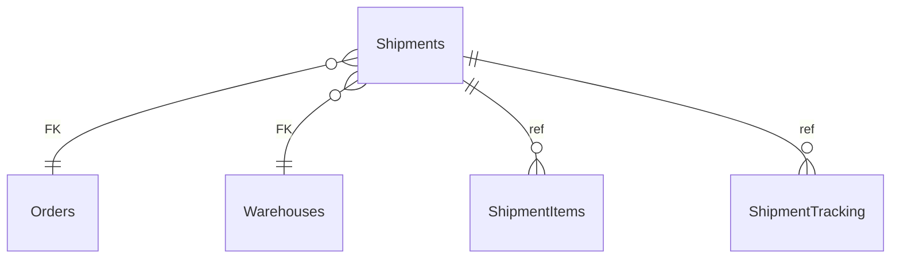

# Shipments

**Table:** `logistics.shipments`

**Base path:** `/shipments`

## Related Tables

### Parent Tables

_Tables this table references via foreign keys._

| Parent Table | FK Column | References | Link |
|-------------|-----------|------------|------|
| `orders` | `order_id` | `shipments_order_id_fkey` | [Orders](./orders) |
| `warehouses` | `warehouse_id` | `shipments_warehouse_id_fkey` | [Warehouses](./warehouses) |

### Child Tables

_Tables that reference this table via foreign keys._

| Child Table | FK Column | References | Link |
|------------|-----------|------------|------|
| `shipment_items` | `shipment_id` | `shipment_items_shipment_id_fkey` | [ShipmentItems](./shipment_items) |
| `shipment_tracking` | `shipment_id` | `shipment_tracking_shipment_id_fkey` | [ShipmentTracking](./shipment_tracking) |


## Entity Relationship Diagram



::::tabs

=== FullStack

## Columns

| # | Column | SQL Type | Go Type | TS Type | Nullable | Default | Constraints | Description |
|---|--------|----------|---------|---------|----------|---------|-------------|-------------|
| 1 | `id` | `uuid` | `uuid.UUID` | `string` | NO | `gen_random_uuid()` | `PK` | Primary key |
| 2 | `name` | `text` | `string` | `string` | NO | `''::text` | - | - |
| 3 | `tracking_number` | `text` | `string` | `string` | NO | `''::text` | - | - |
| 4 | `order_id` | `uuid` | `uuid.UUID` | `string` | NO | - | `FK` | → References `orders` |
| 5 | `warehouse_id` | `uuid` | `uuid.UUID` | `string` | NO | - | `FK` | → References `warehouses` |
| 6 | `carrier` | `text` | `string` | `string` | NO | `''::text` | - | - |
| 7 | `status` | `USER-DEFINED` | `LogisticsShipmentStatus` | `"preparing" \| "picked_up" \| "in_transit" \| "out_for_delivery" \| "delivered" \| "returned" \| "lost"` | NO | `'preparing'::logistics.shipment_status` | - | - |
| 8 | `weight_kg` | `numeric` | `float64` | `number` | YES | - | - | - |
| 9 | `shipped_at` | `timestamp with time zone` | `time.Time` | `string` | YES | - | - | - |
| 10 | `delivered_at` | `timestamp with time zone` | `time.Time` | `string` | YES | - | - | - |
| 11 | `estimated_delivery` | `date` | `time.Time` | `string` | YES | - | - | - |
| 12 | `shipping_cost` | `numeric` | `float64` | `number` | NO | `0.00` | - | - |
| 13 | `created_at` | `timestamp with time zone` | `time.Time` | `string` | NO | `now()` | - | Auto-filled from session |
| 14 | `updated_at` | `timestamp with time zone` | `time.Time` | `string` | NO | `now()` | - | Auto-filled from session |

## Primary Keys

- `id` (`uuid`)

## Foreign Keys & Relationships

| Column | References | Constraint |
|--------|-----------|------------|
| `order_id` | `orders` | `shipments_order_id_fkey` |
| `warehouse_id` | `warehouses` | `shipments_warehouse_id_fkey` |

## Enum Types

### ShipmentStatus

| Value | Go Constant |
|-------|-------------|
| `preparing` | `LogisticsShipmentStatusPreparing` |
| `picked_up` | `LogisticsShipmentStatusPickedUp` |
| `in_transit` | `LogisticsShipmentStatusInTransit` |
| `out_for_delivery` | `LogisticsShipmentStatusOutForDelivery` |
| `delivered` | `LogisticsShipmentStatusDelivered` |
| `returned` | `LogisticsShipmentStatusReturned` |
| `lost` | `LogisticsShipmentStatusLost` |


## Go Generated Code

> 📂 Source: [📄 `Shipments.go`](https://github.com/meftunca/data-bridge-examples/blob/main//logistics/structures/Shipments.go) · [📄 `Shipments.go`](https://github.com/meftunca/data-bridge-examples/blob/main//logistics/services/Shipments.go) · [📄 `Shipments.go`](https://github.com/meftunca/data-bridge-examples/blob/main//logistics/controllers/Shipments.go)

### Structs

:::tabs

== Form

#### ShipmentsForm [](https://github.com/meftunca/data-bridge-examples/blob/main//logistics/structures/Shipments.go#:~:text=type%20ShipmentsForm%20struct)

_Create payload — excludes auto-generated PK fields_

| Field | Go Type | JSON Key | Nullable |
|-------|---------|----------|----------|
| `Name` | `string` | `name` | NO |
| `TrackingNumber` | `string` | `trackingNumber` | NO |
| `OrderId` | `uuid.UUID` | `orderId` | NO |
| `WarehouseId` | `uuid.UUID` | `warehouseId` | NO |
| `Carrier` | `string` | `carrier` | NO |
| `Status` | `LogisticsShipmentStatus` | `status` | NO |
| `WeightKg` | `*float64` | `weightKg` | YES |
| `ShippedAt` | `*time.Time` | `shippedAt` | YES |
| `DeliveredAt` | `*time.Time` | `deliveredAt` | YES |
| `EstimatedDelivery` | `*time.Time` | `estimatedDelivery` | YES |
| `ShippingCost` | `float64` | `shippingCost` | NO |
| `CreatedAt` | `time.Time` | `createdAt` | NO |
| `UpdatedAt` | `time.Time` | `updatedAt` | NO |

== Model

#### Shipments [](https://github.com/meftunca/data-bridge-examples/blob/main//logistics/structures/Shipments.go#:~:text=type%20Shipments%20struct)

_Full model — all columns + GORM/JSON tags + preload relations_

| Field | Go Type | JSON Key | Nullable |
|-------|---------|----------|----------|
| `Id` | `uuid.UUID` | `id` | NO |
| `Name` | `string` | `name` | NO |
| `TrackingNumber` | `string` | `trackingNumber` | NO |
| `OrderId` | `uuid.UUID` | `orderId` | NO |
| `WarehouseId` | `uuid.UUID` | `warehouseId` | NO |
| `Carrier` | `string` | `carrier` | NO |
| `Status` | `LogisticsShipmentStatus` | `status` | NO |
| `WeightKg` | `*float64` | `weightKg` | YES |
| `ShippedAt` | `*time.Time` | `shippedAt` | YES |
| `DeliveredAt` | `*time.Time` | `deliveredAt` | YES |
| `EstimatedDelivery` | `*time.Time` | `estimatedDelivery` | YES |
| `ShippingCost` | `float64` | `shippingCost` | NO |
| `CreatedAt` | `time.Time` | `createdAt` | NO |
| `UpdatedAt` | `time.Time` | `updatedAt` | NO |

== Edit

#### ShipmentsEdit [](https://github.com/meftunca/data-bridge-examples/blob/main//logistics/structures/Shipments.go#:~:text=type%20ShipmentsEdit%20struct)

_Update payload — all fields are pointers (partial update)_

| Field | Go Type | JSON Key | Nullable |
|-------|---------|----------|----------|
| `Id` | `*uuid.UUID` | `id` | YES |
| `Name` | `*string` | `name` | YES |
| `TrackingNumber` | `*string` | `trackingNumber` | YES |
| `OrderId` | `*uuid.UUID` | `orderId` | YES |
| `WarehouseId` | `*uuid.UUID` | `warehouseId` | YES |
| `Carrier` | `*string` | `carrier` | YES |
| `Status` | `*LogisticsShipmentStatus` | `status` | YES |
| `WeightKg` | `*float64` | `weightKg` | YES |
| `ShippedAt` | `*time.Time` | `shippedAt` | YES |
| `DeliveredAt` | `*time.Time` | `deliveredAt` | YES |
| `EstimatedDelivery` | `*time.Time` | `estimatedDelivery` | YES |
| `ShippingCost` | `*float64` | `shippingCost` | YES |
| `CreatedAt` | `*time.Time` | `createdAt` | YES |
| `UpdatedAt` | `*time.Time` | `updatedAt` | YES |

== Filter

#### ShipmentsFilter [](https://github.com/meftunca/data-bridge-examples/blob/main//logistics/structures/Shipments.go#:~:text=type%20ShipmentsFilter%20struct)

_Query filter — all fields are pointers_

| Field | Go Type | JSON Key | Nullable |
|-------|---------|----------|----------|
| `Id` | `*uuid.UUID` | `id` | YES |
| `Name` | `*string` | `name` | YES |
| `TrackingNumber` | `*string` | `trackingNumber` | YES |
| `OrderId` | `*uuid.UUID` | `orderId` | YES |
| `WarehouseId` | `*uuid.UUID` | `warehouseId` | YES |
| `Carrier` | `*string` | `carrier` | YES |
| `Status` | `*LogisticsShipmentStatus` | `status` | YES |
| `WeightKg` | `*float64` | `weightKg` | YES |
| `ShippedAt` | `*time.Time` | `shippedAt` | YES |
| `DeliveredAt` | `*time.Time` | `deliveredAt` | YES |
| `EstimatedDelivery` | `*time.Time` | `estimatedDelivery` | YES |
| `ShippingCost` | `*float64` | `shippingCost` | YES |
| `CreatedAt` | `*time.Time` | `createdAt` | YES |
| `UpdatedAt` | `*time.Time` | `updatedAt` | YES |

== Page

#### ShipmentsPage [](https://github.com/meftunca/data-bridge-examples/blob/main//logistics/structures/Shipments.go#:~:text=type%20ShipmentsPage%20struct)

_Paginated response wrapper_

| Field | Go Type | JSON Key | Nullable |
|-------|---------|----------|----------|
| `Id` | `uuid.UUID` | `id` | NO |
| `Name` | `string` | `name` | NO |
| `TrackingNumber` | `string` | `trackingNumber` | NO |
| `OrderId` | `uuid.UUID` | `orderId` | NO |
| `WarehouseId` | `uuid.UUID` | `warehouseId` | NO |
| `Carrier` | `string` | `carrier` | NO |
| `Status` | `LogisticsShipmentStatus` | `status` | NO |
| `WeightKg` | `*float64` | `weightKg` | YES |
| `ShippedAt` | `*time.Time` | `shippedAt` | YES |
| `DeliveredAt` | `*time.Time` | `deliveredAt` | YES |
| `EstimatedDelivery` | `*time.Time` | `estimatedDelivery` | YES |
| `ShippingCost` | `float64` | `shippingCost` | NO |
| `CreatedAt` | `time.Time` | `createdAt` | NO |
| `UpdatedAt` | `time.Time` | `updatedAt` | NO |

== BatchUpdate

#### ShipmentsBatchUpdate [](https://github.com/meftunca/data-bridge-examples/blob/main//logistics/structures/Shipments.go#:~:text=type%20ShipmentsBatchUpdate%20struct)

```go
type ShipmentsBatchUpdate struct {
    Data       json.RawMessage `json:"data"`
    PathParams struct {
        Id uuid.UUID
    } `json:"pathParams"`
}
```

:::

### Service & Endpoints

:::tabs

== Service Methods

| Method | Signature |
|---------|-----------|
| [Create](https://github.com/meftunca/data-bridge-examples/blob/main//logistics/services/Shipments.go#:~:text=%29%20CreateShipments%28%29) | `(ShipmentsService) CreateShipments(data ShipmentsForm) (ShipmentsForm, error)` |
| [Create Multiple](https://github.com/meftunca/data-bridge-examples/blob/main//logistics/services/Shipments.go#:~:text=%29%20CreateShipmentsMultiple%28%29) | `(ShipmentsService) CreateShipmentsMultiple(data []ShipmentsForm) ([]ShipmentsForm, error)` |
| [Update](https://github.com/meftunca/data-bridge-examples/blob/main//logistics/services/Shipments.go#:~:text=%29%20UpdateShipments%28%29) | `(ShipmentsService) UpdateShipments(id uuid.UUID, data interface{}) error` |
| [Update Multiple](https://github.com/meftunca/data-bridge-examples/blob/main//logistics/services/Shipments.go#:~:text=%29%20UpdateShipmentsMultiple%28%29) | `(ShipmentsService) UpdateShipmentsMultiple(data []ShipmentsBatchUpdate) error` |
| [Delete](https://github.com/meftunca/data-bridge-examples/blob/main//logistics/services/Shipments.go#:~:text=%29%20DeleteShipments%28%29) | `(ShipmentsService) DeleteShipments(id uuid.UUID) error` |

== Endpoints

| Method | Path | Description |
|--------|------|-------------|
| `GET` | `/shipments/` | Search with query params |
| `GET` | `/shipments/pagination` | Paginated listing |
| `POST` | `/shipments/` | Create single record |
| `POST` | `/shipments/bulk/` | Create multiple records |
| `PUT` | `/shipments/bulk/` | Batch update |
| `GET` | `/shipments/with-id/:id` | Get by ID |
| `PUT` | `/shipments/with-id/:id` | Update by ID |
| `DELETE` | `/shipments/with-id/:id` | Delete by ID |

== Query & Filters

| Parameter | Type | Description |
|-----------|------|-------------|
| `page` | `int` | Page number (default: 1) |
| `size` | `int` | Items per page (default: 10) |
| `sort` | `string` | Sort field. Prefix `-` for descending. Example: `-created_at` |
| `fields` | `string` | Comma-separated column list to select |
| `preloads` | `string` | Comma-separated relation names to preload |
| `filters` | `array` | Filter rules: `[[field, op, value], ...]` |
| `groupby` | `string` | Group by field name |
| `aggregations` | `json` | Aggregation specs: `[{func,field,alias}]` |

**Filter Operators:** `eq` `neq` `gt` `gte` `lt` `lte` `in` `notin` `like` `ilike` `is` `isnot` `between`

:::

### RPC Functions

| Function | Parameters | Return | Endpoint |
|----------|-----------|--------|----------|
| `low_stock_count` | `p_warehouse_id uuid` | `integer` | `/rpc/low_stock_count` |
| `warehouse_utilization` | `p_warehouse_id uuid` | `numeric` | `/rpc/warehouse_utilization` |


=== Frontend

## TypeScript Types & Hooks

:::tabs

== Interfaces

```typescript
export type LogisticsShipmentStatus =
  | "preparing"
  | "picked_up"
  | "in_transit"
  | "out_for_delivery"
  | "delivered"
  | "returned"
  | "lost"

export const LogisticsShipmentStatusValues = ["preparing", "picked_up", "in_transit", "out_for_delivery", "delivered", "returned", "lost"] as const;

export interface Shipments {
  id: string;
  name: string;
  trackingNumber: string;
  orderId: string;
  warehouseId: string;
  carrier: string;
  status: LogisticsShipmentStatus;
  weightKg?: number;
  shippedAt?: string;
  deliveredAt?: string;
  estimatedDelivery?: string;
  shippingCost: number;
  createdAt: string;
  updatedAt: string;
}

export interface ShipmentsForm {
  name: string;
  trackingNumber: string;
  orderId: string;
  warehouseId: string;
  carrier: string;
  status: LogisticsShipmentStatus;
  weightKg?: number;
  shippedAt?: string;
  deliveredAt?: string;
  estimatedDelivery?: string;
  shippingCost: number;
  createdAt: string;
  updatedAt: string;
}

export interface ShipmentsEdit {
  id: string;
  name: string;
  trackingNumber: string;
  orderId: string;
  warehouseId: string;
  carrier: string;
  status: LogisticsShipmentStatus;
  weightKg?: number;
  shippedAt?: string;
  deliveredAt?: string;
  estimatedDelivery?: string;
  shippingCost: number;
  createdAt: string;
  updatedAt: string;
}

export interface ShipmentsPage {
  data: Shipments[];
  total: number;
  page: number;
  size: number;
  totalPages: number;
}

export type ShipmentsPathQuery = {
  page?: number;
  size?: number;
  sort?: string;
  fields?: string;
  preloads?: string;
  filters?: string;
};

```

== React Query

```typescript
import { useQuery, useMutation, useQueryClient } from "@tanstack/react-query";

const ShipmentsKeys = {
  all: ["shipments"] as const,
  lists: () => [...ShipmentsKeys.all, "list"] as const,
  detail: (id: any) => [...ShipmentsKeys.all, "detail", id] as const,
} as const;

export function useShipmentsList(query?: ShipmentsPathQuery) {
  return useQuery({
    queryKey: [...ShipmentsKeys.lists(), query],
    queryFn: () => fetch(`/shipments/pagination`, { method: "GET" }).then(r => r.json()) as Promise<ShipmentsPage>,
  });
}

export function useShipmentsDetail(id: any) {
  return useQuery({
    queryKey: ShipmentsKeys.detail(id),
    queryFn: () => fetch(`/shipments/with-id/:id`).then(r => r.json()) as Promise<Shipments>,
  });
}

export function useCreateShipments() {
  const qc = useQueryClient();
  return useMutation({
    mutationFn: (data: ShipmentsForm) =>
      fetch("/shipments/", { method: "POST", body: JSON.stringify(data) }).then(r => r.json()),
    onSuccess: () => qc.invalidateQueries({ queryKey: ShipmentsKeys.lists() }),
  });
}

export function useUpdateShipments() {
  const qc = useQueryClient();
  return useMutation({
    mutationFn: ({ id, data }: { id: any: any; data: ShipmentsEdit }) =>
      fetch(`/shipments/with-id/:id`, { method: "PUT", body: JSON.stringify(data) }).then(r => r.json()),
    onSuccess: () => qc.invalidateQueries({ queryKey: ShipmentsKeys.all }),
  });
}

export function useDeleteShipments() {
  const qc = useQueryClient();
  return useMutation({
    mutationFn: (id: any) =>
      fetch(`/shipments/with-id/:id`, { method: "DELETE" }).then(r => r.json()),
    onSuccess: () => qc.invalidateQueries({ queryKey: ShipmentsKeys.all }),
  });
}

```

== Zod Validation

```typescript
import { z } from "zod";

const LogisticsShipmentStatusSchema = z.enum(["preparing", "picked_up", "in_transit", "out_for_delivery", "delivered", "returned", "lost"]);

export const ShipmentsFormSchema = z.object({
  name: z.string(),
  trackingNumber: z.string(),
  orderId: z.string().uuid(),
  warehouseId: z.string().uuid(),
  carrier: z.string(),
  status: LogisticsShipmentStatusSchema,
  weightKg: z.number().optional(),
  shippedAt: z.string().datetime().optional(),
  deliveredAt: z.string().datetime().optional(),
  estimatedDelivery: z.string().datetime().optional(),
  shippingCost: z.number(),
  createdAt: z.string().datetime(),
  updatedAt: z.string().datetime(),
});

export type ShipmentsFormInput = z.infer<typeof ShipmentsFormSchema>;

```

:::


=== API

<script setup>
import { useOpenapi } from 'vitepress-openapi'
import spec from './shipments.openapi.json'
useOpenapi({ spec })
</script>


## API Reference

:::tabs

== Search

#### <Badge type="info" text="GET" /> Search Shipments

```
GET /api/v1/shipments/
```

> Retrieve list filtered by query parameters.

**Headers:**

| Header | Required | Description |
|--------|----------|-------------|
| `Authorization` | Yes | Bearer token |
| `x-company` | Yes | Company ID |

**Query Parameters:**

| Parameter | Type | Required | Description |
|-----------|------|----------|-------------|
| `size` | `integer` | No | Max results (default: 10) |
| `sort` | `string` | No | Sort field. Prefix `-` for DESC. e.g. `-created_at` |
| `fields` | `string` | No | Comma-separated columns to select |
| `preloads` | `string` | No | Available: ShipmentItemsList, ShipmentItemsList.ShipmentIdDetail, ShipmentItemsList.ShipmentIdDetail.ShipmentItemsList, ShipmentItemsList.ShipmentIdDetail.ShipmentTrackingList, ShipmentItemsList.ShipmentIdDetail.WarehouseIdDetail, ShipmentTrackingList, ShipmentTrackingList.ShipmentIdDetail, ShipmentTrackingList.ShipmentIdDetail.ShipmentItemsList, ShipmentTrackingList.ShipmentIdDetail.ShipmentTrackingList, ShipmentTrackingList.ShipmentIdDetail.WarehouseIdDetail, WarehouseIdDetail, WarehouseIdDetail.StorageZonesList, WarehouseIdDetail.StorageZonesList.StorageBinsList, WarehouseIdDetail.StorageZonesList.WarehouseIdDetail, WarehouseIdDetail.InventoryList, WarehouseIdDetail.InventoryList.StockMovementsList, WarehouseIdDetail.InventoryList.WarehouseIdDetail, WarehouseIdDetail.InventoryList.BinIdDetail, WarehouseIdDetail.PurchaseOrdersList, WarehouseIdDetail.PurchaseOrdersList.PurchaseOrderItemsList, WarehouseIdDetail.PurchaseOrdersList.SupplierIdDetail, WarehouseIdDetail.PurchaseOrdersList.WarehouseIdDetail, WarehouseIdDetail.ShipmentsList, WarehouseIdDetail.ShipmentsList.ShipmentItemsList, WarehouseIdDetail.ShipmentsList.ShipmentTrackingList, WarehouseIdDetail.ShipmentsList.WarehouseIdDetail |
| `joins` | `string` | No | Available: Orders, Warehouses, Warehouses.Organizations, Warehouses.Users |
| `id` | `string (uuid)` | No | Filter by id |
| `name` | `string` | No | Filter by name |
| `trackingNumber` | `string` | No | Filter by tracking_number |
| `orderId` | `string (uuid)` | No | Filter by order_id |
| `warehouseId` | `string (uuid)` | No | Filter by warehouse_id |
| `carrier` | `string` | No | Filter by carrier |
| `status` | `string` | No | Filter by status |
| `weightKg` | `number` | No | Filter by weight_kg |
| `shippedAt` | `string (date-time)` | No | Filter by shipped_at |
| `deliveredAt` | `string (date-time)` | No | Filter by delivered_at |
| `estimatedDelivery` | `string (date)` | No | Filter by estimated_delivery |
| `shippingCost` | `number` | No | Filter by shipping_cost |

**Response:** `Shipments[]`

<details>
<summary>curl example</summary>

```bash
curl -X GET \
  -H "Authorization: Bearer $TOKEN" \
  -H "x-company: $COMPANY_ID" \
  "http://localhost:3000/api/v1/shipments/"
```

</details>

---

#### <Badge type="tip" text="POST" /> Search Shipments (POST)

```
POST /api/v1/shipments/search
```

> Search with body filters. Auto-used when query string > 2KB.

**Headers:**

| Header | Required | Description |
|--------|----------|-------------|
| `Authorization` | Yes | Bearer token |
| `x-company` | Yes | Company ID |

**Request Body:**

```typescript
{
  size?: number  // e.g. 10
  sort?: string[]  // e.g. ["-createdAt"]
  filters?: FilterRule[]  // e.g. [["name", "eq", "value"]]
  fields?: string[]
  preloads?: string[]
}
```

**Response:** `Shipments[]`

<details>
<summary>curl example</summary>

```bash
curl -X POST \
  -H "Authorization: Bearer $TOKEN" \
  -H "x-company: $COMPANY_ID" \
  -H "Content-Type: application/json" \
  -d '{}' \
  "http://localhost:3000/api/v1/shipments/search"
```

</details>

---

== Pagination

#### <Badge type="info" text="GET" /> Paginate Shipments

```
GET /api/v1/shipments/pagination
```

> Paginated listing.

**Headers:**

| Header | Required | Description |
|--------|----------|-------------|
| `Authorization` | Yes | Bearer token |
| `x-company` | Yes | Company ID |

**Query Parameters:**

| Parameter | Type | Required | Description |
|-----------|------|----------|-------------|
| `page` | `integer` | No | Page number (default: 1) |
| `size` | `integer` | No | Max results (default: 10) |
| `sort` | `string` | No | Sort field. Prefix `-` for DESC. e.g. `-created_at` |
| `fields` | `string` | No | Comma-separated columns to select |
| `preloads` | `string` | No | Available: ShipmentItemsList, ShipmentItemsList.ShipmentIdDetail, ShipmentItemsList.ShipmentIdDetail.ShipmentItemsList, ShipmentItemsList.ShipmentIdDetail.ShipmentTrackingList, ShipmentItemsList.ShipmentIdDetail.WarehouseIdDetail, ShipmentTrackingList, ShipmentTrackingList.ShipmentIdDetail, ShipmentTrackingList.ShipmentIdDetail.ShipmentItemsList, ShipmentTrackingList.ShipmentIdDetail.ShipmentTrackingList, ShipmentTrackingList.ShipmentIdDetail.WarehouseIdDetail, WarehouseIdDetail, WarehouseIdDetail.StorageZonesList, WarehouseIdDetail.StorageZonesList.StorageBinsList, WarehouseIdDetail.StorageZonesList.WarehouseIdDetail, WarehouseIdDetail.InventoryList, WarehouseIdDetail.InventoryList.StockMovementsList, WarehouseIdDetail.InventoryList.WarehouseIdDetail, WarehouseIdDetail.InventoryList.BinIdDetail, WarehouseIdDetail.PurchaseOrdersList, WarehouseIdDetail.PurchaseOrdersList.PurchaseOrderItemsList, WarehouseIdDetail.PurchaseOrdersList.SupplierIdDetail, WarehouseIdDetail.PurchaseOrdersList.WarehouseIdDetail, WarehouseIdDetail.ShipmentsList, WarehouseIdDetail.ShipmentsList.ShipmentItemsList, WarehouseIdDetail.ShipmentsList.ShipmentTrackingList, WarehouseIdDetail.ShipmentsList.WarehouseIdDetail |
| `joins` | `string` | No | Available: Orders, Warehouses, Warehouses.Organizations, Warehouses.Users |
| `id` | `string (uuid)` | No | Filter by id |
| `name` | `string` | No | Filter by name |
| `trackingNumber` | `string` | No | Filter by tracking_number |
| `orderId` | `string (uuid)` | No | Filter by order_id |
| `warehouseId` | `string (uuid)` | No | Filter by warehouse_id |
| `carrier` | `string` | No | Filter by carrier |
| `status` | `string` | No | Filter by status |
| `weightKg` | `number` | No | Filter by weight_kg |
| `shippedAt` | `string (date-time)` | No | Filter by shipped_at |
| `deliveredAt` | `string (date-time)` | No | Filter by delivered_at |
| `estimatedDelivery` | `string (date)` | No | Filter by estimated_delivery |
| `shippingCost` | `number` | No | Filter by shipping_cost |

**Response:** `PaginationResponse<Shipments>`

<details>
<summary>curl example</summary>

```bash
curl -X GET \
  -H "Authorization: Bearer $TOKEN" \
  -H "x-company: $COMPANY_ID" \
  "http://localhost:3000/api/v1/shipments/pagination"
```

</details>

---

#### <Badge type="tip" text="POST" /> Paginate Shipments (POST)

```
POST /api/v1/shipments/pagination
```

> Paginated listing with body filters.

**Headers:**

| Header | Required | Description |
|--------|----------|-------------|
| `Authorization` | Yes | Bearer token |
| `x-company` | Yes | Company ID |

**Request Body:**

```typescript
{
  page?: number  // e.g. 1
  size?: number  // e.g. 10
  sort?: string[]  // e.g. ["-createdAt"]
  filters?: FilterRule[]  // e.g. [["name", "eq", "value"]]
  fields?: string[]
  preloads?: string[]
}
```

**Response:** `PaginationResponse<Shipments>`

<details>
<summary>curl example</summary>

```bash
curl -X POST \
  -H "Authorization: Bearer $TOKEN" \
  -H "x-company: $COMPANY_ID" \
  -H "Content-Type: application/json" \
  -d '{}' \
  "http://localhost:3000/api/v1/shipments/pagination"
```

</details>

---

== Create

#### <Badge type="tip" text="POST" /> Create Shipments

```
POST /api/v1/shipments/
```

> Create a new record.

**Headers:**

| Header | Required | Description |
|--------|----------|-------------|
| `Authorization` | Yes | Bearer token |
| `x-company` | Yes | Company ID |

**Request Body:**

```typescript
{
  name?: string  // e.g. example_name
  trackingNumber?: string  // e.g. example_tracking_number
  orderId: string  // e.g. 550e8400-e29b-41d4-a716-446655440000
  warehouseId: string  // e.g. 550e8400-e29b-41d4-a716-446655440000
  carrier?: string  // e.g. example_carrier
  status?: "preparing" | "picked_up" | "in_transit" | "out_for_delivery" | "delivered" | "returned" | "lost"  // e.g. preparing
  weightKg?: number  // e.g. 99.99
  shippedAt?: string  // e.g. 2026-01-15T10:30:00Z
  deliveredAt?: string  // e.g. 2026-01-15T10:30:00Z
  estimatedDelivery?: string  // e.g. 2026-01-15
  shippingCost?: number  // e.g. 99.99
}
```

**Response:** `Shipments`

<details>
<summary>curl example</summary>

```bash
curl -X POST \
  -H "Authorization: Bearer $TOKEN" \
  -H "x-company: $COMPANY_ID" \
  -H "Content-Type: application/json" \
  -d '{}' \
  "http://localhost:3000/api/v1/shipments/"
```

</details>

---

#### <Badge type="tip" text="POST" /> Bulk Create Shipments

```
POST /api/v1/shipments/bulk/
```

> Create multiple records in one request.

**Headers:**

| Header | Required | Description |
|--------|----------|-------------|
| `Authorization` | Yes | Bearer token |
| `x-company` | Yes | Company ID |

**Request Body:**

```typescript
{
  name?: string  // e.g. example_name
  trackingNumber?: string  // e.g. example_tracking_number
  orderId: string  // e.g. 550e8400-e29b-41d4-a716-446655440000
  warehouseId: string  // e.g. 550e8400-e29b-41d4-a716-446655440000
  carrier?: string  // e.g. example_carrier
  status?: "preparing" | "picked_up" | "in_transit" | "out_for_delivery" | "delivered" | "returned" | "lost"  // e.g. preparing
  weightKg?: number  // e.g. 99.99
  shippedAt?: string  // e.g. 2026-01-15T10:30:00Z
  deliveredAt?: string  // e.g. 2026-01-15T10:30:00Z
  estimatedDelivery?: string  // e.g. 2026-01-15
  shippingCost?: number  // e.g. 99.99
}
```

**Response:** `Shipments[]`

<details>
<summary>curl example</summary>

```bash
curl -X POST \
  -H "Authorization: Bearer $TOKEN" \
  -H "x-company: $COMPANY_ID" \
  -H "Content-Type: application/json" \
  -d '{}' \
  "http://localhost:3000/api/v1/shipments/bulk/"
```

</details>

---

== Find & Update

#### <Badge type="info" text="GET" /> Find Shipments by ID

```
GET /api/v1/shipments/with-id/:id
```

> Retrieve a single record by primary key.

**Headers:**

| Header | Required | Description |
|--------|----------|-------------|
| `Authorization` | Yes | Bearer token |
| `x-company` | Yes | Company ID |

**Query Parameters:**

| Parameter | Type | Required | Description |
|-----------|------|----------|-------------|
| `Id` | `string (uuid)` | Yes | Primary key (uuid) |

**Response:** `Shipments`

<details>
<summary>curl example</summary>

```bash
curl -X GET \
  -H "Authorization: Bearer $TOKEN" \
  -H "x-company: $COMPANY_ID" \
  "http://localhost:3000/api/v1/shipments/with-id/:id"
```

</details>

---

#### <Badge type="warning" text="PUT" /> Update Shipments

```
PUT /api/v1/shipments/with-id/:id
```

> Partial update — send only the fields to change.

**Headers:**

| Header | Required | Description |
|--------|----------|-------------|
| `Authorization` | Yes | Bearer token |
| `x-company` | Yes | Company ID |

**Query Parameters:**

| Parameter | Type | Required | Description |
|-----------|------|----------|-------------|
| `Id` | `string (uuid)` | Yes | Primary key (uuid) |

**Request Body:**

```typescript
{
  name?: string
  trackingNumber?: string
  orderId?: string
  warehouseId?: string
  carrier?: string
  status?: "preparing" | "picked_up" | "in_transit" | "out_for_delivery" | "delivered" | "returned" | "lost"
  weightKg?: number
  shippedAt?: string
  deliveredAt?: string
  estimatedDelivery?: string
  shippingCost?: number
}
```

**Response:** `Success`

<details>
<summary>curl example</summary>

```bash
curl -X PUT \
  -H "Authorization: Bearer $TOKEN" \
  -H "x-company: $COMPANY_ID" \
  -H "Content-Type: application/json" \
  -d '{}' \
  "http://localhost:3000/api/v1/shipments/with-id/:id"
```

</details>

---

#### <Badge type="warning" text="PUT" /> Bulk Update Shipments

```
PUT /api/v1/shipments/bulk/
```

> Batch update multiple records.

**Headers:**

| Header | Required | Description |
|--------|----------|-------------|
| `Authorization` | Yes | Bearer token |
| `x-company` | Yes | Company ID |

**Request Body:** Array of { pathParams, data: ShipmentsEdit }

**Response:** `Success`

<details>
<summary>curl example</summary>

```bash
curl -X PUT \
  -H "Authorization: Bearer $TOKEN" \
  -H "x-company: $COMPANY_ID" \
  -H "Content-Type: application/json" \
  -d '{}' \
  "http://localhost:3000/api/v1/shipments/bulk/"
```

</details>

---

== Delete

#### <Badge type="danger" text="DELETE" /> Delete Shipments

```
DELETE /api/v1/shipments/with-id/:id
```

> Soft-delete (sets deleted_at + deleted_by).

**Headers:**

| Header | Required | Description |
|--------|----------|-------------|
| `Authorization` | Yes | Bearer token |
| `x-company` | Yes | Company ID |

**Query Parameters:**

| Parameter | Type | Required | Description |
|-----------|------|----------|-------------|
| `Id` | `string (uuid)` | Yes | Primary key (uuid) |

**Response:** `Success`

<details>
<summary>curl example</summary>

```bash
curl -X DELETE \
  -H "Authorization: Bearer $TOKEN" \
  -H "x-company: $COMPANY_ID" \
  "http://localhost:3000/api/v1/shipments/with-id/:id"
```

</details>

---

:::


::::
