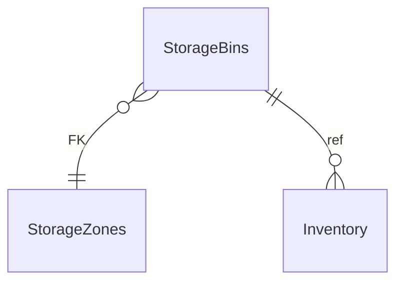

# StorageBins

**Table:** `logistics.storage_bins`

**Base path:** `/storage-bins`

## Related Tables

### Parent Tables

_Tables this table references via foreign keys._

| Parent Table | FK Column | References | Link |
|-------------|-----------|------------|------|
| `storage_zones` | `zone_id` | `storage_bins_zone_id_fkey` | [StorageZones](./storage_zones) |

### Child Tables

_Tables that reference this table via foreign keys._

| Child Table | FK Column | References | Link |
|------------|-----------|------------|------|
| `inventory` | `bin_id` | `inventory_bin_id_fkey` | [Inventory](./inventory) |


## Entity Relationship Diagram



::::tabs

=== FullStack

## Columns

| # | Column | SQL Type | Go Type | TS Type | Nullable | Default | Constraints | Description |
|---|--------|----------|---------|---------|----------|---------|-------------|-------------|
| 1 | `id` | `uuid` | `uuid.UUID` | `string` | NO | `gen_random_uuid()` | `PK` | Primary key |
| 2 | `name` | `text` | `string` | `string` | NO | - | - | - |
| 3 | `zone_id` | `uuid` | `uuid.UUID` | `string` | NO | - | `FK` | → References `storage_zones` |
| 4 | `bin_code` | `text` | `string` | `string` | NO | `'B001'::text` | - | - |
| 5 | `max_capacity` | `integer` | `int` | `number` | NO | `100` | - | - |
| 6 | `current_count` | `integer` | `int` | `number` | NO | `0` | - | - |
| 7 | `created_at` | `timestamp with time zone` | `time.Time` | `string` | NO | `now()` | - | Auto-filled from session |
| 8 | `updated_at` | `timestamp with time zone` | `time.Time` | `string` | NO | `now()` | - | Auto-filled from session |

## Primary Keys

- `id` (`uuid`)

## Foreign Keys & Relationships

| Column | References | Constraint |
|--------|-----------|------------|
| `zone_id` | `storage_zones` | `storage_bins_zone_id_fkey` |


## Go Generated Code

> 📂 Source: [📄 `StorageBins.go`](https://github.com/meftunca/data-bridge-examples/blob/main//logistics/structures/StorageBins.go) · [📄 `StorageBins.go`](https://github.com/meftunca/data-bridge-examples/blob/main//logistics/services/StorageBins.go) · [📄 `StorageBins.go`](https://github.com/meftunca/data-bridge-examples/blob/main//logistics/controllers/StorageBins.go)

### Structs

:::tabs

== Form

#### StorageBinsForm [](https://github.com/meftunca/data-bridge-examples/blob/main//logistics/structures/StorageBins.go#:~:text=type%20StorageBinsForm%20struct)

_Create payload — excludes auto-generated PK fields_

| Field | Go Type | JSON Key | Nullable |
|-------|---------|----------|----------|
| `Name` | `string` | `name` | NO |
| `ZoneId` | `uuid.UUID` | `zoneId` | NO |
| `BinCode` | `string` | `binCode` | NO |
| `MaxCapacity` | `int` | `maxCapacity` | NO |
| `CurrentCount` | `int` | `currentCount` | NO |
| `CreatedAt` | `time.Time` | `createdAt` | NO |
| `UpdatedAt` | `time.Time` | `updatedAt` | NO |

== Model

#### StorageBins [](https://github.com/meftunca/data-bridge-examples/blob/main//logistics/structures/StorageBins.go#:~:text=type%20StorageBins%20struct)

_Full model — all columns + GORM/JSON tags + preload relations_

| Field | Go Type | JSON Key | Nullable |
|-------|---------|----------|----------|
| `Id` | `uuid.UUID` | `id` | NO |
| `Name` | `string` | `name` | NO |
| `ZoneId` | `uuid.UUID` | `zoneId` | NO |
| `BinCode` | `string` | `binCode` | NO |
| `MaxCapacity` | `int` | `maxCapacity` | NO |
| `CurrentCount` | `int` | `currentCount` | NO |
| `CreatedAt` | `time.Time` | `createdAt` | NO |
| `UpdatedAt` | `time.Time` | `updatedAt` | NO |

== Edit

#### StorageBinsEdit [](https://github.com/meftunca/data-bridge-examples/blob/main//logistics/structures/StorageBins.go#:~:text=type%20StorageBinsEdit%20struct)

_Update payload — all fields are pointers (partial update)_

| Field | Go Type | JSON Key | Nullable |
|-------|---------|----------|----------|
| `Id` | `*uuid.UUID` | `id` | YES |
| `Name` | `*string` | `name` | YES |
| `ZoneId` | `*uuid.UUID` | `zoneId` | YES |
| `BinCode` | `*string` | `binCode` | YES |
| `MaxCapacity` | `*int` | `maxCapacity` | YES |
| `CurrentCount` | `*int` | `currentCount` | YES |
| `CreatedAt` | `*time.Time` | `createdAt` | YES |
| `UpdatedAt` | `*time.Time` | `updatedAt` | YES |

== Filter

#### StorageBinsFilter [](https://github.com/meftunca/data-bridge-examples/blob/main//logistics/structures/StorageBins.go#:~:text=type%20StorageBinsFilter%20struct)

_Query filter — all fields are pointers_

| Field | Go Type | JSON Key | Nullable |
|-------|---------|----------|----------|
| `Id` | `*uuid.UUID` | `id` | YES |
| `Name` | `*string` | `name` | YES |
| `ZoneId` | `*uuid.UUID` | `zoneId` | YES |
| `BinCode` | `*string` | `binCode` | YES |
| `MaxCapacity` | `*int` | `maxCapacity` | YES |
| `CurrentCount` | `*int` | `currentCount` | YES |
| `CreatedAt` | `*time.Time` | `createdAt` | YES |
| `UpdatedAt` | `*time.Time` | `updatedAt` | YES |

== Page

#### StorageBinsPage [](https://github.com/meftunca/data-bridge-examples/blob/main//logistics/structures/StorageBins.go#:~:text=type%20StorageBinsPage%20struct)

_Paginated response wrapper_

| Field | Go Type | JSON Key | Nullable |
|-------|---------|----------|----------|
| `Id` | `uuid.UUID` | `id` | NO |
| `Name` | `string` | `name` | NO |
| `ZoneId` | `uuid.UUID` | `zoneId` | NO |
| `BinCode` | `string` | `binCode` | NO |
| `MaxCapacity` | `int` | `maxCapacity` | NO |
| `CurrentCount` | `int` | `currentCount` | NO |
| `CreatedAt` | `time.Time` | `createdAt` | NO |
| `UpdatedAt` | `time.Time` | `updatedAt` | NO |

== BatchUpdate

#### StorageBinsBatchUpdate [](https://github.com/meftunca/data-bridge-examples/blob/main//logistics/structures/StorageBins.go#:~:text=type%20StorageBinsBatchUpdate%20struct)

```go
type StorageBinsBatchUpdate struct {
    Data       json.RawMessage `json:"data"`
    PathParams struct {
        Id uuid.UUID
    } `json:"pathParams"`
}
```

:::

### Service & Endpoints

:::tabs

== Service Methods

| Method | Signature |
|---------|-----------|
| [Create](https://github.com/meftunca/data-bridge-examples/blob/main//logistics/services/StorageBins.go#:~:text=%29%20CreateStorageBins%28%29) | `(StorageBinsService) CreateStorageBins(data StorageBinsForm) (StorageBinsForm, error)` |
| [Create Multiple](https://github.com/meftunca/data-bridge-examples/blob/main//logistics/services/StorageBins.go#:~:text=%29%20CreateStorageBinsMultiple%28%29) | `(StorageBinsService) CreateStorageBinsMultiple(data []StorageBinsForm) ([]StorageBinsForm, error)` |
| [Update](https://github.com/meftunca/data-bridge-examples/blob/main//logistics/services/StorageBins.go#:~:text=%29%20UpdateStorageBins%28%29) | `(StorageBinsService) UpdateStorageBins(id uuid.UUID, data interface{}) error` |
| [Update Multiple](https://github.com/meftunca/data-bridge-examples/blob/main//logistics/services/StorageBins.go#:~:text=%29%20UpdateStorageBinsMultiple%28%29) | `(StorageBinsService) UpdateStorageBinsMultiple(data []StorageBinsBatchUpdate) error` |
| [Delete](https://github.com/meftunca/data-bridge-examples/blob/main//logistics/services/StorageBins.go#:~:text=%29%20DeleteStorageBins%28%29) | `(StorageBinsService) DeleteStorageBins(id uuid.UUID) error` |

== Endpoints

| Method | Path | Description |
|--------|------|-------------|
| `GET` | `/storage-bins/` | Search with query params |
| `GET` | `/storage-bins/pagination` | Paginated listing |
| `POST` | `/storage-bins/` | Create single record |
| `POST` | `/storage-bins/bulk/` | Create multiple records |
| `PUT` | `/storage-bins/bulk/` | Batch update |
| `GET` | `/storage-bins/with-id/:id` | Get by ID |
| `PUT` | `/storage-bins/with-id/:id` | Update by ID |
| `DELETE` | `/storage-bins/with-id/:id` | Delete by ID |

== Query & Filters

| Parameter | Type | Description |
|-----------|------|-------------|
| `page` | `int` | Page number (default: 1) |
| `size` | `int` | Items per page (default: 10) |
| `sort` | `string` | Sort field. Prefix `-` for descending. Example: `-created_at` |
| `fields` | `string` | Comma-separated column list to select |
| `preloads` | `string` | Comma-separated relation names to preload |
| `filters` | `array` | Filter rules: `[[field, op, value], ...]` |
| `groupby` | `string` | Group by field name |
| `aggregations` | `json` | Aggregation specs: `[{func,field,alias}]` |

**Filter Operators:** `eq` `neq` `gt` `gte` `lt` `lte` `in` `notin` `like` `ilike` `is` `isnot` `between`

:::

### RPC Functions

| Function | Parameters | Return | Endpoint |
|----------|-----------|--------|----------|
| `low_stock_count` | `p_warehouse_id uuid` | `integer` | `/rpc/low_stock_count` |
| `warehouse_utilization` | `p_warehouse_id uuid` | `numeric` | `/rpc/warehouse_utilization` |


=== Frontend

## TypeScript Types & Hooks

:::tabs

== Interfaces

```typescript
export interface StorageBins {
  id: string;
  name: string;
  zoneId: string;
  binCode: string;
  maxCapacity: number;
  currentCount: number;
  createdAt: string;
  updatedAt: string;
}

export interface StorageBinsForm {
  name: string;
  zoneId: string;
  binCode: string;
  maxCapacity: number;
  currentCount: number;
  createdAt: string;
  updatedAt: string;
}

export interface StorageBinsEdit {
  id: string;
  name: string;
  zoneId: string;
  binCode: string;
  maxCapacity: number;
  currentCount: number;
  createdAt: string;
  updatedAt: string;
}

export interface StorageBinsPage {
  data: StorageBins[];
  total: number;
  page: number;
  size: number;
  totalPages: number;
}

export type StorageBinsPathQuery = {
  page?: number;
  size?: number;
  sort?: string;
  fields?: string;
  preloads?: string;
  filters?: string;
};

```

== React Query

```typescript
import { useQuery, useMutation, useQueryClient } from "@tanstack/react-query";

const StorageBinsKeys = {
  all: ["storage_bins"] as const,
  lists: () => [...StorageBinsKeys.all, "list"] as const,
  detail: (id: any) => [...StorageBinsKeys.all, "detail", id] as const,
} as const;

export function useStorageBinsList(query?: StorageBinsPathQuery) {
  return useQuery({
    queryKey: [...StorageBinsKeys.lists(), query],
    queryFn: () => fetch(`/storage-bins/pagination`, { method: "GET" }).then(r => r.json()) as Promise<StorageBinsPage>,
  });
}

export function useStorageBinsDetail(id: any) {
  return useQuery({
    queryKey: StorageBinsKeys.detail(id),
    queryFn: () => fetch(`/storage-bins/with-id/:id`).then(r => r.json()) as Promise<StorageBins>,
  });
}

export function useCreateStorageBins() {
  const qc = useQueryClient();
  return useMutation({
    mutationFn: (data: StorageBinsForm) =>
      fetch("/storage-bins/", { method: "POST", body: JSON.stringify(data) }).then(r => r.json()),
    onSuccess: () => qc.invalidateQueries({ queryKey: StorageBinsKeys.lists() }),
  });
}

export function useUpdateStorageBins() {
  const qc = useQueryClient();
  return useMutation({
    mutationFn: ({ id, data }: { id: any: any; data: StorageBinsEdit }) =>
      fetch(`/storage-bins/with-id/:id`, { method: "PUT", body: JSON.stringify(data) }).then(r => r.json()),
    onSuccess: () => qc.invalidateQueries({ queryKey: StorageBinsKeys.all }),
  });
}

export function useDeleteStorageBins() {
  const qc = useQueryClient();
  return useMutation({
    mutationFn: (id: any) =>
      fetch(`/storage-bins/with-id/:id`, { method: "DELETE" }).then(r => r.json()),
    onSuccess: () => qc.invalidateQueries({ queryKey: StorageBinsKeys.all }),
  });
}

```

== Zod Validation

```typescript
import { z } from "zod";

export const StorageBinsFormSchema = z.object({
  name: z.string(),
  zoneId: z.string().uuid(),
  binCode: z.string(),
  maxCapacity: z.number().int(),
  currentCount: z.number().int(),
  createdAt: z.string().datetime(),
  updatedAt: z.string().datetime(),
});

export type StorageBinsFormInput = z.infer<typeof StorageBinsFormSchema>;

```

:::


=== API

<script setup>
import { useOpenapi } from 'vitepress-openapi'
import spec from './storage_bins.openapi.json'
useOpenapi({ spec })
</script>


## API Reference

:::tabs

== Search

#### <Badge type="info" text="GET" /> Search StorageBins

```
GET /api/v1/storage-bins/
```

> Retrieve list filtered by query parameters.

**Headers:**

| Header | Required | Description |
|--------|----------|-------------|
| `Authorization` | Yes | Bearer token |
| `x-company` | Yes | Company ID |

**Query Parameters:**

| Parameter | Type | Required | Description |
|-----------|------|----------|-------------|
| `size` | `integer` | No | Max results (default: 10) |
| `sort` | `string` | No | Sort field. Prefix `-` for DESC. e.g. `-created_at` |
| `fields` | `string` | No | Comma-separated columns to select |
| `preloads` | `string` | No | Available: InventoryList, InventoryList.StockMovementsList, InventoryList.StockMovementsList.InventoryIdDetail, InventoryList.WarehouseIdDetail, InventoryList.WarehouseIdDetail.StorageZonesList, InventoryList.WarehouseIdDetail.InventoryList, InventoryList.WarehouseIdDetail.PurchaseOrdersList, InventoryList.WarehouseIdDetail.ShipmentsList, InventoryList.BinIdDetail, InventoryList.BinIdDetail.InventoryList, InventoryList.BinIdDetail.ZoneIdDetail, ZoneIdDetail, ZoneIdDetail.StorageBinsList, ZoneIdDetail.StorageBinsList.InventoryList, ZoneIdDetail.StorageBinsList.ZoneIdDetail, ZoneIdDetail.WarehouseIdDetail, ZoneIdDetail.WarehouseIdDetail.StorageZonesList, ZoneIdDetail.WarehouseIdDetail.InventoryList, ZoneIdDetail.WarehouseIdDetail.PurchaseOrdersList, ZoneIdDetail.WarehouseIdDetail.ShipmentsList |
| `joins` | `string` | No | Available: StorageZones, StorageZones.Warehouses, StorageZones.Warehouses.Organizations, StorageZones.Warehouses.Users |
| `id` | `string (uuid)` | No | Filter by id |
| `name` | `string` | No | Filter by name |
| `zoneId` | `string (uuid)` | No | Filter by zone_id |
| `binCode` | `string` | No | Filter by bin_code |
| `maxCapacity` | `integer` | No | Filter by max_capacity |
| `currentCount` | `integer` | No | Filter by current_count |

**Response:** `StorageBins[]`

<details>
<summary>curl example</summary>

```bash
curl -X GET \
  -H "Authorization: Bearer $TOKEN" \
  -H "x-company: $COMPANY_ID" \
  "http://localhost:3000/api/v1/storage-bins/"
```

</details>

---

#### <Badge type="tip" text="POST" /> Search StorageBins (POST)

```
POST /api/v1/storage-bins/search
```

> Search with body filters. Auto-used when query string > 2KB.

**Headers:**

| Header | Required | Description |
|--------|----------|-------------|
| `Authorization` | Yes | Bearer token |
| `x-company` | Yes | Company ID |

**Request Body:**

```typescript
{
  size?: number  // e.g. 10
  sort?: string[]  // e.g. ["-createdAt"]
  filters?: FilterRule[]  // e.g. [["name", "eq", "value"]]
  fields?: string[]
  preloads?: string[]
}
```

**Response:** `StorageBins[]`

<details>
<summary>curl example</summary>

```bash
curl -X POST \
  -H "Authorization: Bearer $TOKEN" \
  -H "x-company: $COMPANY_ID" \
  -H "Content-Type: application/json" \
  -d '{}' \
  "http://localhost:3000/api/v1/storage-bins/search"
```

</details>

---

== Pagination

#### <Badge type="info" text="GET" /> Paginate StorageBins

```
GET /api/v1/storage-bins/pagination
```

> Paginated listing.

**Headers:**

| Header | Required | Description |
|--------|----------|-------------|
| `Authorization` | Yes | Bearer token |
| `x-company` | Yes | Company ID |

**Query Parameters:**

| Parameter | Type | Required | Description |
|-----------|------|----------|-------------|
| `page` | `integer` | No | Page number (default: 1) |
| `size` | `integer` | No | Max results (default: 10) |
| `sort` | `string` | No | Sort field. Prefix `-` for DESC. e.g. `-created_at` |
| `fields` | `string` | No | Comma-separated columns to select |
| `preloads` | `string` | No | Available: InventoryList, InventoryList.StockMovementsList, InventoryList.StockMovementsList.InventoryIdDetail, InventoryList.WarehouseIdDetail, InventoryList.WarehouseIdDetail.StorageZonesList, InventoryList.WarehouseIdDetail.InventoryList, InventoryList.WarehouseIdDetail.PurchaseOrdersList, InventoryList.WarehouseIdDetail.ShipmentsList, InventoryList.BinIdDetail, InventoryList.BinIdDetail.InventoryList, InventoryList.BinIdDetail.ZoneIdDetail, ZoneIdDetail, ZoneIdDetail.StorageBinsList, ZoneIdDetail.StorageBinsList.InventoryList, ZoneIdDetail.StorageBinsList.ZoneIdDetail, ZoneIdDetail.WarehouseIdDetail, ZoneIdDetail.WarehouseIdDetail.StorageZonesList, ZoneIdDetail.WarehouseIdDetail.InventoryList, ZoneIdDetail.WarehouseIdDetail.PurchaseOrdersList, ZoneIdDetail.WarehouseIdDetail.ShipmentsList |
| `joins` | `string` | No | Available: StorageZones, StorageZones.Warehouses, StorageZones.Warehouses.Organizations, StorageZones.Warehouses.Users |
| `id` | `string (uuid)` | No | Filter by id |
| `name` | `string` | No | Filter by name |
| `zoneId` | `string (uuid)` | No | Filter by zone_id |
| `binCode` | `string` | No | Filter by bin_code |
| `maxCapacity` | `integer` | No | Filter by max_capacity |
| `currentCount` | `integer` | No | Filter by current_count |

**Response:** `PaginationResponse<StorageBins>`

<details>
<summary>curl example</summary>

```bash
curl -X GET \
  -H "Authorization: Bearer $TOKEN" \
  -H "x-company: $COMPANY_ID" \
  "http://localhost:3000/api/v1/storage-bins/pagination"
```

</details>

---

#### <Badge type="tip" text="POST" /> Paginate StorageBins (POST)

```
POST /api/v1/storage-bins/pagination
```

> Paginated listing with body filters.

**Headers:**

| Header | Required | Description |
|--------|----------|-------------|
| `Authorization` | Yes | Bearer token |
| `x-company` | Yes | Company ID |

**Request Body:**

```typescript
{
  page?: number  // e.g. 1
  size?: number  // e.g. 10
  sort?: string[]  // e.g. ["-createdAt"]
  filters?: FilterRule[]  // e.g. [["name", "eq", "value"]]
  fields?: string[]
  preloads?: string[]
}
```

**Response:** `PaginationResponse<StorageBins>`

<details>
<summary>curl example</summary>

```bash
curl -X POST \
  -H "Authorization: Bearer $TOKEN" \
  -H "x-company: $COMPANY_ID" \
  -H "Content-Type: application/json" \
  -d '{}' \
  "http://localhost:3000/api/v1/storage-bins/pagination"
```

</details>

---

== Create

#### <Badge type="tip" text="POST" /> Create StorageBins

```
POST /api/v1/storage-bins/
```

> Create a new record.

**Headers:**

| Header | Required | Description |
|--------|----------|-------------|
| `Authorization` | Yes | Bearer token |
| `x-company` | Yes | Company ID |

**Request Body:**

```typescript
{
  name: string  // e.g. example_name
  zoneId: string  // e.g. 550e8400-e29b-41d4-a716-446655440000
  binCode?: string  // e.g. example_bin_code
  maxCapacity?: number  // e.g. 1
  currentCount?: number  // e.g. 1
}
```

**Response:** `StorageBins`

<details>
<summary>curl example</summary>

```bash
curl -X POST \
  -H "Authorization: Bearer $TOKEN" \
  -H "x-company: $COMPANY_ID" \
  -H "Content-Type: application/json" \
  -d '{}' \
  "http://localhost:3000/api/v1/storage-bins/"
```

</details>

---

#### <Badge type="tip" text="POST" /> Bulk Create StorageBins

```
POST /api/v1/storage-bins/bulk/
```

> Create multiple records in one request.

**Headers:**

| Header | Required | Description |
|--------|----------|-------------|
| `Authorization` | Yes | Bearer token |
| `x-company` | Yes | Company ID |

**Request Body:**

```typescript
{
  name: string  // e.g. example_name
  zoneId: string  // e.g. 550e8400-e29b-41d4-a716-446655440000
  binCode?: string  // e.g. example_bin_code
  maxCapacity?: number  // e.g. 1
  currentCount?: number  // e.g. 1
}
```

**Response:** `StorageBins[]`

<details>
<summary>curl example</summary>

```bash
curl -X POST \
  -H "Authorization: Bearer $TOKEN" \
  -H "x-company: $COMPANY_ID" \
  -H "Content-Type: application/json" \
  -d '{}' \
  "http://localhost:3000/api/v1/storage-bins/bulk/"
```

</details>

---

== Find & Update

#### <Badge type="info" text="GET" /> Find StorageBins by ID

```
GET /api/v1/storage-bins/with-id/:id
```

> Retrieve a single record by primary key.

**Headers:**

| Header | Required | Description |
|--------|----------|-------------|
| `Authorization` | Yes | Bearer token |
| `x-company` | Yes | Company ID |

**Query Parameters:**

| Parameter | Type | Required | Description |
|-----------|------|----------|-------------|
| `Id` | `string (uuid)` | Yes | Primary key (uuid) |

**Response:** `StorageBins`

<details>
<summary>curl example</summary>

```bash
curl -X GET \
  -H "Authorization: Bearer $TOKEN" \
  -H "x-company: $COMPANY_ID" \
  "http://localhost:3000/api/v1/storage-bins/with-id/:id"
```

</details>

---

#### <Badge type="warning" text="PUT" /> Update StorageBins

```
PUT /api/v1/storage-bins/with-id/:id
```

> Partial update — send only the fields to change.

**Headers:**

| Header | Required | Description |
|--------|----------|-------------|
| `Authorization` | Yes | Bearer token |
| `x-company` | Yes | Company ID |

**Query Parameters:**

| Parameter | Type | Required | Description |
|-----------|------|----------|-------------|
| `Id` | `string (uuid)` | Yes | Primary key (uuid) |

**Request Body:**

```typescript
{
  name?: string
  zoneId?: string
  binCode?: string
  maxCapacity?: number
  currentCount?: number
}
```

**Response:** `Success`

<details>
<summary>curl example</summary>

```bash
curl -X PUT \
  -H "Authorization: Bearer $TOKEN" \
  -H "x-company: $COMPANY_ID" \
  -H "Content-Type: application/json" \
  -d '{}' \
  "http://localhost:3000/api/v1/storage-bins/with-id/:id"
```

</details>

---

#### <Badge type="warning" text="PUT" /> Bulk Update StorageBins

```
PUT /api/v1/storage-bins/bulk/
```

> Batch update multiple records.

**Headers:**

| Header | Required | Description |
|--------|----------|-------------|
| `Authorization` | Yes | Bearer token |
| `x-company` | Yes | Company ID |

**Request Body:** Array of { pathParams, data: StorageBinsEdit }

**Response:** `Success`

<details>
<summary>curl example</summary>

```bash
curl -X PUT \
  -H "Authorization: Bearer $TOKEN" \
  -H "x-company: $COMPANY_ID" \
  -H "Content-Type: application/json" \
  -d '{}' \
  "http://localhost:3000/api/v1/storage-bins/bulk/"
```

</details>

---

== Delete

#### <Badge type="danger" text="DELETE" /> Delete StorageBins

```
DELETE /api/v1/storage-bins/with-id/:id
```

> Soft-delete (sets deleted_at + deleted_by).

**Headers:**

| Header | Required | Description |
|--------|----------|-------------|
| `Authorization` | Yes | Bearer token |
| `x-company` | Yes | Company ID |

**Query Parameters:**

| Parameter | Type | Required | Description |
|-----------|------|----------|-------------|
| `Id` | `string (uuid)` | Yes | Primary key (uuid) |

**Response:** `Success`

<details>
<summary>curl example</summary>

```bash
curl -X DELETE \
  -H "Authorization: Bearer $TOKEN" \
  -H "x-company: $COMPANY_ID" \
  "http://localhost:3000/api/v1/storage-bins/with-id/:id"
```

</details>

---

:::


::::
