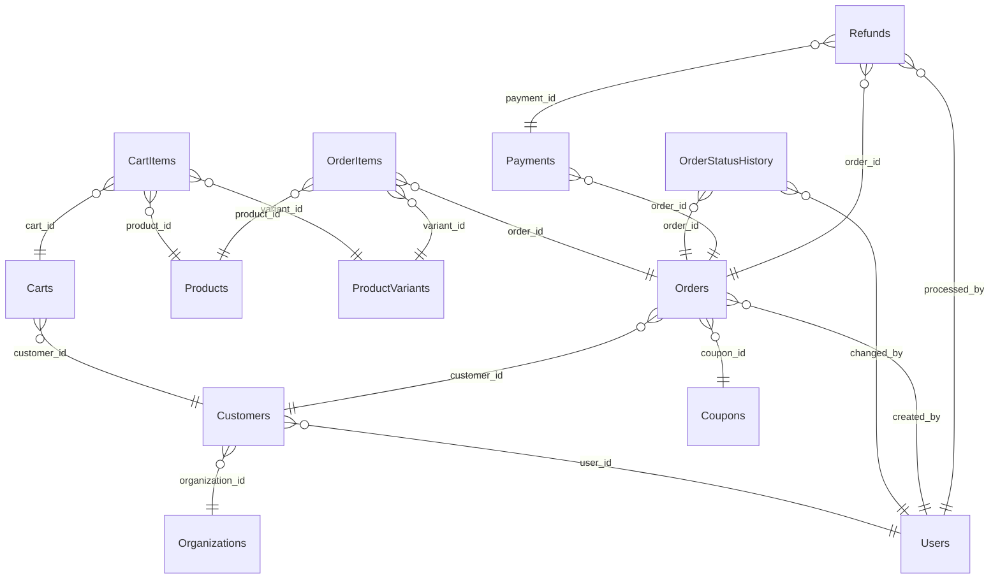

# Orders Schema

> Generated by DataBridge Doc Generator — 2026-04-03 12:39:58

## Tables

| Name | SQL Name | Type | Info |
|------|----------|------|------|
| [CartItems](./cart_items.md) | `cart_items` | TABLE | 8 columns |
| [Carts](./carts.md) | `carts` | TABLE | 7 columns |
| [Coupons](./coupons.md) | `coupons` | TABLE | 13 columns |
| [Customers](./customers.md) | `customers` | TABLE | 11 columns |
| [OrderItems](./order_items.md) | `order_items` | TABLE | 12 columns |
| [OrderStatusHistory](./order_status_history.md) | `order_status_history` | TABLE | 8 columns |
| [Orders](./orders.md) | `orders` | TABLE | 24 columns |
| [Payments](./payments.md) | `payments` | TABLE | 12 columns |
| [Refunds](./refunds.md) | `refunds` | TABLE | 11 columns |

## Entity Relationship Diagram

## Enum Types

| Enum | Values |
|------|--------|
| `orders.order_status` | `pending`, `confirmed`, `processing`, `shipped`, `delivered`, `cancelled`, `refunded` |
| `orders.payment_method` | `credit_card`, `debit_card`, `bank_transfer`, `wallet`, `crypto` |
| `orders.payment_status` | `pending`, `authorized`, `captured`, `failed`, `refunded` |

