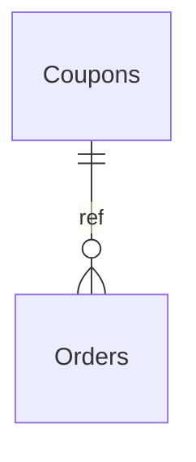

# Coupons

**Table:** `orders.coupons`

**Base path:** `/coupons`

## Related Tables

### Child Tables

_Tables that reference this table via foreign keys._

| Child Table | FK Column | References | Link |
|------------|-----------|------------|------|
| `orders` | `coupon_id` | `orders_coupon_id_fkey` | [Orders](./orders) |


## Entity Relationship Diagram



::::tabs

=== FullStack

## Columns

| # | Column | SQL Type | Go Type | TS Type | Nullable | Default | Constraints | Description |
|---|--------|----------|---------|---------|----------|---------|-------------|-------------|
| 1 | `id` | `uuid` | `uuid.UUID` | `string` | NO | `gen_random_uuid()` | `PK` | Primary key |
| 2 | `name` | `text` | `string` | `string` | NO | - | - | - |
| 3 | `code` | `text` | `string` | `string` | NO | - | `UQ` | - |
| 4 | `discount_type` | `text` | `string` | `string` | NO | `'percentage'::text` | - | - |
| 5 | `discount_value` | `numeric` | `float64` | `number` | NO | `0` | - | - |
| 6 | `min_order_value` | `numeric` | `float64` | `number` | NO | `0` | - | - |
| 7 | `max_uses` | `integer` | `int` | `number` | NO | `0` | - | - |
| 8 | `used_count` | `integer` | `int` | `number` | NO | `0` | - | - |
| 9 | `is_active` | `boolean` | `bool` | `boolean` | NO | `true` | - | - |
| 10 | `valid_from` | `timestamp with time zone` | `time.Time` | `string` | NO | `now()` | - | - |
| 11 | `valid_until` | `timestamp with time zone` | `time.Time` | `string` | YES | - | - | - |
| 12 | `created_at` | `timestamp with time zone` | `time.Time` | `string` | NO | `now()` | - | Auto-filled from session |
| 13 | `updated_at` | `timestamp with time zone` | `time.Time` | `string` | NO | `now()` | - | Auto-filled from session |

## Primary Keys

- `id` (`uuid`)

## Unique Keys

- `code` (`text`)


## Go Generated Code

> 📂 Source: [📄 `Coupons.go`](https://github.com/meftunca/data-bridge-examples/blob/main//orders/structures/Coupons.go) · [📄 `Coupons.go`](https://github.com/meftunca/data-bridge-examples/blob/main//orders/services/Coupons.go) · [📄 `Coupons.go`](https://github.com/meftunca/data-bridge-examples/blob/main//orders/controllers/Coupons.go)

### Structs

:::tabs

== Form

#### CouponsForm [](https://github.com/meftunca/data-bridge-examples/blob/main//orders/structures/Coupons.go#:~:text=type%20CouponsForm%20struct)

_Create payload — excludes auto-generated PK fields_

| Field | Go Type | JSON Key | Nullable |
|-------|---------|----------|----------|
| `Name` | `string` | `name` | NO |
| `Code` | `string` | `code` | NO |
| `DiscountType` | `string` | `discountType` | NO |
| `DiscountValue` | `float64` | `discountValue` | NO |
| `MinOrderValue` | `float64` | `minOrderValue` | NO |
| `MaxUses` | `int` | `maxUses` | NO |
| `UsedCount` | `int` | `usedCount` | NO |
| `IsActive` | `bool` | `isActive` | NO |
| `ValidFrom` | `time.Time` | `validFrom` | NO |
| `ValidUntil` | `*time.Time` | `validUntil` | YES |
| `CreatedAt` | `time.Time` | `createdAt` | NO |
| `UpdatedAt` | `time.Time` | `updatedAt` | NO |

== Model

#### Coupons [](https://github.com/meftunca/data-bridge-examples/blob/main//orders/structures/Coupons.go#:~:text=type%20Coupons%20struct)

_Full model — all columns + GORM/JSON tags + preload relations_

| Field | Go Type | JSON Key | Nullable |
|-------|---------|----------|----------|
| `Id` | `uuid.UUID` | `id` | NO |
| `Name` | `string` | `name` | NO |
| `Code` | `string` | `code` | NO |
| `DiscountType` | `string` | `discountType` | NO |
| `DiscountValue` | `float64` | `discountValue` | NO |
| `MinOrderValue` | `float64` | `minOrderValue` | NO |
| `MaxUses` | `int` | `maxUses` | NO |
| `UsedCount` | `int` | `usedCount` | NO |
| `IsActive` | `bool` | `isActive` | NO |
| `ValidFrom` | `time.Time` | `validFrom` | NO |
| `ValidUntil` | `*time.Time` | `validUntil` | YES |
| `CreatedAt` | `time.Time` | `createdAt` | NO |
| `UpdatedAt` | `time.Time` | `updatedAt` | NO |

== Edit

#### CouponsEdit [](https://github.com/meftunca/data-bridge-examples/blob/main//orders/structures/Coupons.go#:~:text=type%20CouponsEdit%20struct)

_Update payload — all fields are pointers (partial update)_

| Field | Go Type | JSON Key | Nullable |
|-------|---------|----------|----------|
| `Id` | `*uuid.UUID` | `id` | YES |
| `Name` | `*string` | `name` | YES |
| `Code` | `*string` | `code` | YES |
| `DiscountType` | `*string` | `discountType` | YES |
| `DiscountValue` | `*float64` | `discountValue` | YES |
| `MinOrderValue` | `*float64` | `minOrderValue` | YES |
| `MaxUses` | `*int` | `maxUses` | YES |
| `UsedCount` | `*int` | `usedCount` | YES |
| `IsActive` | `*bool` | `isActive` | YES |
| `ValidFrom` | `*time.Time` | `validFrom` | YES |
| `ValidUntil` | `*time.Time` | `validUntil` | YES |
| `CreatedAt` | `*time.Time` | `createdAt` | YES |
| `UpdatedAt` | `*time.Time` | `updatedAt` | YES |

== Filter

#### CouponsFilter [](https://github.com/meftunca/data-bridge-examples/blob/main//orders/structures/Coupons.go#:~:text=type%20CouponsFilter%20struct)

_Query filter — all fields are pointers_

| Field | Go Type | JSON Key | Nullable |
|-------|---------|----------|----------|
| `Id` | `*uuid.UUID` | `id` | YES |
| `Name` | `*string` | `name` | YES |
| `Code` | `*string` | `code` | YES |
| `DiscountType` | `*string` | `discountType` | YES |
| `DiscountValue` | `*float64` | `discountValue` | YES |
| `MinOrderValue` | `*float64` | `minOrderValue` | YES |
| `MaxUses` | `*int` | `maxUses` | YES |
| `UsedCount` | `*int` | `usedCount` | YES |
| `IsActive` | `*bool` | `isActive` | YES |
| `ValidFrom` | `*time.Time` | `validFrom` | YES |
| `ValidUntil` | `*time.Time` | `validUntil` | YES |
| `CreatedAt` | `*time.Time` | `createdAt` | YES |
| `UpdatedAt` | `*time.Time` | `updatedAt` | YES |

== Page

#### CouponsPage [](https://github.com/meftunca/data-bridge-examples/blob/main//orders/structures/Coupons.go#:~:text=type%20CouponsPage%20struct)

_Paginated response wrapper_

| Field | Go Type | JSON Key | Nullable |
|-------|---------|----------|----------|
| `Id` | `uuid.UUID` | `id` | NO |
| `Name` | `string` | `name` | NO |
| `Code` | `string` | `code` | NO |
| `DiscountType` | `string` | `discountType` | NO |
| `DiscountValue` | `float64` | `discountValue` | NO |
| `MinOrderValue` | `float64` | `minOrderValue` | NO |
| `MaxUses` | `int` | `maxUses` | NO |
| `UsedCount` | `int` | `usedCount` | NO |
| `IsActive` | `bool` | `isActive` | NO |
| `ValidFrom` | `time.Time` | `validFrom` | NO |
| `ValidUntil` | `*time.Time` | `validUntil` | YES |
| `CreatedAt` | `time.Time` | `createdAt` | NO |
| `UpdatedAt` | `time.Time` | `updatedAt` | NO |

== BatchUpdate

#### CouponsBatchUpdate [](https://github.com/meftunca/data-bridge-examples/blob/main//orders/structures/Coupons.go#:~:text=type%20CouponsBatchUpdate%20struct)

```go
type CouponsBatchUpdate struct {
    Data       json.RawMessage `json:"data"`
    PathParams struct {
        Id uuid.UUID
    } `json:"pathParams"`
}
```

:::

### Service & Endpoints

:::tabs

== Service Methods

| Method | Signature |
|---------|-----------|
| [Create](https://github.com/meftunca/data-bridge-examples/blob/main//orders/services/Coupons.go#:~:text=%29%20CreateCoupons%28%29) | `(CouponsService) CreateCoupons(data CouponsForm) (CouponsForm, error)` |
| [Create Multiple](https://github.com/meftunca/data-bridge-examples/blob/main//orders/services/Coupons.go#:~:text=%29%20CreateCouponsMultiple%28%29) | `(CouponsService) CreateCouponsMultiple(data []CouponsForm) ([]CouponsForm, error)` |
| [Update](https://github.com/meftunca/data-bridge-examples/blob/main//orders/services/Coupons.go#:~:text=%29%20UpdateCoupons%28%29) | `(CouponsService) UpdateCoupons(id uuid.UUID, data interface{}) error` |
| [Update Multiple](https://github.com/meftunca/data-bridge-examples/blob/main//orders/services/Coupons.go#:~:text=%29%20UpdateCouponsMultiple%28%29) | `(CouponsService) UpdateCouponsMultiple(data []CouponsBatchUpdate) error` |
| [Delete](https://github.com/meftunca/data-bridge-examples/blob/main//orders/services/Coupons.go#:~:text=%29%20DeleteCoupons%28%29) | `(CouponsService) DeleteCoupons(id uuid.UUID) error` |

== Endpoints

| Method | Path | Description |
|--------|------|-------------|
| `GET` | `/coupons/` | Search with query params |
| `GET` | `/coupons/pagination` | Paginated listing |
| `POST` | `/coupons/` | Create single record |
| `POST` | `/coupons/bulk/` | Create multiple records |
| `PUT` | `/coupons/bulk/` | Batch update |
| `GET` | `/coupons/with-id/:id` | Get by ID |
| `PUT` | `/coupons/with-id/:id` | Update by ID |
| `DELETE` | `/coupons/with-id/:id` | Delete by ID |

== Query & Filters

| Parameter | Type | Description |
|-----------|------|-------------|
| `page` | `int` | Page number (default: 1) |
| `size` | `int` | Items per page (default: 10) |
| `sort` | `string` | Sort field. Prefix `-` for descending. Example: `-created_at` |
| `fields` | `string` | Comma-separated column list to select |
| `preloads` | `string` | Comma-separated relation names to preload |
| `filters` | `array` | Filter rules: `[[field, op, value], ...]` |
| `groupby` | `string` | Group by field name |
| `aggregations` | `json` | Aggregation specs: `[{func,field,alias}]` |

**Filter Operators:** `eq` `neq` `gt` `gte` `lt` `lte` `in` `notin` `like` `ilike` `is` `isnot` `between`

:::

### RPC Functions

| Function | Parameters | Return | Endpoint |
|----------|-----------|--------|----------|
| `customer_total_spent` | `p_customer_id uuid` | `numeric` | `/rpc/customer_total_spent` |
| `orders_by_status` | `p_status text` | `integer` | `/rpc/orders_by_status` |
| `total_revenue` | - | `numeric` | `/rpc/total_revenue` |


=== Frontend

## TypeScript Types & Hooks

:::tabs

== Interfaces

```typescript
export interface Coupons {
  id: string;
  name: string;
  code: string;
  discountType: string;
  discountValue: number;
  minOrderValue: number;
  maxUses: number;
  usedCount: number;
  isActive: boolean;
  validFrom: string;
  validUntil?: string;
  createdAt: string;
  updatedAt: string;
}

export interface CouponsForm {
  name: string;
  code: string;
  discountType: string;
  discountValue: number;
  minOrderValue: number;
  maxUses: number;
  usedCount: number;
  isActive: boolean;
  validFrom: string;
  validUntil?: string;
  createdAt: string;
  updatedAt: string;
}

export interface CouponsEdit {
  id: string;
  name: string;
  code: string;
  discountType: string;
  discountValue: number;
  minOrderValue: number;
  maxUses: number;
  usedCount: number;
  isActive: boolean;
  validFrom: string;
  validUntil?: string;
  createdAt: string;
  updatedAt: string;
}

export interface CouponsPage {
  data: Coupons[];
  total: number;
  page: number;
  size: number;
  totalPages: number;
}

export type CouponsPathQuery = {
  page?: number;
  size?: number;
  sort?: string;
  fields?: string;
  preloads?: string;
  filters?: string;
};

```

== React Query

```typescript
import { useQuery, useMutation, useQueryClient } from "@tanstack/react-query";

const CouponsKeys = {
  all: ["coupons"] as const,
  lists: () => [...CouponsKeys.all, "list"] as const,
  detail: (id: any) => [...CouponsKeys.all, "detail", id] as const,
} as const;

export function useCouponsList(query?: CouponsPathQuery) {
  return useQuery({
    queryKey: [...CouponsKeys.lists(), query],
    queryFn: () => fetch(`/coupons/pagination`, { method: "GET" }).then(r => r.json()) as Promise<CouponsPage>,
  });
}

export function useCouponsDetail(id: any) {
  return useQuery({
    queryKey: CouponsKeys.detail(id),
    queryFn: () => fetch(`/coupons/with-id/:id`).then(r => r.json()) as Promise<Coupons>,
  });
}

export function useCreateCoupons() {
  const qc = useQueryClient();
  return useMutation({
    mutationFn: (data: CouponsForm) =>
      fetch("/coupons/", { method: "POST", body: JSON.stringify(data) }).then(r => r.json()),
    onSuccess: () => qc.invalidateQueries({ queryKey: CouponsKeys.lists() }),
  });
}

export function useUpdateCoupons() {
  const qc = useQueryClient();
  return useMutation({
    mutationFn: ({ id, data }: { id: any: any; data: CouponsEdit }) =>
      fetch(`/coupons/with-id/:id`, { method: "PUT", body: JSON.stringify(data) }).then(r => r.json()),
    onSuccess: () => qc.invalidateQueries({ queryKey: CouponsKeys.all }),
  });
}

export function useDeleteCoupons() {
  const qc = useQueryClient();
  return useMutation({
    mutationFn: (id: any) =>
      fetch(`/coupons/with-id/:id`, { method: "DELETE" }).then(r => r.json()),
    onSuccess: () => qc.invalidateQueries({ queryKey: CouponsKeys.all }),
  });
}

```

== Zod Validation

```typescript
import { z } from "zod";

export const CouponsFormSchema = z.object({
  name: z.string(),
  code: z.string(),
  discountType: z.string(),
  discountValue: z.number(),
  minOrderValue: z.number(),
  maxUses: z.number().int(),
  usedCount: z.number().int(),
  isActive: z.boolean(),
  validFrom: z.string().datetime(),
  validUntil: z.string().datetime().optional(),
  createdAt: z.string().datetime(),
  updatedAt: z.string().datetime(),
});

export type CouponsFormInput = z.infer<typeof CouponsFormSchema>;

```

:::


=== API

<script setup>
import { useOpenapi } from 'vitepress-openapi'
import spec from './coupons.openapi.json'
useOpenapi({ spec })
</script>


## API Reference

:::tabs

== Search

#### <Badge type="info" text="GET" /> Search Coupons

```
GET /api/v1/coupons/
```

> Retrieve list filtered by query parameters.

**Headers:**

| Header | Required | Description |
|--------|----------|-------------|
| `Authorization` | Yes | Bearer token |
| `x-company` | Yes | Company ID |

**Query Parameters:**

| Parameter | Type | Required | Description |
|-----------|------|----------|-------------|
| `size` | `integer` | No | Max results (default: 10) |
| `sort` | `string` | No | Sort field. Prefix `-` for DESC. e.g. `-created_at` |
| `fields` | `string` | No | Comma-separated columns to select |
| `preloads` | `string` | No | Available: OrdersList, OrdersList.OrderItemsList, OrdersList.OrderItemsList.OrderIdDetail, OrdersList.PaymentsList, OrdersList.PaymentsList.RefundsList, OrdersList.PaymentsList.OrderIdDetail, OrdersList.RefundsList, OrdersList.RefundsList.OrderIdDetail, OrdersList.RefundsList.PaymentIdDetail, OrdersList.OrderStatusHistoryList, OrdersList.OrderStatusHistoryList.OrderIdDetail, OrdersList.CustomerIdDetail, OrdersList.CustomerIdDetail.OrdersList, OrdersList.CustomerIdDetail.CartsList, OrdersList.CouponIdDetail, OrdersList.CouponIdDetail.OrdersList |
| `joins` | `string` | No | Comma-separated relations to join |
| `id` | `string (uuid)` | No | Filter by id |
| `name` | `string` | No | Filter by name |
| `code` | `string` | No | Filter by code |
| `discountType` | `string` | No | Filter by discount_type |
| `discountValue` | `number` | No | Filter by discount_value |
| `minOrderValue` | `number` | No | Filter by min_order_value |
| `maxUses` | `integer` | No | Filter by max_uses |
| `usedCount` | `integer` | No | Filter by used_count |
| `isActive` | `boolean` | No | Filter by is_active |
| `validFrom` | `string (date-time)` | No | Filter by valid_from |
| `validUntil` | `string (date-time)` | No | Filter by valid_until |

**Response:** `Coupons[]`

<details>
<summary>curl example</summary>

```bash
curl -X GET \
  -H "Authorization: Bearer $TOKEN" \
  -H "x-company: $COMPANY_ID" \
  "http://localhost:3000/api/v1/coupons/"
```

</details>

---

#### <Badge type="tip" text="POST" /> Search Coupons (POST)

```
POST /api/v1/coupons/search
```

> Search with body filters. Auto-used when query string > 2KB.

**Headers:**

| Header | Required | Description |
|--------|----------|-------------|
| `Authorization` | Yes | Bearer token |
| `x-company` | Yes | Company ID |

**Request Body:**

```typescript
{
  size?: number  // e.g. 10
  sort?: string[]  // e.g. ["-createdAt"]
  filters?: FilterRule[]  // e.g. [["name", "eq", "value"]]
  fields?: string[]
  preloads?: string[]
}
```

**Response:** `Coupons[]`

<details>
<summary>curl example</summary>

```bash
curl -X POST \
  -H "Authorization: Bearer $TOKEN" \
  -H "x-company: $COMPANY_ID" \
  -H "Content-Type: application/json" \
  -d '{}' \
  "http://localhost:3000/api/v1/coupons/search"
```

</details>

---

== Pagination

#### <Badge type="info" text="GET" /> Paginate Coupons

```
GET /api/v1/coupons/pagination
```

> Paginated listing.

**Headers:**

| Header | Required | Description |
|--------|----------|-------------|
| `Authorization` | Yes | Bearer token |
| `x-company` | Yes | Company ID |

**Query Parameters:**

| Parameter | Type | Required | Description |
|-----------|------|----------|-------------|
| `page` | `integer` | No | Page number (default: 1) |
| `size` | `integer` | No | Max results (default: 10) |
| `sort` | `string` | No | Sort field. Prefix `-` for DESC. e.g. `-created_at` |
| `fields` | `string` | No | Comma-separated columns to select |
| `preloads` | `string` | No | Available: OrdersList, OrdersList.OrderItemsList, OrdersList.OrderItemsList.OrderIdDetail, OrdersList.PaymentsList, OrdersList.PaymentsList.RefundsList, OrdersList.PaymentsList.OrderIdDetail, OrdersList.RefundsList, OrdersList.RefundsList.OrderIdDetail, OrdersList.RefundsList.PaymentIdDetail, OrdersList.OrderStatusHistoryList, OrdersList.OrderStatusHistoryList.OrderIdDetail, OrdersList.CustomerIdDetail, OrdersList.CustomerIdDetail.OrdersList, OrdersList.CustomerIdDetail.CartsList, OrdersList.CouponIdDetail, OrdersList.CouponIdDetail.OrdersList |
| `joins` | `string` | No | Comma-separated relations to join |
| `id` | `string (uuid)` | No | Filter by id |
| `name` | `string` | No | Filter by name |
| `code` | `string` | No | Filter by code |
| `discountType` | `string` | No | Filter by discount_type |
| `discountValue` | `number` | No | Filter by discount_value |
| `minOrderValue` | `number` | No | Filter by min_order_value |
| `maxUses` | `integer` | No | Filter by max_uses |
| `usedCount` | `integer` | No | Filter by used_count |
| `isActive` | `boolean` | No | Filter by is_active |
| `validFrom` | `string (date-time)` | No | Filter by valid_from |
| `validUntil` | `string (date-time)` | No | Filter by valid_until |

**Response:** `PaginationResponse<Coupons>`

<details>
<summary>curl example</summary>

```bash
curl -X GET \
  -H "Authorization: Bearer $TOKEN" \
  -H "x-company: $COMPANY_ID" \
  "http://localhost:3000/api/v1/coupons/pagination"
```

</details>

---

#### <Badge type="tip" text="POST" /> Paginate Coupons (POST)

```
POST /api/v1/coupons/pagination
```

> Paginated listing with body filters.

**Headers:**

| Header | Required | Description |
|--------|----------|-------------|
| `Authorization` | Yes | Bearer token |
| `x-company` | Yes | Company ID |

**Request Body:**

```typescript
{
  page?: number  // e.g. 1
  size?: number  // e.g. 10
  sort?: string[]  // e.g. ["-createdAt"]
  filters?: FilterRule[]  // e.g. [["name", "eq", "value"]]
  fields?: string[]
  preloads?: string[]
}
```

**Response:** `PaginationResponse<Coupons>`

<details>
<summary>curl example</summary>

```bash
curl -X POST \
  -H "Authorization: Bearer $TOKEN" \
  -H "x-company: $COMPANY_ID" \
  -H "Content-Type: application/json" \
  -d '{}' \
  "http://localhost:3000/api/v1/coupons/pagination"
```

</details>

---

== Create

#### <Badge type="tip" text="POST" /> Create Coupons

```
POST /api/v1/coupons/
```

> Create a new record.

**Headers:**

| Header | Required | Description |
|--------|----------|-------------|
| `Authorization` | Yes | Bearer token |
| `x-company` | Yes | Company ID |

**Request Body:**

```typescript
{
  name: string  // e.g. example_name
  code: string  // e.g. example_code
  discountType?: string  // e.g. example_discount_type
  discountValue?: number  // e.g. 99.99
  minOrderValue?: number  // e.g. 99.99
  maxUses?: number  // e.g. 1
  usedCount?: number  // e.g. 1
  isActive?: boolean  // e.g. true
  validFrom?: string  // e.g. 2026-01-15T10:30:00Z
  validUntil?: string  // e.g. 2026-01-15T10:30:00Z
}
```

**Response:** `Coupons`

<details>
<summary>curl example</summary>

```bash
curl -X POST \
  -H "Authorization: Bearer $TOKEN" \
  -H "x-company: $COMPANY_ID" \
  -H "Content-Type: application/json" \
  -d '{}' \
  "http://localhost:3000/api/v1/coupons/"
```

</details>

---

#### <Badge type="tip" text="POST" /> Bulk Create Coupons

```
POST /api/v1/coupons/bulk/
```

> Create multiple records in one request.

**Headers:**

| Header | Required | Description |
|--------|----------|-------------|
| `Authorization` | Yes | Bearer token |
| `x-company` | Yes | Company ID |

**Request Body:**

```typescript
{
  name: string  // e.g. example_name
  code: string  // e.g. example_code
  discountType?: string  // e.g. example_discount_type
  discountValue?: number  // e.g. 99.99
  minOrderValue?: number  // e.g. 99.99
  maxUses?: number  // e.g. 1
  usedCount?: number  // e.g. 1
  isActive?: boolean  // e.g. true
  validFrom?: string  // e.g. 2026-01-15T10:30:00Z
  validUntil?: string  // e.g. 2026-01-15T10:30:00Z
}
```

**Response:** `Coupons[]`

<details>
<summary>curl example</summary>

```bash
curl -X POST \
  -H "Authorization: Bearer $TOKEN" \
  -H "x-company: $COMPANY_ID" \
  -H "Content-Type: application/json" \
  -d '{}' \
  "http://localhost:3000/api/v1/coupons/bulk/"
```

</details>

---

== Find & Update

#### <Badge type="info" text="GET" /> Find Coupons by ID

```
GET /api/v1/coupons/with-id/:id
```

> Retrieve a single record by primary key.

**Headers:**

| Header | Required | Description |
|--------|----------|-------------|
| `Authorization` | Yes | Bearer token |
| `x-company` | Yes | Company ID |

**Query Parameters:**

| Parameter | Type | Required | Description |
|-----------|------|----------|-------------|
| `Id` | `string (uuid)` | Yes | Primary key (uuid) |

**Response:** `Coupons`

<details>
<summary>curl example</summary>

```bash
curl -X GET \
  -H "Authorization: Bearer $TOKEN" \
  -H "x-company: $COMPANY_ID" \
  "http://localhost:3000/api/v1/coupons/with-id/:id"
```

</details>

---

#### <Badge type="warning" text="PUT" /> Update Coupons

```
PUT /api/v1/coupons/with-id/:id
```

> Partial update — send only the fields to change.

**Headers:**

| Header | Required | Description |
|--------|----------|-------------|
| `Authorization` | Yes | Bearer token |
| `x-company` | Yes | Company ID |

**Query Parameters:**

| Parameter | Type | Required | Description |
|-----------|------|----------|-------------|
| `Id` | `string (uuid)` | Yes | Primary key (uuid) |

**Request Body:**

```typescript
{
  name?: string
  code?: string
  discountType?: string
  discountValue?: number
  minOrderValue?: number
  maxUses?: number
  usedCount?: number
  isActive?: boolean
  validFrom?: string
  validUntil?: string
}
```

**Response:** `Success`

<details>
<summary>curl example</summary>

```bash
curl -X PUT \
  -H "Authorization: Bearer $TOKEN" \
  -H "x-company: $COMPANY_ID" \
  -H "Content-Type: application/json" \
  -d '{}' \
  "http://localhost:3000/api/v1/coupons/with-id/:id"
```

</details>

---

#### <Badge type="warning" text="PUT" /> Bulk Update Coupons

```
PUT /api/v1/coupons/bulk/
```

> Batch update multiple records.

**Headers:**

| Header | Required | Description |
|--------|----------|-------------|
| `Authorization` | Yes | Bearer token |
| `x-company` | Yes | Company ID |

**Request Body:** Array of { pathParams, data: CouponsEdit }

**Response:** `Success`

<details>
<summary>curl example</summary>

```bash
curl -X PUT \
  -H "Authorization: Bearer $TOKEN" \
  -H "x-company: $COMPANY_ID" \
  -H "Content-Type: application/json" \
  -d '{}' \
  "http://localhost:3000/api/v1/coupons/bulk/"
```

</details>

---

== Delete

#### <Badge type="danger" text="DELETE" /> Delete Coupons

```
DELETE /api/v1/coupons/with-id/:id
```

> Soft-delete (sets deleted_at + deleted_by).

**Headers:**

| Header | Required | Description |
|--------|----------|-------------|
| `Authorization` | Yes | Bearer token |
| `x-company` | Yes | Company ID |

**Query Parameters:**

| Parameter | Type | Required | Description |
|-----------|------|----------|-------------|
| `Id` | `string (uuid)` | Yes | Primary key (uuid) |

**Response:** `Success`

<details>
<summary>curl example</summary>

```bash
curl -X DELETE \
  -H "Authorization: Bearer $TOKEN" \
  -H "x-company: $COMPANY_ID" \
  "http://localhost:3000/api/v1/coupons/with-id/:id"
```

</details>

---

:::


::::
