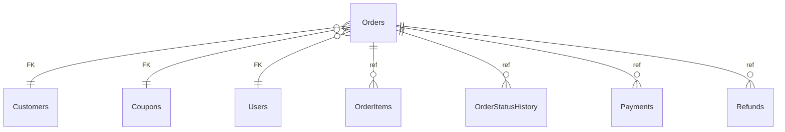

# Orders

**Table:** `orders.orders`

**Base path:** `/orders`

## Related Tables

### Parent Tables

_Tables this table references via foreign keys._

| Parent Table | FK Column | References | Link |
|-------------|-----------|------------|------|
| `customers` | `customer_id` | `orders_customer_id_fkey` | [Customers](./customers) |
| `coupons` | `coupon_id` | `orders_coupon_id_fkey` | [Coupons](./coupons) |
| `users` | `created_by` | `orders_created_by_fkey` | [Users](./users) |

### Child Tables

_Tables that reference this table via foreign keys._

| Child Table | FK Column | References | Link |
|------------|-----------|------------|------|
| `order_items` | `order_id` | `order_items_order_id_fkey` | [OrderItems](./order_items) |
| `order_status_history` | `order_id` | `order_status_history_order_id_fkey` | [OrderStatusHistory](./order_status_history) |
| `payments` | `order_id` | `payments_order_id_fkey` | [Payments](./payments) |
| `refunds` | `order_id` | `refunds_order_id_fkey` | [Refunds](./refunds) |
| `shipments` | `order_id` | `shipments_order_id_fkey` | [Shipments](./shipments) |


## Entity Relationship Diagram



::::tabs

:::tab FullStack

## Columns

| # | Column | SQL Type | Go Type | TS Type | Nullable | Default | Constraints | Description |
|---|--------|----------|---------|---------|----------|---------|-------------|-------------|
| 1 | `id` | `uuid` | `uuid.UUID` | `string` | NO | `gen_random_uuid()` | `PK` | Primary key |
| 2 | `name` | `text` | `string` | `string` | NO | `''::text` | - | - |
| 3 | `order_number` | `text` | `string` | `string` | NO | - | `UQ` | - |
| 4 | `customer_id` | `uuid` | `uuid.UUID` | `string` | NO | - | `FK` | → References `customers` |
| 5 | `status` | `USER-DEFINED` | `OrdersOrderStatus` | `"pending" \| "confirmed" \| "processing" \| "shipped" \| "delivered" \| "cancelled" \| "refunded"` | NO | `'pending'::orders.order_status` | - | - |
| 6 | `subtotal` | `numeric` | `float64` | `number` | NO | `0.00` | - | - |
| 7 | `tax_amount` | `numeric` | `float64` | `number` | NO | `0.00` | - | - |
| 8 | `shipping_amount` | `numeric` | `float64` | `number` | NO | `0.00` | - | - |
| 9 | `discount_amount` | `numeric` | `float64` | `number` | NO | `0.00` | - | - |
| 10 | `total` | `numeric` | `float64` | `number` | NO | `0.00` | - | - |
| 11 | `currency` | `text` | `string` | `string` | NO | `'USD'::text` | - | - |
| 12 | `coupon_id` | `uuid` | `uuid.UUID` | `string` | YES | - | `FK` | → References `coupons` |
| 13 | `shipping_address` | `jsonb` | `json.RawMessage` | `Record<string, unknown>` | NO | `'{}'::jsonb` | - | - |
| 14 | `billing_address` | `jsonb` | `json.RawMessage` | `Record<string, unknown>` | NO | `'{}'::jsonb` | - | - |
| 15 | `notes` | `text` | `string` | `string` | NO | `''::text` | - | - |
| 16 | `placed_at` | `timestamp with time zone` | `time.Time` | `string` | YES | - | - | - |
| 17 | `confirmed_at` | `timestamp with time zone` | `time.Time` | `string` | YES | - | - | - |
| 18 | `shipped_at` | `timestamp with time zone` | `time.Time` | `string` | YES | - | - | - |
| 19 | `delivered_at` | `timestamp with time zone` | `time.Time` | `string` | YES | - | - | - |
| 20 | `cancelled_at` | `timestamp with time zone` | `time.Time` | `string` | YES | - | - | - |
| 21 | `created_by` | `uuid` | `uuid.UUID` | `string` | YES | - | `FK` | Auto-filled from session |
| 22 | `created_at` | `timestamp with time zone` | `time.Time` | `string` | NO | `now()` | - | Auto-filled from session |
| 23 | `updated_at` | `timestamp with time zone` | `time.Time` | `string` | NO | `now()` | - | Auto-filled from session |
| 24 | `deleted_at` | `timestamp with time zone` | `time.Time` | `string` | YES | - | - | Auto-filled from session |

## Primary Keys

- `id` (`uuid`)

## Foreign Keys & Relationships

| Column | References | Constraint |
|--------|-----------|------------|
| `customer_id` | `customers` | `orders_customer_id_fkey` |
| `coupon_id` | `coupons` | `orders_coupon_id_fkey` |
| `created_by` | `users` | `orders_created_by_fkey` |

## Unique Keys

- `order_number` (`text`)

## Enum Types

### OrderStatus

| Value | Go Constant |
|-------|-------------|
| `pending` | `OrdersOrderStatusPending` |
| `confirmed` | `OrdersOrderStatusConfirmed` |
| `processing` | `OrdersOrderStatusProcessing` |
| `shipped` | `OrdersOrderStatusShipped` |
| `delivered` | `OrdersOrderStatusDelivered` |
| `cancelled` | `OrdersOrderStatusCancelled` |
| `refunded` | `OrdersOrderStatusRefunded` |


## Go Generated Code

> 📂 Source: [📄 `Orders.go`](https://github.com/meftunca/data-bridge-examples/blob/main//orders/structures/Orders.go) · [📄 `Orders.go`](https://github.com/meftunca/data-bridge-examples/blob/main//orders/services/Orders.go) · [📄 `Orders.go`](https://github.com/meftunca/data-bridge-examples/blob/main//orders/controllers/Orders.go)

### Structs

::::tabs

:::tab Form

#### OrdersForm [](https://github.com/meftunca/data-bridge-examples/blob/main//orders/structures/Orders.go#:~:text=type%20OrdersForm%20struct)

_Create payload — excludes auto-generated PK fields_

| Field | Go Type | JSON Key | Nullable |
|-------|---------|----------|----------|
| `Name` | `string` | `name` | NO |
| `OrderNumber` | `string` | `orderNumber` | NO |
| `CustomerId` | `uuid.UUID` | `customerId` | NO |
| `Status` | `OrdersOrderStatus` | `status` | NO |
| `Subtotal` | `float64` | `subtotal` | NO |
| `TaxAmount` | `float64` | `taxAmount` | NO |
| `ShippingAmount` | `float64` | `shippingAmount` | NO |
| `DiscountAmount` | `float64` | `discountAmount` | NO |
| `Total` | `float64` | `total` | NO |
| `Currency` | `string` | `currency` | NO |
| `CouponId` | `*uuid.UUID` | `couponId` | YES |
| `ShippingAddress` | `json.RawMessage` | `shippingAddress` | NO |
| `BillingAddress` | `json.RawMessage` | `billingAddress` | NO |
| `Notes` | `string` | `notes` | NO |
| `PlacedAt` | `*time.Time` | `placedAt` | YES |
| `ConfirmedAt` | `*time.Time` | `confirmedAt` | YES |
| `ShippedAt` | `*time.Time` | `shippedAt` | YES |
| `DeliveredAt` | `*time.Time` | `deliveredAt` | YES |
| `CancelledAt` | `*time.Time` | `cancelledAt` | YES |
| `CreatedBy` | `*uuid.UUID` | `createdBy` | YES |
| `CreatedAt` | `time.Time` | `createdAt` | NO |
| `UpdatedAt` | `time.Time` | `updatedAt` | NO |
| `DeletedAt` | `*time.Time` | `deletedAt` | YES |

:::tab Model

#### Orders [](https://github.com/meftunca/data-bridge-examples/blob/main//orders/structures/Orders.go#:~:text=type%20Orders%20struct)

_Full model — all columns + GORM/JSON tags + preload relations_

| Field | Go Type | JSON Key | Nullable |
|-------|---------|----------|----------|
| `Id` | `uuid.UUID` | `id` | NO |
| `Name` | `string` | `name` | NO |
| `OrderNumber` | `string` | `orderNumber` | NO |
| `CustomerId` | `uuid.UUID` | `customerId` | NO |
| `Status` | `OrdersOrderStatus` | `status` | NO |
| `Subtotal` | `float64` | `subtotal` | NO |
| `TaxAmount` | `float64` | `taxAmount` | NO |
| `ShippingAmount` | `float64` | `shippingAmount` | NO |
| `DiscountAmount` | `float64` | `discountAmount` | NO |
| `Total` | `float64` | `total` | NO |
| `Currency` | `string` | `currency` | NO |
| `CouponId` | `*uuid.UUID` | `couponId` | YES |
| `ShippingAddress` | `json.RawMessage` | `shippingAddress` | NO |
| `BillingAddress` | `json.RawMessage` | `billingAddress` | NO |
| `Notes` | `string` | `notes` | NO |
| `PlacedAt` | `*time.Time` | `placedAt` | YES |
| `ConfirmedAt` | `*time.Time` | `confirmedAt` | YES |
| `ShippedAt` | `*time.Time` | `shippedAt` | YES |
| `DeliveredAt` | `*time.Time` | `deliveredAt` | YES |
| `CancelledAt` | `*time.Time` | `cancelledAt` | YES |
| `CreatedBy` | `*uuid.UUID` | `createdBy` | YES |
| `CreatedAt` | `time.Time` | `createdAt` | NO |
| `UpdatedAt` | `time.Time` | `updatedAt` | NO |
| `DeletedAt` | `*time.Time` | `deletedAt` | YES |

:::tab Edit

#### OrdersEdit [](https://github.com/meftunca/data-bridge-examples/blob/main//orders/structures/Orders.go#:~:text=type%20OrdersEdit%20struct)

_Update payload — all fields are pointers (partial update)_

| Field | Go Type | JSON Key | Nullable |
|-------|---------|----------|----------|
| `Id` | `*uuid.UUID` | `id` | YES |
| `Name` | `*string` | `name` | YES |
| `OrderNumber` | `*string` | `orderNumber` | YES |
| `CustomerId` | `*uuid.UUID` | `customerId` | YES |
| `Status` | `*OrdersOrderStatus` | `status` | YES |
| `Subtotal` | `*float64` | `subtotal` | YES |
| `TaxAmount` | `*float64` | `taxAmount` | YES |
| `ShippingAmount` | `*float64` | `shippingAmount` | YES |
| `DiscountAmount` | `*float64` | `discountAmount` | YES |
| `Total` | `*float64` | `total` | YES |
| `Currency` | `*string` | `currency` | YES |
| `CouponId` | `*uuid.UUID` | `couponId` | YES |
| `ShippingAddress` | `*json.RawMessage` | `shippingAddress` | YES |
| `BillingAddress` | `*json.RawMessage` | `billingAddress` | YES |
| `Notes` | `*string` | `notes` | YES |
| `PlacedAt` | `*time.Time` | `placedAt` | YES |
| `ConfirmedAt` | `*time.Time` | `confirmedAt` | YES |
| `ShippedAt` | `*time.Time` | `shippedAt` | YES |
| `DeliveredAt` | `*time.Time` | `deliveredAt` | YES |
| `CancelledAt` | `*time.Time` | `cancelledAt` | YES |
| `CreatedBy` | `*uuid.UUID` | `createdBy` | YES |
| `CreatedAt` | `*time.Time` | `createdAt` | YES |
| `UpdatedAt` | `*time.Time` | `updatedAt` | YES |
| `DeletedAt` | `*time.Time` | `deletedAt` | YES |

:::tab Filter

#### OrdersFilter [](https://github.com/meftunca/data-bridge-examples/blob/main//orders/structures/Orders.go#:~:text=type%20OrdersFilter%20struct)

_Query filter — all fields are pointers_

| Field | Go Type | JSON Key | Nullable |
|-------|---------|----------|----------|
| `Id` | `*uuid.UUID` | `id` | YES |
| `Name` | `*string` | `name` | YES |
| `OrderNumber` | `*string` | `orderNumber` | YES |
| `CustomerId` | `*uuid.UUID` | `customerId` | YES |
| `Status` | `*OrdersOrderStatus` | `status` | YES |
| `Subtotal` | `*float64` | `subtotal` | YES |
| `TaxAmount` | `*float64` | `taxAmount` | YES |
| `ShippingAmount` | `*float64` | `shippingAmount` | YES |
| `DiscountAmount` | `*float64` | `discountAmount` | YES |
| `Total` | `*float64` | `total` | YES |
| `Currency` | `*string` | `currency` | YES |
| `CouponId` | `*uuid.UUID` | `couponId` | YES |
| `ShippingAddress` | `*json.RawMessage` | `shippingAddress` | YES |
| `BillingAddress` | `*json.RawMessage` | `billingAddress` | YES |
| `Notes` | `*string` | `notes` | YES |
| `PlacedAt` | `*time.Time` | `placedAt` | YES |
| `ConfirmedAt` | `*time.Time` | `confirmedAt` | YES |
| `ShippedAt` | `*time.Time` | `shippedAt` | YES |
| `DeliveredAt` | `*time.Time` | `deliveredAt` | YES |
| `CancelledAt` | `*time.Time` | `cancelledAt` | YES |
| `CreatedBy` | `*uuid.UUID` | `createdBy` | YES |
| `CreatedAt` | `*time.Time` | `createdAt` | YES |
| `UpdatedAt` | `*time.Time` | `updatedAt` | YES |
| `DeletedAt` | `*time.Time` | `deletedAt` | YES |

:::tab Page

#### OrdersPage [](https://github.com/meftunca/data-bridge-examples/blob/main//orders/structures/Orders.go#:~:text=type%20OrdersPage%20struct)

_Paginated response wrapper_

| Field | Go Type | JSON Key | Nullable |
|-------|---------|----------|----------|
| `Id` | `uuid.UUID` | `id` | NO |
| `Name` | `string` | `name` | NO |
| `OrderNumber` | `string` | `orderNumber` | NO |
| `CustomerId` | `uuid.UUID` | `customerId` | NO |
| `Status` | `OrdersOrderStatus` | `status` | NO |
| `Subtotal` | `float64` | `subtotal` | NO |
| `TaxAmount` | `float64` | `taxAmount` | NO |
| `ShippingAmount` | `float64` | `shippingAmount` | NO |
| `DiscountAmount` | `float64` | `discountAmount` | NO |
| `Total` | `float64` | `total` | NO |
| `Currency` | `string` | `currency` | NO |
| `CouponId` | `*uuid.UUID` | `couponId` | YES |
| `ShippingAddress` | `json.RawMessage` | `shippingAddress` | NO |
| `BillingAddress` | `json.RawMessage` | `billingAddress` | NO |
| `Notes` | `string` | `notes` | NO |
| `PlacedAt` | `*time.Time` | `placedAt` | YES |
| `ConfirmedAt` | `*time.Time` | `confirmedAt` | YES |
| `ShippedAt` | `*time.Time` | `shippedAt` | YES |
| `DeliveredAt` | `*time.Time` | `deliveredAt` | YES |
| `CancelledAt` | `*time.Time` | `cancelledAt` | YES |
| `CreatedBy` | `*uuid.UUID` | `createdBy` | YES |
| `CreatedAt` | `time.Time` | `createdAt` | NO |
| `UpdatedAt` | `time.Time` | `updatedAt` | NO |
| `DeletedAt` | `*time.Time` | `deletedAt` | YES |

:::tab BatchUpdate

#### OrdersBatchUpdate [](https://github.com/meftunca/data-bridge-examples/blob/main//orders/structures/Orders.go#:~:text=type%20OrdersBatchUpdate%20struct)

```go
type OrdersBatchUpdate struct {
    Data       json.RawMessage `json:"data"`
    PathParams struct {
        Id uuid.UUID
    } `json:"pathParams"`
}
```

::::

### Service & Endpoints

::::tabs

:::tab Service Methods

| Method | Signature |
|---------|-----------|
| [Create](https://github.com/meftunca/data-bridge-examples/blob/main//orders/services/Orders.go#:~:text=)%20CreateOrders() | `(OrdersService) CreateOrders(data OrdersForm) (OrdersForm, error)` |
| [Create Multiple](https://github.com/meftunca/data-bridge-examples/blob/main//orders/services/Orders.go#:~:text=)%20CreateOrdersMultiple() | `(OrdersService) CreateOrdersMultiple(data []OrdersForm) ([]OrdersForm, error)` |
| [Update](https://github.com/meftunca/data-bridge-examples/blob/main//orders/services/Orders.go#:~:text=)%20UpdateOrders() | `(OrdersService) UpdateOrders(id uuid.UUID, data interface{}) error` |
| [Update Multiple](https://github.com/meftunca/data-bridge-examples/blob/main//orders/services/Orders.go#:~:text=)%20UpdateOrdersMultiple() | `(OrdersService) UpdateOrdersMultiple(data []OrdersBatchUpdate) error` |
| [Delete](https://github.com/meftunca/data-bridge-examples/blob/main//orders/services/Orders.go#:~:text=)%20DeleteOrders() | `(OrdersService) DeleteOrders(id uuid.UUID) error` |

:::tab Endpoints

| Method | Path | Description |
|--------|------|-------------|
| `GET` | `/orders/` | Search with query params |
| `GET` | `/orders/pagination` | Paginated listing |
| `POST` | `/orders/` | Create single record |
| `POST` | `/orders/bulk/` | Create multiple records |
| `PUT` | `/orders/bulk/` | Batch update |
| `GET` | `/orders/with-id/:id` | Get by ID |
| `PUT` | `/orders/with-id/:id` | Update by ID |
| `DELETE` | `/orders/with-id/:id` | Delete by ID |

:::tab Query & Filters

| Parameter | Type | Description |
|-----------|------|-------------|
| `page` | `int` | Page number (default: 1) |
| `size` | `int` | Items per page (default: 10) |
| `sort` | `string` | Sort field. Prefix `-` for descending. Example: `-created_at` |
| `fields` | `string` | Comma-separated column list to select |
| `preloads` | `string` | Comma-separated relation names to preload |
| `filters` | `array` | Filter rules: `[[field, op, value], ...]` |
| `groupby` | `string` | Group by field name |
| `aggregations` | `json` | Aggregation specs: `[{func,field,alias}]` |

**Filter Operators:** `eq` `neq` `gt` `gte` `lt` `lte` `in` `notin` `like` `ilike` `is` `isnot` `between`

::::

### RPC Functions

| Function | Parameters | Return | Endpoint |
|----------|-----------|--------|----------|
| `customer_total_spent` | `p_customer_id uuid` | `numeric` | `/rpc/customer_total_spent` |
| `orders_by_status` | `p_status text` | `integer` | `/rpc/orders_by_status` |
| `total_revenue` | - | `numeric` | `/rpc/total_revenue` |


:::tab Frontend

## TypeScript Types & Hooks

::::tabs

:::tab Interfaces

```typescript
export type OrdersOrderStatus =
  | "pending"
  | "confirmed"
  | "processing"
  | "shipped"
  | "delivered"
  | "cancelled"
  | "refunded"

export const OrdersOrderStatusValues = ["pending", "confirmed", "processing", "shipped", "delivered", "cancelled", "refunded"] as const;

export interface Orders {
  id: string;
  name: string;
  orderNumber: string;
  customerId: string;
  status: OrdersOrderStatus;
  subtotal: number;
  taxAmount: number;
  shippingAmount: number;
  discountAmount: number;
  total: number;
  currency: string;
  couponId?: string;
  shippingAddress: Record<string, unknown>;
  billingAddress: Record<string, unknown>;
  notes: string;
  placedAt?: string;
  confirmedAt?: string;
  shippedAt?: string;
  deliveredAt?: string;
  cancelledAt?: string;
  createdBy?: string;
  createdAt: string;
  updatedAt: string;
  deletedAt?: string;
}

export interface OrdersForm {
  name: string;
  orderNumber: string;
  customerId: string;
  status: OrdersOrderStatus;
  subtotal: number;
  taxAmount: number;
  shippingAmount: number;
  discountAmount: number;
  total: number;
  currency: string;
  couponId?: string;
  shippingAddress: Record<string, unknown>;
  billingAddress: Record<string, unknown>;
  notes: string;
  placedAt?: string;
  confirmedAt?: string;
  shippedAt?: string;
  deliveredAt?: string;
  cancelledAt?: string;
  createdBy?: string;
  createdAt: string;
  updatedAt: string;
  deletedAt?: string;
}

export interface OrdersEdit {
  id: string;
  name: string;
  orderNumber: string;
  customerId: string;
  status: OrdersOrderStatus;
  subtotal: number;
  taxAmount: number;
  shippingAmount: number;
  discountAmount: number;
  total: number;
  currency: string;
  couponId?: string;
  shippingAddress: Record<string, unknown>;
  billingAddress: Record<string, unknown>;
  notes: string;
  placedAt?: string;
  confirmedAt?: string;
  shippedAt?: string;
  deliveredAt?: string;
  cancelledAt?: string;
  createdBy?: string;
  createdAt: string;
  updatedAt: string;
  deletedAt?: string;
}

export interface OrdersPage {
  data: Orders[];
  total: number;
  page: number;
  size: number;
  totalPages: number;
}

export type OrdersPathQuery = {
  page?: number;
  size?: number;
  sort?: string;
  fields?: string;
  preloads?: string;
  filters?: string;
};

```

:::tab React Query

```typescript
import { useQuery, useMutation, useQueryClient } from "@tanstack/react-query";

const OrdersKeys = {
  all: ["orders"] as const,
  lists: () => [...OrdersKeys.all, "list"] as const,
  detail: (id: any) => [...OrdersKeys.all, "detail", id] as const,
} as const;

export function useOrdersList(query?: OrdersPathQuery) {
  return useQuery({
    queryKey: [...OrdersKeys.lists(), query],
    queryFn: () => fetch(`/orders/pagination`, { method: "GET" }).then(r => r.json()) as Promise<OrdersPage>,
  });
}

export function useOrdersDetail(id: any) {
  return useQuery({
    queryKey: OrdersKeys.detail(id),
    queryFn: () => fetch(`/orders/with-id/:id`).then(r => r.json()) as Promise<Orders>,
  });
}

export function useCreateOrders() {
  const qc = useQueryClient();
  return useMutation({
    mutationFn: (data: OrdersForm) =>
      fetch("/orders/", { method: "POST", body: JSON.stringify(data) }).then(r => r.json()),
    onSuccess: () => qc.invalidateQueries({ queryKey: OrdersKeys.lists() }),
  });
}

export function useUpdateOrders() {
  const qc = useQueryClient();
  return useMutation({
    mutationFn: ({ id, data }: { id: any: any; data: OrdersEdit }) =>
      fetch(`/orders/with-id/:id`, { method: "PUT", body: JSON.stringify(data) }).then(r => r.json()),
    onSuccess: () => qc.invalidateQueries({ queryKey: OrdersKeys.all }),
  });
}

export function useDeleteOrders() {
  const qc = useQueryClient();
  return useMutation({
    mutationFn: (id: any) =>
      fetch(`/orders/with-id/:id`, { method: "DELETE" }).then(r => r.json()),
    onSuccess: () => qc.invalidateQueries({ queryKey: OrdersKeys.all }),
  });
}

```

:::tab Zod Validation

```typescript
import { z } from "zod";

const OrdersOrderStatusSchema = z.enum(["pending", "confirmed", "processing", "shipped", "delivered", "cancelled", "refunded"]);

export const OrdersFormSchema = z.object({
  name: z.string(),
  orderNumber: z.string(),
  customerId: z.string().uuid(),
  status: OrdersOrderStatusSchema,
  subtotal: z.number(),
  taxAmount: z.number(),
  shippingAmount: z.number(),
  discountAmount: z.number(),
  total: z.number(),
  currency: z.string(),
  couponId: z.string().uuid().optional(),
  shippingAddress: z.record(z.unknown()),
  billingAddress: z.record(z.unknown()),
  notes: z.string(),
  placedAt: z.string().datetime().optional(),
  confirmedAt: z.string().datetime().optional(),
  shippedAt: z.string().datetime().optional(),
  deliveredAt: z.string().datetime().optional(),
  cancelledAt: z.string().datetime().optional(),
  createdBy: z.string().uuid().optional(),
  createdAt: z.string().datetime(),
  updatedAt: z.string().datetime(),
  deletedAt: z.string().datetime().optional(),
});

export type OrdersFormInput = z.infer<typeof OrdersFormSchema>;

```

::::


:::tab API

<script setup>
import { useOpenapi } from 'vitepress-openapi'
import spec from './orders.openapi.json'
useOpenapi({ spec })
</script>


## API Reference

::::tabs

:::tab Search

#### <Badge type="info" text="GET" /> Search Orders

```
GET /api/v1/orders/
```

> Retrieve list filtered by query parameters.

**Headers:**

| Header | Required | Description |
|--------|----------|-------------|
| `Authorization` | Yes | Bearer token |
| `x-company` | Yes | Company ID |

**Query Parameters:**

| Parameter | Type | Required | Description |
|-----------|------|----------|-------------|
| `size` | `integer` | No | Max results (default: 10) |
| `sort` | `string` | No | Sort field. Prefix `-` for DESC. e.g. `-created_at` |
| `fields` | `string` | No | Comma-separated columns to select |
| `preloads` | `string` | No | Available: OrderItemsList, OrderItemsList.OrderIdDetail, OrderItemsList.OrderIdDetail.OrderItemsList, OrderItemsList.OrderIdDetail.PaymentsList, OrderItemsList.OrderIdDetail.RefundsList, OrderItemsList.OrderIdDetail.OrderStatusHistoryList, OrderItemsList.OrderIdDetail.CustomerIdDetail, OrderItemsList.OrderIdDetail.CouponIdDetail, PaymentsList, PaymentsList.RefundsList, PaymentsList.RefundsList.OrderIdDetail, PaymentsList.RefundsList.PaymentIdDetail, PaymentsList.OrderIdDetail, PaymentsList.OrderIdDetail.OrderItemsList, PaymentsList.OrderIdDetail.PaymentsList, PaymentsList.OrderIdDetail.RefundsList, PaymentsList.OrderIdDetail.OrderStatusHistoryList, PaymentsList.OrderIdDetail.CustomerIdDetail, PaymentsList.OrderIdDetail.CouponIdDetail, RefundsList, RefundsList.OrderIdDetail, RefundsList.OrderIdDetail.OrderItemsList, RefundsList.OrderIdDetail.PaymentsList, RefundsList.OrderIdDetail.RefundsList, RefundsList.OrderIdDetail.OrderStatusHistoryList, RefundsList.OrderIdDetail.CustomerIdDetail, RefundsList.OrderIdDetail.CouponIdDetail, RefundsList.PaymentIdDetail, RefundsList.PaymentIdDetail.RefundsList, RefundsList.PaymentIdDetail.OrderIdDetail, OrderStatusHistoryList, OrderStatusHistoryList.OrderIdDetail, OrderStatusHistoryList.OrderIdDetail.OrderItemsList, OrderStatusHistoryList.OrderIdDetail.PaymentsList, OrderStatusHistoryList.OrderIdDetail.RefundsList, OrderStatusHistoryList.OrderIdDetail.OrderStatusHistoryList, OrderStatusHistoryList.OrderIdDetail.CustomerIdDetail, OrderStatusHistoryList.OrderIdDetail.CouponIdDetail, CustomerIdDetail, CustomerIdDetail.OrdersList, CustomerIdDetail.OrdersList.OrderItemsList, CustomerIdDetail.OrdersList.PaymentsList, CustomerIdDetail.OrdersList.RefundsList, CustomerIdDetail.OrdersList.OrderStatusHistoryList, CustomerIdDetail.OrdersList.CustomerIdDetail, CustomerIdDetail.OrdersList.CouponIdDetail, CustomerIdDetail.CartsList, CustomerIdDetail.CartsList.CartItemsList, CustomerIdDetail.CartsList.CustomerIdDetail, CouponIdDetail, CouponIdDetail.OrdersList, CouponIdDetail.OrdersList.OrderItemsList, CouponIdDetail.OrdersList.PaymentsList, CouponIdDetail.OrdersList.RefundsList, CouponIdDetail.OrdersList.OrderStatusHistoryList, CouponIdDetail.OrdersList.CustomerIdDetail, CouponIdDetail.OrdersList.CouponIdDetail |
| `joins` | `string` | No | Available: Customers, Customers.Users, Customers.Organizations, Coupons, Users |
| `id` | `string (uuid)` | No | Filter by id |
| `name` | `string` | No | Filter by name |
| `orderNumber` | `string` | No | Filter by order_number |
| `customerId` | `string (uuid)` | No | Filter by customer_id |
| `status` | `string` | No | Filter by status |
| `subtotal` | `number` | No | Filter by subtotal |
| `taxAmount` | `number` | No | Filter by tax_amount |
| `shippingAmount` | `number` | No | Filter by shipping_amount |
| `discountAmount` | `number` | No | Filter by discount_amount |
| `total` | `number` | No | Filter by total |
| `currency` | `string` | No | Filter by currency |
| `couponId` | `string (uuid)` | No | Filter by coupon_id |
| `shippingAddress` | `string` | No | Filter by shipping_address |
| `billingAddress` | `string` | No | Filter by billing_address |
| `notes` | `string` | No | Filter by notes |
| `placedAt` | `string (date-time)` | No | Filter by placed_at |
| `confirmedAt` | `string (date-time)` | No | Filter by confirmed_at |
| `shippedAt` | `string (date-time)` | No | Filter by shipped_at |
| `deliveredAt` | `string (date-time)` | No | Filter by delivered_at |
| `cancelledAt` | `string (date-time)` | No | Filter by cancelled_at |

**Response:** `Orders[]`

<details>
<summary>curl example</summary>

```bash
curl -X GET \
  -H "Authorization: Bearer $TOKEN" \
  -H "x-company: $COMPANY_ID" \
  "http://localhost:3000/api/v1/orders/"
```

</details>

---

#### <Badge type="tip" text="POST" /> Search Orders (POST)

```
POST /api/v1/orders/search
```

> Search with body filters. Auto-used when query string > 2KB.

**Headers:**

| Header | Required | Description |
|--------|----------|-------------|
| `Authorization` | Yes | Bearer token |
| `x-company` | Yes | Company ID |

**Request Body:**

```typescript
{
  size?: number  // e.g. 10
  sort?: string[]  // e.g. ["-createdAt"]
  filters?: FilterRule[]  // e.g. [["name", "eq", "value"]]
  fields?: string[]
  preloads?: string[]
}
```

**Response:** `Orders[]`

<details>
<summary>curl example</summary>

```bash
curl -X POST \
  -H "Authorization: Bearer $TOKEN" \
  -H "x-company: $COMPANY_ID" \
  -H "Content-Type: application/json" \
  -d '{}' \
  "http://localhost:3000/api/v1/orders/search"
```

</details>

---

:::tab Pagination

#### <Badge type="info" text="GET" /> Paginate Orders

```
GET /api/v1/orders/pagination
```

> Paginated listing.

**Headers:**

| Header | Required | Description |
|--------|----------|-------------|
| `Authorization` | Yes | Bearer token |
| `x-company` | Yes | Company ID |

**Query Parameters:**

| Parameter | Type | Required | Description |
|-----------|------|----------|-------------|
| `page` | `integer` | No | Page number (default: 1) |
| `size` | `integer` | No | Max results (default: 10) |
| `sort` | `string` | No | Sort field. Prefix `-` for DESC. e.g. `-created_at` |
| `fields` | `string` | No | Comma-separated columns to select |
| `preloads` | `string` | No | Available: OrderItemsList, OrderItemsList.OrderIdDetail, OrderItemsList.OrderIdDetail.OrderItemsList, OrderItemsList.OrderIdDetail.PaymentsList, OrderItemsList.OrderIdDetail.RefundsList, OrderItemsList.OrderIdDetail.OrderStatusHistoryList, OrderItemsList.OrderIdDetail.CustomerIdDetail, OrderItemsList.OrderIdDetail.CouponIdDetail, PaymentsList, PaymentsList.RefundsList, PaymentsList.RefundsList.OrderIdDetail, PaymentsList.RefundsList.PaymentIdDetail, PaymentsList.OrderIdDetail, PaymentsList.OrderIdDetail.OrderItemsList, PaymentsList.OrderIdDetail.PaymentsList, PaymentsList.OrderIdDetail.RefundsList, PaymentsList.OrderIdDetail.OrderStatusHistoryList, PaymentsList.OrderIdDetail.CustomerIdDetail, PaymentsList.OrderIdDetail.CouponIdDetail, RefundsList, RefundsList.OrderIdDetail, RefundsList.OrderIdDetail.OrderItemsList, RefundsList.OrderIdDetail.PaymentsList, RefundsList.OrderIdDetail.RefundsList, RefundsList.OrderIdDetail.OrderStatusHistoryList, RefundsList.OrderIdDetail.CustomerIdDetail, RefundsList.OrderIdDetail.CouponIdDetail, RefundsList.PaymentIdDetail, RefundsList.PaymentIdDetail.RefundsList, RefundsList.PaymentIdDetail.OrderIdDetail, OrderStatusHistoryList, OrderStatusHistoryList.OrderIdDetail, OrderStatusHistoryList.OrderIdDetail.OrderItemsList, OrderStatusHistoryList.OrderIdDetail.PaymentsList, OrderStatusHistoryList.OrderIdDetail.RefundsList, OrderStatusHistoryList.OrderIdDetail.OrderStatusHistoryList, OrderStatusHistoryList.OrderIdDetail.CustomerIdDetail, OrderStatusHistoryList.OrderIdDetail.CouponIdDetail, CustomerIdDetail, CustomerIdDetail.OrdersList, CustomerIdDetail.OrdersList.OrderItemsList, CustomerIdDetail.OrdersList.PaymentsList, CustomerIdDetail.OrdersList.RefundsList, CustomerIdDetail.OrdersList.OrderStatusHistoryList, CustomerIdDetail.OrdersList.CustomerIdDetail, CustomerIdDetail.OrdersList.CouponIdDetail, CustomerIdDetail.CartsList, CustomerIdDetail.CartsList.CartItemsList, CustomerIdDetail.CartsList.CustomerIdDetail, CouponIdDetail, CouponIdDetail.OrdersList, CouponIdDetail.OrdersList.OrderItemsList, CouponIdDetail.OrdersList.PaymentsList, CouponIdDetail.OrdersList.RefundsList, CouponIdDetail.OrdersList.OrderStatusHistoryList, CouponIdDetail.OrdersList.CustomerIdDetail, CouponIdDetail.OrdersList.CouponIdDetail |
| `joins` | `string` | No | Available: Customers, Customers.Users, Customers.Organizations, Coupons, Users |
| `id` | `string (uuid)` | No | Filter by id |
| `name` | `string` | No | Filter by name |
| `orderNumber` | `string` | No | Filter by order_number |
| `customerId` | `string (uuid)` | No | Filter by customer_id |
| `status` | `string` | No | Filter by status |
| `subtotal` | `number` | No | Filter by subtotal |
| `taxAmount` | `number` | No | Filter by tax_amount |
| `shippingAmount` | `number` | No | Filter by shipping_amount |
| `discountAmount` | `number` | No | Filter by discount_amount |
| `total` | `number` | No | Filter by total |
| `currency` | `string` | No | Filter by currency |
| `couponId` | `string (uuid)` | No | Filter by coupon_id |
| `shippingAddress` | `string` | No | Filter by shipping_address |
| `billingAddress` | `string` | No | Filter by billing_address |
| `notes` | `string` | No | Filter by notes |
| `placedAt` | `string (date-time)` | No | Filter by placed_at |
| `confirmedAt` | `string (date-time)` | No | Filter by confirmed_at |
| `shippedAt` | `string (date-time)` | No | Filter by shipped_at |
| `deliveredAt` | `string (date-time)` | No | Filter by delivered_at |
| `cancelledAt` | `string (date-time)` | No | Filter by cancelled_at |

**Response:** `PaginationResponse<Orders>`

<details>
<summary>curl example</summary>

```bash
curl -X GET \
  -H "Authorization: Bearer $TOKEN" \
  -H "x-company: $COMPANY_ID" \
  "http://localhost:3000/api/v1/orders/pagination"
```

</details>

---

#### <Badge type="tip" text="POST" /> Paginate Orders (POST)

```
POST /api/v1/orders/pagination
```

> Paginated listing with body filters.

**Headers:**

| Header | Required | Description |
|--------|----------|-------------|
| `Authorization` | Yes | Bearer token |
| `x-company` | Yes | Company ID |

**Request Body:**

```typescript
{
  page?: number  // e.g. 1
  size?: number  // e.g. 10
  sort?: string[]  // e.g. ["-createdAt"]
  filters?: FilterRule[]  // e.g. [["name", "eq", "value"]]
  fields?: string[]
  preloads?: string[]
}
```

**Response:** `PaginationResponse<Orders>`

<details>
<summary>curl example</summary>

```bash
curl -X POST \
  -H "Authorization: Bearer $TOKEN" \
  -H "x-company: $COMPANY_ID" \
  -H "Content-Type: application/json" \
  -d '{}' \
  "http://localhost:3000/api/v1/orders/pagination"
```

</details>

---

:::tab Create

#### <Badge type="tip" text="POST" /> Create Orders

```
POST /api/v1/orders/
```

> Create a new record.

**Headers:**

| Header | Required | Description |
|--------|----------|-------------|
| `Authorization` | Yes | Bearer token |
| `x-company` | Yes | Company ID |

**Request Body:**

```typescript
{
  name?: string  // e.g. example_name
  orderNumber: string  // e.g. example_order_number
  customerId: string  // e.g. 550e8400-e29b-41d4-a716-446655440000
  status?: "pending" | "confirmed" | "processing" | "shipped" | "delivered" | "cancelled" | "refunded"  // e.g. pending
  subtotal?: number  // e.g. 99.99
  taxAmount?: number  // e.g. 99.99
  shippingAmount?: number  // e.g. 99.99
  discountAmount?: number  // e.g. 99.99
  total?: number  // e.g. 99.99
  currency?: string  // e.g. example_currency
  couponId?: string  // e.g. 550e8400-e29b-41d4-a716-446655440000
  shippingAddress?: Record<string, unknown>  // e.g. map[]
  billingAddress?: Record<string, unknown>  // e.g. map[]
  notes?: string  // e.g. example_notes
  placedAt?: string  // e.g. 2026-01-15T10:30:00Z
  confirmedAt?: string  // e.g. 2026-01-15T10:30:00Z
  shippedAt?: string  // e.g. 2026-01-15T10:30:00Z
  deliveredAt?: string  // e.g. 2026-01-15T10:30:00Z
  cancelledAt?: string  // e.g. 2026-01-15T10:30:00Z
}
```

**Response:** `Orders`

<details>
<summary>curl example</summary>

```bash
curl -X POST \
  -H "Authorization: Bearer $TOKEN" \
  -H "x-company: $COMPANY_ID" \
  -H "Content-Type: application/json" \
  -d '{}' \
  "http://localhost:3000/api/v1/orders/"
```

</details>

---

#### <Badge type="tip" text="POST" /> Bulk Create Orders

```
POST /api/v1/orders/bulk/
```

> Create multiple records in one request.

**Headers:**

| Header | Required | Description |
|--------|----------|-------------|
| `Authorization` | Yes | Bearer token |
| `x-company` | Yes | Company ID |

**Request Body:**

```typescript
{
  name?: string  // e.g. example_name
  orderNumber: string  // e.g. example_order_number
  customerId: string  // e.g. 550e8400-e29b-41d4-a716-446655440000
  status?: "pending" | "confirmed" | "processing" | "shipped" | "delivered" | "cancelled" | "refunded"  // e.g. pending
  subtotal?: number  // e.g. 99.99
  taxAmount?: number  // e.g. 99.99
  shippingAmount?: number  // e.g. 99.99
  discountAmount?: number  // e.g. 99.99
  total?: number  // e.g. 99.99
  currency?: string  // e.g. example_currency
  couponId?: string  // e.g. 550e8400-e29b-41d4-a716-446655440000
  shippingAddress?: Record<string, unknown>  // e.g. map[]
  billingAddress?: Record<string, unknown>  // e.g. map[]
  notes?: string  // e.g. example_notes
  placedAt?: string  // e.g. 2026-01-15T10:30:00Z
  confirmedAt?: string  // e.g. 2026-01-15T10:30:00Z
  shippedAt?: string  // e.g. 2026-01-15T10:30:00Z
  deliveredAt?: string  // e.g. 2026-01-15T10:30:00Z
  cancelledAt?: string  // e.g. 2026-01-15T10:30:00Z
}
```

**Response:** `Orders[]`

<details>
<summary>curl example</summary>

```bash
curl -X POST \
  -H "Authorization: Bearer $TOKEN" \
  -H "x-company: $COMPANY_ID" \
  -H "Content-Type: application/json" \
  -d '{}' \
  "http://localhost:3000/api/v1/orders/bulk/"
```

</details>

---

:::tab Find & Update

#### <Badge type="info" text="GET" /> Find Orders by ID

```
GET /api/v1/orders/with-id/:id
```

> Retrieve a single record by primary key.

**Headers:**

| Header | Required | Description |
|--------|----------|-------------|
| `Authorization` | Yes | Bearer token |
| `x-company` | Yes | Company ID |

**Query Parameters:**

| Parameter | Type | Required | Description |
|-----------|------|----------|-------------|
| `Id` | `string (uuid)` | Yes | Primary key (uuid) |

**Response:** `Orders`

<details>
<summary>curl example</summary>

```bash
curl -X GET \
  -H "Authorization: Bearer $TOKEN" \
  -H "x-company: $COMPANY_ID" \
  "http://localhost:3000/api/v1/orders/with-id/:id"
```

</details>

---

#### <Badge type="warning" text="PUT" /> Update Orders

```
PUT /api/v1/orders/with-id/:id
```

> Partial update — send only the fields to change.

**Headers:**

| Header | Required | Description |
|--------|----------|-------------|
| `Authorization` | Yes | Bearer token |
| `x-company` | Yes | Company ID |

**Query Parameters:**

| Parameter | Type | Required | Description |
|-----------|------|----------|-------------|
| `Id` | `string (uuid)` | Yes | Primary key (uuid) |

**Request Body:**

```typescript
{
  name?: string
  orderNumber?: string
  customerId?: string
  status?: "pending" | "confirmed" | "processing" | "shipped" | "delivered" | "cancelled" | "refunded"
  subtotal?: number
  taxAmount?: number
  shippingAmount?: number
  discountAmount?: number
  total?: number
  currency?: string
  couponId?: string
  shippingAddress?: Record<string, unknown>
  billingAddress?: Record<string, unknown>
  notes?: string
  placedAt?: string
  confirmedAt?: string
  shippedAt?: string
  deliveredAt?: string
  cancelledAt?: string
}
```

**Response:** `Success`

<details>
<summary>curl example</summary>

```bash
curl -X PUT \
  -H "Authorization: Bearer $TOKEN" \
  -H "x-company: $COMPANY_ID" \
  -H "Content-Type: application/json" \
  -d '{}' \
  "http://localhost:3000/api/v1/orders/with-id/:id"
```

</details>

---

#### <Badge type="warning" text="PUT" /> Bulk Update Orders

```
PUT /api/v1/orders/bulk/
```

> Batch update multiple records.

**Headers:**

| Header | Required | Description |
|--------|----------|-------------|
| `Authorization` | Yes | Bearer token |
| `x-company` | Yes | Company ID |

**Request Body:** Array of { pathParams, data: OrdersEdit }

**Response:** `Success`

<details>
<summary>curl example</summary>

```bash
curl -X PUT \
  -H "Authorization: Bearer $TOKEN" \
  -H "x-company: $COMPANY_ID" \
  -H "Content-Type: application/json" \
  -d '{}' \
  "http://localhost:3000/api/v1/orders/bulk/"
```

</details>

---

:::tab Delete

#### <Badge type="danger" text="DELETE" /> Delete Orders

```
DELETE /api/v1/orders/with-id/:id
```

> Soft-delete (sets deleted_at + deleted_by).

**Headers:**

| Header | Required | Description |
|--------|----------|-------------|
| `Authorization` | Yes | Bearer token |
| `x-company` | Yes | Company ID |

**Query Parameters:**

| Parameter | Type | Required | Description |
|-----------|------|----------|-------------|
| `Id` | `string (uuid)` | Yes | Primary key (uuid) |

**Response:** `Success`

<details>
<summary>curl example</summary>

```bash
curl -X DELETE \
  -H "Authorization: Bearer $TOKEN" \
  -H "x-company: $COMPANY_ID" \
  "http://localhost:3000/api/v1/orders/with-id/:id"
```

</details>

---

::::


::::
