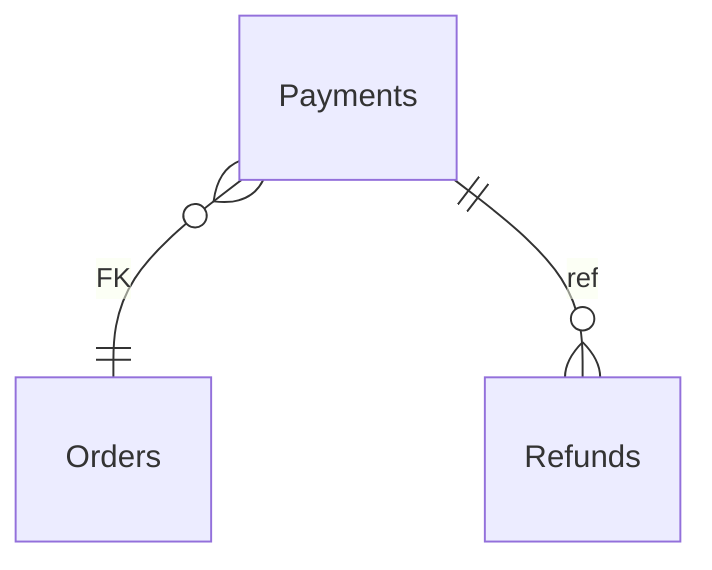

# Payments

**Table:** `orders.payments`

**Base path:** `/payments`

## Related Tables

### Parent Tables

_Tables this table references via foreign keys._

| Parent Table | FK Column | References | Link |
|-------------|-----------|------------|------|
| `orders` | `order_id` | `payments_order_id_fkey` | [Orders](./orders) |

### Child Tables

_Tables that reference this table via foreign keys._

| Child Table | FK Column | References | Link |
|------------|-----------|------------|------|
| `refunds` | `payment_id` | `refunds_payment_id_fkey` | [Refunds](./refunds) |


## Entity Relationship Diagram



::::tabs

:::tab FullStack

## Columns

| # | Column | SQL Type | Go Type | TS Type | Nullable | Default | Constraints | Description |
|---|--------|----------|---------|---------|----------|---------|-------------|-------------|
| 1 | `id` | `uuid` | `uuid.UUID` | `string` | NO | `gen_random_uuid()` | `PK` | Primary key |
| 2 | `name` | `text` | `string` | `string` | NO | `''::text` | - | - |
| 3 | `order_id` | `uuid` | `uuid.UUID` | `string` | NO | - | `FK` | → References `orders` |
| 4 | `amount` | `numeric` | `float64` | `number` | NO | - | - | - |
| 5 | `currency` | `text` | `string` | `string` | NO | `'USD'::text` | - | - |
| 6 | `method` | `USER-DEFINED` | `OrdersPaymentMethod` | `"credit_card" \| "debit_card" \| "bank_transfer" \| "wallet" \| "crypto"` | NO | `'credit_card'::orders.payment_method` | - | - |
| 7 | `status` | `USER-DEFINED` | `OrdersPaymentStatus` | `"pending" \| "authorized" \| "captured" \| "failed" \| "refunded"` | NO | `'pending'::orders.payment_status` | - | - |
| 8 | `provider_ref` | `text` | `string` | `string` | NO | `''::text` | - | - |
| 9 | `provider_data` | `jsonb` | `json.RawMessage` | `Record<string, unknown>` | NO | `'{}'::jsonb` | - | - |
| 10 | `paid_at` | `timestamp with time zone` | `time.Time` | `string` | YES | - | - | - |
| 11 | `created_at` | `timestamp with time zone` | `time.Time` | `string` | NO | `now()` | - | Auto-filled from session |
| 12 | `updated_at` | `timestamp with time zone` | `time.Time` | `string` | NO | `now()` | - | Auto-filled from session |

## Primary Keys

- `id` (`uuid`)

## Foreign Keys & Relationships

| Column | References | Constraint |
|--------|-----------|------------|
| `order_id` | `orders` | `payments_order_id_fkey` |

## Enum Types

### PaymentMethod

| Value | Go Constant |
|-------|-------------|
| `credit_card` | `OrdersPaymentMethodCreditCard` |
| `debit_card` | `OrdersPaymentMethodDebitCard` |
| `bank_transfer` | `OrdersPaymentMethodBankTransfer` |
| `wallet` | `OrdersPaymentMethodWallet` |
| `crypto` | `OrdersPaymentMethodCrypto` |

### PaymentStatus

| Value | Go Constant |
|-------|-------------|
| `pending` | `OrdersPaymentStatusPending` |
| `authorized` | `OrdersPaymentStatusAuthorized` |
| `captured` | `OrdersPaymentStatusCaptured` |
| `failed` | `OrdersPaymentStatusFailed` |
| `refunded` | `OrdersPaymentStatusRefunded` |


## Go Generated Code

> 📂 Source: [📄 `Payments.go`](https://github.com/meftunca/data-bridge-examples/blob/main//orders/structures/Payments.go) · [📄 `Payments.go`](https://github.com/meftunca/data-bridge-examples/blob/main//orders/services/Payments.go) · [📄 `Payments.go`](https://github.com/meftunca/data-bridge-examples/blob/main//orders/controllers/Payments.go)

### Structs

::::tabs

:::tab Form

#### PaymentsForm [](https://github.com/meftunca/data-bridge-examples/blob/main//orders/structures/Payments.go#:~:text=type%20PaymentsForm%20struct)

_Create payload — excludes auto-generated PK fields_

| Field | Go Type | JSON Key | Nullable |
|-------|---------|----------|----------|
| `Name` | `string` | `name` | NO |
| `OrderId` | `uuid.UUID` | `orderId` | NO |
| `Amount` | `float64` | `amount` | NO |
| `Currency` | `string` | `currency` | NO |
| `Method` | `OrdersPaymentMethod` | `method` | NO |
| `Status` | `OrdersPaymentStatus` | `status` | NO |
| `ProviderRef` | `string` | `providerRef` | NO |
| `ProviderData` | `json.RawMessage` | `providerData` | NO |
| `PaidAt` | `*time.Time` | `paidAt` | YES |
| `CreatedAt` | `time.Time` | `createdAt` | NO |
| `UpdatedAt` | `time.Time` | `updatedAt` | NO |

:::tab Model

#### Payments [](https://github.com/meftunca/data-bridge-examples/blob/main//orders/structures/Payments.go#:~:text=type%20Payments%20struct)

_Full model — all columns + GORM/JSON tags + preload relations_

| Field | Go Type | JSON Key | Nullable |
|-------|---------|----------|----------|
| `Id` | `uuid.UUID` | `id` | NO |
| `Name` | `string` | `name` | NO |
| `OrderId` | `uuid.UUID` | `orderId` | NO |
| `Amount` | `float64` | `amount` | NO |
| `Currency` | `string` | `currency` | NO |
| `Method` | `OrdersPaymentMethod` | `method` | NO |
| `Status` | `OrdersPaymentStatus` | `status` | NO |
| `ProviderRef` | `string` | `providerRef` | NO |
| `ProviderData` | `json.RawMessage` | `providerData` | NO |
| `PaidAt` | `*time.Time` | `paidAt` | YES |
| `CreatedAt` | `time.Time` | `createdAt` | NO |
| `UpdatedAt` | `time.Time` | `updatedAt` | NO |

:::tab Edit

#### PaymentsEdit [](https://github.com/meftunca/data-bridge-examples/blob/main//orders/structures/Payments.go#:~:text=type%20PaymentsEdit%20struct)

_Update payload — all fields are pointers (partial update)_

| Field | Go Type | JSON Key | Nullable |
|-------|---------|----------|----------|
| `Id` | `*uuid.UUID` | `id` | YES |
| `Name` | `*string` | `name` | YES |
| `OrderId` | `*uuid.UUID` | `orderId` | YES |
| `Amount` | `*float64` | `amount` | YES |
| `Currency` | `*string` | `currency` | YES |
| `Method` | `*OrdersPaymentMethod` | `method` | YES |
| `Status` | `*OrdersPaymentStatus` | `status` | YES |
| `ProviderRef` | `*string` | `providerRef` | YES |
| `ProviderData` | `*json.RawMessage` | `providerData` | YES |
| `PaidAt` | `*time.Time` | `paidAt` | YES |
| `CreatedAt` | `*time.Time` | `createdAt` | YES |
| `UpdatedAt` | `*time.Time` | `updatedAt` | YES |

:::tab Filter

#### PaymentsFilter [](https://github.com/meftunca/data-bridge-examples/blob/main//orders/structures/Payments.go#:~:text=type%20PaymentsFilter%20struct)

_Query filter — all fields are pointers_

| Field | Go Type | JSON Key | Nullable |
|-------|---------|----------|----------|
| `Id` | `*uuid.UUID` | `id` | YES |
| `Name` | `*string` | `name` | YES |
| `OrderId` | `*uuid.UUID` | `orderId` | YES |
| `Amount` | `*float64` | `amount` | YES |
| `Currency` | `*string` | `currency` | YES |
| `Method` | `*OrdersPaymentMethod` | `method` | YES |
| `Status` | `*OrdersPaymentStatus` | `status` | YES |
| `ProviderRef` | `*string` | `providerRef` | YES |
| `ProviderData` | `*json.RawMessage` | `providerData` | YES |
| `PaidAt` | `*time.Time` | `paidAt` | YES |
| `CreatedAt` | `*time.Time` | `createdAt` | YES |
| `UpdatedAt` | `*time.Time` | `updatedAt` | YES |

:::tab Page

#### PaymentsPage [](https://github.com/meftunca/data-bridge-examples/blob/main//orders/structures/Payments.go#:~:text=type%20PaymentsPage%20struct)

_Paginated response wrapper_

| Field | Go Type | JSON Key | Nullable |
|-------|---------|----------|----------|
| `Id` | `uuid.UUID` | `id` | NO |
| `Name` | `string` | `name` | NO |
| `OrderId` | `uuid.UUID` | `orderId` | NO |
| `Amount` | `float64` | `amount` | NO |
| `Currency` | `string` | `currency` | NO |
| `Method` | `OrdersPaymentMethod` | `method` | NO |
| `Status` | `OrdersPaymentStatus` | `status` | NO |
| `ProviderRef` | `string` | `providerRef` | NO |
| `ProviderData` | `json.RawMessage` | `providerData` | NO |
| `PaidAt` | `*time.Time` | `paidAt` | YES |
| `CreatedAt` | `time.Time` | `createdAt` | NO |
| `UpdatedAt` | `time.Time` | `updatedAt` | NO |

:::tab BatchUpdate

#### PaymentsBatchUpdate [](https://github.com/meftunca/data-bridge-examples/blob/main//orders/structures/Payments.go#:~:text=type%20PaymentsBatchUpdate%20struct)

```go
type PaymentsBatchUpdate struct {
    Data       json.RawMessage `json:"data"`
    PathParams struct {
        Id uuid.UUID
    } `json:"pathParams"`
}
```

::::

### Service & Endpoints

::::tabs

:::tab Service Methods

| Method | Signature |
|---------|-----------|
| [Create](https://github.com/meftunca/data-bridge-examples/blob/main//orders/services/Payments.go#:~:text=)%20CreatePayments() | `(PaymentsService) CreatePayments(data PaymentsForm) (PaymentsForm, error)` |
| [Create Multiple](https://github.com/meftunca/data-bridge-examples/blob/main//orders/services/Payments.go#:~:text=)%20CreatePaymentsMultiple() | `(PaymentsService) CreatePaymentsMultiple(data []PaymentsForm) ([]PaymentsForm, error)` |
| [Update](https://github.com/meftunca/data-bridge-examples/blob/main//orders/services/Payments.go#:~:text=)%20UpdatePayments() | `(PaymentsService) UpdatePayments(id uuid.UUID, data interface{}) error` |
| [Update Multiple](https://github.com/meftunca/data-bridge-examples/blob/main//orders/services/Payments.go#:~:text=)%20UpdatePaymentsMultiple() | `(PaymentsService) UpdatePaymentsMultiple(data []PaymentsBatchUpdate) error` |
| [Delete](https://github.com/meftunca/data-bridge-examples/blob/main//orders/services/Payments.go#:~:text=)%20DeletePayments() | `(PaymentsService) DeletePayments(id uuid.UUID) error` |

:::tab Endpoints

| Method | Path | Description |
|--------|------|-------------|
| `GET` | `/payments/` | Search with query params |
| `GET` | `/payments/pagination` | Paginated listing |
| `POST` | `/payments/` | Create single record |
| `POST` | `/payments/bulk/` | Create multiple records |
| `PUT` | `/payments/bulk/` | Batch update |
| `GET` | `/payments/with-id/:id` | Get by ID |
| `PUT` | `/payments/with-id/:id` | Update by ID |
| `DELETE` | `/payments/with-id/:id` | Delete by ID |

:::tab Query & Filters

| Parameter | Type | Description |
|-----------|------|-------------|
| `page` | `int` | Page number (default: 1) |
| `size` | `int` | Items per page (default: 10) |
| `sort` | `string` | Sort field. Prefix `-` for descending. Example: `-created_at` |
| `fields` | `string` | Comma-separated column list to select |
| `preloads` | `string` | Comma-separated relation names to preload |
| `filters` | `array` | Filter rules: `[[field, op, value], ...]` |
| `groupby` | `string` | Group by field name |
| `aggregations` | `json` | Aggregation specs: `[{func,field,alias}]` |

**Filter Operators:** `eq` `neq` `gt` `gte` `lt` `lte` `in` `notin` `like` `ilike` `is` `isnot` `between`

::::

### RPC Functions

| Function | Parameters | Return | Endpoint |
|----------|-----------|--------|----------|
| `customer_total_spent` | `p_customer_id uuid` | `numeric` | `/rpc/customer_total_spent` |
| `orders_by_status` | `p_status text` | `integer` | `/rpc/orders_by_status` |
| `total_revenue` | - | `numeric` | `/rpc/total_revenue` |


:::tab Frontend

## TypeScript Types & Hooks

::::tabs

:::tab Interfaces

```typescript
export type OrdersPaymentMethod =
  | "credit_card"
  | "debit_card"
  | "bank_transfer"
  | "wallet"
  | "crypto"

export const OrdersPaymentMethodValues = ["credit_card", "debit_card", "bank_transfer", "wallet", "crypto"] as const;

export type OrdersPaymentStatus =
  | "pending"
  | "authorized"
  | "captured"
  | "failed"
  | "refunded"

export const OrdersPaymentStatusValues = ["pending", "authorized", "captured", "failed", "refunded"] as const;

export interface Payments {
  id: string;
  name: string;
  orderId: string;
  amount: number;
  currency: string;
  method: OrdersPaymentMethod;
  status: OrdersPaymentStatus;
  providerRef: string;
  providerData: Record<string, unknown>;
  paidAt?: string;
  createdAt: string;
  updatedAt: string;
}

export interface PaymentsForm {
  name: string;
  orderId: string;
  amount: number;
  currency: string;
  method: OrdersPaymentMethod;
  status: OrdersPaymentStatus;
  providerRef: string;
  providerData: Record<string, unknown>;
  paidAt?: string;
  createdAt: string;
  updatedAt: string;
}

export interface PaymentsEdit {
  id: string;
  name: string;
  orderId: string;
  amount: number;
  currency: string;
  method: OrdersPaymentMethod;
  status: OrdersPaymentStatus;
  providerRef: string;
  providerData: Record<string, unknown>;
  paidAt?: string;
  createdAt: string;
  updatedAt: string;
}

export interface PaymentsPage {
  data: Payments[];
  total: number;
  page: number;
  size: number;
  totalPages: number;
}

export type PaymentsPathQuery = {
  page?: number;
  size?: number;
  sort?: string;
  fields?: string;
  preloads?: string;
  filters?: string;
};

```

:::tab React Query

```typescript
import { useQuery, useMutation, useQueryClient } from "@tanstack/react-query";

const PaymentsKeys = {
  all: ["payments"] as const,
  lists: () => [...PaymentsKeys.all, "list"] as const,
  detail: (id: any) => [...PaymentsKeys.all, "detail", id] as const,
} as const;

export function usePaymentsList(query?: PaymentsPathQuery) {
  return useQuery({
    queryKey: [...PaymentsKeys.lists(), query],
    queryFn: () => fetch(`/payments/pagination`, { method: "GET" }).then(r => r.json()) as Promise<PaymentsPage>,
  });
}

export function usePaymentsDetail(id: any) {
  return useQuery({
    queryKey: PaymentsKeys.detail(id),
    queryFn: () => fetch(`/payments/with-id/:id`).then(r => r.json()) as Promise<Payments>,
  });
}

export function useCreatePayments() {
  const qc = useQueryClient();
  return useMutation({
    mutationFn: (data: PaymentsForm) =>
      fetch("/payments/", { method: "POST", body: JSON.stringify(data) }).then(r => r.json()),
    onSuccess: () => qc.invalidateQueries({ queryKey: PaymentsKeys.lists() }),
  });
}

export function useUpdatePayments() {
  const qc = useQueryClient();
  return useMutation({
    mutationFn: ({ id, data }: { id: any: any; data: PaymentsEdit }) =>
      fetch(`/payments/with-id/:id`, { method: "PUT", body: JSON.stringify(data) }).then(r => r.json()),
    onSuccess: () => qc.invalidateQueries({ queryKey: PaymentsKeys.all }),
  });
}

export function useDeletePayments() {
  const qc = useQueryClient();
  return useMutation({
    mutationFn: (id: any) =>
      fetch(`/payments/with-id/:id`, { method: "DELETE" }).then(r => r.json()),
    onSuccess: () => qc.invalidateQueries({ queryKey: PaymentsKeys.all }),
  });
}

```

:::tab Zod Validation

```typescript
import { z } from "zod";

const OrdersPaymentMethodSchema = z.enum(["credit_card", "debit_card", "bank_transfer", "wallet", "crypto"]);

const OrdersPaymentStatusSchema = z.enum(["pending", "authorized", "captured", "failed", "refunded"]);

export const PaymentsFormSchema = z.object({
  name: z.string(),
  orderId: z.string().uuid(),
  amount: z.number(),
  currency: z.string(),
  method: OrdersPaymentMethodSchema,
  status: OrdersPaymentStatusSchema,
  providerRef: z.string(),
  providerData: z.record(z.unknown()),
  paidAt: z.string().datetime().optional(),
  createdAt: z.string().datetime(),
  updatedAt: z.string().datetime(),
});

export type PaymentsFormInput = z.infer<typeof PaymentsFormSchema>;

```

::::


:::tab API

<script setup>
import { useOpenapi } from 'vitepress-openapi'
import spec from './payments.openapi.json'
useOpenapi({ spec })
</script>


## API Reference

::::tabs

:::tab Search

#### <Badge type="info" text="GET" /> Search Payments

```
GET /api/v1/payments/
```

> Retrieve list filtered by query parameters.

**Headers:**

| Header | Required | Description |
|--------|----------|-------------|
| `Authorization` | Yes | Bearer token |
| `x-company` | Yes | Company ID |

**Query Parameters:**

| Parameter | Type | Required | Description |
|-----------|------|----------|-------------|
| `size` | `integer` | No | Max results (default: 10) |
| `sort` | `string` | No | Sort field. Prefix `-` for DESC. e.g. `-created_at` |
| `fields` | `string` | No | Comma-separated columns to select |
| `preloads` | `string` | No | Available: RefundsList, RefundsList.OrderIdDetail, RefundsList.OrderIdDetail.OrderItemsList, RefundsList.OrderIdDetail.PaymentsList, RefundsList.OrderIdDetail.RefundsList, RefundsList.OrderIdDetail.OrderStatusHistoryList, RefundsList.OrderIdDetail.CustomerIdDetail, RefundsList.OrderIdDetail.CouponIdDetail, RefundsList.PaymentIdDetail, RefundsList.PaymentIdDetail.RefundsList, RefundsList.PaymentIdDetail.OrderIdDetail, OrderIdDetail, OrderIdDetail.OrderItemsList, OrderIdDetail.OrderItemsList.OrderIdDetail, OrderIdDetail.PaymentsList, OrderIdDetail.PaymentsList.RefundsList, OrderIdDetail.PaymentsList.OrderIdDetail, OrderIdDetail.RefundsList, OrderIdDetail.RefundsList.OrderIdDetail, OrderIdDetail.RefundsList.PaymentIdDetail, OrderIdDetail.OrderStatusHistoryList, OrderIdDetail.OrderStatusHistoryList.OrderIdDetail, OrderIdDetail.CustomerIdDetail, OrderIdDetail.CustomerIdDetail.OrdersList, OrderIdDetail.CustomerIdDetail.CartsList, OrderIdDetail.CouponIdDetail, OrderIdDetail.CouponIdDetail.OrdersList |
| `joins` | `string` | No | Available: Orders, Orders.Customers, Orders.Customers.Users, Orders.Customers.Organizations, Orders.Coupons, Orders.Users |
| `id` | `string (uuid)` | No | Filter by id |
| `name` | `string` | No | Filter by name |
| `orderId` | `string (uuid)` | No | Filter by order_id |
| `amount` | `number` | No | Filter by amount |
| `currency` | `string` | No | Filter by currency |
| `method` | `string` | No | Filter by method |
| `status` | `string` | No | Filter by status |
| `providerRef` | `string` | No | Filter by provider_ref |
| `providerData` | `string` | No | Filter by provider_data |
| `paidAt` | `string (date-time)` | No | Filter by paid_at |

**Response:** `Payments[]`

<details>
<summary>curl example</summary>

```bash
curl -X GET \
  -H "Authorization: Bearer $TOKEN" \
  -H "x-company: $COMPANY_ID" \
  "http://localhost:3000/api/v1/payments/"
```

</details>

---

#### <Badge type="tip" text="POST" /> Search Payments (POST)

```
POST /api/v1/payments/search
```

> Search with body filters. Auto-used when query string > 2KB.

**Headers:**

| Header | Required | Description |
|--------|----------|-------------|
| `Authorization` | Yes | Bearer token |
| `x-company` | Yes | Company ID |

**Request Body:**

```typescript
{
  size?: number  // e.g. 10
  sort?: string[]  // e.g. ["-createdAt"]
  filters?: FilterRule[]  // e.g. [["name", "eq", "value"]]
  fields?: string[]
  preloads?: string[]
}
```

**Response:** `Payments[]`

<details>
<summary>curl example</summary>

```bash
curl -X POST \
  -H "Authorization: Bearer $TOKEN" \
  -H "x-company: $COMPANY_ID" \
  -H "Content-Type: application/json" \
  -d '{}' \
  "http://localhost:3000/api/v1/payments/search"
```

</details>

---

:::tab Pagination

#### <Badge type="info" text="GET" /> Paginate Payments

```
GET /api/v1/payments/pagination
```

> Paginated listing.

**Headers:**

| Header | Required | Description |
|--------|----------|-------------|
| `Authorization` | Yes | Bearer token |
| `x-company` | Yes | Company ID |

**Query Parameters:**

| Parameter | Type | Required | Description |
|-----------|------|----------|-------------|
| `page` | `integer` | No | Page number (default: 1) |
| `size` | `integer` | No | Max results (default: 10) |
| `sort` | `string` | No | Sort field. Prefix `-` for DESC. e.g. `-created_at` |
| `fields` | `string` | No | Comma-separated columns to select |
| `preloads` | `string` | No | Available: RefundsList, RefundsList.OrderIdDetail, RefundsList.OrderIdDetail.OrderItemsList, RefundsList.OrderIdDetail.PaymentsList, RefundsList.OrderIdDetail.RefundsList, RefundsList.OrderIdDetail.OrderStatusHistoryList, RefundsList.OrderIdDetail.CustomerIdDetail, RefundsList.OrderIdDetail.CouponIdDetail, RefundsList.PaymentIdDetail, RefundsList.PaymentIdDetail.RefundsList, RefundsList.PaymentIdDetail.OrderIdDetail, OrderIdDetail, OrderIdDetail.OrderItemsList, OrderIdDetail.OrderItemsList.OrderIdDetail, OrderIdDetail.PaymentsList, OrderIdDetail.PaymentsList.RefundsList, OrderIdDetail.PaymentsList.OrderIdDetail, OrderIdDetail.RefundsList, OrderIdDetail.RefundsList.OrderIdDetail, OrderIdDetail.RefundsList.PaymentIdDetail, OrderIdDetail.OrderStatusHistoryList, OrderIdDetail.OrderStatusHistoryList.OrderIdDetail, OrderIdDetail.CustomerIdDetail, OrderIdDetail.CustomerIdDetail.OrdersList, OrderIdDetail.CustomerIdDetail.CartsList, OrderIdDetail.CouponIdDetail, OrderIdDetail.CouponIdDetail.OrdersList |
| `joins` | `string` | No | Available: Orders, Orders.Customers, Orders.Customers.Users, Orders.Customers.Organizations, Orders.Coupons, Orders.Users |
| `id` | `string (uuid)` | No | Filter by id |
| `name` | `string` | No | Filter by name |
| `orderId` | `string (uuid)` | No | Filter by order_id |
| `amount` | `number` | No | Filter by amount |
| `currency` | `string` | No | Filter by currency |
| `method` | `string` | No | Filter by method |
| `status` | `string` | No | Filter by status |
| `providerRef` | `string` | No | Filter by provider_ref |
| `providerData` | `string` | No | Filter by provider_data |
| `paidAt` | `string (date-time)` | No | Filter by paid_at |

**Response:** `PaginationResponse<Payments>`

<details>
<summary>curl example</summary>

```bash
curl -X GET \
  -H "Authorization: Bearer $TOKEN" \
  -H "x-company: $COMPANY_ID" \
  "http://localhost:3000/api/v1/payments/pagination"
```

</details>

---

#### <Badge type="tip" text="POST" /> Paginate Payments (POST)

```
POST /api/v1/payments/pagination
```

> Paginated listing with body filters.

**Headers:**

| Header | Required | Description |
|--------|----------|-------------|
| `Authorization` | Yes | Bearer token |
| `x-company` | Yes | Company ID |

**Request Body:**

```typescript
{
  page?: number  // e.g. 1
  size?: number  // e.g. 10
  sort?: string[]  // e.g. ["-createdAt"]
  filters?: FilterRule[]  // e.g. [["name", "eq", "value"]]
  fields?: string[]
  preloads?: string[]
}
```

**Response:** `PaginationResponse<Payments>`

<details>
<summary>curl example</summary>

```bash
curl -X POST \
  -H "Authorization: Bearer $TOKEN" \
  -H "x-company: $COMPANY_ID" \
  -H "Content-Type: application/json" \
  -d '{}' \
  "http://localhost:3000/api/v1/payments/pagination"
```

</details>

---

:::tab Create

#### <Badge type="tip" text="POST" /> Create Payments

```
POST /api/v1/payments/
```

> Create a new record.

**Headers:**

| Header | Required | Description |
|--------|----------|-------------|
| `Authorization` | Yes | Bearer token |
| `x-company` | Yes | Company ID |

**Request Body:**

```typescript
{
  name?: string  // e.g. example_name
  orderId: string  // e.g. 550e8400-e29b-41d4-a716-446655440000
  amount: number  // e.g. 99.99
  currency?: string  // e.g. example_currency
  method?: "credit_card" | "debit_card" | "bank_transfer" | "wallet" | "crypto"  // e.g. credit_card
  status?: "pending" | "authorized" | "captured" | "failed" | "refunded"  // e.g. pending
  providerRef?: string  // e.g. example_provider_ref
  providerData?: Record<string, unknown>  // e.g. map[]
  paidAt?: string  // e.g. 2026-01-15T10:30:00Z
}
```

**Response:** `Payments`

<details>
<summary>curl example</summary>

```bash
curl -X POST \
  -H "Authorization: Bearer $TOKEN" \
  -H "x-company: $COMPANY_ID" \
  -H "Content-Type: application/json" \
  -d '{}' \
  "http://localhost:3000/api/v1/payments/"
```

</details>

---

#### <Badge type="tip" text="POST" /> Bulk Create Payments

```
POST /api/v1/payments/bulk/
```

> Create multiple records in one request.

**Headers:**

| Header | Required | Description |
|--------|----------|-------------|
| `Authorization` | Yes | Bearer token |
| `x-company` | Yes | Company ID |

**Request Body:**

```typescript
{
  name?: string  // e.g. example_name
  orderId: string  // e.g. 550e8400-e29b-41d4-a716-446655440000
  amount: number  // e.g. 99.99
  currency?: string  // e.g. example_currency
  method?: "credit_card" | "debit_card" | "bank_transfer" | "wallet" | "crypto"  // e.g. credit_card
  status?: "pending" | "authorized" | "captured" | "failed" | "refunded"  // e.g. pending
  providerRef?: string  // e.g. example_provider_ref
  providerData?: Record<string, unknown>  // e.g. map[]
  paidAt?: string  // e.g. 2026-01-15T10:30:00Z
}
```

**Response:** `Payments[]`

<details>
<summary>curl example</summary>

```bash
curl -X POST \
  -H "Authorization: Bearer $TOKEN" \
  -H "x-company: $COMPANY_ID" \
  -H "Content-Type: application/json" \
  -d '{}' \
  "http://localhost:3000/api/v1/payments/bulk/"
```

</details>

---

:::tab Find & Update

#### <Badge type="info" text="GET" /> Find Payments by ID

```
GET /api/v1/payments/with-id/:id
```

> Retrieve a single record by primary key.

**Headers:**

| Header | Required | Description |
|--------|----------|-------------|
| `Authorization` | Yes | Bearer token |
| `x-company` | Yes | Company ID |

**Query Parameters:**

| Parameter | Type | Required | Description |
|-----------|------|----------|-------------|
| `Id` | `string (uuid)` | Yes | Primary key (uuid) |

**Response:** `Payments`

<details>
<summary>curl example</summary>

```bash
curl -X GET \
  -H "Authorization: Bearer $TOKEN" \
  -H "x-company: $COMPANY_ID" \
  "http://localhost:3000/api/v1/payments/with-id/:id"
```

</details>

---

#### <Badge type="warning" text="PUT" /> Update Payments

```
PUT /api/v1/payments/with-id/:id
```

> Partial update — send only the fields to change.

**Headers:**

| Header | Required | Description |
|--------|----------|-------------|
| `Authorization` | Yes | Bearer token |
| `x-company` | Yes | Company ID |

**Query Parameters:**

| Parameter | Type | Required | Description |
|-----------|------|----------|-------------|
| `Id` | `string (uuid)` | Yes | Primary key (uuid) |

**Request Body:**

```typescript
{
  name?: string
  orderId?: string
  amount?: number
  currency?: string
  method?: "credit_card" | "debit_card" | "bank_transfer" | "wallet" | "crypto"
  status?: "pending" | "authorized" | "captured" | "failed" | "refunded"
  providerRef?: string
  providerData?: Record<string, unknown>
  paidAt?: string
}
```

**Response:** `Success`

<details>
<summary>curl example</summary>

```bash
curl -X PUT \
  -H "Authorization: Bearer $TOKEN" \
  -H "x-company: $COMPANY_ID" \
  -H "Content-Type: application/json" \
  -d '{}' \
  "http://localhost:3000/api/v1/payments/with-id/:id"
```

</details>

---

#### <Badge type="warning" text="PUT" /> Bulk Update Payments

```
PUT /api/v1/payments/bulk/
```

> Batch update multiple records.

**Headers:**

| Header | Required | Description |
|--------|----------|-------------|
| `Authorization` | Yes | Bearer token |
| `x-company` | Yes | Company ID |

**Request Body:** Array of { pathParams, data: PaymentsEdit }

**Response:** `Success`

<details>
<summary>curl example</summary>

```bash
curl -X PUT \
  -H "Authorization: Bearer $TOKEN" \
  -H "x-company: $COMPANY_ID" \
  -H "Content-Type: application/json" \
  -d '{}' \
  "http://localhost:3000/api/v1/payments/bulk/"
```

</details>

---

:::tab Delete

#### <Badge type="danger" text="DELETE" /> Delete Payments

```
DELETE /api/v1/payments/with-id/:id
```

> Soft-delete (sets deleted_at + deleted_by).

**Headers:**

| Header | Required | Description |
|--------|----------|-------------|
| `Authorization` | Yes | Bearer token |
| `x-company` | Yes | Company ID |

**Query Parameters:**

| Parameter | Type | Required | Description |
|-----------|------|----------|-------------|
| `Id` | `string (uuid)` | Yes | Primary key (uuid) |

**Response:** `Success`

<details>
<summary>curl example</summary>

```bash
curl -X DELETE \
  -H "Authorization: Bearer $TOKEN" \
  -H "x-company: $COMPANY_ID" \
  "http://localhost:3000/api/v1/payments/with-id/:id"
```

</details>

---

::::


::::
