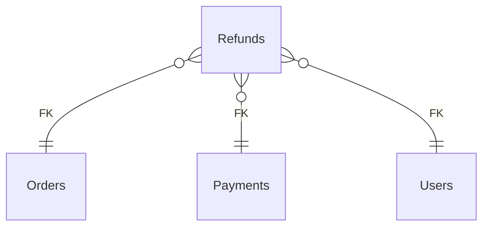

# Refunds

**Table:** `orders.refunds`

**Base path:** `/refunds`

## Related Tables

### Parent Tables

_Tables this table references via foreign keys._

| Parent Table | FK Column | References | Link |
|-------------|-----------|------------|------|
| `orders` | `order_id` | `refunds_order_id_fkey` | [Orders](./orders) |
| `payments` | `payment_id` | `refunds_payment_id_fkey` | [Payments](./payments) |
| `users` | `processed_by` | `refunds_processed_by_fkey` | [Users](./users) |


## Entity Relationship Diagram



::::tabs

=== FullStack

## Columns

| # | Column | SQL Type | Go Type | TS Type | Nullable | Default | Constraints | Description |
|---|--------|----------|---------|---------|----------|---------|-------------|-------------|
| 1 | `id` | `uuid` | `uuid.UUID` | `string` | NO | `gen_random_uuid()` | `PK` | Primary key |
| 2 | `name` | `text` | `string` | `string` | NO | `''::text` | - | - |
| 3 | `order_id` | `uuid` | `uuid.UUID` | `string` | NO | - | `FK` | → References `orders` |
| 4 | `payment_id` | `uuid` | `uuid.UUID` | `string` | NO | - | `FK` | → References `payments` |
| 5 | `amount` | `numeric` | `float64` | `number` | NO | - | - | - |
| 6 | `reason` | `text` | `string` | `string` | NO | `''::text` | - | - |
| 7 | `status` | `text` | `string` | `string` | NO | `'pending'::text` | - | - |
| 8 | `processed_by` | `uuid` | `uuid.UUID` | `string` | YES | - | `FK` | → References `users` |
| 9 | `processed_at` | `timestamp with time zone` | `time.Time` | `string` | YES | - | - | - |
| 10 | `created_at` | `timestamp with time zone` | `time.Time` | `string` | NO | `now()` | - | Auto-filled from session |
| 11 | `updated_at` | `timestamp with time zone` | `time.Time` | `string` | NO | `now()` | - | Auto-filled from session |

## Primary Keys

- `id` (`uuid`)

## Foreign Keys & Relationships

| Column | References | Constraint |
|--------|-----------|------------|
| `order_id` | `orders` | `refunds_order_id_fkey` |
| `payment_id` | `payments` | `refunds_payment_id_fkey` |
| `processed_by` | `users` | `refunds_processed_by_fkey` |


## Go Generated Code

> 📂 Source: [📄 `Refunds.go`](https://github.com/meftunca/data-bridge-examples/blob/main//orders/structures/Refunds.go) · [📄 `Refunds.go`](https://github.com/meftunca/data-bridge-examples/blob/main//orders/services/Refunds.go) · [📄 `Refunds.go`](https://github.com/meftunca/data-bridge-examples/blob/main//orders/controllers/Refunds.go)

### Structs

:::tabs

== Form

#### RefundsForm [](https://github.com/meftunca/data-bridge-examples/blob/main//orders/structures/Refunds.go#:~:text=type%20RefundsForm%20struct)

_Create payload — excludes auto-generated PK fields_

| Field | Go Type | JSON Key | Nullable |
|-------|---------|----------|----------|
| `Name` | `string` | `name` | NO |
| `OrderId` | `uuid.UUID` | `orderId` | NO |
| `PaymentId` | `uuid.UUID` | `paymentId` | NO |
| `Amount` | `float64` | `amount` | NO |
| `Reason` | `string` | `reason` | NO |
| `Status` | `string` | `status` | NO |
| `ProcessedBy` | `*uuid.UUID` | `processedBy` | YES |
| `ProcessedAt` | `*time.Time` | `processedAt` | YES |
| `CreatedAt` | `time.Time` | `createdAt` | NO |
| `UpdatedAt` | `time.Time` | `updatedAt` | NO |

== Model

#### Refunds [](https://github.com/meftunca/data-bridge-examples/blob/main//orders/structures/Refunds.go#:~:text=type%20Refunds%20struct)

_Full model — all columns + GORM/JSON tags + preload relations_

| Field | Go Type | JSON Key | Nullable |
|-------|---------|----------|----------|
| `Id` | `uuid.UUID` | `id` | NO |
| `Name` | `string` | `name` | NO |
| `OrderId` | `uuid.UUID` | `orderId` | NO |
| `PaymentId` | `uuid.UUID` | `paymentId` | NO |
| `Amount` | `float64` | `amount` | NO |
| `Reason` | `string` | `reason` | NO |
| `Status` | `string` | `status` | NO |
| `ProcessedBy` | `*uuid.UUID` | `processedBy` | YES |
| `ProcessedAt` | `*time.Time` | `processedAt` | YES |
| `CreatedAt` | `time.Time` | `createdAt` | NO |
| `UpdatedAt` | `time.Time` | `updatedAt` | NO |

== Edit

#### RefundsEdit [](https://github.com/meftunca/data-bridge-examples/blob/main//orders/structures/Refunds.go#:~:text=type%20RefundsEdit%20struct)

_Update payload — all fields are pointers (partial update)_

| Field | Go Type | JSON Key | Nullable |
|-------|---------|----------|----------|
| `Id` | `*uuid.UUID` | `id` | YES |
| `Name` | `*string` | `name` | YES |
| `OrderId` | `*uuid.UUID` | `orderId` | YES |
| `PaymentId` | `*uuid.UUID` | `paymentId` | YES |
| `Amount` | `*float64` | `amount` | YES |
| `Reason` | `*string` | `reason` | YES |
| `Status` | `*string` | `status` | YES |
| `ProcessedBy` | `*uuid.UUID` | `processedBy` | YES |
| `ProcessedAt` | `*time.Time` | `processedAt` | YES |
| `CreatedAt` | `*time.Time` | `createdAt` | YES |
| `UpdatedAt` | `*time.Time` | `updatedAt` | YES |

== Filter

#### RefundsFilter [](https://github.com/meftunca/data-bridge-examples/blob/main//orders/structures/Refunds.go#:~:text=type%20RefundsFilter%20struct)

_Query filter — all fields are pointers_

| Field | Go Type | JSON Key | Nullable |
|-------|---------|----------|----------|
| `Id` | `*uuid.UUID` | `id` | YES |
| `Name` | `*string` | `name` | YES |
| `OrderId` | `*uuid.UUID` | `orderId` | YES |
| `PaymentId` | `*uuid.UUID` | `paymentId` | YES |
| `Amount` | `*float64` | `amount` | YES |
| `Reason` | `*string` | `reason` | YES |
| `Status` | `*string` | `status` | YES |
| `ProcessedBy` | `*uuid.UUID` | `processedBy` | YES |
| `ProcessedAt` | `*time.Time` | `processedAt` | YES |
| `CreatedAt` | `*time.Time` | `createdAt` | YES |
| `UpdatedAt` | `*time.Time` | `updatedAt` | YES |

== Page

#### RefundsPage [](https://github.com/meftunca/data-bridge-examples/blob/main//orders/structures/Refunds.go#:~:text=type%20RefundsPage%20struct)

_Paginated response wrapper_

| Field | Go Type | JSON Key | Nullable |
|-------|---------|----------|----------|
| `Id` | `uuid.UUID` | `id` | NO |
| `Name` | `string` | `name` | NO |
| `OrderId` | `uuid.UUID` | `orderId` | NO |
| `PaymentId` | `uuid.UUID` | `paymentId` | NO |
| `Amount` | `float64` | `amount` | NO |
| `Reason` | `string` | `reason` | NO |
| `Status` | `string` | `status` | NO |
| `ProcessedBy` | `*uuid.UUID` | `processedBy` | YES |
| `ProcessedAt` | `*time.Time` | `processedAt` | YES |
| `CreatedAt` | `time.Time` | `createdAt` | NO |
| `UpdatedAt` | `time.Time` | `updatedAt` | NO |

== BatchUpdate

#### RefundsBatchUpdate [](https://github.com/meftunca/data-bridge-examples/blob/main//orders/structures/Refunds.go#:~:text=type%20RefundsBatchUpdate%20struct)

```go
type RefundsBatchUpdate struct {
    Data       json.RawMessage `json:"data"`
    PathParams struct {
        Id uuid.UUID
    } `json:"pathParams"`
}
```

:::

### Service & Endpoints

:::tabs

== Service Methods

| Method | Signature |
|---------|-----------|
| [Create](https://github.com/meftunca/data-bridge-examples/blob/main//orders/services/Refunds.go#:~:text=%29%20CreateRefunds%28%29) | `(RefundsService) CreateRefunds(data RefundsForm) (RefundsForm, error)` |
| [Create Multiple](https://github.com/meftunca/data-bridge-examples/blob/main//orders/services/Refunds.go#:~:text=%29%20CreateRefundsMultiple%28%29) | `(RefundsService) CreateRefundsMultiple(data []RefundsForm) ([]RefundsForm, error)` |
| [Update](https://github.com/meftunca/data-bridge-examples/blob/main//orders/services/Refunds.go#:~:text=%29%20UpdateRefunds%28%29) | `(RefundsService) UpdateRefunds(id uuid.UUID, data interface{}) error` |
| [Update Multiple](https://github.com/meftunca/data-bridge-examples/blob/main//orders/services/Refunds.go#:~:text=%29%20UpdateRefundsMultiple%28%29) | `(RefundsService) UpdateRefundsMultiple(data []RefundsBatchUpdate) error` |
| [Delete](https://github.com/meftunca/data-bridge-examples/blob/main//orders/services/Refunds.go#:~:text=%29%20DeleteRefunds%28%29) | `(RefundsService) DeleteRefunds(id uuid.UUID) error` |

== Endpoints

| Method | Path | Description |
|--------|------|-------------|
| `GET` | `/refunds/` | Search with query params |
| `GET` | `/refunds/pagination` | Paginated listing |
| `POST` | `/refunds/` | Create single record |
| `POST` | `/refunds/bulk/` | Create multiple records |
| `PUT` | `/refunds/bulk/` | Batch update |
| `GET` | `/refunds/with-id/:id` | Get by ID |
| `PUT` | `/refunds/with-id/:id` | Update by ID |
| `DELETE` | `/refunds/with-id/:id` | Delete by ID |

== Query & Filters

| Parameter | Type | Description |
|-----------|------|-------------|
| `page` | `int` | Page number (default: 1) |
| `size` | `int` | Items per page (default: 10) |
| `sort` | `string` | Sort field. Prefix `-` for descending. Example: `-created_at` |
| `fields` | `string` | Comma-separated column list to select |
| `preloads` | `string` | Comma-separated relation names to preload |
| `filters` | `array` | Filter rules: `[[field, op, value], ...]` |
| `groupby` | `string` | Group by field name |
| `aggregations` | `json` | Aggregation specs: `[{func,field,alias}]` |

**Filter Operators:** `eq` `neq` `gt` `gte` `lt` `lte` `in` `notin` `like` `ilike` `is` `isnot` `between`

:::

### RPC Functions

| Function | Parameters | Return | Endpoint |
|----------|-----------|--------|----------|
| `customer_total_spent` | `p_customer_id uuid` | `numeric` | `/rpc/customer_total_spent` |
| `orders_by_status` | `p_status text` | `integer` | `/rpc/orders_by_status` |
| `total_revenue` | - | `numeric` | `/rpc/total_revenue` |


=== Frontend

## TypeScript Types & Hooks

:::tabs

== Interfaces

```typescript
export interface Refunds {
  id: string;
  name: string;
  orderId: string;
  paymentId: string;
  amount: number;
  reason: string;
  status: string;
  processedBy?: string;
  processedAt?: string;
  createdAt: string;
  updatedAt: string;
}

export interface RefundsForm {
  name: string;
  orderId: string;
  paymentId: string;
  amount: number;
  reason: string;
  status: string;
  processedBy?: string;
  processedAt?: string;
  createdAt: string;
  updatedAt: string;
}

export interface RefundsEdit {
  id: string;
  name: string;
  orderId: string;
  paymentId: string;
  amount: number;
  reason: string;
  status: string;
  processedBy?: string;
  processedAt?: string;
  createdAt: string;
  updatedAt: string;
}

export interface RefundsPage {
  data: Refunds[];
  total: number;
  page: number;
  size: number;
  totalPages: number;
}

export type RefundsPathQuery = {
  page?: number;
  size?: number;
  sort?: string;
  fields?: string;
  preloads?: string;
  filters?: string;
};

```

== React Query

```typescript
import { useQuery, useMutation, useQueryClient } from "@tanstack/react-query";

const RefundsKeys = {
  all: ["refunds"] as const,
  lists: () => [...RefundsKeys.all, "list"] as const,
  detail: (id: any) => [...RefundsKeys.all, "detail", id] as const,
} as const;

export function useRefundsList(query?: RefundsPathQuery) {
  return useQuery({
    queryKey: [...RefundsKeys.lists(), query],
    queryFn: () => fetch(`/refunds/pagination`, { method: "GET" }).then(r => r.json()) as Promise<RefundsPage>,
  });
}

export function useRefundsDetail(id: any) {
  return useQuery({
    queryKey: RefundsKeys.detail(id),
    queryFn: () => fetch(`/refunds/with-id/:id`).then(r => r.json()) as Promise<Refunds>,
  });
}

export function useCreateRefunds() {
  const qc = useQueryClient();
  return useMutation({
    mutationFn: (data: RefundsForm) =>
      fetch("/refunds/", { method: "POST", body: JSON.stringify(data) }).then(r => r.json()),
    onSuccess: () => qc.invalidateQueries({ queryKey: RefundsKeys.lists() }),
  });
}

export function useUpdateRefunds() {
  const qc = useQueryClient();
  return useMutation({
    mutationFn: ({ id, data }: { id: any: any; data: RefundsEdit }) =>
      fetch(`/refunds/with-id/:id`, { method: "PUT", body: JSON.stringify(data) }).then(r => r.json()),
    onSuccess: () => qc.invalidateQueries({ queryKey: RefundsKeys.all }),
  });
}

export function useDeleteRefunds() {
  const qc = useQueryClient();
  return useMutation({
    mutationFn: (id: any) =>
      fetch(`/refunds/with-id/:id`, { method: "DELETE" }).then(r => r.json()),
    onSuccess: () => qc.invalidateQueries({ queryKey: RefundsKeys.all }),
  });
}

```

== Zod Validation

```typescript
import { z } from "zod";

export const RefundsFormSchema = z.object({
  name: z.string(),
  orderId: z.string().uuid(),
  paymentId: z.string().uuid(),
  amount: z.number(),
  reason: z.string(),
  status: z.string(),
  processedBy: z.string().uuid().optional(),
  processedAt: z.string().datetime().optional(),
  createdAt: z.string().datetime(),
  updatedAt: z.string().datetime(),
});

export type RefundsFormInput = z.infer<typeof RefundsFormSchema>;

```

:::


=== API

<script setup>
import { useOpenapi } from 'vitepress-openapi'
import spec from './refunds.openapi.json'
useOpenapi({ spec })
</script>


## API Reference

:::tabs

== Search

#### <Badge type="info" text="GET" /> Search Refunds

```
GET /api/v1/refunds/
```

> Retrieve list filtered by query parameters.

**Headers:**

| Header | Required | Description |
|--------|----------|-------------|
| `Authorization` | Yes | Bearer token |
| `x-company` | Yes | Company ID |

**Query Parameters:**

| Parameter | Type | Required | Description |
|-----------|------|----------|-------------|
| `size` | `integer` | No | Max results (default: 10) |
| `sort` | `string` | No | Sort field. Prefix `-` for DESC. e.g. `-created_at` |
| `fields` | `string` | No | Comma-separated columns to select |
| `preloads` | `string` | No | Available: OrderIdDetail, OrderIdDetail.OrderItemsList, OrderIdDetail.OrderItemsList.OrderIdDetail, OrderIdDetail.PaymentsList, OrderIdDetail.PaymentsList.RefundsList, OrderIdDetail.PaymentsList.OrderIdDetail, OrderIdDetail.RefundsList, OrderIdDetail.RefundsList.OrderIdDetail, OrderIdDetail.RefundsList.PaymentIdDetail, OrderIdDetail.OrderStatusHistoryList, OrderIdDetail.OrderStatusHistoryList.OrderIdDetail, OrderIdDetail.CustomerIdDetail, OrderIdDetail.CustomerIdDetail.OrdersList, OrderIdDetail.CustomerIdDetail.CartsList, OrderIdDetail.CouponIdDetail, OrderIdDetail.CouponIdDetail.OrdersList, PaymentIdDetail, PaymentIdDetail.RefundsList, PaymentIdDetail.RefundsList.OrderIdDetail, PaymentIdDetail.RefundsList.PaymentIdDetail, PaymentIdDetail.OrderIdDetail, PaymentIdDetail.OrderIdDetail.OrderItemsList, PaymentIdDetail.OrderIdDetail.PaymentsList, PaymentIdDetail.OrderIdDetail.RefundsList, PaymentIdDetail.OrderIdDetail.OrderStatusHistoryList, PaymentIdDetail.OrderIdDetail.CustomerIdDetail, PaymentIdDetail.OrderIdDetail.CouponIdDetail |
| `joins` | `string` | No | Available: Orders, Orders.Customers, Orders.Customers.Users, Orders.Customers.Organizations, Orders.Coupons, Orders.Users, Payments, Payments.Orders, Payments.Orders.Customers, Payments.Orders.Coupons, Payments.Orders.Users, Users |
| `id` | `string (uuid)` | No | Filter by id |
| `name` | `string` | No | Filter by name |
| `orderId` | `string (uuid)` | No | Filter by order_id |
| `paymentId` | `string (uuid)` | No | Filter by payment_id |
| `amount` | `number` | No | Filter by amount |
| `reason` | `string` | No | Filter by reason |
| `status` | `string` | No | Filter by status |
| `processedBy` | `string (uuid)` | No | Filter by processed_by |
| `processedAt` | `string (date-time)` | No | Filter by processed_at |

**Response:** `Refunds[]`

<details>
<summary>curl example</summary>

```bash
curl -X GET \
  -H "Authorization: Bearer $TOKEN" \
  -H "x-company: $COMPANY_ID" \
  "http://localhost:3000/api/v1/refunds/"
```

</details>

---

#### <Badge type="tip" text="POST" /> Search Refunds (POST)

```
POST /api/v1/refunds/search
```

> Search with body filters. Auto-used when query string > 2KB.

**Headers:**

| Header | Required | Description |
|--------|----------|-------------|
| `Authorization` | Yes | Bearer token |
| `x-company` | Yes | Company ID |

**Request Body:**

```typescript
{
  size?: number  // e.g. 10
  sort?: string[]  // e.g. ["-createdAt"]
  filters?: FilterRule[]  // e.g. [["name", "eq", "value"]]
  fields?: string[]
  preloads?: string[]
}
```

**Response:** `Refunds[]`

<details>
<summary>curl example</summary>

```bash
curl -X POST \
  -H "Authorization: Bearer $TOKEN" \
  -H "x-company: $COMPANY_ID" \
  -H "Content-Type: application/json" \
  -d '{}' \
  "http://localhost:3000/api/v1/refunds/search"
```

</details>

---

== Pagination

#### <Badge type="info" text="GET" /> Paginate Refunds

```
GET /api/v1/refunds/pagination
```

> Paginated listing.

**Headers:**

| Header | Required | Description |
|--------|----------|-------------|
| `Authorization` | Yes | Bearer token |
| `x-company` | Yes | Company ID |

**Query Parameters:**

| Parameter | Type | Required | Description |
|-----------|------|----------|-------------|
| `page` | `integer` | No | Page number (default: 1) |
| `size` | `integer` | No | Max results (default: 10) |
| `sort` | `string` | No | Sort field. Prefix `-` for DESC. e.g. `-created_at` |
| `fields` | `string` | No | Comma-separated columns to select |
| `preloads` | `string` | No | Available: OrderIdDetail, OrderIdDetail.OrderItemsList, OrderIdDetail.OrderItemsList.OrderIdDetail, OrderIdDetail.PaymentsList, OrderIdDetail.PaymentsList.RefundsList, OrderIdDetail.PaymentsList.OrderIdDetail, OrderIdDetail.RefundsList, OrderIdDetail.RefundsList.OrderIdDetail, OrderIdDetail.RefundsList.PaymentIdDetail, OrderIdDetail.OrderStatusHistoryList, OrderIdDetail.OrderStatusHistoryList.OrderIdDetail, OrderIdDetail.CustomerIdDetail, OrderIdDetail.CustomerIdDetail.OrdersList, OrderIdDetail.CustomerIdDetail.CartsList, OrderIdDetail.CouponIdDetail, OrderIdDetail.CouponIdDetail.OrdersList, PaymentIdDetail, PaymentIdDetail.RefundsList, PaymentIdDetail.RefundsList.OrderIdDetail, PaymentIdDetail.RefundsList.PaymentIdDetail, PaymentIdDetail.OrderIdDetail, PaymentIdDetail.OrderIdDetail.OrderItemsList, PaymentIdDetail.OrderIdDetail.PaymentsList, PaymentIdDetail.OrderIdDetail.RefundsList, PaymentIdDetail.OrderIdDetail.OrderStatusHistoryList, PaymentIdDetail.OrderIdDetail.CustomerIdDetail, PaymentIdDetail.OrderIdDetail.CouponIdDetail |
| `joins` | `string` | No | Available: Orders, Orders.Customers, Orders.Customers.Users, Orders.Customers.Organizations, Orders.Coupons, Orders.Users, Payments, Payments.Orders, Payments.Orders.Customers, Payments.Orders.Coupons, Payments.Orders.Users, Users |
| `id` | `string (uuid)` | No | Filter by id |
| `name` | `string` | No | Filter by name |
| `orderId` | `string (uuid)` | No | Filter by order_id |
| `paymentId` | `string (uuid)` | No | Filter by payment_id |
| `amount` | `number` | No | Filter by amount |
| `reason` | `string` | No | Filter by reason |
| `status` | `string` | No | Filter by status |
| `processedBy` | `string (uuid)` | No | Filter by processed_by |
| `processedAt` | `string (date-time)` | No | Filter by processed_at |

**Response:** `PaginationResponse<Refunds>`

<details>
<summary>curl example</summary>

```bash
curl -X GET \
  -H "Authorization: Bearer $TOKEN" \
  -H "x-company: $COMPANY_ID" \
  "http://localhost:3000/api/v1/refunds/pagination"
```

</details>

---

#### <Badge type="tip" text="POST" /> Paginate Refunds (POST)

```
POST /api/v1/refunds/pagination
```

> Paginated listing with body filters.

**Headers:**

| Header | Required | Description |
|--------|----------|-------------|
| `Authorization` | Yes | Bearer token |
| `x-company` | Yes | Company ID |

**Request Body:**

```typescript
{
  page?: number  // e.g. 1
  size?: number  // e.g. 10
  sort?: string[]  // e.g. ["-createdAt"]
  filters?: FilterRule[]  // e.g. [["name", "eq", "value"]]
  fields?: string[]
  preloads?: string[]
}
```

**Response:** `PaginationResponse<Refunds>`

<details>
<summary>curl example</summary>

```bash
curl -X POST \
  -H "Authorization: Bearer $TOKEN" \
  -H "x-company: $COMPANY_ID" \
  -H "Content-Type: application/json" \
  -d '{}' \
  "http://localhost:3000/api/v1/refunds/pagination"
```

</details>

---

== Create

#### <Badge type="tip" text="POST" /> Create Refunds

```
POST /api/v1/refunds/
```

> Create a new record.

**Headers:**

| Header | Required | Description |
|--------|----------|-------------|
| `Authorization` | Yes | Bearer token |
| `x-company` | Yes | Company ID |

**Request Body:**

```typescript
{
  name?: string  // e.g. example_name
  orderId: string  // e.g. 550e8400-e29b-41d4-a716-446655440000
  paymentId: string  // e.g. 550e8400-e29b-41d4-a716-446655440000
  amount: number  // e.g. 99.99
  reason?: string  // e.g. example_reason
  status?: string  // e.g. example_status
  processedBy?: string  // e.g. 550e8400-e29b-41d4-a716-446655440000
  processedAt?: string  // e.g. 2026-01-15T10:30:00Z
}
```

**Response:** `Refunds`

<details>
<summary>curl example</summary>

```bash
curl -X POST \
  -H "Authorization: Bearer $TOKEN" \
  -H "x-company: $COMPANY_ID" \
  -H "Content-Type: application/json" \
  -d '{}' \
  "http://localhost:3000/api/v1/refunds/"
```

</details>

---

#### <Badge type="tip" text="POST" /> Bulk Create Refunds

```
POST /api/v1/refunds/bulk/
```

> Create multiple records in one request.

**Headers:**

| Header | Required | Description |
|--------|----------|-------------|
| `Authorization` | Yes | Bearer token |
| `x-company` | Yes | Company ID |

**Request Body:**

```typescript
{
  name?: string  // e.g. example_name
  orderId: string  // e.g. 550e8400-e29b-41d4-a716-446655440000
  paymentId: string  // e.g. 550e8400-e29b-41d4-a716-446655440000
  amount: number  // e.g. 99.99
  reason?: string  // e.g. example_reason
  status?: string  // e.g. example_status
  processedBy?: string  // e.g. 550e8400-e29b-41d4-a716-446655440000
  processedAt?: string  // e.g. 2026-01-15T10:30:00Z
}
```

**Response:** `Refunds[]`

<details>
<summary>curl example</summary>

```bash
curl -X POST \
  -H "Authorization: Bearer $TOKEN" \
  -H "x-company: $COMPANY_ID" \
  -H "Content-Type: application/json" \
  -d '{}' \
  "http://localhost:3000/api/v1/refunds/bulk/"
```

</details>

---

== Find & Update

#### <Badge type="info" text="GET" /> Find Refunds by ID

```
GET /api/v1/refunds/with-id/:id
```

> Retrieve a single record by primary key.

**Headers:**

| Header | Required | Description |
|--------|----------|-------------|
| `Authorization` | Yes | Bearer token |
| `x-company` | Yes | Company ID |

**Query Parameters:**

| Parameter | Type | Required | Description |
|-----------|------|----------|-------------|
| `Id` | `string (uuid)` | Yes | Primary key (uuid) |

**Response:** `Refunds`

<details>
<summary>curl example</summary>

```bash
curl -X GET \
  -H "Authorization: Bearer $TOKEN" \
  -H "x-company: $COMPANY_ID" \
  "http://localhost:3000/api/v1/refunds/with-id/:id"
```

</details>

---

#### <Badge type="warning" text="PUT" /> Update Refunds

```
PUT /api/v1/refunds/with-id/:id
```

> Partial update — send only the fields to change.

**Headers:**

| Header | Required | Description |
|--------|----------|-------------|
| `Authorization` | Yes | Bearer token |
| `x-company` | Yes | Company ID |

**Query Parameters:**

| Parameter | Type | Required | Description |
|-----------|------|----------|-------------|
| `Id` | `string (uuid)` | Yes | Primary key (uuid) |

**Request Body:**

```typescript
{
  name?: string
  orderId?: string
  paymentId?: string
  amount?: number
  reason?: string
  status?: string
  processedBy?: string
  processedAt?: string
}
```

**Response:** `Success`

<details>
<summary>curl example</summary>

```bash
curl -X PUT \
  -H "Authorization: Bearer $TOKEN" \
  -H "x-company: $COMPANY_ID" \
  -H "Content-Type: application/json" \
  -d '{}' \
  "http://localhost:3000/api/v1/refunds/with-id/:id"
```

</details>

---

#### <Badge type="warning" text="PUT" /> Bulk Update Refunds

```
PUT /api/v1/refunds/bulk/
```

> Batch update multiple records.

**Headers:**

| Header | Required | Description |
|--------|----------|-------------|
| `Authorization` | Yes | Bearer token |
| `x-company` | Yes | Company ID |

**Request Body:** Array of { pathParams, data: RefundsEdit }

**Response:** `Success`

<details>
<summary>curl example</summary>

```bash
curl -X PUT \
  -H "Authorization: Bearer $TOKEN" \
  -H "x-company: $COMPANY_ID" \
  -H "Content-Type: application/json" \
  -d '{}' \
  "http://localhost:3000/api/v1/refunds/bulk/"
```

</details>

---

== Delete

#### <Badge type="danger" text="DELETE" /> Delete Refunds

```
DELETE /api/v1/refunds/with-id/:id
```

> Soft-delete (sets deleted_at + deleted_by).

**Headers:**

| Header | Required | Description |
|--------|----------|-------------|
| `Authorization` | Yes | Bearer token |
| `x-company` | Yes | Company ID |

**Query Parameters:**

| Parameter | Type | Required | Description |
|-----------|------|----------|-------------|
| `Id` | `string (uuid)` | Yes | Primary key (uuid) |

**Response:** `Success`

<details>
<summary>curl example</summary>

```bash
curl -X DELETE \
  -H "Authorization: Bearer $TOKEN" \
  -H "x-company: $COMPANY_ID" \
  "http://localhost:3000/api/v1/refunds/with-id/:id"
```

</details>

---

:::


::::
